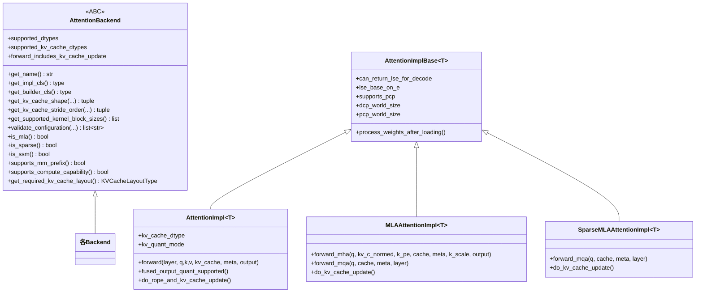

# backend 抽象层

[← Wiki 首页](../README.md) > [注意力](../README.md) > backend 抽象层

> 源码：`vllm/v1/attention/backend.py`

## 是什么

`backend.py` 是整个注意力子系统的契约文件。它用一组 ABC / Protocol / dataclass 定义了：

- `AttentionType` —— 四种注意力语义（decoder/encoder/encoder_only/encoder_decoder）。
- `AttentionBackend` —— backend 的静态能力声明 + 工厂方法 + 配置校验。
- `AttentionMetadata` / `CommonAttentionMetadata` —— 每 step 跨层共享的元数据。
- `AttentionMetadataBuilder` —— 把调度器输出转成 backend 专属 metadata。
- `AttentionImplBase` / `AttentionImpl` / `MLAAttentionImpl` / `SparseMLAAttentionImpl` —— 三类 forward 接口。
- `AttentionCGSupport` —— CUDA Graph 支持等级。
- `AttentionLayer` Protocol —— 给 impl 传的"层句柄"（带 scale 等）。
- `subclass_attention_backend*` —— 动态派生 backend 的工具。

## 为什么

vLLM 支持 30+ backend（见 registry），但上层 `Attention` layer 只想调一个 `forward(query, key, value, kv_cache, attn_metadata)`。`backend.py` 用抽象把"能力声明"（backend 类）与"逐层执行"（impl 实例）分离：

- 选择阶段只看 backend 的**静态 classmethod**（`supports_*` / `validate_configuration`），不实例化任何重对象。
- 执行阶段每层才 `get_impl_cls()()` 构造 impl，拿到 kernel。
- metadata 阶段每 KV cache group 一个 builder，`build()` 每 step 跑一次。

这样 selector 能在不 import GPU kernel 的情况下纯靠元数据筛 backend，避免循环依赖与冷启动开销。

## 怎么做

### AttentionBackend 关键成员

### 三类 forward 接口

| 接口 | 适用 | 方法 | 位置 |
|------|------|------|------|
| `AttentionImpl` | 标准 GQA/encoder | `forward(layer, query, key, value, kv_cache, attn_metadata, output, output_scale, output_block_scale)` | `backend.py:884` |
| `MLAAttentionImpl` | DeepSeek V2/V3 dense MLA | `forward_mha`（prefill）+ `forward_mqa`（decode） | `backend.py:944` / `backend.py:986` |
| `SparseMLAAttentionImpl` | DeepSeek V4 sparse MLA，仅 decode | `forward_mqa` | `backend.py:1032` |

`MLAAttentionImpl.do_kv_cache_update` 调 `ops.concat_and_cache_mla` 把 `kv_c_normed` + `k_pe` 拼进压缩 KV cache（`backend.py:1009`）。

### CommonAttentionMetadata

`CommonAttentionMetadata`（`backend.py:394`）是**跨 backend 共享**的每 batch 元数据，由 scheduler/worker 构造、喂给各 builder：

- `query_start_loc` / `seq_lens` / `num_reqs` / `num_actual_tokens` —— batch 形状。
- `block_table_tensor` / `slot_mapping` —— paged KV 寻址。
- `causal` —— 标量或 per-request tensor（PrefixLM 可为局部非因果）。
- `encoder_seq_lens` —— cross-attention 用。
- `dcp_local_seq_lens` —— Decode Context Parallel 本 rank 序列长。
- `positions` / `is_prefilling` / `rswa_prefix_lens` / `mm_req_doc_ranges` —— 给 sparse/R-SWA/多模态前缀用。

它带若干 deprecated 的 CPU 同步字段（`seq_lens_cpu`、`num_computed_tokens_cpu`，标 `v0.15.0` 移除），因为隐式 H←D 同步会破坏 async scheduling。

### AttentionMetadataBuilder

`AttentionMetadataBuilder`（`backend.py:600`）关键方法：

- `build(common_prefix_len, common_attn_metadata, fast_build)` —— 主入口（`backend.py:666`）。
- `build_for_cudagraph_capture` —— CUDA graph 捕获路径（`backend.py:701`）。
- `build_for_drafting` —— spec decode 草稿模型路径（`backend.py:713`）。
- `use_cascade_attention(...)` —— 是否对本 batch 用 cascade（默认 False）。
- `get_cudagraph_support(vllm_config, kv_cache_spec)` —— 返回 `AttentionCGSupport`。

`AttentionCGSupport`（`backend.py:583`）四档：`ALWAYS` > `UNIFORM_BATCH` > `UNIFORM_SINGLE_TOKEN_DECODE` > `NEVER`。

### AttentionImplBase 与 DCP/PCP

`AttentionImplBase.__new__`（`backend.py:826`）在实例化时从 `get_dcp_group()` / `get_pcp_group()` 读 `dcp_world_size` / `pcp_world_size`，并据 `can_return_lse_for_decode` 自动设 `need_to_return_lse_for_decode`（DCP>1 时 decode 必须吐 LSE 才能跨 rank 归约）。

`lse_base_on_e`（`backend.py:795`）是个**关键正确性开关**：`True` 用自然对数，`False` 用 log2。DCP 合并 kernel（`ops/common.py` 的 `cp_lse_ag_out_rs`）按 `IS_BASE_E` 分支，写错会静默污染 softmax 分母。FlashInfer trtllm-gen MLA 用 base2，其余（Triton MLA / FlashAttention / FlashMLA / CUTLASS）用 base e。

## 与其它模块/系统配合

- **selector**：只消费 `AttentionBackend` 的 classmethod 做筛选，见 [selector](selector.md)。
- **registry**：`AttentionBackendEnum` 的 value 是 backend 类的全限定名，`get_class()` 走 `resolve_obj_by_qualname`，见 [backend 注册表](backend-registry.md)。
- **MLA 公共层**：`vllm/model_executor/layers/attention/mla_attention.py` 里的 `MLACommonBackend` / `MLACommonImpl` 继承本文件的 `AttentionBackend` / `MLAAttentionImpl`，所有 MLA backend 再继承 `MLACommon*`，复用 `forward_mha`/`forward_mqa` 公共逻辑（`mla_attention.py:1206` / `mla_attention.py:1988`）。
- **KV cache 布局**：`get_required_kv_cache_layout` 返回 `"NHD"`/`"HND"`，由 `backends/utils.py:set_kv_cache_layout` 落地。`indexes_kv_by_block_stride()`（`backend.py:206`）判断 backend 是否按 block stride 寻址，决定能否跨层统一布局（hybrid_blocks）。
- **torch.compile**：`AttentionType` 用 `str` enum 仅为 torch.compile 兼容；`supports_quant_query_input` 让上层把 Q 量化前移以与前置算子融合。

## 历史版本演进

- **v0.6.x**：初版 `AttentionBackend` / `AttentionImpl` / `AttentionMetadataBuilder`，只有标准 forward。
- **v0.7.x**：抽 `CommonAttentionMetadata` 出来；引入 `AttentionCGSupport` 四档；`supports_mm_prefix` / `supports_non_causal` 等细粒度能力位。
- **v0.8.x**：新增 `MLAAttentionImpl`（`forward_mha`/`forward_mqa`）与 `AttentionImplBase` 公共基类；`__new__` 注入 DCP/PCP world size；`lse_base_on_e` 正确性开关。
- **v0.9.x**：新增 `SparseMLAAttentionImpl`（只有 `forward_mqa`）；`indexes_kv_by_block_stride` 支持 hybrid_blocks 跨层布局；`supports_kv_connector` capability；开始标 deprecated CPU 同步字段。
- **v0.10.x（当前）**：`supports_quant_query_input` 让 Q 预量化与 torch.compile 融合；`supports_combination` 做组合合法性裁决（单纯单项校验不够时）；`subclass_attention_backend_with_overrides` 动态派生工具。

---

[← 返回注意力首页](../README.md)

## 参见

- [selector 选择器](selector.md)
- [backend 注册表](backend-registry.md)
- [底层 ops](ops.md)
- [backends/utils](backends/utils.md)
- [MLA 总览](backends/mla/README.md)
