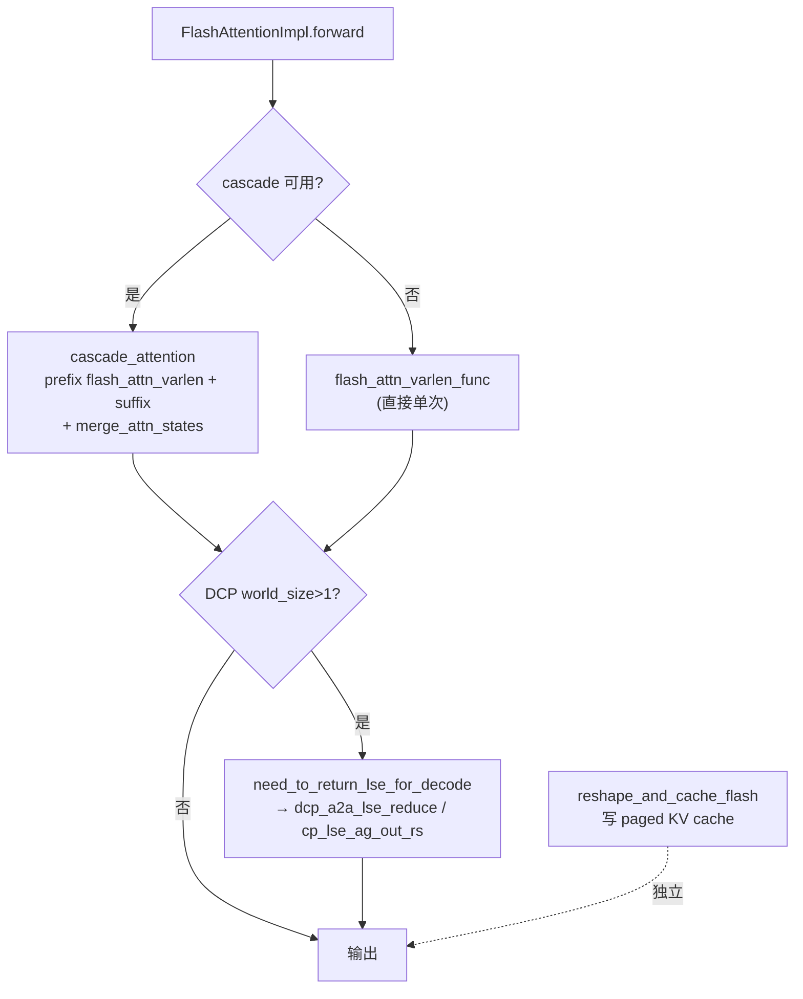

# FlashAttention backend

[← Wiki 首页](../../README.md) > [注意力](../../README.md) > [Backend 列表](../README.md) > FlashAttention

> 源码：`vllm/v1/attention/backends/flash_attn.py`、`vllm/v1/attention/backends/flash_attn_diffkv.py`

## 是什么

`FlashAttentionBackend` 是 vLLM 在 NVIDIA CUDA / Intel XPU 上的**默认主力 backend**，封装 Dao Labs 的 `vllm_flash_attn`（FA2/FA3/FA4）`flash_attn_varlen_func`。配套 `FlashAttentionDiffKVBackend` 支持 K 与 V head dim 不同（R1 类模型）。

核心三件套：

- `FlashAttentionBackend`（`flash_attn.py:67`）—— 能力声明 + 工厂。
- `FlashAttentionMetadataBuilder`（`flash_attn.py:303`）—— 构造 metadata、决定 cascade、cudagraph 支持。
- `FlashAttentionImpl`（`flash_attn.py:674`）—— 调 `flash_attn_varlen_func` + cascade + KV 写入。

DiffKV 在同文件体系下扩展：`FlashAttentionDiffKVBackend`（`flash_attn_diffkv.py:36`，继承）、`FlashAttentionDiffKVImpl`（`flash_attn_diffkv.py:117`，KV cache 沿最后一维 packed）。

## 为什么

FlashAttention 的 fused varlen kernel 是 prefill/long-context 业界最快的开源实现之一，且原生支持 paged KV、sliding window、ALiBi、attention sink、softcap。vLLM 在它之上额外做：

- **cascade attention**：公共前缀走一次 prefix kernel，尾部各 request 走 suffix，再用 `merge_attn_states` LSE 合并，省大量重复计算。
- **DCP**：跨 rank 用 `cp_lse_ag_out_rs` / `dcp_a2a_lse_reduce` 归约。
- **torch.compile / CUDA graph 友好**：`supports_batch_invariance=True`，`_cudagraph_support` 按 FA 版本动态裁决。
- **diff-kv**：FA2 不支持 K≠V head dim，故 diff-kv 走 FA3/FA4，并改用 packed 布局。

## 怎么做

### 能力声明要点

| 项 | 值 | 位置 |
|----|----|------|
| `forward_includes_kv_cache_update` | `False`（KV 写入单独走 `reshape_and_cache_flash`） | `flash_attn.py:79` |
| block sizes | `MultipleOf(16)`；XPU 强制 ≥64 | `flash_attn.py:76` / `flash_attn.py:82` |
| `supports_attn_type` | 全四种（decoder/encoder/encoder_only/encoder_decoder） | `flash_attn.py:100` |
| `supports_non_causal` / `supports_batch_invariance` | `True` | `flash_attn.py:92/96` |
| `supports_sink` | 委托 `fa_utils.flash_attn_supports_sinks()`（FA 版本相关） | `flash_attn.py:183` |
| `supports_per_head_quant_scales` | FA3+ | `flash_attn.py:110` |
| KV cache 形状 | `(2, num_blocks, block_size, num_kv_heads, head_size/x, x)` | `flash_attn.py:123` |
| cudagraph 支持 | 动态 `_cudagraph_support`（按 FA 版本与配置 `get_cudagraph_support`） | `flash_attn.py:322` |

### forward 路径

cascade 由 `cascade_attention()`（`flash_attn.py:1432`）实现，prefill 与 decode 都可用，取决于 builder 的 `use_cascade_attention()`。

### KV cache 写入

因 `forward_includes_kv_cache_update=False`，`Attention` layer 在调 forward **之前**用 `reshape_and_cache_flash`（来自 `_custom_ops` / `fa_utils`）把新 K/V 写入 paged cache。

### DiffKV 差异

- `FlashAttentionDiffKVBackend.head_size_v` 默认 128，可 `set_head_size_v` 设。
- KV cache 形状沿最后一维 packed：`[num_blocks, block_size, num_kv_heads, head_size_qk + head_size_v]`（`flash_attn_diffkv.py:77`）。
- 写入走 `triton_reshape_and_cache_flash_diffkv`（区别于标准 `reshape_and_cache_flash`）。
- FA 版本要求 ≥3（`is_supported_on_current_device` 检查 FA3/FA4）。

### fa_utils 版本探测

FlashAttention 版本与能力（sink、quant query、MLA 支持）由 `backends/fa_utils.py` 探测：

- `get_flash_attn_version()` —— 2/3/4。
- `is_flash_attn_varlen_func_available()`。
- `FlashAttentionCuTeDSLCompileSpec`（`fa_utils.py:66`）—— FA4 CuTeDSL warmup（Blackwell），`compile()` 触发只编译不执行。
- 平台分流：CUDA 用 `vllm.vllm_flash_attn`；XPU 用 `xpu_ops`；ROCm 用上游 `flash_attn` 包（`fa_utils.py:21-62`）。

## 与其它模块/系统配合

- **ops**：`merge_attn_states`（cascade 合并）、`reshape_and_cache_flash`（C++）、`cp_lse_ag_out_rs`/`dcp_a2a_lse_reduce`（DCP），见 [ops](../ops.md)。
- **utils**：`get_kv_cache_layout`、`split_decodes_and_prefills`、`get_dcp_local_seq_lens`，见 [utils](utils.md)。
- **selector**：CUDA 非 MLA 默认第一优先级（Hopper 及以下）或第二（Blackwell 仅次于 FlashInfer），见 [selector](../selector.md)。
- **MLA**：`mla/flashattn_mla.py` 的 `FlashAttnMLABackend` 复用 `fa_utils` 与 `flash_attn_varlen_func`，但走 `MLACommonImpl` 框架，见 [MLA FlashAttn](mla/flashattn.md)。
- **worker**：`forward_includes_kv_cache_update=False` 意味着 worker 的 `Attention` layer 要显式调 KV cache 更新，见 [执行层-Worker](../../02-execution/worker/README.md)。
- **torch.compile**：`flash_attn_varlen_func` 经 `compile_flash_attn_varlen_func_from_specs` 预编译；`supports_quant_query_input` 让 Q 量化前移融合。

## 历史版本演进

- **v0.6.x**：`FlashAttentionBackend`（FA2），`forward_includes_kv_cache_update=False`，paged KV via `reshape_and_cache_flash`。
- **v0.7.x**：cascade attention 落地（`cascade_attention` + `merge_attn_states`）；`supports_non_causal`/`supports_batch_invariance`；动态 cudagraph 支持。
- **v0.8.x**：FA3 支持（`get_flash_attn_version`、`supports_per_head_quant_scales` for FA3+、`flash_attn_supports_sinks`）；DCP LSE 归约。
- **v0.9.x**：attention sink、R-SWA、mm_prefix；DCP A2A 路径；XPU 路径完善（`flash_attn.py:82` XPU block_size≥64）。
- **v0.10.x（当前）**：`FlashAttentionDiffKVBackend`（R1 类模型 diff-kv）；FA4 CuTeDSL warmup（`FlashAttentionCuTeDSLCompileSpec`）；`supports_quant_query_input`；`flash_attn_supports_mla` gating。

---

[← 返回注意力首页](../../README.md)

## 参见

- [FlashInfer backend](flashinfer.md)
- [Triton backend](triton.md)
- [MLA FlashAttn](mla/flashattn.md)
- [底层 ops](../ops.md)
- [Utils](utils.md)
