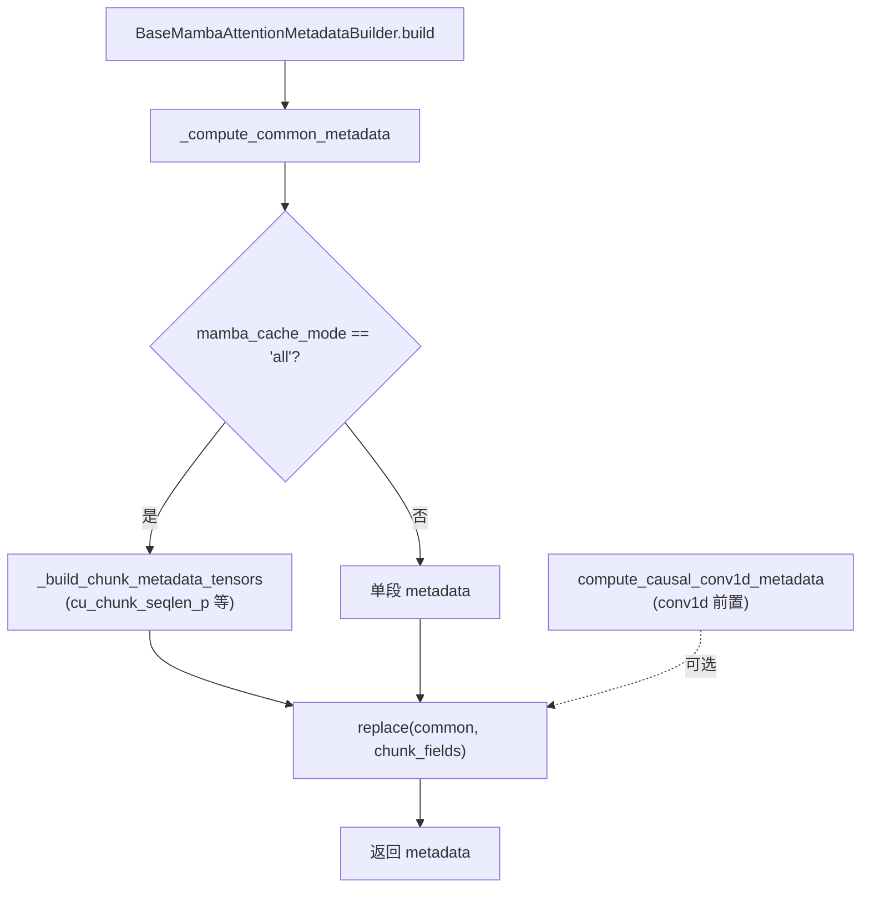

# Mamba / SSM attention backend

[← Wiki 首页](../../README.md) > [注意力](../../README.md) > [Backend 列表](../README.md) > Mamba/SSM

> 源码：`vllm/v1/attention/backends/mamba_attn.py`、`mamba1_attn.py`、`mamba2_attn.py`、`short_conv_attn.py`、`gdn_attn.py`

## 是什么

这是 **State-Space Model（SSM）族**注意力 backend，对应 `MambaAttentionBackendEnum`，由 `selector.get_mamba_attn_backend()` 选择，`is_ssm()` 返回 True。包括：

- `Mamba1AttentionBackend`（`mamba1_attn.py:14`）—— Mamba1 SSM。
- `Mamba2AttentionBackend`（`mamba2_attn.py:91`）—— Mamba2 SSD（含 `compute_varlen_chunk_metadata`）。
- `ShortConvAttentionBackend`（`short_conv_attn.py:12`）—— 短卷积注意力，继承 `BaseMambaAttentionMetadata`。
- `GDNAttentionBackend`（`gdn_attn.py:27`）—— GatedDeltaNet。
- `LinearAttentionBackend`（见 [linear.md](linear.md)）也属 SSM 族。

公共基类在 `mamba_attn.py`：`BaseMambaAttentionMetadata`（`mamba_attn.py:30`）与 `BaseMambaAttentionMetadataBuilder`（`mamba_attn.py:79`，ABC）。

## 为什么

SSM 不走 paged KV cache，而是走 **递归状态缓存**（`MambaSpec`，非 `AttentionSpec`）。与标准注意力相比：

- 无 Q×K softmax，而是状态更新 + 线性 attention 风格的 query-state 交互。
- 需要 **causal conv1d** 前置（`compute_causal_conv1d_metadata`，`utils.py:836`）。
- prefill 需要分 chunk 处理（`mamba_cache_mode`："all" 全分块 / "none" 不分块 / "align" 对齐）。
- 支持 prefix caching：通过 block table 记录已计算 state 的 checkpoint。
- spec decode：`num_accepted_tokens` 决定加载哪个 checkpoint。

公共逻辑抽出 `BaseMamba*`，各 SSM 变体只重写 build 的 chunk 部分。

## 怎么做

### BaseMambaAttentionMetadata

字段（`mamba_attn.py:30`）：

- prefill 段：`has_initial_states_p`、`query_start_loc_p`、`num_computed_tokens_p`、`state_indices_tensor_p`。
- decode 段：`state_indices_tensor_d`、`query_start_loc_d`、`num_accepted_tokens`。
- prefix caching：`block_idx_last_scheduled_token`、`block_idx_first_scheduled_token_p`、`block_idx_last_computed_token`、`block_idx_last_scheduled_token_prev_step`。
- align 模式：`seq_lens`。
- chunked：`cu_chunk_seqlen_p`、`last_chunk_indices_p` 等。

预填充/解码/扩展混合 builder 用 `split_decodes_and_prefills` 拆 batch。

### build 流程

- `_cudagraph_support = UNIFORM_BATCH`（`mamba_attn.py:82`），支持等长 spec decode。
- `reorder_batch_threshold` 由 `_init_reorder_batch_threshold` 处理 spec token 数。

### 各变体差异

| 变体 | 关键点 |
|------|--------|
| Mamba1 | `cache_mode=="all"` 时构造 `cu_chunk_seqlen_p`、`last_chunk_indices_p`；Mamba1 chunk 分块（`mamba1_attn.py:38`） |
| Mamba2 | `compute_varlen_chunk_metadata`（`mamba2_attn.py:22`）按物理 `chunk_size` 切逻辑 chunk，给 Mamba2 SSD kernel 用；导出供测试复用 |
| ShortConv | 仅 34 行，直接复用 base，`metadata_cls = ShortConvAttentionMetadata`（`short_conv_attn.py:33`） |
| GDN | 独立 `build`（`gdn_attn.py:168`），含 `compute_causal_conv1d_metadata` 和 `build_for_cudagraph_capture`（`gdn_attn.py:513`） |

### 选择路径

不走 `AttentionBackendEnum` 优先级表，而由模型层显式调 `get_mamba_attn_backend(MambaAttentionBackendEnum.MAMBA2)`（见 [selector](../selector.md)）。`MambaSpec` 在 `kv_cache_interface.py` 与 `AttentionSpec` 并列。

## 与其它模块/系统配合

- **utils**：`split_decodes_and_prefills`、`compute_causal_conv1d_metadata`、`mamba_get_block_table_tensor`、`NULL_BLOCK_ID`，见 [utils](utils.md)。
- **KV 管理**：`MambaSpec` 描述 state cache 维度，见 [引擎核心-KV 管理](../../01-engine-core/kv-cache-management/README.md)。
- **selector**：`get_mamba_attn_backend` 独立路径，见 [selector](../selector.md)。
- **spec decode**：`num_accepted_tokens` 与 `build_for_drafting` 协同。
- **模型**：Jamba、Falcon3-Hybrid、Zamba 等混合 SSM+attention 模型按层用不同 backend。

## 历史版本演进

- **v0.6.x**：Mamba1 backend 初版（V1 SSM 支持）。
- **v0.7.x**：prefill/decode 拆分；`mamba_cache_mode` 三档；prefix caching state checkpoint。
- **v0.8.x**：Mamba2 SSD（`compute_varlen_chunk_metadata`）；spec decode 支持（`num_accepted_tokens`）。
- **v0.9.x**：ShortConv、GDN 加入；`_cudagraph_support = UNIFORM_BATCH`；align 模式。
- **v0.10.x（当前）**：`BailingLinearAttentionBackend` 见 [linear.md](linear.md)；chunk metadata 导出供测试。

---

[← 返回注意力首页](../../README.md)

## 参见

- [Linear backend](linear.md)
- [Utils](utils.md)
- [selector](../selector.md)
- [引擎核心-KV 管理](../../01-engine-core/kv-cache-management/README.md)
