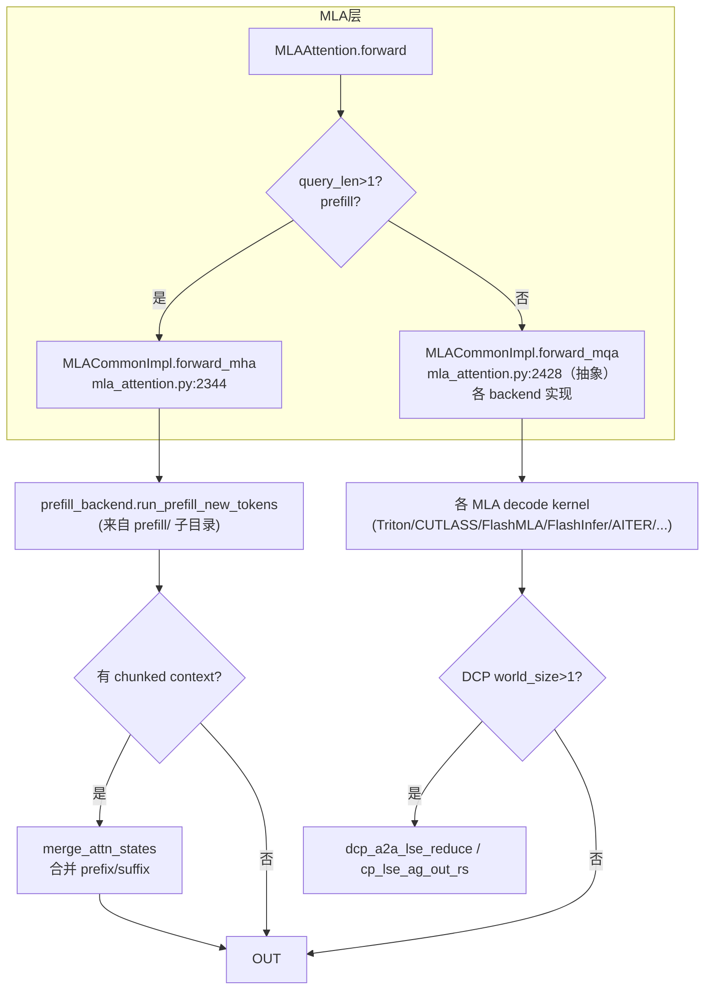
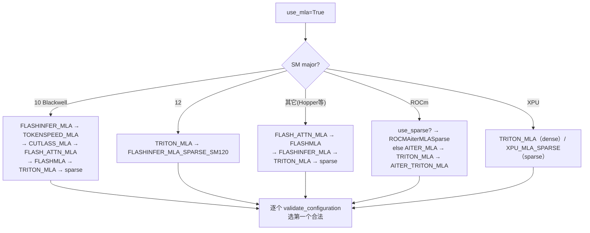
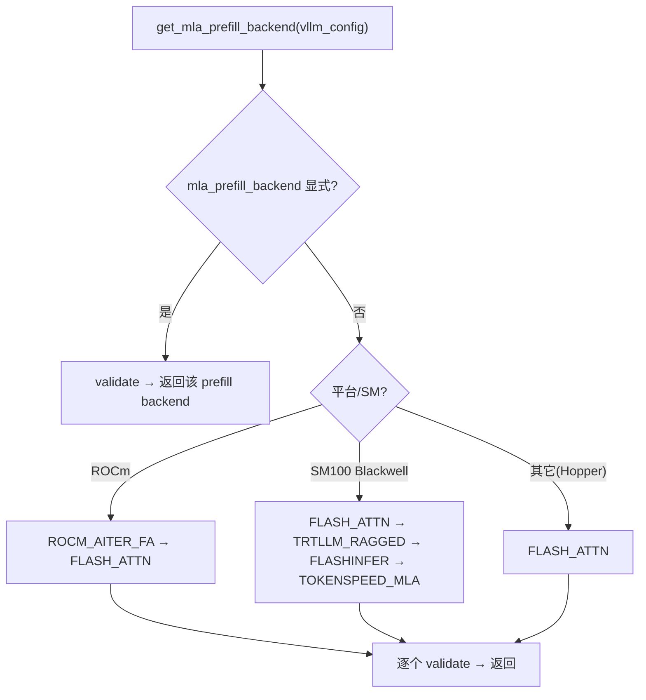

# MLA 后端总览

[← Wiki 首页](../../../README.md) > [注意力](../../README.md) > [Backend 列表](../README.md) > [← MLA 首页](../README.md) > MLA 后端总览

> 源码目录：`vllm/v1/attention/backends/mla/`
> 公共层：`vllm/model_executor/layers/attention/mla_attention.py`（`MLACommonBackend` / `MLACommonImpl` / `MLACommonMetadata`）

## 是什么

`mla/` 子目录专门服务 DeepSeek V2/V3/V4 的 **Multi-head Latent Attention（MLA）**。MLA 把 KV 压缩成低秩 `kv_c`（`kv_lora_rank`）+ 解耦 `k_pe`（rope head dim），decode 时只存压缩 latent，大幅降 KV cache 内存。`mla/` 下分三类：

1. **Dense MLA backend** —— 继承 `MLACommonBackend` + `MLACommonImpl`，实现 `forward_mha`（prefill）+ `forward_mqa`（decode）。
2. **Sparse MLA backend** —— 继承 `SparseMLAAttentionImpl`，仅 `forward_mqa`（decode-only），服务 DeepSeek V4 的 top-k 稀疏 MLA。
3. **prefill/ 子目录** —— MLA prefill 独立选择子系统（`MLAPrefillBackend` + 独立 selector/registry），由 `MLACommonImpl.forward_mha` 调用。

另有 `indexer.py`（top-k 页选择）、`sparse_swa.py`（DeepSeek V4 SWA 层）、`sparse_utils.py` / `compressor_utils.py`（工具 kernel）等支撑文件。

## 为什么

DeepSeek V3/R1 系列长上下文场景下，标准 GQA 的 KV cache 是吞吐与显存瓶颈。MLA 把每 token KV 压到 `kv_lora_rank`（如 512）+ `qk_rope_head_dim`（如 64），decode 用 MQA 风格直接对 latent 做 attention，省 ~10x KV。不同 GPU/平台有不同最优 kernel：

- Hopper（SM90）：FlashAttention、FlashMLA、CUTLASS 不支持→用 FA/FlashMLA/Triton。
- Blackwell（SM100）：FlashInfer trtllm-gen、CUTLASS MLA、TokenSpeed CuTe DSL 最快。
- ROCm：AITER MLA。
- DeepSeek V4：sparse MLA（只注意 top-k 相关页），由 indexer 选页。

统一抽象让上层 `MLAAttention` layer 只调 `forward_mha`/`forward_mqa`，底层 kernel 自由替换。

## 怎么做

### 双 forward 架构

`forward_mha`（`mla_attention.py:2344`）做 prefill：`kv_b_proj` 解出 `k_nope`/`v`，拼 `k_pe`，交给 **prefill backend** 的 `run_prefill_new_tokens`；若该 batch 既有新 token 又有 chunked context，再 `merge_attn_states` 合并。

`forward_mqa`（`mla_attention.py:2428` 抽象，各 backend 实现）做 decode：直接对压缩 latent `kv_c_and_k_pe_cache` 做 MQA。

### 实际文件清单

#### Dense MLA backend（继承 `MLACommonBackend` / `MLACommonImpl`）

| 文件 | 类 | 目标平台 | block | cudagraph |
|------|----|----|----|----|
| `triton_mla.py` | `TritonMLABackend`/`TritonMLAImpl` | 跨平台（CUDA/ROCm/XPU） | MultipleOf(16) | `UNIFORM_BATCH` |
| `cutlass_mla.py` | `CutlassMLABackend`/`CutlassMLAImpl` | SM100 Blackwell | 128 | `UNIFORM_SINGLE_TOKEN_DECODE` |
| `flashattn_mla.py` | `FlashAttnMLABackend`/`FlashAttnMLAImpl` | SM90 Hopper | MultipleOf(16) | `UNIFORM_BATCH` |
| `flashinfer_mla.py` | `FlashInferMLABackend`/`FlashInferMLAImpl` | SM100 Blackwell | 32/64 | `UNIFORM_BATCH` |
| `flashmla.py` | `FlashMLABackend`/`FlashMLAImpl` | SM90/SM100 | 64 | `UNIFORM_BATCH` |
| `rocm_aiter_mla.py` | `AiterMLABackend`/`AiterMLAImpl` | ROCm | MultipleOf(1) | `UNIFORM_BATCH` |
| `aiter_triton_mla.py` | `AiterTritonMLABackend`/`AiterTritonMLAImpl` | ROCm（prefill 用 aiter Triton MHA） | 继承 | 继承 |
| `tokenspeed_mla.py` | `TokenspeedMLABackend`/`TokenspeedMLAImpl` | SM100 Blackwell，FP8 KV only | 继承 | `UNIFORM_BATCH` |

#### Sparse MLA backend（继承 `SparseMLAAttentionImpl`，仅 `forward_mqa`，DeepSeek V4）

| 文件 | 类 | 目标平台 |
|------|----|----|
| `flashmla_sparse.py` | `FlashMLASparseBackend`/`FlashMLASparseImpl` | SM90/SM100 DC |
| `flashinfer_mla_sparse.py` | `FlashInferMLASparseTRTLLMBackend` / `FlashInferMLASparseSM120Backend`（+ 共用 `FlashInferMLASparseImpl`） | SM100 / SM120 |
| `flashinfer_mla_sparse_sm120.py` | `FlashInferMLASparseSM120Impl`（复用 metadata） | SM120 |
| `flashattn_mla_sparse.py` | `FlashAttnMLASparseBackend`/`FlashAttnMLASparseImpl` | SM90 Hopper |
| `rocm_aiter_mla_sparse.py` | `ROCMAiterMLASparseBackend`/`ROCMAiterMLASparseImpl` | ROCm |
| `xpu_mla_sparse.py` | `XPUMLASparseBackend`/`XPUMLASparseImpl` | XPU |

#### 支撑文件

| 文件 | 类/作用 |
|------|------|
| `indexer.py` | `DeepseekV32IndexerBackend` / `DeepseekV4IndexerBackend` + builders；sparse MLA top-k 页选择，用 `get_paged_mqa_logits_metadata`（deep_gemm） |
| `sparse_swa.py` | `DeepseekSparseSWABackend` / `DeepseekV4SWACache`；DeepSeek V4 SWA（C4A/C128A）层 |
| `sparse_utils.py` | `triton_convert_req_index_to_global_index` 等 Triton kernel；sparse index 转换 + DCP 过滤 |
| `compressor_utils.py` | `get_compressed_slot_mapping`；DeepSeek V4 KV 压缩 slot 映射 |
| `__init__.py` | 空 |

#### prefill/ 子目录（MLA prefill 独立选择）

| 文件 | 类 | 目标 |
|------|----|----|
| `prefill/base.py` | `MLAPrefillBackend` ABC / `MLADimensions` | 抽象 `run_prefill_new_tokens` / `run_prefill_context_chunk` |
| `prefill/registry.py` | `MLAPrefillBackendEnum` + `_MLA_PREFILL_OVERRIDES` + `register_mla_prefill_backend` | prefill backend 注册 |
| `prefill/selector.py` | `get_mla_prefill_backend` + `_get_mla_prefill_backend_priorities` | 按 SM/平台优先级选 prefill |
| `prefill/flash_attn.py` | `FlashAttnPrefillBackend` | FA3/FA4（Hopper/Blackwell 默认最高） |
| `prefill/flashinfer.py` | `FlashInferPrefillBackend` | Blackwell |
| `prefill/trtllm_ragged.py` | `TrtllmRaggedPrefillBackend` | Blackwell（dims 128+64 或 192+64+256） |
| `prefill/tokenspeed_mla.py` | `TokenspeedMLAPrefillBackend` | Blackwell（dims 128+64+128） |
| `prefill/aiter_flash_attn.py` | `AiterFlashAttnPrefillBackend` | ROCm MI3xx |

### MLA backend 选择决策树

> Sparse MLA（`use_sparse=True`）优先级再叠加：FP8 KV 偏好 FlashInfer sparse，BF16 + 低 head 数偏好 FlashInfer sparse，否则 FlashMLA sparse（`platforms/cuda.py:97-115`）。

### MLA prefill 选择决策树

### MLACommon 公共层

`MLACommonBackend`（`mla_attention.py:1206`）：

- `is_mla()` True；`get_supported_head_sizes` = [320, 576]（DeepSeek V3=576）。
- KV cache 形状 `(num_blocks, block_size, head_size)`（单 head，head_size = kv_lora_rank + qk_rope_head_dim）。
- 默认 stride_order identity（不支持跨层）；各 backend 重写为 `(1,0,2,3)` 以支持跨层布局。

`MLACommonImpl`（`mla_attention.py:1988`）：含 `forward_mha` 公共实现、`_compute_prefill_context`、`_context_parallel_compute_prefill_context`、`do_kv_cache_update`（调 `concat_and_cache_mla`）、`lse_base_on_e`、`supports_quant_query_input=True`、DCP/PCP world size 注入。

`MLACommonMetadataBuilder`（`mla_attention.py:1401`）：按 `query_len_support`（SINGLE_ONLY/UNIFORM/VARLEN，`mla_attention.py:1145`）拆 batch、reorder、调 prefill backend `prepare_metadata`。

## 与其它模块/系统配合

- **模型库-DeepSeek**：DeepSeek V2/V3 触发 MLA（`use_mla=True`），V4 触发 sparse MLA + indexer。见 [模型库-DeepSeek](../../../04-model-zoo/architecture-families/deepseek.md)。
- **ops**：`flashmla.py`、`triton_decode_attention.decode_attention_fwd`、`merge_attn_states`、`dcp_alltoall.dcp_a2a_lse_reduce`、`common.cp_lse_ag_out_rs`，见 [底层 ops](../../ops.md)。
- **分布式-All2All**：DCP（Decode Context Parallel）跨 rank 归约 LSE，见 [分布式-All2All](../../../07-distributed/device-communicators/all2all.md)。
- **selector**：MLA backend 走 `AttentionBackendEnum`，prefill backend 走独立 `MLAPrefillBackendEnum`，见 [selector](../../selector.md)。
- **KV 管理**：`MLAAttentionSpec` 描述 MLA 压缩维度，见 [引擎核心-KV 管理](../../../01-engine-core/kv-cache-management/README.md)。
- **deep_gemm**：`indexer.py` 用 `get_paged_mqa_logits_metadata` 做 sparse 页打分（`has_deep_gemm` gating）。

## 历史版本演进

- **v0.6.x**：DeepSeek V2 引入，初版 Triton MLA decode（`triton_decode_attention`），prefill 走 flash_attn varlen。
- **v0.7.x**：MLA 公共层 `MLACommonBackend`/`MLACommonImpl` 抽出；`forward_mha`/`forward_mqa` 双接口；FP8 KV cache。
- **v0.8.x**：CUTLASS MLA（Blackwell SM100）、FlashMLA（C++）、FlashAttn MLA、FlashInfer MLA、ROCm AITER MLA 全家桶；DCP 支持；`QueryLenSupport` 三档。
- **v0.9.x**：Sparse MLA（DeepSeek V4）—— FlashMLA/FlashInfer/FlashAttn/ROCm/XPU sparse 变体；`indexer.py` top-k 选页；`sparse_swa.py` SWA 层；`SparseMLAAttentionImpl` 抽象；DeepSeek V4 模型驱动 backend（`FLASHMLA_SPARSE_DSV4` 等）。
- **v0.10.x（当前）**：prefill 解耦为独立 `prefill/` 子目录（`MLAPrefillBackend` + 独立 selector/registry）；TokenSpeed MLA（Blackwell CuTe DSL）；`aiter_triton_mla`（ROCm prefill 走 Triton MHA）；`flashinfer_mla_sparse_sm120`；FA4 MLA prefill warmup；KV 跨层布局（`get_kv_cache_stride_order` 改 blocks 优先）。

---

## 子页面

- [AITER](aiter.md)（`rocm_aiter_mla.py` + `aiter_triton_mla.py` + `rocm_aiter_mla_sparse.py`）
- [Triton](triton.md)（`triton_mla.py`）
- [CUTLASS](cutlass.md)（`cutlass_mla.py`）
- [FlashAttn](flashattn.md)（`flashattn_mla.py` + `flashattn_mla_sparse.py`）
- [FlashInfer](flashinfer.md)（`flashinfer_mla.py` + `flashinfer_mla_sparse*.py`）
- [FlashMLA](flashmla.md)（`flashmla.py` + `flashmla_sparse.py`）
- prefill/ 子目录（在 [FlashAttn](flashattn.md) / [FlashInfer](flashinfer.md) / [AITER](aiter.md) 页内描述）

## 参见

- [backend 抽象层](../../backend-abstraction.md)
- [底层 ops](../../ops.md)
- [模型库-DeepSeek](../../../04-model-zoo/architecture-families/deepseek.md)
- [分布式-All2All](../../../07-distributed/device-communicators/all2all.md)

[← 返回 MLA 首页](../README.md)
