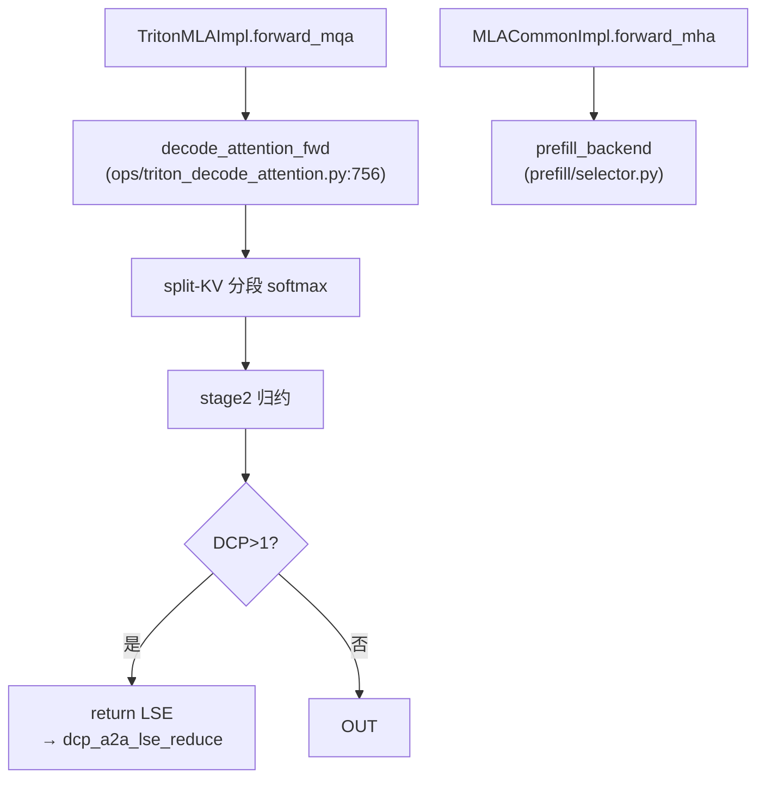

# Triton MLA backend

[← Wiki 首页](../../../README.md) > [注意力](../../README.md) > [Backend 列表](../README.md) > [← MLA 首页](../README.md) > Triton MLA

> 源码：`vllm/v1/attention/backends/mla/triton_mla.py`

## 是什么

`TritonMLABackend` / `TritonMLAImpl`（`triton_mla.py:81/134`）是纯 Triton 实现的 MLA dense backend，跨 CUDA / ROCm / XPU 可用，是 MLA 的**通用兜底**与 XPU 的主力 decode backend。继承 `MLACommonBackend`/`MLACommonImpl`。配套 `TritonMLAMetadataBuilder`（`triton_mla.py:50`）。

decode 走 `ops/triton_decode_attention.py:decode_attention_fwd`（split-KV flash decoding），prefill 复用 `MLACommonImpl.forward_mha` 调 prefill backend。

## 为什么

- **无外部依赖**：不需要 FlashMLA/CUTLASS/AITER，纯 Triton，是 XPU 与任意 CUDA/ROCm 设备的兜底 MLA decode。
- **`supports_compute_capability` 返回 True**：不挑硬件，任何能跑 Triton 的地方都能用。
- **`can_return_lse_for_decode=True`**：支持 DCP 跨 rank LSE 归约。
- **`supports_batch_invariance=True`**：可用于 spec decode 与 `UNIFORM_BATCH` cudagraph。
- **`lse_base_on_e=True`**（继承 `MLACommonImpl`）：与合并 kernel 默认 base e 一致。

## 怎么做

### 能力要点

| 项 | 值 | 位置 |
|----|----|------|
| dtypes | fp16/bf16 | `triton_mla.py:82` |
| kv dtype | auto/fp16/bf16/fp8/fp8_e4m3 | `triton_mla.py:83` |
| block sizes | `MultipleOf(16)`（`supports_block_size` 同） | `triton_mla.py:96/100` |
| cudagraph | `UNIFORM_BATCH` | `triton_mla.py:51` |
| head sizes | `[]`（任意，受 `MLACommonBackend` 的 [320,576] 约束） | `triton_mla.py:92` |
| `supports_compute_capability` | `True`（全平台） | `triton_mla.py:130` |
| `can_return_lse_for_decode` | `True` | `triton_mla.py:135` |
| stride_order | blocks 优先 `(1,0,2,3)`（含 layers 维） | `triton_mla.py:106` |

### 限制

`TritonMLAImpl.__init__`（`triton_mla.py:137`）显式拒绝 `alibi_slopes` / `sliding_window` / `logits_soft_cap`，且 `attn_type` 必须是 `DECODER`（不支持 encoder/cross）。

### workspace 预留

`TritonMLAMetadataBuilder._reserve_attn_logits_workspace`（`triton_mla.py:57`）在 warmup 前按最坏情况（max_model_len → max num_kv_splits，max_num_seqs decode tokens）预留 split-KV logits workspace。`_compute_num_kv_splits`（`triton_mla.py:41`）按 `max_seq_len/_MIN_WORK_PER_SPLIT` 算 2 的幂 splits，受 SM 数封顶（`_SPLIT_OCCUPANCY_MULTIPLIER=2`）。

### forward 路径

## 与其它模块/系统配合

- **ops**：`triton_decode_attention.decode_attention_fwd`，见 [ops](../../ops.md)。
- **workspace manager**：`current_workspace_manager().get_simultaneous` 预留 buffer，见 [执行层-Worker](../../../02-execution/worker/README.md)。
- **selector**：MLA 优先级表末位兜底；XPU MLA 直接选它，见 [selector](../../selector.md)。
- **DCP**：`can_return_lse_for_decode` 让 DCP 路径可用，见 [分布式-All2All](../../../07-distributed/device-communicators/all2all.md)。
- **prefill**：prefill 由独立 `prefill/selector.py` 选（Hopper 默认 `FlashAttnPrefillBackend`），见 [MLA 总览](../README.md)。

## 历史版本演进

- **v0.6.x**：MLA Triton decode 初版（改编自 SGLang/LightLLM split-KV），DeepSeek V2。
- **v0.7.x**：接入 `MLACommonImpl` 双 forward 框架。
- **v0.8.x**：FP8 KV cache；`can_return_lse_for_decode` 支持 DCP；workspace 预留机制。
- **v0.9.x**：`supports_batch_invariance`；`_SPLIT_OCCUPANCY_MULTIPLIER` 调优；stride_order blocks 优先支持跨层布局。
- **v0.10.x（当前）**：workspace manager 集成；prefill 完全外移到 `prefill/` 子目录。

---

[← 返回 MLA 首页](../README.md)

## 参见

- [MLA 总览](../README.md)
- [MLA AITER](aiter.md)（ROCm 上的对应物）
- [Triton 标准 backend](../triton.md)
- [底层 ops](../../ops.md)
