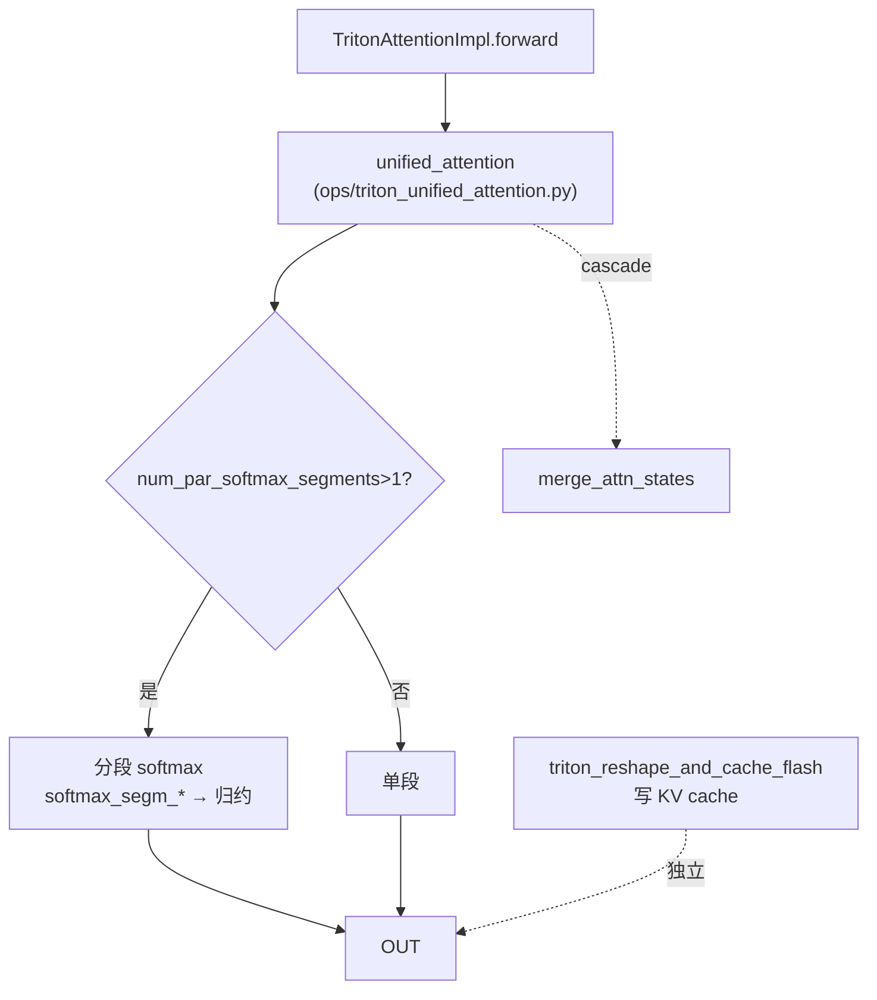

# Triton attention backend

[← Wiki 首页](../../README.md) > [注意力](../../README.md) > [Backend 列表](../README.md) > Triton

> 源码：`vllm/v1/attention/backends/triton_attn.py`、`vllm/v1/attention/backends/triton_attn_diffkv.py`

## 是什么

`TritonAttentionBackend` 是用纯 Triton kernel 实现的统一注意力 backend，prefill 与 decode 都走 `ops/triton_unified_attention.py:unified_attention`（IBM hpc-ops 出品）。它是 CUDA/ROCm/XPU 上的**通用回退**与某些场景的主力（如 XPU 非 MLA、ROCm 无 AITER 时）。配套 `TritonAttentionDiffKVBackend` 支持 K≠V head dim（R1 类模型），走 `ops/triton_unified_attention_diffkv.py:unified_attention_diffkv`。

三件套：

- `TritonAttentionBackend`（`triton_attn.py`）+ `TritonAttentionMetadataBuilder` + `TritonAttentionImpl`。
- `TritonAttentionMetadata`（`triton_attn.py:59`）—— 含 softmax 分段并行所需的 `softmax_segm_*`、cascade 字段、mm_prefix/rswa 字段。
- DiffKV：`TritonAttentionDiffKVBackend`（`triton_attn_diffkv.py:73`，继承标准）+ `TritonAttentionDiffKVImpl`。

## 为什么

- **无第三方依赖**：不需要 flash-attn / FlashInfer pip 包，纯 Triton，跨 CUDA/ROCm/XPU 可用，是兜底 backend。
- **全特性**：unified kernel 一套覆盖 cascade、ALiBi、softcap、sliding window、RSWA、mm_prefix、KV 量化、FP8。
- **CUDA graph ALWAYS**：`_cudagraph_support = AttentionCGSupport.ALWAYS`（`triton_attn.py:102`），支持 mixed prefill-decode 捕获。
- **diff-kv**：R1 类模型（如 RWKV 系列）K/V head dim 不同，FA2 不支持，故提供 Triton diff-kv 路径。

## 怎么做

### 能力要点

| 项 | 值 | 位置 |
|----|----|------|
| `_cudagraph_support` | `ALWAYS`（mixed prefill-decode 可捕获） | `triton_attn.py:102` |
| block sizes | `MultipleOf(1)` 实质由 kernel 定 | `triton_attn.py` |
| `supports_sink` | `True`（`triton_attn.py:385`） | |
| `supports_alibi_sqrt` | `True`（`triton_attn.py:399`，ALiBi with √d scale） | |
| KV cache 形状 | `(2, num_blocks, block_size, num_kv_heads, head_size/x, x)` | `triton_attn.py:318` |
| stride_order | 按 NHD/HND layout | `triton_attn.py:348` |

### metadata 与 softmax 分段

`TritonAttentionMetadata` 含：

- `seq_threshold_3D`、`num_par_softmax_segments` —— 决定何时切到 3D kernel 与分段 softmax（`NUM_PAR_SOFTMAX_SEGMENTS=16`、`MIN_LAUNCH_GRID_SIZE_2D=128`，`triton_attn.py:55-56`）。
- `softmax_segm_output/max/expsum` —— 分段 softmax 归约中间结果。
- `cu_prefix_query_lens` / `prefix_kv_lens` / `suffix_kv_lens` —— cascade。
- `scheduler_metadata` / `prefix_scheduler_metadata` —— FA3 scheduler metadata 兼容（AOT 调度）。
- `mm_prefix_range_tensor` / `rswa_prefix_lens` / `rswa_window` —— 多模态前缀与 R-SWA。

### forward 路径

KV 写入走 `ops/triton_reshape_and_cache_flash.py:triton_reshape_and_cache_flash`（含 `_per_token_head_quant` 变体）；diff-kv 走 `triton_reshape_and_cache_flash_diffkv`。

### DiffKV 差异

- `TritonAttentionDiffKVBackend.head_size_v` 类属性（与 FA diff-kv 对齐）。
- KV cache 沿最后一维 packed：`[num_blocks, block_size, num_kv_heads, head_size_qk + head_size_v]`（`triton_attn_diffkv.py:100`）。
- builder 重写 `softmax_segm_output` 的最后一维为 `next_power_of_2(head_size_v)`（`triton_attn_diffkv.py:41-60`）。
- forward 调 `unified_attention_diffkv`。

## 与其它模块/系统配合

- **ops**：`unified_attention` / `unified_attention_diffkv` / `triton_reshape_and_cache_flash` / `triton_prefill_attention.context_attention_fwd` / `merge_attn_states`，见 [ops](../ops.md)。
- **utils**：`get_kv_cache_layout`、`get_num_attention_heads_from_layers`、`compute_mm_prefix_range_tensor`，见 [utils](utils.md)。
- **selector**：CUDA 非 MLA 中等优先级；XPU 主力（FA 缺特性时回退）；ROCm 无 AITER 时回退，见 [selector](../selector.md)。
- **MLA**：`mla/triton_mla.py` 的 `TritonMLABackend` 用 `ops/triton_decode_attention.py:decode_attention_fwd` 做 MLA decode，但走 `MLACommonImpl`，与本文件独立，见 [MLA Triton](mla/triton.md)。
- **ROCm**：`triton_attn.py` import `rocm_aiter_ops`（`triton_attn.py:11`），在 ROCm 上复用部分 AITER helper。
- **FA4/MTP**：metadata 沿用 FA3 scheduler metadata 字段以兼容 AOT 调度（`triton_attn.py:93-94`）。

## 历史版本演进

- **v0.6.x**：初版 Triton attention（prefill `context_attention_fwd` + decode paged）。
- **v0.7.x**：引入 `unified_attention`（IBM hpc-ops），prefill+decode 统一；分段 softmax；`supports_alibi_sqrt`。
- **v0.8.x**：cascade 字段；sliding window；FP8 KV cache；cudagraph `ALWAYS`。
- **v0.9.x**：mm_prefix range tensor；R-SWA；per-token-head quant 写入；scheduler metadata 字段。
- **v0.10.x（当前）**：`TritonAttentionDiffKVBackend`（R1 类 diff-kv）；`triton_attn_diffkv.py` 独立文件；`get_num_attention_heads_from_layers` 支持非均匀逐层 head 数。

---

[← 返回注意力首页](../../README.md)

## 参见

- [FlashAttention backend](flash-attn.md)
- [FlashInfer backend](flashinfer.md)
- [ROCm backend](rocm.md)
- [MLA Triton](mla/triton.md)
- [底层 ops](../ops.md)
