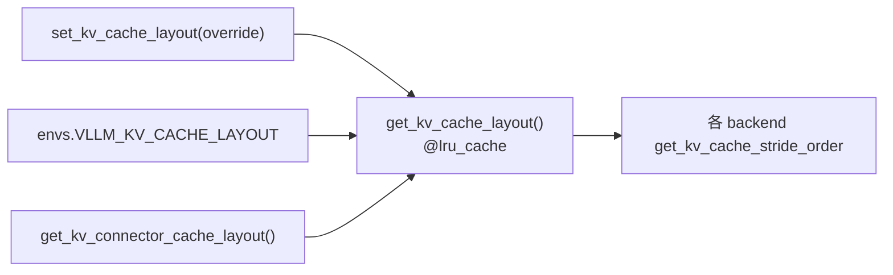

# backends 工具层（utils / fa_utils）

[← Wiki 首页](../../README.md) > [注意力](../../README.md) > [Backend 列表](../README.md) > Utils

> 源码：`vllm/v1/attention/backends/utils.py`、`vllm/v1/attention/backends/fa_utils.py`

## 是什么

`utils.py` 与 `fa_utils.py` 是所有 attention backend 共享的基础设施层：

- `utils.py` —— KV cache layout 全局状态、batch 拆分、逐层参数推断、cascade 工具、DCP helper、Mamba/GDN 公共元数据构造、spec decode reshape、subclass 工厂。
- `fa_utils.py` —— FlashAttention 版本探测 / 跨平台导入 / Fähigkeit gating / FA4 CuTeDSL 编译 spec。

## 为什么

把跨 backend 复用的逻辑集中，避免每个 backend 重复实现：

- KV cache layout (`NHD`/`HND`) 是全局状态，必须单点管理（selector / KV connector 都要读）。
- `split_decodes_and_prefills` 被 FlashInfer/ROCm/Triton/CPU/Mamba/Sparse MLA 全用。
- `PerLayerParameters` / `infer_global_hyperparameters` 解决"同 batch 不同层 head 数/quant 不同"。
- FlashAttention 版本/能力探测若散落各 backend 会循环依赖与重复 import。

## 怎么做

### utils.py 主要 API

| API | 作用 | 位置 |
|-----|------|------|
| `KVCacheLayoutType` / `get_kv_cache_layout` / `set_kv_cache_layout` / `is_valid_kv_cache_layout` | 全局 KV cache layout（NHD/HND）单例 + override | `utils.py:42/83/112/78` |
| `PAD_SLOT_ID` / `NULL_BLOCK_ID` | pad/null block 常量 | `utils.py:45-46` |
| `compute_mm_prefix_range_tensor` | mm_prefix_range dict → padded tensor | `utils.py:49` |
| `PerLayerParameters` / `get_per_layer_parameters` / `get_num_attention_heads_from_layers` | 逐层 head 数/quant 参数 | `utils.py:119/136/169` |
| `infer_global_hyperparameters` | 批级全局超参 | `utils.py:195` |
| `make_local_attention_virtual_batches` | local attention 虚拟 batch | `utils.py:277` |
| `make_kv_sharing_fast_prefill_common_attn_metadata` / `KVSharingFastPrefillMetadata` / `create_fast_prefill_custom_backend` | KV sharing fast prefill | `utils.py:423/786/791` |
| `split_decodes_prefills_and_extends` / `split_decodes_and_prefills` / `split_prefill_chunks` / `reorder_batch_to_split_decodes_and_prefills` | batch 拆分与重排 | `utils.py:492/564/636/663` |
| `reshape_query_for_spec_decode` / `reshape_attn_output_for_spec_decode` | spec decode query/output reshape | `utils.py:743/759` |
| `subclass_attention_metadata` | 派生 backend（来自 `backend.py:subclass_attention_backend`） | `utils.py:772` |
| `compute_causal_conv1d_metadata` | Mamba/GDN causal conv1d 元数据 | `utils.py:836` |
| `get_dcp_local_seq_lens` | DCP 本 rank seq lens | `utils.py:885` |
| `mamba_get_block_table_tensor` | Mamba block table tensor | `utils.py:925` |

### KV cache layout 全局状态

优先级：`_KV_CACHE_LAYOUT_OVERRIDE`（backend 要求，如 CPU→HND、XPU→NHD）> `VLLM_KV_CACHE_LAYOUT` 环境变量 > KV connector 要求 > 默认。

### fa_utils.py 主要 API

| API | 作用 | 位置 |
|-----|------|------|
| `get_flash_attn_version(...)` | 返回 2/3/4 | `fa_utils.py` |
| `is_flash_attn_varlen_func_available()` | 是否可用 | |
| `is_fa_version_supported(...)` | 版本 gating | |
| `flash_attn_varlen_func` / `get_scheduler_metadata` / `reshape_and_cache_flash` | 跨平台导入（CUDA/XPU/ROCm 分流） | `fa_utils.py:21-62` |
| `flash_attn_supports_sinks()` / `flash_attn_supports_quant_query_input()` / `flash_attn_supports_mla()` | 能力 gating | `fa_utils.py:280` 等 |
| `FlashAttentionCuTeDSLCompileSpec` | FA4 CuTeDSL warmup spec（Blackwell） | `fa_utils.py:66` |
| `compile_flash_attn_varlen_func_from_specs` | 预编译 | |

平台分流：

- CUDA → `vllm.vllm_flash_attn` + `_custom_ops.reshape_and_cache_flash`。
- XPU → `xpu_ops`。
- ROCm → 上游 `flash_attn` 包（`_ROCM_FLASH_ATTN_AVAILABLE` flag）+ `_custom_ops`。

## 与其它模块/系统配合

- **被所有 backend 用**：见各 backend 页。
- **selector**：`set_kv_cache_layout` 在选定 backend 后调用，见 [selector](../selector.md)。
- **KV connector**：`get_kv_connector_cache_layout` 决定 connector 要求的 layout。
- **Mamba/Linear/GDN**：`compute_causal_conv1d_metadata`、`mamba_get_block_table_tensor`、`split_decodes_and_prefills`，见 [Mamba](mamba.md)、[Linear](linear.md)。
- **Sparse MLA**：`split_decodes_and_prefills`、`split_prefill_chunks`、`reshape_*_for_spec_decode`，见 [MLA 总览](mla/README.md)。

## 历史版本演进

- **v0.6.x**：`utils.py` 初版（split_decodes、kv_cache_layout）。
- **v0.7.x**：`PerLayerParameters` / `infer_global_hyperparameters`（非均匀逐层 head）；KV connector layout 协调。
- **v0.8.x**：`fa_utils.py` FA3 版本探测；cascade/scheduler metadata helper。
- **v0.9.x**：`compute_mm_prefix_range_tensor`；R-SWA；spec decode reshape；KV sharing fast prefill；`subclass_attention_metadata`。
- **v0.10.x（当前）**：`FlashAttentionCuTeDSLCompileSpec`（FA4）；`set_kv_cache_layout` override 机制；`split_decodes_prefills_and_extends` 三段拆分。

---

[← 返回注意力首页](../../README.md)

## 参见

- [FlashAttention backend](flash-attn.md)
- [Triton backend](triton.md)
- [Mamba/SSM backend](mamba.md)
- [MLA 总览](mla/README.md)
- [selector](../selector.md)
