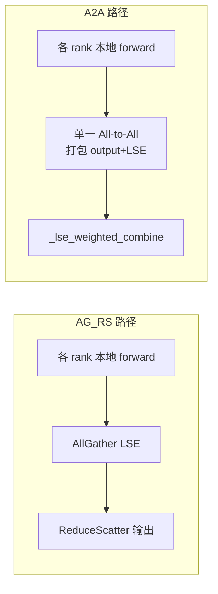

# 底层 ops

[← Wiki 首页](../README.md) > [注意力](../README.md) > 底层 ops

> 源码目录：`vllm/v1/attention/ops/`

## 是什么

`ops/` 是与 backend 解耦的**底层 fused kernel 集合**。backend 文件负责"选 kernel + 组织 metadata"，而真正的 CUDA/Triton/C++ 算子放在 `ops/`。这样多 backend 能复用同一 kernel（如 `merge_attn_states` 同时被 FlashAttention、FlashInfer、ROCm 用），也便于单独测试。

目录下文件（按职责分组）：

| 文件 | 入口函数 | 作用 |
|------|----------|------|
| `common.py` | `cp_lse_ag_out_rs` | DCP/Prefill-CP 的 LSE all-gather + output reduce-scatter Triton kernel，按 `IS_BASE_E` 分支 |
| `dcp_alltoall.py` | `dcp_a2a_lse_reduce` | Decode Context Parallel 的 All-to-All 通信 + LSE 加权合并（`arxiv:2507.07120`） |
| `paged_attn.py` | `PagedAttention.split_kv_cache` / `write_to_paged_cache` | 经典 paged 分裂/写入；转发到 `_custom_ops.reshape_and_cache` |
| `prefix_prefill.py` | `context_attention_fwd` | Triton prefill context attention（改编自 LightLLM） |
| `chunked_prefill_paged_decode.py` | `chunked_prefill_paged_decode` / `has_native_kv_cache_layout` | ROCm chunked prefill + paged decode 统一 kernel |
| `merge_attn_states.py` | `merge_attn_states` | prefix/suffix 部分 attention 输出 LSE 合并（CUDA + Triton） |
| `triton_merge_attn_states.py` | `merge_attn_states` | 纯 Triton 版合并 |
| `triton_reshape_and_cache_flash.py` | `triton_reshape_and_cache_flash` / `_diffkv` / `_per_token_head_quant` | Triton 版 KV cache 写入（含 diff-kv、per-head 量化） |
| `triton_unified_attention.py` | `unified_attention` | IBM hpc-ops 出品的统一 prefill+decode Triton kernel（含 cascade、alibi、softcap、sliding window） |
| `triton_unified_attention_diffkv.py` | `unified_attention_diffkv` | 上一项的 diff-kv (K≠V head dim) 变体 |
| `triton_prefill_attention.py` | `context_attention_fwd` | Triton prefill（改编自 SGLang，page_size=1） |
| `triton_decode_attention.py` | `decode_attention_fwd` / `_normal` / `_grouped` | Triton flash decoding（split-KV stage1+2，改编自 SGLang/LightLLM） |
| `triton_attention_helpers.py` | `apply_alibi_to_score` `apply_softcap` `find_seq_idx` `softmax_step` 等 | unified_attention 的内部 helper |
| `triton_fp8_mqa_logits.py` | (gfx942 fp8_mqa_logits fallback) | ROCm MI300X 的 AITER fp8_mqa_logits 临时 Triton 复刻（待 AITER 上游修 `ROCm/aiter#3257` 后移除） |
| `int4_per_token_head.py` | `unified_attention_int4` / `reshape_and_cache_int4` | INT4 per-token-head KV cache 模式：nibble pack、RHT、split-dot attention |
| `triton_turboquant_store.py` | `triton_turboquant_store` | TurboQuant KV 量化写入 |
| `triton_turboquant_decode.py` | `triton_turboquant_decode_attention` | TurboQuant decode attention（解压 + softmax） |
| `flashmla.py` | `flash_mla_with_kvcache` / `_fp8` / `flash_mla_sparse_fwd` / `get_mla_metadata` / `is_flashmla_dense_supported` / `is_flashmla_sparse_supported` | DeepSeek FlashMLA C++ 扩展封装（`vllm._flashmla_C` / `_flashmla_extension_C`） |
| `xpu_mla_sparse.py` | `triton_bf16_mla_sparse_interface` | XPU 专用 sparse MLA Triton kernel |
| `rocm_aiter_mla_sparse.py` | (ROCm AITER sparse MLA ops) | ROCm 端 sparse MLA 算子（与 backends/mla/rocm_aiter_mla_sparse.py 配套） |
| `vit_attn_wrappers.py` | `flash_attn_maxseqlen_wrapper` 等 | ViT attention 的 torch.compile 兼容 wrapper |

## 为什么

- **复用**：`merge_attn_states` 在 cascade attention、chunked prefill、MLA chunked context、DCP 归约都用到，放 ops 让多 backend 共享。
- **可测**：每个 kernel 可独立单测，脱离 backend metadata 构造。
- **平台隔离**：`flashmla.py` 用 `current_platform.is_cuda()` gate C++ import；`xpu_mla_sparse.py` / `rocm_aiter_mla_sparse.py` 只在对应平台加载。
- **正确性收口**：DCP 的 LSE base（自然对数 vs log2）是跨 backend 的统一陷阱，所以合并逻辑集中在 `common.py` / `dcp_alltoall.py`，由 `AttentionImplBase.lse_base_on_e` 单点驱动 `IS_BASE_E` 编译期常量。

## 怎么做

### prefix/suffix 合并（cascade / chunked prefill 核心）

`merge_attn_states`（`merge_attn_states.py:9`）实现 `arxiv:2501.01005` §2.2 的 LSE rescaling：

```
out = (pref_out * exp(pref_lse) + suff_out * exp(suff_lse)) / Z
```

- `prefill_tokens_with_context` 区分需要合并的 prefill token 与直接拷贝的 decode token。
- FP8 输出需带 `output_scale`，FP8 输入目前回退 Triton（CUDA kernel 不支持 FP8 输入，但支持 FP8 输出）。
- Triton 版在 `triton_merge_attn_states.py:14`。

### DCP 通信



- `cp_lse_ag_out_rs`（`common.py:213`）：AG+RS 经典路径。
- `dcp_a2a_lse_reduce`（`dcp_alltoall.py:392`）：A2A 路径，把 partial output 与 LSE 打包一次 NCCL A2A，再 `_lse_weighted_combine`（`dcp_alltoall.py:35`）做精确 LSE 加权归约；`is_lse_base_on_e` 决定 `exp` 还是 `pow(2,·)`。
- 用法：`vllm serve ... --dcp-comm-backend a2a`。

### Triton unified attention

`unified_attention`（`triton_unified_attention.py:802`）源自 IBM hpc-ops，是 Triton backend 与 MLA Triton decode 共享的统一 kernel：

- 支持 cascade（prefix/suffix 双路径 + `merge_attn_states`）。
- 支持 ALiBi、softcap、sliding window、RSWA、mm_prefix。
- KV 量化通过 `KVQuantMode` constexpr 分支。
- `unified_attention_diffkv`（`triton_unified_attention_diffkv.py:383`）支持 K/V head dim 不同（R1 类模型）。
- 配套 helper 在 `triton_attention_helpers.py`（`find_seq_idx`、`resolve_seq_and_query_len`、`softmax_step` 等）。

### FlashMLA ops

`flashmla.py` 封装 DeepSeek 官方 FlashMLA C++ 扩展：

- `flash_mla_with_kvcache` / `flash_mla_with_kvcache_fp8` —— dense decode。
- `flash_mla_sparse_fwd` —— sparse decode（DeepSeek V4）。
- `get_mla_metadata` / `get_mla_metadata_dense_fp8` —— 计算 `num_kv_splits`。
- `is_flashmla_dense_supported`（Hopper only）/ `is_flashmla_sparse_supported`（Hopper+Blackwell DC）。
- 探测 `vllm._flashmla_C` 与 `vllm._flashmla_extension_C` 是否编译成功。

## 与其它模块/系统配合

- **Triton backend / ROCm backend**：直接调 `unified_attention` / `context_attention_fwd` / `triton_reshape_and_cache_flash`，见 [Triton backend](backends/triton.md)、[ROCm backend](backends/rocm.md)。
- **FlashAttention / FlashInfer backend**：调 `merge_attn_states`、`reshape_and_cache_flash`（C++）、`cp_lse_ag_out_rs`/`dcp_a2a_lse_reduce` 做 DCP，见 [FlashAttention](backends/flash-attn.md)、[FlashInfer](backends/flashinfer.md)。
- **MLA backends**：`flashmla.py` 被 `mla/flashmla.py` 与 `mla/flashmla_sparse.py` 用；`decode_attention_fwd` 被 `mla/triton_mla.py` 用；`merge_attn_states` 被 `MLACommonImpl.forward_mha` 的 chunked context 路径用，见 [MLA 总览](backends/mla/README.md)。
- **分布式-All2All**：`dcp_alltoall.py` 是 DCP 的通信实现，见 [分布式-All2All](../07-distributed/device-communicators/all2all.md)。
- **KV cache 写入**：`reshape_and_cache_flash` / `concat_and_cache_mla`（在 `_custom_ops`）是把新 K/V 落盘 paged cache 的统一入口，见 [引擎核心-KV 管理](../01-engine-core/kv-cache-management/README.md)。
- **torch.compile**：`vit_attn_wrappers.py` 把 `.item()` 等 torch.compile 不友好的操作包成 custom op。

## 历史版本演进

- **v0.6.x**：`paged_attn.py` + `prefix_prefill.py` 初版（V0 `AttentionKernel` 迁移）。
- **v0.7.x**：`triton_unified_attention.py`（IBM hpc-ops）引入；`merge_attn_states` 抽出 cascade 合并。
- **v0.8.x**：`flashmla.py` 接入 FlashMLA C++；`triton_decode_attention.py`（split-KV MLA decode）；`common.py` 的 DCP AG+RS。
- **v0.9.x**：`dcp_alltoall.py` A2A backend；`flash_mla_sparse_fwd`；`xpu_mla_sparse.py`；`int4_per_token_head.py`；`triton_fp8_mqa_logits.py` gfx942 fallback。
- **v0.10.x（当前）**：`triton_unified_attention_diffkv.py`；`triton_turboquant_*`；`chunked_prefill_paged_decode`；`triton_reshape_and_cache_flash_diffkv` 与 `_per_token_head_quant` 变体。

---

[← 返回注意力首页](../README.md)

## 参见

- [backends 导航](backends/README.md)
- [FlashAttention](backends/flash-attn.md) ｜ [Triton](backends/triton.md) ｜ [ROCm](backends/rocm.md)
- [MLA 总览](backends/mla/README.md)
- [分布式-All2All](../07-distributed/device-communicators/all2all.md)
