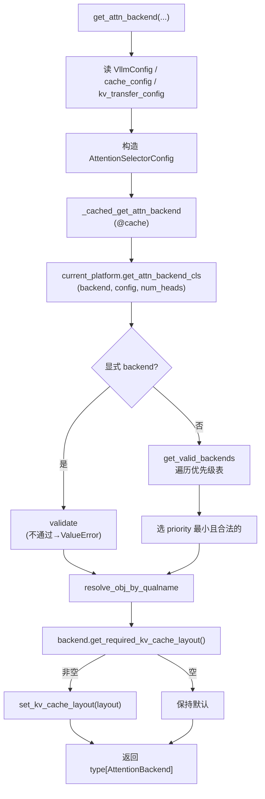

# selector 选择器

[← Wiki 首页](../README.md) > [注意力](../README.md) > selector

> 源码：`vllm/v1/attention/selector.py`

## 是什么

`selector.py` 是注意力 backend 的**入口路由器**。它把"模型/head_size/dtype/kv_cache_dtype/use_mla/…"这一组配置，加上 `vllm_config.attention_config.backend`（用户 `--attention-backend`），交由 `current_platform.get_attn_backend_cls()` 裁决出一个 backend 类的全限定名，再 `resolve_obj_by_qualname` 成真正的 `type[AttentionBackend]`。

对外两个主入口：

- `get_attn_backend(...)` —— 标准注意力（含 MLA/sparse），`selector.py:54`。
- `get_mamba_attn_backend(mamba_type)` —— SSM 族（Mamba1/2/ShortConv/Linear/GDN），`selector.py:147`。

## 为什么

backend 的合法性取决于"平台 + GPU 架构 + 模型结构 + KV 量化 + 环境变量"的**组合**，没有任何单点能独立判断。`selector.py` 的职责是：

1. 把分散的 `VllmConfig` / `envs` / 模型字段**汇聚**成一个 hashable 的 `AttentionSelectorConfig`（NamedTuple）。
2. 用 `@cache` 让同一组配置只裁决一次（首次启动慢、后续 step 零开销）。
3. 把**真正的优先级表**下放到各 platform（CUDA/ROCm/CPU/XPU 各有不同优先级），selector 只做"取优先级 → 逐个 validate → 选第一个合法"的通用流程。
4. 在选定后应用 backend 要求的 KV cache layout 覆盖。

## 怎么做

### AttentionSelectorConfig

`AttentionSelectorConfig`（`selector.py:21`）是 NamedTuple，字段：

```
head_size, dtype, kv_cache_dtype, block_size,
use_mla, has_sink, use_sparse, use_mm_prefix,
use_per_head_quant_scales, attn_type,
use_non_causal, use_batch_invariant, use_kv_connector
```

其中 `use_non_causal` 来自 `vllm_config.attention_config.use_non_causal`，`use_batch_invariant` 来自 `envs.VLLM_BATCH_INVARIANT`，`use_kv_connector` 来自 `kv_transfer_config.is_kv_transfer_instance`。NamedTuple 是为了可 hash 进 `@cache`。

### get_attn_backend 流程



关键点：

- `_cached_get_attn_backend`（`selector.py:113`）用 `@cache`，以 `(backend, attn_selector_config, num_heads)` 为 key。
- 若 platform 返回空串会 `raise ValueError("Invalid attention backend for ...")`。
- 选定后调 `backend.get_required_kv_cache_layout()`（`selector.py:133`），若 backend 声明了 `NHD`/`HND`，调 `backends/utils.py:set_kv_cache_layout` 写全局 override。典型：XPU 强制 `NHD`，部分 ROCm backend 强制 `HND`。

### Mamba backend 选择

`get_mamba_attn_backend`（`selector.py:147`）走 `MambaAttentionBackendEnum.get_class()`，不走 platform 优先级表。若 `envs.VLLM_BATCH_INVARIANT` 开启但 backend 不支持 `supports_batch_invariance()` 则直接 `RuntimeError`。

### platform 侧优先级（裁决核心）

各 platform 的 `get_attn_backend_cls` + `get_valid_backends` 才是真正的决策表：

- **CUDA**（`platforms/cuda.py:391` / `platforms/cuda.py:83` 的 `_get_backend_priorities`）：按 SM major×use_mla×kv_cache_dtype×num_heads 给优先级表；显式 `--block-size` 会排除高优先级 backend 并 warning。
- **ROCm**（`platforms/rocm.py:531` / `platforms/rocm.py:407`）：按 use_sparse→use_mla→use_kv_connector 组合；AITER 可用性由 `rocm_aiter_ops.is_mla_enabled/is_mha_enabled` 控制。
- **XPU**（`platforms/xpu.py:121`）：强制 NHD；MLA→Triton，sparse→XPU_MLA_SPARSE，turboquant→TURBOQUANT，否则 FA 或回退 Triton。
- **CPU**（`platforms/cpu.py:75`）：只返回 `CPU_ATTN`，MLA/sparse 直接 `NotImplementedError`。

详见各平台文件，决策树图见 [注意力首页](README.md)。

## 与其它模块/系统配合

- **Attention 抽象层**：产出 `type[AttentionBackend]` 给上层，见 [backend 抽象层](backend-abstraction.md)。
- **registry**：`get_attn_backend_cls` 返回的字符串对应 `AttentionBackendEnum` 的类路径，selector 不直接 import backend，全靠 `resolve_obj_by_qualname` 懒加载，见 [backend 注册表](backend-registry.md)。
- **platforms**：`current_platform.get_attn_backend_cls` 是多态分发点，见平台文件。
- **MLA prefill 选择**：MLA 的 prefill backend 是**独立**的第二层选择（`backends/mla/prefill/selector.py`），不走本文件，而是在 `MLACommonImpl` 初始化时由 `get_mla_prefill_backend(vllm_config)` 选定，见 [MLA 总览](backends/mla/README.md)。
- **环境变量**：`VLLM_ATTENTION_BACKEND`（通过 `attention_config.backend`）、`VLLM_BATCH_INVARIANT`、`VLLM_KV_CACHE_LAYOUT` 都在此汇合。

## 历史版本演进

- **v0.6.x**：`get_attn_backend` 初版，硬编码 if-else 选 FlashAttn/Triton。
- **v0.7.x**：引入 `AttentionSelectorConfig` NamedTuple + `@cache`；开始把优先级表外移到 platform。
- **v0.8.x**：MLA 分支进入 platform 优先级表；`use_kv_connector` 加入 config（KV connector 要求 blocks-first 布局，会排除部分 ROCm backend）。
- **v0.9.x**：`use_sparse` 字段；DCP 相关 `dcp_local_seq_lens`；`num_heads` 参数加入（Sparse MLA 按头数选 FlashInfer vs FlashMLA）。
- **v0.10.x（当前）**：MLA prefill 选择完全独立到 `mla/prefill/selector.py`；`get_required_kv_cache_layout` 应用逻辑迁入 selector；`@cache` key 含 num_heads。

---

[← 返回注意力首页](../README.md)

## 参见

- [backend 抽象层](backend-abstraction.md)
- [backend 注册表](backend-registry.md)
- [MLA 总览](backends/mla/README.md)
