[← Wiki 首页](../README.md)

# 采样与解码子系统（06-sampling-decoding）

> 本子系统覆盖从"模型 logits"到"最终落盘 token"之间的全部逻辑：在每一步前向之后，对 logits 做惩罚/约束/采样得到下一批 token；通过投机解码（speculative decoding）在每步预测多 token 以提高吞吐；通过结构化输出（structured output）保证生成内容符合 JSON / 正则 / 文法约束。整体由三块互补的代码组成：`vllm/v1/sample/`、`vllm/v1/spec_decode/`、`vllm/v1/structured_output/`。

---

## 总览

```mermaid
flowchart LR
    Logits["模型 logits<br/>[num_tokens, vocab]"] --> Sampler["Sampler<br/>(vllm/v1/sample/sampler.py)"]
    Sampler --> |"penalties / bad_words<br/>logits processors / topk_topp"| Sampled["sampled token ids"]
    Sampled --> |"非 spec decode"| Out["SamplerOutput"]

    subgraph SD["投机解码 (可选)"]
        direction LR
        Proposer["Proposer<br/>(eagle/medusa/mtp/ngram/...)"] --> |"draft_token_ids"| RS["RejectionSampler<br/>(vllm/v1/sample/rejection_sampler.py)"]
        RS --> |"accept / reject / recover / bonus"| Out2["SamplerOutput (K+1 tokens)"]
    end

    Sampled --> |"spec decode<br/>(drafter.propose)"| Proposer

    subgraph SO["结构化输出 (可选)"]
        direction LR
        SOM["StructuredOutputManager<br/>编译 grammar + 生成 bitmask"] --> |"apply_grammar_bitmask"| Logits
    end

    Schema["JSON / regex / grammar"] --> SOM
```



三块之间的关系：**结构化输出在采样之前修改 logits**（mask 非法 token），**采样器产出主路径 token**，**投机解码在对比 draft token 与 target 概率后一次性输出多 token**；三者可以叠加（spec decode + structured output 都开启时，draft 与 target 的 logits 都会被 bitmask 约束）。

---

## 是什么

本子系统由三个子目录构成：

| 子目录 | 源码路径 | 角色 |
|---|---|---|
| 采样器 | `vllm/v1/sample/` | 把 logits 变成 token：惩罚、bad_words、logits processors、top-k/top-p、logprobs 聚合 |
| 投机解码 | `vllm/v1/spec_decode/` | "draft token 提议 + target 验证" 的全部 proposer 实现，以及配套 metadata、vocab mapping、metrics 等 |
| 结构化输出 | `vllm/v1/structured_output/` | 多后端（xgrammar / guidance / outlines / lm-format-enforcer）的 grammar 编译、bitmask 生成与应用 |

注意：spec decode 的"verifier/rejection sampler"实际位于 `vllm/v1/sample/rejection_sampler.py`（属于采样器子目录），因为其本质是一次特殊的多 token 采样；本 wiki 按用户视角将它放在投机解码语境下展开讨论。

## 为什么独立成层

- **采样正确性是底线**：top-k/top-p、temperature、repetition/frequency/presence penalties 的实现必须与 HF 参考实现统计等价；任何偏差都会导致请求级输出分布漂移。
- **采样是性能瓶颈**：每步都跑，且 vocab_size 通常 ≥ 12 万；对排序/softmax/argmax 的实现必须 GPU-friendly 且无 CPU-GPU 同步。`vllm/v1/sample/ops/topk_topp_triton.py` 引入 Qrita 算法把 top-k+top-p 合并到一个 Triton kernel。
- **spec decode 的算法复杂度集中在采样路径**：rejection sampling 需要按位置比较 draft/target 概率并采"recovered token"，所有逻辑放在 `rejection_sampler.py` 中的 Triton kernel。
- **structured output 的 bitmask 也要在采样前 apply**：bitmask 是 `[batch, vocab // 32]` 的 int32 张量，由 `xgrammar`/`llguidance` 等 FSM 写入，vLLM 自身只负责按 batch 顺序对齐并调用 `apply_token_bitmask_inplace`。
- 三者解耦使得后端可插拔：spec decode 可单独关闭；structured output backend 可四种任选。

## 怎么组织

| 类别 | 关键文件 | 入口 Wiki |
|---|---|---|
| 采样入口 | `vllm/v1/sample/sampler.py` | [sampler.md](sampler.md) |
| Spec decode 验证采样 | `vllm/v1/sample/rejection_sampler.py` | [rejection-sampler.md](rejection-sampler.md) |
| Logits 处理器框架 | `vllm/v1/sample/logits_processor/` | [logits-processor.md](logits-processor.md) |
| 采样算子集 | `vllm/v1/sample/ops/` | [sampling-ops.md](sampling-ops.md) |
| 思考预算状态机 | `vllm/v1/sample/thinking_budget_state.py` | [thinking-budget.md](thinking-budget.md) |
| 投机解码总览 | `vllm/v1/spec_decode/` | [speculative-decoding/README.md](speculative-decoding/README.md) |
| 结构化输出总览 | `vllm/v1/structured_output/` | [structured-output/README.md](structured-output/README.md) |

## 与其它子系统的协作

- [引擎核心-调度](../01-engine-core/scheduler/README.md)：调度器决定每步哪些请求、每个请求带多少 spec/draft token，并组装 `SchedulerOutput`/`GrammarOutput`；scheduler 内还根据 `num_speculative_tokens` 调整 `num_computed_tokens` 与请求推进。
- [执行层-ModelRunner](../02-execution/worker/README.md)：`GPUModelRunner` 是采样器、proposer、rejection sampler、structured output manager 的持有者；每步 `forward` → `apply_grammar_bitmask` → `sampler` / `rejection_sampler` → `ModelRunnerOutput`。
- [模型执行-层库](../03-model-execution/README.md)：模型最后一层 `compute_logits` 输出 `[num_tokens, vocab]` 张量给采样器；`LogitsProcessor` 也可在模型内部以 hook 方式注入（per-request 风格，V0 兼容）。
- [注意力后端](../05-attention/README.md)：EAGLE / Gemma4 / Step3.5 / DFlash 等 proposer 内部维护独立的 `AttentionGroup` 与 attention metadata builder，且 EAGLE 的 draft KV cache 复用 target 的 KV cache group（甚至跨模型 KV 共享）。
- [编译与 IR](../09-compilation-ir/README.md)：`batched_count_greater_than`、`compiled_random_sample`、`TopKTopPSampler.forward_cpu` 等使用 `torch.compile`/simple_compile_backend；EAGLE 走 piecewise cudagraph。
- [模型库-Eagle/DFlash/DSpark 等](../04-model-zoo/architecture-families/README.md)：drafter 模型本身的权重与 hf_config（`eagle_aux_hidden_state_layer_ids`、`dflash_config`、`dspark_target_layer_ids` 等）决定 proposer 行为。
- [tokenizers](../14-tokenizers-transformers/README.md)：`VocabMapping` 在异构 vocab 场景下需要 target/draft 双 tokenizer 归一化比较；structured output 的 reduced vocabulary 也由 tokenizer 决定。
- [LoRA](../12-lora/README.md)：当 LoRA 启用时 lm_head 可能被替换，sampling 路径仍走 `Sampler`，但 logits 计算路径多一层 LoRA scale/merge（待核实：spec decode + LoRA 的支持矩阵）。

## 子目录导航

```
06-sampling-decoding/
├── README.md                       （本页：三块总览）
├── sampler.md                      （vllm/v1/sample/sampler.py：采样入口）
├── rejection-sampler.md            （vllm/v1/sample/rejection_sampler.py：spec decode 验证器）
├── logits-processor.md             （vllm/v1/sample/logits_processor/：argmax/非 argmax 不变量处理器）
├── sampling-ops.md                 （vllm/v1/sample/ops/：topk_topp / penalties / bad_words / logprobs）
├── thinking-budget.md              （vllm/v1/sample/thinking_budget_state.py：思考预算强制收尾）
├── speculative-decoding/           （投机解码子目录）
│   ├── README.md
│   ├── llm-base-proposer.md
│   ├── eagle.md
│   ├── medusa.md
│   ├── step3p5.md
│   ├── gemma4.md
│   ├── dflash.md
│   ├── dspark.md
│   ├── mtp.md
│   ├── ngram.md
│   ├── ngram-gpu.md
│   ├── suffix.md
│   ├── custom-class.md
│   ├── vocab-mapping.md
│   ├── extract-hidden-states.md
│   ├── draft-model.md
│   ├── dynamic.md
│   └── metrics.md
└── structured-output/              （结构化输出子目录）
    ├── README.md
    ├── manager.md
    ├── backend-types.md
    ├── backend-xgrammar.md
    ├── backend-guidance.md
    ├── backend-outlines.md
    ├── backend-lm-format-enforcer.md
    ├── request.md
    └── utils.md
```

## 历史版本演进

- **v0.5–v0.6**：V0 时代的 `vllm/spec_decode/` 已经有 ngram + draft_model 两路 proposer；V0 采样器在 `vllm/model_executor/layers/sampler.py`，与 V1 的 `vllm/v1/sample/sampler.py` 是两套实现。
- **v0.7.0**：V1 引擎 landfall。V1 `Sampler` 引入"argmax-invariant vs non-argmax-invariant logits processor"二分；先跑非 argmax-invariant（min_tokens / logit_bias），再在 `sample()` 内跑 argmax-invariant（min_p）、再 top-k/top-p、再 multinomial 等价采样。
- **v0.8.0**：V1 spec decode 首批落地（ngram、draft_model）；`RejectionSampler` 拆分为 `rejection_greedy_sample_kernel` + `rejection_random_sample_kernel` 两个 Triton kernel。
- **v0.8.5–v0.9.0**：EAGLE / EAGLE3、MTP（DeepSeek 系）、Medusa 进入主线；引入 `SpecDecodeBaseProposer` 统一 drafter 接口、`SpecDecodeMetadata` 数据类。
- **v0.9.0**：suffix decoding、ngram GPU（`NgramProposerGPU`）、custom class proposer 落地；`SpeculativeConfig` 加入 `satisfy_lossless_rate` 与 `synthetic_acceptance_rates`（用于 synthetic rejection mode）。
- **v0.10.0**：structured output 由 V0 单 backend（xgrammar）扩展为四 backend（xgrammar / guidance / outlines / lm-format-enforcer），由 `StructuredOutputManager` 统一调度；引入 reasoning parser 与"in reasoning"模式。
- **v0.10.5–v0.11**：thinking budget state 进入采样层（`ThinkingBudgetStateHolder` 在 penalties 之后 apply），强制 `<think>` 段在预算耗尽时立即结束；spec decode + thinking budget 的"force_index"逻辑与 spec_token_ids 联动。
- **v0.12 / main**：DFlash、DSpark、Gemma4 MTP、Step3.5 MTP 等并行 / 跨模型 KV 共享 drafter 进入活跃开发；`TopKTopPSampler` 支持 FlashInfer / aiter / xpu / triton 多场景分支，引入 Qrita Triton kernel；`extract_hidden_states` 方法用于 KV transfer 场景（不真正 speculate，只缓存 hidden）。

[← 返回 Wiki 首页](../README.md)
