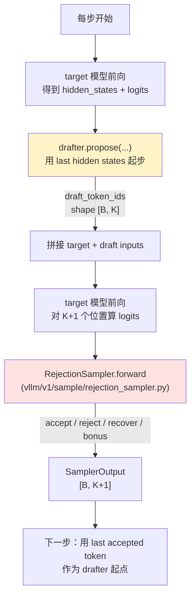

[← Wiki 首页](../../README.md) > [采样与解码](../README.md) > 投机解码

# 投机解码（Speculative Decoding）

> vLLM V1 的投机解码（spec decoding，简称 SD）是一种"小代价 drafter + 大模型靶"的解码加速技术：每步让 drafter 一次预测 K 个 token（draft），target 模型并行验证 K+1 个位置，按拒绝采样算法接受 / 拒绝 / 补偿 / 加 bonus。整体由"drafter 子系统（本目录）"+"rejection sampler（采样层）"+"调度器 spec-aware 部分"三块组成。

---

## 总览



### drafter 选择 map

`SpeculativeConfig.method`（在 `vllm/config/speculative.py:60` 定义）决定 drafter，`GPUModelRunner` 在 `vllm/v1/worker/gpu_model_runner.py:570` 处按 method 实例化 `self.drafter`：

| method | drafter 类 | 文件 | 何时用 |
|---|---|---|---|
| `ngram` | `NgramProposer` | `vllm/v1/spec_decode/ngram_proposer.py` | CPU-only，提示/输出自身的 n-gram 匹配 |
| ngram GPU | `NgramProposerGPU` | `vllm/v1/spec_decode/ngram_proposer_gpu.py` | GPU 加速版（`use_ngram_gpu()`） |
| `suffix` | `SuffixDecodingProposer` | `vllm/v1/spec_decode/suffix_decoding.py` | 复用 prompt + 历史 response 的后缀树 |
| `custom_class` | 用户类 | `vllm/v1/spec_decode/custom_class_proposer.py` | 自定义 drafter（FQCN 加载） |
| `eagle` / `eagle3` | `EagleProposer` | `vllm/v1/spec_decode/eagle.py` | EAGLE/EAGLE3，draft 子网络吃 target 的 hidden states |
| `draft_model` | `DraftModelProposer` | `vllm/v1/spec_decode/draft_model.py` | 独立小模型当 drafter |
| `medusa` | `MedusaProposer` | `vllm/v1/spec_decode/medusa.py` | Medusa 多头并行预测 |
| `mtp` | MTP family | `vllm/v1/spec_decode/llm_base_proposer.py`（base） | DeepSeek MTP / 通用 MTP |
| `use_gemma4_mtp()` | `Gemma4Proposer` | `vllm/v1/spec_decode/gemma4.py` | Gemma4 跨模型 KV 共享 MTP |
| `use_step3p5_mtp()` | `Step3p5MTPProposer` | `vllm/v1/spec_decode/step3p5.py` | Step3.5 per-layer 选 draft-step |
| `use_dflash()` | `DFlashProposer` | `vllm/v1/spec_decode/dflash.py` | DFlash 并行 drafting（mask token） |
| `dspark` | （不在本目录，见 dspark.md） | `vllm/v1/worker/gpu/spec_decode/dspark/speculator.py` | DSV4 DSpark |
| `extract_hidden_states` | `ExtractHiddenStatesProposer` | `vllm/v1/spec_decode/extract_hidden_states.py` | 不真正 speculate，只缓存 hidden 用于 KV transfer |

## 是什么

投机解码子系统 = `vllm/v1/spec_decode/` 目录 + `RejectionSampler` + scheduler/ModelRunner 的 spec-aware 部分。它分四层：

1. **Proposer 接口层**：`SpecDecodeBaseProposer` 提供统一 `propose(...)` API；每个具体 proposer 覆盖关键方法。
2. **Metadata + Utils 层**：`SpecDecodeMetadata`、`utils.py`（triton kernel + helpers）、`vocab_mapping.py`、`extract_hidden_states.py`、`metrics.py`。
3. **状态/调度层**：`dynamic/utils.py` 提供 dynamic SD 的 batch_size→K 查找表；scheduler 端决定每步实际 `num_speculative_tokens`。
4. **验证层**：`RejectionSampler`（在采样层目录，见 [../rejection-sampler.md](../rejection-sampler.md)）。

## 为什么独立成层

- **算法统一性**：所有 drafter 都遵循"draft token 流入 RejectionSampler，按 lossless 拒绝采样验证"的范式——分离让 Rejection 可统一优化、drafter 可独立演化。
- **drafter 性能开销极小**：理想 drafter 一次 forward 应远轻于 target。本目录多个 proposer（ngram、suffix、custom_class）甚至不需要任何 GPU forward；EAGLE/MTP 等虽走 forward 但单层或子模型。
- **KV cache 共享**：EAGLE / Gemma4 等 drafter 可与 target 共享 KV cache（甚至跨模型 KV 共享），必须由 spec_decode 层管理 `AttentionGroup` 与 attention metadata build。
- **可观测性**：`SpecDecodingStats` / `SpecDecodingLogging` / `SpecDecodingProm` 标准化所有 drafter 的接受率/吞吐/平均接受长度指标，方便横向比较。
- **配置可插拔**：`SpeculativeConfig` 拥有 ~30 字段（`num_speculative_tokens` / `prompt_lookup_min` / `synthetic_acceptance_rates` / `disable_padded_drafter_batch` / `use_heterogeneous_vocab` 等）精细化控制不同 drafter 的行为。

## 怎么做

### 每步执行序列（spec decode 启用时）

`GPUModelRunner.execute` 每步大致按以下顺序（简化）：

1. 组装 inputs（含 `cu_query_lens`、`cu_seq_lens` 与 spec draft 的 slot_mapping）。
2. target 模型 forward → `target_hidden_states` + `target_logits`（覆盖 num_target_tokens 个位置）。
3. `drafter.propose(num_spec_tokens, target_token_ids, target_positions, target_hidden_states, next_token_ids, ...)` → `draft_token_ids [B, K]` + 可选 `draft_probs [B, K, V]`。
4. 把 draft token 拼到 inputs，跑 target 模型第二次 forward 验证（或与第 2 步合并为单次 forward，取决于方法）。
5. `rejection_sampler(spec_decode_metadata, draft_probs, verify_logits, sampling_metadata)` → `SamplerOutput [B, K+1]`。
6. scheduler 回收 `SamplerOutput`，按接受长度推进每请求的 `num_computed_tokens`。
7. metrics：`SpecDecodingStats.observe_draft(num_draft_tokens, num_accepted_tokens)` 累计。

###drafter propose 通用接口（`SpecDecodeBaseProposer.propose`）

签名（`vllm/v1/spec_decode/llm_base_proposer.py:502`）：

```python
def propose(
    self,
    num_speculative_tokens,
    target_token_ids,           # [num_tokens]
    target_positions,           # [num_tokens] 或 [3, num_tokens] (M-RoPE)
    target_hidden_states,       # [num_tokens, hidden_size]
    next_token_ids,             # [batch_size]
    token_indices_to_sample,    # [batch_size] 或 None
    common_attn_metadata,
    sampling_metadata,
    mm_embed_inputs=None,
    num_rejected_tokens_gpu=None,
    slot_mappings=None,
) -> torch.Tensor:  # [batch_size, num_speculative_tokens]
```

实现走"first pass + 剩余 K-1 个 token 的 multi-pass"模式（EAGLE/Gemma4/Step3.5/MTP/DFlash 通用）：

- **first pass**（行 821）：用 `target_token_ids` + `next_token_ids` 平移重组为 drafter 的输入；调 `set_inputs_first_pass` 走 triton kernel 把 hidden_states 写到正确 slot。
- **first forward**（行 580）：drafter 模型 forward，得 `last_hidden_states` + `hidden_states`（前者用于采样本位置，后者作下一位置输入）。
- **采样本位置**（行 620）：`_sample_draft_tokens(sample_hidden_states, sampling_metadata)` → `draft_token_ids` + 可选 `draft_probs`。
- **multi-pass**（行 682–761）：若 `num_speculative_tokens > 1` 且非 parallel_drafting：循环 K-1 次，每次：用上一步 draft 作 input_ids、hidden_states 作 hidden 输入、positions+1、更新 slot_mapping、forward、采样。
- **parallel_drafting**（行 619）：DFlash 一次 forward 同时算 K 个位置，跳过 multi-pass。

###drafter KV cache 复用

`SpecDecodeBaseProposer.initialize_attn_backend`（行 1705）把 draft 模型的 attn 层（与 target 不同的层）按 backend+kv_cache_group 聚合成 `AttentionGroup`；`build_per_group_and_layer_attn_metadata` 调用每 group 的 metadata builder `build_for_drafting(common_attn_metadata, draft_index=draft_index)`（draft_index 用于 EAGLE 的多次 forward 间区分位置）。

Gemma4 与 Step3.5 覆盖此方法以支持多 KV cache group（sliding vs full attention）。Gemma4 还在 `_setup_gemma4_kv_sharing`（`vllm/v1/spec_decode/gemma4.py:280`）把每个 draft 层的 attn 映射到 target 同型层的最后非共享层做 cross-model KV sharing。

### spec decode metadata（`vllm/v1/spec_decode/metadata.py:10`）

```python
@dataclass
class SpecDecodeMetadata:
    draft_token_ids: torch.Tensor
    num_draft_tokens: list[int]
    cu_num_draft_tokens: torch.Tensor
    cu_num_sampled_tokens: torch.Tensor
    target_logits_indices: torch.Tensor
    bonus_logits_indices: torch.Tensor
    logits_indices: torch.Tensor
```

- `num_draft_tokens[i]`：请求 i 实际 draft 数（可能小于 K，如 dynamic SD）。
- `bonus_logits_indices[i]`：请求 i 的 bonus token 在 logits 张量中的行索引。
- `target_logits_indices`：K 个 draft 位置在 logits 张量中的行索引。
- `cu_num_draft_tokens` / `cu_num_sampled_tokens`：累积值，用于 triton kernel 切分。

`make_dummy` 用于 prefill-only step（无 draft）的占位。

## 与其它模块/系统配合

- [../sampler.md](../sampler.md)：bonus token 走 `Sampler.forward(predict_bonus_token=True)`；spec_token_ids 用于 penalties 历史拼接。
- [../rejection-sampler.md](../rejection-sampler.md)：核心验证逻辑；`RejectionSampler` 是 drafter 输出的最终消费者。
- [../sampling-ops.md](../sampling-ops.md)：`apply_top_k_top_p` / `apply_bad_words_with_drafts` / `MinTokens.apply_with_spec_decode` 在 spec decode 路径被复用。
- [引擎核心-调度](../../01-engine-core/scheduler/README.md)：scheduler 根据 `num_speculative_tokens` 与 `SpecDecodeMetadata` 推进 `num_computed_tokens`；dynamic SD 在 `vllm/v1/core/sched/scheduler.py:253` 根据 batch_size 查 `dense_schedule` 决定 K。
- [执行层-GPUModelRunner](../../02-execution/worker/README.md)：持有 drafter + rejection_sampler；含 `use_async_spec_decode`、`prepare_inputs_padded`、`use_aux_hidden_state_outputs` 等 SD 相关字段。
- [注意力后端](../../05-attention/README.md)：`build_for_drafting` 接口；EAGLE / Gemma4 / Step3.5 的 draft KV cache 与 target 共享 group。
- [模型库](../../04-model-zoo/architecture-families/README.md)：drafter 模型权重与 hf_config（如 `eagle_aux_hidden_state_layer_ids`、`dflash_config`、`dspark_target_layer_ids`、`ptd_token_id`）驱动 proposer 行为。
- [tokenizers](../../14-tokenizers-transformers/README.md)：`VocabMapping` 在 draft/target vocab 不同时做归一化映射，详见 [vocab-mapping.md](vocab-mapping.md)。
- [LoRA](../../12-lora/README.md)：spec decode + LoRA 的支持矩阵受 drafter 模型自身能力限制（待核实）。

## 子目录导航

```
speculative-decoding/
├── README.md                 （本页）
├── llm-base-proposer.md      （SpecDecodeBaseProposer：EAGLE/MTP/Gemma4/DFlash/DraftModel/Step3.5 共同基类）
├── eagle.md                  （EagleProposer：EAGLE / EAGLE3）
├── medusa.md                 （MedusaProposer：多头并行）
├── step3p5.md                （Step3p5MTPProposer：Step3.5 per-layer draft-step）
├── gemma4.md                 （Gemma4Proposer：跨模型 KV 共享 MTP）
├── dflash.md                 （DFlashProposer：并行 drafting + mask token）
├── dspark.md                 （DSpark：DSV4 专用，不在 spec_decode/ 下）
├── mtp.md                    （通用 MTP：DeepSeek 系）
├── ngram.md                  （NgramProposer：CPU numba）
├── ngram-gpu.md              （NgramProposerGPU：GPU vectorized）
├── suffix.md                 （SuffixDecodingProposer：Arctic Inference）
├── custom-class.md           （create_custom_proposer：FQCN 加载）
├── vocab-mapping.md          （VocabMapping：异构 vocab 翻译）
├── extract-hidden-states.md  （ExtractHiddenStatesProposer：KV transfer 用）
├── draft-model.md            （DraftModelProposer：独立小模型 drafter）
├── dynamic.md                （dynamic SD：batch_size → K 调度）
└── metrics.md                （SpecDecodingStats / Logging / Prom）
```

## 历史版本演进

- **v0.5–v0.6（V0）**：`vllm/spec_decode/` 有 ngram + draft_model + Medusa + EAGLE，与 V0 采样器配套。V0 用 `MultiStepWorker` 跑 K 次 forward。
- **v0.7.0**：V1 spec decode landfall，`SpecDecodeBaseProposer` 抽象落地，统一 drafter 接口；ngram + draft_model + EAGLE 优先迁移。
- **v0.7.5**：`SpecDecodeMetadata` 与 `cu_num_draft_tokens` 累积布局固定，支持 `MAX_SPEC_LEN=128`。
- **v0.8.0**：`padded_drafter_batch` 模式引入——所有请求固定 K 个 draft 槽位（含 padding），让 CUDA graph 与 batch 实际接受长度解耦；`prepare_inputs_padded` + `prepare_next_token_ids_padded` 落地。
- **v0.8.5**：EAGLE3 + Medusa 进入主线；`use_aux_hidden_state_outputs` 字段加入。
- **v0.9.0**：ngram GPU、SuffixDecoding、custom_class_proposer 落地；`synthetic_acceptance_rates` 与 `rejection_sample_method="synthetic"` 用于无 drafter benchmark。
- **v0.10.0**：Dynamic SD（`num_speculative_tokens_per_batch_size`）落地，scheduler 按 batch_size 动态调整 K；`disable_padded_drafter_batch` 选项加入。
- **v0.10.5**：MTP（DeepSeek）、Step3.5 MTP、Gemma4 MTP 三家进入主线；`constant_draft_positions` 用于 Gemma4 的 Q-only attention 共享 KV。
- **v0.11.0**：DFlash、DSpark 进入主线；并行 drafting 概念普及，`parallel_drafting_token_id` 字段 + `extra_slots_per_request` 调整。
- **v0.12 / main**：`extract_hidden_states` 方法落地（用于 KV transfer，drafter 不真正 speculate）；dynamic SD 与 DFlash/DSpark 等并行 drafting 的 K=0 路径合并到统一 `propose` 早返回。

[← 返回采样与解码](../README.md)

## 参见

- [../sampler.md](../sampler.md)
- [../rejection-sampler.md](../rejection-sampler.md)
- [llm-base-proposer.md](llm-base-proposer.md)
