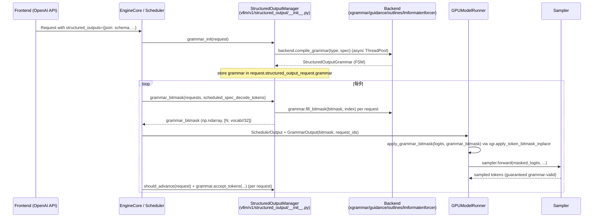

[← Wiki 首页](../../README.md) > [采样与解码](../README.md) > 结构化输出

# 结构化输出（Structured Output）

> vLLM V1 的结构化输出保证模型生成内容符合用户指定的 JSON Schema、正则、文法、choice、structural tag 等约束。它由 `StructuredOutputManager`（调度器端，编译 grammar、生成 bitmask）+ 四个后端（xgrammar / guidance / outlines / lm-format-enforcer）+ `apply_grammar_bitmask`（worker 端，把 bitmask 应用到 logits）三部分组成。

---

## 总览



## 是什么

| 文件 | 内容 |
|---|---|
| `__init__.py` | `StructuredOutputManager`：engine-level 管理 grammar 编译、bitmask 生成、reasoning parser 协作 |
| `backend_types.py` | `StructuredOutputBackend` ABC + `StructuredOutputGrammar` ABC + `StructuredOutputOptions` enum |
| `backend_xgrammar.py` | XgrammarBackend + XgrammarGrammar（默认 backend） |
| `backend_guidance.py` | GuidanceBackend + GuidanceGrammar（llguidance 后端） |
| `backend_outlines.py` | OutlinesBackend + OutlinesGrammar（regex-automata FSM） |
| `backend_lm_format_enforcer.py` | LMFormatEnforcerBackend + LMFormatEnforcerGrammar |
| `request.py` | `StructuredOutputRequest` dataclass + `get_structured_output_key` |
| `utils.py` | `apply_grammar_bitmask`（worker 端）+ outlines vocabulary 工具 + Lark→EBNF 转换 + regex compile timeout |

## 为什么独立成层

- **算法统一性**：所有后端（xgrammar、guidance、outlines、lm-format-enforcer）最终输出都是同一个数据结构——一个 `[vocab // 32]` int32 bitmask（每 bit 表示对应 token 是否合法）。这让 vLLM 的上层逻辑只需与 bitmask 打交道，后端可插拔。
- **异步 grammar init**：JSON Schema / regex 编译耗时几十毫秒到秒级；放在 ThreadPoolExecutor 避免阻塞 scheduler。请求进入后状态先 `WAITING_FOR_STRUCTURED_OUTPUT_GRAMMAR`，grammar 完成后转 `WAITING`。
- **bitmask batch 优化**：`grammar_bitmask` 一次为 batch 中所有 structured-output 请求构造 bitmask（含 spec decode 的多 K+1 行），最后通过 `SchedulerOutput.GrammarOutput` 序列化为 numpy 数组传给 worker。
- **后端能力差异**：xgrammar 支持 JSON / regex / grammar / structural_tag / choice 几乎全覆盖；outlines 不支持 grammar、lm-format-enforcer 不支持 grammar / structural_tag；guidance 全覆盖但需要 llguidance 库。后端选择走字符串切换。
- **reasoning parser 协作**：thinking 模型在 reasoning 段不应被 grammar 约束（输出 `</think>` 之前自由），但 `</think>` 之后必须严格约束。`StructuredOutputManager` 与 `ReasoningParser` 联动：`should_fill_bitmask` / `should_advance` / `trim_reasoning_for_advance` 三个方法决定何时填 mask、何时推进 FSM。

## 怎么做

### 后端选择

`request.sampling_params.structured_outputs._backend` 字段在前端 processor 校验阶段被设置；`StructuredOutputManager.grammar_init` 第一次调用时按此选择实例化 backend（`__init__.py:130`）：

- `"xgrammar"` → `XgrammarBackend(...)`
- `"guidance"` → `GuidanceBackend(...)`
- `"outlines"` → `OutlinesBackend(...)`（lazy import 避免未启用时引入 outlines_core 依赖）
- `"lm-format-enforcer"` → `LMFormatEnforcerBackend(...)`

注意：vLLM 当前**只支持单 backend per engine**——同一 engine 内所有 structured-output 请求必须用同一 backend。SOM 在第一次 `grammar_init` 时锁定 backend，后续请求的 `_backend` 必须一致（否则 assert fail，待核实具体 assert 位置）。

### grammar_init

```python
def grammar_init(self, request):
    if request.structured_output_request is None: return
    if self.backend is None:
        backend = request.sampling_params.structured_outputs._backend
        ...  # 实例化
    if self._use_async_grammar_compilation:
        grammar = self.executor.submit(self._create_grammar, request)
    else:
        grammar = self._create_grammar(request)
    request.structured_output_request.grammar = grammar
```

- `external_launcher` 模式下 `_use_async_grammar_compilation=False`——避免多 TP rank 间因 grammar 编译完成时机不同步导致 determinism 破坏（行 53）。
- `_create_grammar` 调用 `backend.compile_grammar(request_type, grammar_spec)` 编译 FSM。返回 `StructuredOutputGrammar` 实例或其 `Future`。

### grammar_bitmask

```python
def grammar_bitmask(self, requests, structured_output_request_ids, scheduled_spec_decode_tokens):
    if not structured_output_request_ids: return None
    if self._grammar_bitmask is None:
        self._grammar_bitmask = self.backend.allocate_token_bitmask(
            max_batch_size * (1 + num_speculative_tokens))
    cumulative_index = 0
    # 大 batch + 非 spec：并行 fill bitmask
    if len(structured_output_request_ids) > threshold and num_spec == 0:
        promises = [self._async_submit_fill_bitmask(batch) for batch in chunks]
        for p in promises: p.result()
    else:
        # 串行 fill + 处理 spec decode 的多行 + reasoning parser 联动
        for req_id in structured_output_request_ids:
            ...
            for i, token in enumerate(req_tokens):
                self._fill_bitmasks(((grammar, cumulative_index, apply_bitmask),))
                # 中途检测 reasoning end，翻转 apply_bitmask
                if advance_grammar and not grammar.is_terminated():
                    accepted = grammar.accept_tokens(req_id, [token])
                    ...
                cumulative_index += 1
            # bonus token bitmask
            self._fill_bitmasks(((grammar, cumulative_index, bonus_apply),))
    return bitmask_tensor.numpy()
```

- spec decode 路径下 `scheduled_spec_decode_tokens` 提供每请求的 draft token ids（含 `-1` 占位）；SOM 据此为每个 draft 位置填一行 bitmask，并在 grammars 上 `validate_tokens`（不推进 FSM）或 `accept_tokens`（推进 FSM）。
- `should_fill_bitmask(request)` 判断是否当前应填 mask：reasoning 已结束 → True；reasoning 中 → False（除非 `enable_in_reasoning=True`）。
- `rollback(state_advancements)` 在 spec draft 被 rejection sampler 拒绝后回滚 FSM 状态。

### apply_grammar_bitmask（worker 端，utils.py:85）

```python
def apply_grammar_bitmask(scheduler_output, grammar_output, input_batch, logits):
    grammar_bitmask = grammar_output.grammar_bitmask
    struct_out_req_batch_indices = {}
    cumulative_offset = 0
    for batch_index, req_id in enumerate(input_batch.req_ids):
        logit_index = batch_index + cumulative_offset
        cumulative_offset += len(spec_tokens.get(req_id, ()))
        if req_id in struct_out_req_ids:
            struct_out_req_batch_indices[req_id] = logit_index
    # 重排序 bitmask 以匹配本 batch
    sorted_bitmask_tensor = torch.full((logits.shape[0], ...), -1, ...)
    ...
    # GPU: xgr.apply_token_bitmask_inplace(logits, grammar_bitmask, indices=index_tensor)
    # CPU: 同样接口，但 indices 是 list
```

- scheduler 给的 bitmask 按 `structured_output_request_ids` 顺序，与 worker 的 `input_batch.req_ids` 顺序不一致——必须按 `struct_out_req_batch_indices` 重排。
- spec_decode 让一个请求占 ≥1 行 logits（K 个 draft + 1 bonus）；`cumulative_offset` 跟踪当前 offset。
- worker 端调 `xgrammar.apply_token_bitmask_inplace`（CPU/GPU 共用接口），bitmask 是 `int32 [vocab // 32]`——vLLM 不直接操作 bit，xgrammar 自己解 bit。
- `skip_out_indices` 优化：当所有 logits 行都是 structured output 行时（无 unconstrained request），不传 indices。

## 与其它模块/系统配合

- [../sampler.md](../sampler.md)：bitmask 在 sampler 调用前 apply；sampler 不感知 grammar。
- [../rejection-sampler.md](../rejection-sampler.md)：spec decode + structured output 时，draft 与 target 的 logits 都被 mask；SOM 在 `grammar_bitmask` 中按 `scheduled_spec_decode_tokens` 生成 K+1 行 mask。
- [../thinking-budget.md](../thinking-budget.md)：thinking budget 强制结束思考段 → `should_fill_bitmask` 在下一 step 翻 True，与 grammar 配合。
- [引擎核心-调度](../../01-engine-core/scheduler/README.md)：scheduler 在 `WAITING_FOR_STRUCTURED_OUTPUT_GRAMMAR → WAITING` 转换处等 grammar future；`grammar_bitmask()` 调用每步触发；`should_advance()` 在 step 结束后调用以决定是否推进 FSM。
- [执行层-GPUModelRunner](../../02-execution/worker/README.md)：在 `apply_grammar_bitmask` 出现的位置（`forward` 后、`sampler` 前）调用；CPU 端 `logits.is_cpu` 走不同分支处理 dtype 与 indices list。
- [tokenizers](../../14-tokenizers-transformers/README.md)：reduced vocabulary 由 tokenizer 决定，影响 xgrammar 的 `TokenizerInfo` 与 outlines 的 `Vocabulary`。
- [编译与 IR](../../09-compilation-ir/README.md)：bitmask 应用是非 compile 路径（xgrammar 自身 kernel）；torch.compile 不介入。

## 子目录导航

```
structured-output/
├── README.md                       （本页）
├── manager.md                      （StructuredOutputManager）
├── backend-types.md                （ABC + StructuredOutputOptions）
├── backend-xgrammar.md             （默认后端）
├── backend-guidance.md             （llguidance 后端）
├── backend-outlines.md             （regex-automata FSM）
├── backend-lm-format-enforcer.md   （lm-format-enforcer 后端）
├── request.md                      （请求级 dataclass + key 生成）
└── utils.md                        （apply_grammar_bitmask + 工具函数）
```

## 历史版本演进

- **v0.6.x（V0）**：V0 只有 xgrammar 一个 backend，per-request 实例化 GrammarMatcher，per-step fill bitmask；不支持 spec decode。
- **v0.7.0**：V1 `StructuredOutputManager` 落地；grammar 编译移到 ThreadPoolExecutor；bitmask 通过 `SchedulerOutput.GrammarOutput` 跨进程序列化。
- **v0.8.0**：spec decode + structured output 联动落地；bitmask batch 内按 K+1 行展开；rollback FSM 状态机制。
- **v0.9.0**：guidance backend (llguidance) 引入；`disable_any_whitespace` / `disable_additional_properties` 字段加入。
- **v0.10.0**：outlines backend 与 lm-format-enforcer backend 引入；`backend_types.py` ABC 抽象稳定；reasoning parser 联动（`should_fill_bitmask` / `should_advance` / `trim_reasoning_for_advance`）。
- **v0.10.5**：structural_tag option 加入（用于思考段切换格式）；`enable_in_reasoning` 字段让 grammar 在 reasoning 中也生效。
- **v0.11.0**：parallel bitmask fill（`fill_bitmask_parallel_threshold = 128`）落入；ThreadPoolExecutor max_workers 受 cpu count 约束。
- **v0.12 / main**：diffusion LLM 的 canvas 路径与 grammar bitmask 协作（`is_diffusion` 路径在 `grammar_bitmask` 中跳过 bonus）；`reasoning_parser_plugin` 字段支持动态加载 parser。

[← 返回采样与解码](../README.md)

## 参见

- [../sampler.md](../sampler.md)
- [../rejection-sampler.md](../rejection-sampler.md)
- [manager.md](manager.md)
