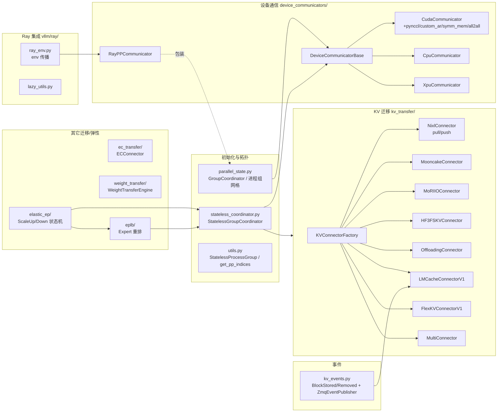
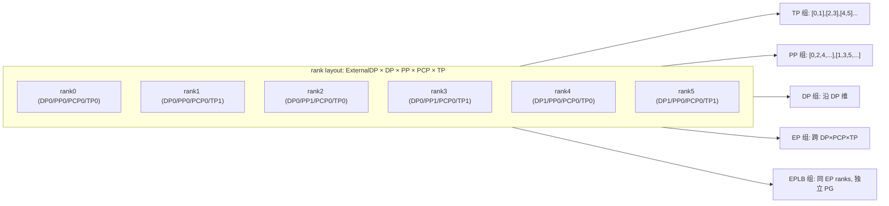

# 07 · 分布式子系统

[← Wiki 首页](../README.md)

本子系统对应 `vllm/distributed/` 与 `vllm/ray/`，承担 vLLM 在多设备/多节点下的全部协同：进程组拓扑（TP/PP/DP/EP/PCP/DCP/EPLB）、设备通信算子（all-reduce/all-gather/all2all/P2P/广播）、跨实例 KV/Encoder/权重迁移，以及 Ray 集成。它是 [执行层](../02-execution/README.md)、[引擎核心](../01-engine-core/README.md) 在多卡/多机场景下能正确工作的"通信底座"。

## 子系统边界与对外接口

### 主要 API 出口

- **拓扑查询**：`get_tp_group`/`get_pp_group`/`get_dp_group`/`get_ep_group`/`get_eplb_group`/`get_pcp_group`/`get_dcp_group`/`get_world_group`（`parallel_state.py`）。
- **通信算子**：`tensor_model_parallel_all_reduce`/`all_gather`/`reduce_scatter`/`gather`/`broadcast_tensor_dict`（`communication_op.py`）。
- **KV 迁移**：`ensure_kv_transfer_initialized`/`get_kv_transfer_group`/`has_kv_transfer_group`（`kv_transfer/kv_transfer_state.py`）。
- **EC 迁移**：`ensure_ec_transfer_initialized`/`get_ec_transfer`（`ec_transfer/ec_transfer_state.py`）。
- **权重迁移**：`WeightTransferEngineFactory.create_engine`（`weight_transfer/factory.py`）。
- **弹性 EP**：`ScaleUpExistingEngineState`/`ScaleDownRemainingEngineState` 等状态机 + `execute_reconfigure_distributed`（`elastic_ep/`）。
- **EPLB**：`create_eplb_communicator` + `DefaultEplbPolicy.rebalance_experts`（`eplb/`）。
- **KV 事件**：`EventPublisherFactory.create` + `KVEventAggregator`（`kv_events.py`）。
- **Ray**：`is_ray_initialized`/`is_in_ray_actor`/`get_env_vars_to_copy`（`vllm/ray/`）。

## 进程组网格拓扑

布局顺序为 `ExternalDP × DP × PP × PCP × TP`（见 `parallel_state.py:1779` 注释），通过对 `torch.arange(world_size)` 的多维 reshape + 转置派生每一维的子组。DCP（decode context parallel）复用 TP 的 GPU（`dcp_size ≤ tp_size`）。EP 组跨 `DP×PCP×TP` 派生；EPLB 组与 EP 同序但独立 PG，避免与 MoE 前向 collective 死锁。

## 子目录导航表

### 顶层模块页

| 文档 | 简介 | 主要源码 |
|---|---|---|
| [parallel-state.md](parallel-state.md) | `GroupCoordinator` 与 TP/PP/DP/EP/EPLB/PCP/DCP 进程组初始化、`initialize_model_parallel` 网格派生 | `vllm/distributed/parallel_state.py` |
| [communication-op.md](communication-op.md) | `tensor_model_parallel_all_reduce` 等对 TP 组的薄封装算子 | `vllm/distributed/communication_op.py` |
| [utils.md](utils.md) | `StatelessProcessGroup`（基于 TCPStore 的元数据通信）、`get_pp_indices`、各种 PG 辅助 | `vllm/distributed/utils.py` |
| [stateless-coordinator.md](stateless-coordinator.md) | `StatelessGroupCoordinator`：脱离 torch WORLD、动态建组（Elastic EP/EPLB 用） | `vllm/distributed/stateless_coordinator.py` |
| [kv-events.md](kv-events.md) | `BlockStored`/`BlockRemoved`/`AllBlocksCleared` 事件 + `ZmqEventPublisher`（replay buffer） | `vllm/distributed/kv_events.py` |
| [nixl-utils.md](nixl-utils.md) | NIXL/RIXL 懒加载包装 + UCX rcache 调校 | `vllm/distributed/nixl_utils.py` |
| [ray-integration.md](ray-integration.md) | `vllm/ray/` 环境变量传播 + `RayPPCommunicator` + Ray Executor 集成 | `vllm/ray/`、`device_communicators/ray_communicator.py`、`v1/executor/ray_executor*.py` |

### device-communicators/ 子目录

| 文档 | 简介 | 主要源码 |
|---|---|---|
| [device-communicators/README.md](device-communicators/README.md) | 设备通信子模块总览 + all-reduce 调度链 | `vllm/distributed/device_communicators/` |
| [device-communicators/base.md](device-communicators/base.md) | `DeviceCommunicatorBase` + `All2AllManagerBase` 抽象 | `base_device_communicator.py` |
| [device-communicators/cuda.md](device-communicators/cuda.md) | `CudaCommunicator`：all-reduce 后端调度链、all2all manager 选择 | `cuda_communicator.py` |
| [device-communicators/cpu.md](device-communicators/cpu.md) | `CpuCommunicator` + `_CPUSHMDistributed`（CPU 共享内存） | `cpu_communicator.py` |
| [device-communicators/xpu.md](device-communicators/xpu.md) | `XpuCommunicator`（Intel XPU，oneCCL 路径） | `xpu_communicator.py` |
| [device-communicators/ray.md](device-communicators/ray.md) | `RayPPCommunicator`：Ray Compiled Graph 下 PP 通信包装 | `ray_communicator.py` |
| [device-communicators/shm-broadcast.md](device-communicators/shm-broadcast.md) | `MessageQueue`/`ShmRingBuffer`/`SpinCondition`：跨进程共享内存广播 | `shm_broadcast.py` |
| [device-communicators/custom-all-reduce.md](device-communicators/custom-all-reduce.md) | `CustomAllreduce`：vLLM 自研低延迟 all-reduce（NVLink P2P） | `custom_all_reduce.py` |
| [device-communicators/quick-all-reduce.md](device-communicators/quick-all-reduce.md) | `QuickAllReduce`：ROCm MI300 量化 all-reduce（quickreduce） | `quick_all_reduce.py` |
| [device-communicators/flashinfer-all-reduce.md](device-communicators/flashinfer-all-reduce.md) | `FlashInferAllReduce`：trtllm/mnnvl all-reduce + RMSNorm 融合 | `flashinfer_all_reduce.py` |
| [device-communicators/symm-mem.md](device-communicators/symm-mem.md) | `SymmMemCommunicator`：torch symmetric memory multicast all-reduce | `symm_mem.py` |
| [device-communicators/all2all.md](device-communicators/all2all.md) | 各类 EP all2all manager（AgRs/DeepEP/NIXL/FlashInfer/MoRI/DeepEPv2） | `all2all.py` |
| [device-communicators/pynccl.md](device-communicators/pynccl.md) | `PyNcclCommunicator`：CUDA graph 友好的 NCCL 直连 | `pynccl.py` |
| [device-communicators/cuda-wrapper.md](device-communicators/cuda-wrapper.md) | `CudaRTLibrary`：ctypes 直连 `libcudart`（IPC 句柄等） | `cuda_wrapper.py` |
| [device-communicators/aiter-custom-all-reduce.md](device-communicators/aiter-custom-all-reduce.md) | `AiterCustomAllreduce`：ROCm AITER custom allreduce 包装 | `aiter_custom_all_reduce.py` |
| [device-communicators/mnnvl-compat.md](device-communicators/mnnvl-compat.md) | `CustomCommunicator`：flashinfer MNNVL 通信后端适配器 | `mnnvl_compat.py` |
| [device-communicators/shm-object-storage.md](device-communicators/shm-object-storage.md) | `SingleWriterShmRingBuffer`/`ShmObjectStorage`：SHM 对象存储 | `shm_object_storage.py` |
| [device-communicators/all-reduce-utils.md](device-communicators/all-reduce-utils.md) | P2P 探测 + 各 all-reduce 后端 max_size 表 + NCCL symm_mem 配置 | `all_reduce_utils.py` |

### kv-transfer/ 子目录

| 文档 | 简介 | 主要源码 |
|---|---|---|
| [kv-transfer/README.md](kv-transfer/README.md) | KV 迁移子模块总览 + 三层抽象 + P/D 角色 | `vllm/distributed/kv_transfer/` |
| [kv-transfer/base.md](kv-transfer/base.md) | `KVConnectorBase_V1`/`SupportsHMA`/`KVConnectorRole` + `KVConnectorFactory` 注册表 | `kv_connector/base.py`、`kv_connector/factory.py`、`kv_connector/v1/base.py` |
| [kv-transfer/utils.md](kv-transfer/utils.md) | `KVOutputAggregator`/`TransferTopology`/`EngineTransferInfo` + cache layout 决策 | `kv_connector/utils.py` |
| [kv-transfer/offloading.md](kv-transfer/offloading.md) | `OffloadingConnector` 与 `SimpleCPUOffloadConnector`（CPU 卸载/分层） | `v1/offloading_connector.py`、`v1/simple_cpu_offload_connector.py`、`v1/offloading/` |
| [kv-transfer/lmcache.md](kv-transfer/lmcache.md) | `LMCacheConnectorV1`/`LMCacheMPConnector` + LMCache 集成适配 | `v1/lmcache_connector.py`、`v1/lmcache_mp_connector.py`、`v1/lmcache_integration/` |
| [kv-transfer/flexkv.md](kv-transfer/flexkv.md) | `FlexKVConnectorV1`：外部 FlexKV 分布式 KV 存储门面 | `v1/flexkv_connector.py` |
| [kv-transfer/multi.md](kv-transfer/multi.md) | `MultiConnector`：组合多个子 connector | `v1/multi_connector.py` |
| [kv-transfer/transports/nixl.md](kv-transfer/transports/nixl.md) | `NixlPull/PushConnector` + scheduler/worker 基类 + TP mapping | `v1/nixl/` |
| [kv-transfer/transports/mooncake.md](kv-transfer/transports/mooncake.md) | `MooncakeConnector`/`MooncakeStoreConnector` + RDMA + bootstrap server | `v1/mooncake/` |
| [kv-transfer/transports/moriio.md](kv-transfer/transports/moriio.md) | `MoRIIOConnector` + `MoRIIOWrapper` + layout/role 管理 | `v1/moriio/` |
| [kv-transfer/transports/hf3fs.md](kv-transfer/transports/hf3fs.md) | `HF3FSKVConnector` + metadata server + 3FS 客户端 | `v1/hf3fs/` |

### 其它子包页

| 文档 | 简介 | 主要源码 |
|---|---|---|
| [ec-transfer.md](ec-transfer.md) | `ECConnectorBase`/`ECConnectorFactory` + Example：多模态编码器缓存迁移 | `vllm/distributed/ec_transfer/` |
| [elastic-ep.md](elastic-ep.md) | Elastic EP scale up/down 状态机 + standby groups + 重配置执行 | `vllm/distributed/elastic_ep/` |
| [eplb.md](eplb.md) | EPLB 专家重排状态/通信/策略（DeepSeek 算法） + async worker | `vllm/distributed/eplb/` |
| [weight-transfer.md](weight-transfer.md) | `WeightTransferEngine` 抽象 + NCCL/IPC/SparseNCCL 引擎 | `vllm/distributed/weight_transfer/` |

## 阅读建议

1. 第一次进入分布式：先读 [parallel-state.md](parallel-state.md) 理解进程组网格，再到 [communication-op.md](communication-op.md) 看算子如何落到 PG。
2. 关注多卡通信性能：[device-communicators/README.md](device-communicators/README.md) → [cuda.md](device-communicators/cuda.md) → [custom-all-reduce.md](device-communicators/custom-all-reduce.md)。
3. 关注 PD 分离/KV 迁移：[kv-transfer/README.md](kv-transfer/README.md) → [base.md](kv-transfer/base.md) → 各 transport（[nixl.md](kv-transfer/transports/nixl.md) / [mooncake.md](kv-transfer/transports/mooncake.md) 等）。
4. 关注 MoE/专家负载：[eplb.md](eplb.md) + [elastic-ep.md](elastic-ep.md) + [device-communicators/all2all.md](device-communicators/all2all.md)。
5. 关注在线学习/权重热更新：[weight-transfer.md](weight-transfer.md)。

## 与其它子系统的关系

- [引擎核心](../01-engine-core/README.md)：`Scheduler` 通过 `kv_transfer_group`/`ec_transfer` 钩子驱动迁移；DP wave 协调依赖 `get_dp_group`。
- [执行层](../02-execution/README.md)：`Executor`/`Worker` 调 `init_distributed_environment`/`ensure_model_parallel_initialized`；ModelRunner 在 `forward` 内消费 `device_communicator.dispatch/combine`。
- [KV 卸载](../15-kv-cache-offload/README.md)：`simple_kv_offload` 是 `SimpleCPUOffloadConnector` 的底层；`OffloadingConnector` 复用 `v1/kv_offload/factory`。
- [平台](../08-platforms/README.md)：`current_platform.get_device_communicator_cls()` 决定走 CUDA/CPU/XPU；`is_cuda_alike`/`is_rocm` 切换 NIXL/RIXL、AITER。
- [编译](../09-compilation-ir/README.md)：all-reduce/all2all 需 piecewise CUDA graph 友好；`requires_piecewise_for_cudagraph` 由 connector 声明。
- [注意力-MLA](../05-attention/backends/mla/README.md)：MLA spec 影响 KV layout 选择（`get_kv_connector_cache_layout`），NIXL mooncake 等需处理 MLA 专用块结构。

[← 返回 Wiki 首页](../README.md)
