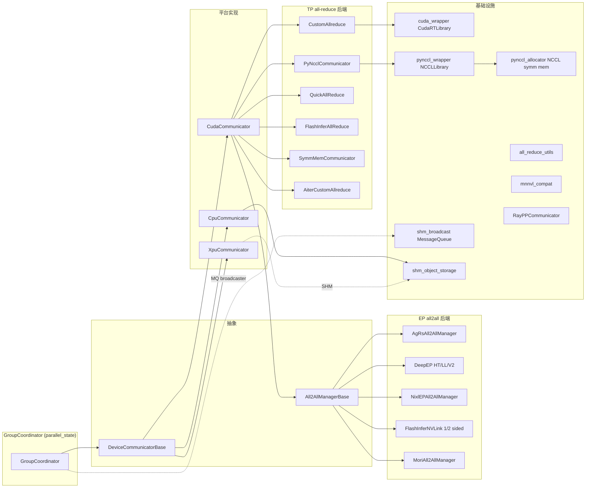

# device-communicators/ — 设备通信子模块

[← Wiki 首页](../../README.md) > [分布式](../README.md) > device-communicators

源码根：`vllm/distributed/device_communicators/`。本子目录把"上层的并行组 API"（[parallel_state](../parallel-state.md) 的 `GroupCoordinator`）与"底层通信库"（NCCL/CUDA SHM/symmetric memory/DeepEP/FlashInfer/NIXL/Ray Compiled Graph）解耦。每个 `GroupCoordinator.device_communicator` 都是一个 `DeviceCommunicatorBase` 子类，把 `all_reduce`/`all_gather`/`dispatch`/`combine` 等算子按平台与配置路由到具体后端。

## 子模块边界

### all-reduce 调度链（CudaCommunicator）

`CudaCommunicator.all_reduce` 按下表自顶向下尝试，任一后端经 `should_*` 拒绝（size/dtype/world_size gate）即 fall through 到下一个；全部失败回落 `pynccl_comm.all_reduce`（NCCL）。详见 [cuda.md](cuda.md) 与 [all-reduce-utils.md](all-reduce-utils.md)。

| 后端 | 启用条件 | 大小上限 |
|---|---|---|
| NCCL_SYMM_MEM | `VLLM_USE_NCCL_SYMM_MEM` + world_size 过 tuned 范围 | `NCCL_SYMM_MEM_ALL_REDUCE_CONFIG` |
| QUICK_REDUCE | ROCm MI300 + `use_custom_allreduce` | `QuickAllReduce._QR_MIN_SIZE` |
| FLASHINFER | `VLLM_ALLREDUCE_USE_FLASHINFER` | `_create_workspace` 内动态 |
| AITER_CUSTOM | ROCm + `VLLM_ROCM_USE_AITER_CUSTOM_AR` | `AiterCustomAllreduce.MAX_SIZE//2` |
| CUSTOM | `VLLM_USE_VLLM_BACKEND`/默认开启 + NVLink P2P | `CUSTOM_ALL_REDUCE_MAX_SIZES[cap][ws]` |
| SYMM_MEM | `VLLM_ALLREDUCE_USE_SYMM_MEM` + multicast 支持 | `SYMM_MEM_ALL_REDUCE_MAX_SIZES[cap][ws]` |
| PYNCCL | 兜底 | 无 |

### EP all2all 后端选择

由 `parallel_config.all2all_backend` 决定（见 `cuda_communicator.py:137`）：`naive`/`allgather_reducescatter`、`deepep_high_throughput`、`deepep_low_latency`、`mori_high_throughput`/`mori_low_latency`、`deepep_v2`、`nixl_ep`、`flashinfer_nvlink_two_sided`（旧名 `flashinfer_all2allv` 已 deprecated）、`flashinfer_nvlink_one_sided`。

### 平台选择

`current_platform.get_device_communicator_cls()` 返回一个 qualname，由 `GroupCoordinator` `resolve_obj_by_qualname` 动态加载。CUDA 走 `CudaCommunicator`，CPU 走 `CpuCommunicator`，XPU 走 `XpuCommunicator`；TPU/CPU 等也可能直接用基类。

## 子目录导航表

| 文档 | 简介 | 主要源码 |
|---|---|---|
| [base.md](base.md) | `DeviceCommunicatorBase` 与 `All2AllManagerBase`/`Cache` 抽象 | `base_device_communicator.py` |
| [cuda.md](cuda.md) | `CudaCommunicator` all-reduce 调度链 + all2all manager 选择 | `cuda_communicator.py` |
| [cpu.md](cpu.md) | `CpuCommunicator` + `_CPUSHMDistributed` 共享内存算子 | `cpu_communicator.py` |
| [xpu.md](xpu.md) | `XpuCommunicator`（Intel XPU） | `xpu_communicator.py` |
| [ray.md](ray.md) | `RayPPCommunicator`（Ray Compiled Graph 包装） | `ray_communicator.py` |
| [shm-broadcast.md](shm-broadcast.md) | `MessageQueue`/`ShmRingBuffer`/`SpinCondition` | `shm_broadcast.py` |
| [custom-all-reduce.md](custom-all-reduce.md) | `CustomAllreduce`（vLLM NVLink P2P 自研） | `custom_all_reduce.py` |
| [quick-all-reduce.md](quick-all-reduce.md) | `QuickAllReduce`（ROCm 量化 quickreduce） | `quick_all_reduce.py` |
| [flashinfer-all-reduce.md](flashinfer-all-reduce.md) | `FlashInferAllReduce` + RMSNorm 融合 | `flashinfer_all_reduce.py` |
| [symm-mem.md](symm-mem.md) | `SymmMemCommunicator`（torch symmetric memory multicast） | `symm_mem.py` |
| [all2all.md](all2all.md) | 各 EP all2all manager | `all2all.py` |
| [pynccl.md](pynccl.md) | `PyNcclCommunicator`（CUDA graph 友好 NCCL） | `pynccl.py` |
| [cuda-wrapper.md](cuda-wrapper.md) | `CudaRTLibrary`（ctypes 直连 libcudart） | `cuda_wrapper.py` |
| [aiter-custom-all-reduce.md](aiter-custom-all-reduce.md) | `AiterCustomAllreduce` 包装 AITER | `aiter_custom_all_reduce.py` |
| [mnnvl-compat.md](mnnvl-compat.md) | `CustomCommunicator` MNNVL 适配器 | `mnnvl_compat.py` |
| [shm-object-storage.md](shm-object-storage.md) | `SingleWriterShmRingBuffer`/`ShmObjectStorage` | `shm_object_storage.py` |
| [all-reduce-utils.md](all-reduce-utils.md) | P2P 探测 + max_size 表 + NCCL symm_mem 配置 | `all_reduce_utils.py` |

## 与其它子系统

- [执行层](../../02-execution/README.md)：Worker `forward` 内经 `get_forward_context()` 拿到 `device_communicator`，由 fused MoE 层调 `dispatch/combine`。
- [03-model-execution](../../03-model-execution/README.md)：MoE `FusedMoE`/`UnquantMoEImpl` 等调 `dispatch_router_logits`/`dispatch`/`combine`。
- [09-compilation-ir](../../09-compilation-ir/README.md)：piecewise CUDA graph 需 `all_reduce` 等是 custom op 注册 + fake 实现。
- [08-platforms](../../08-platforms/README.md)：`get_device_communicator_cls` 决定 impl；`is_cuda_alike`/`is_rocm` 决定 AR/AITER/NIXL/RIXL。
- [05-attention-MLA](../../05-attention/backends/mla/README.md)：EP all2all 与 MLA MoE（DeepSeek）紧密协作。

[← 返回分布式首页](../README.md)
