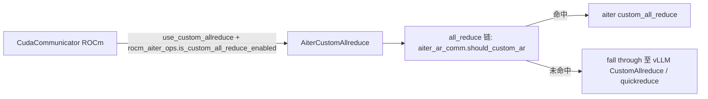

# aiter_custom_all_reduce.py — AiterCustomAllreduce

[← Wiki 首页](../../README.md) > [分布式](../../README.md) > [device-communicators](README.md) > aiter-custom-all-reduce

源码：`vllm/distributed/device_communicators/aiter_custom_all_reduce.py`（约 95 行）。vLLM 对 [AITER](https://github.com/ROCm/aiter)（AMD Inference Tuning & Efficiency Runner）`CustomAllreduce` 的轻包装，让 plain allreduce 与 fused allreduce+RMSNorm 共用同一 AITER 实例与其 IPC buffer。由 [CudaCommunicator](cuda.md) 在 ROCm + `VLLM_ROCM_USE_AITER_CUSTOM_AR` 时持有 `aiter_ar_comm`。

## 是什么

### AiterCustomAllreduce（`:19`）

- `MAX_SIZE: int = 8192 * 1024 * 8 * 2`（`:21`）：AITER IPC buffer 默认大小。
- `effective_max_size() -> int`（classmethod，`:23`）：返回 `MAX_SIZE // 2`（输入上限，buffer 需 2× 容纳输入与输出）。
- `__init__(group, device, max_size=None)`（`:30`）：
  - `max_size=None` 时用 `MAX_SIZE`。
  - `from aiter.dist.device_communicators.custom_all_reduce import CustomAllreduce as _AiterCustomAllreduce` 懒 import AITER。
  - `self._impl = _AiterCustomAllreduce(group, device, max_size=max_size)`。
- 属性/方法（全部转发给 `self._impl`）：
  - `aiter_ca` property → `self._impl`；
  - `disabled` property；
  - `should_custom_ar(inp)`；
  - `custom_all_reduce(inp) -> torch.Tensor | None`；
  - `capture()`：CUDA graph warmup 钩子。

## 为什么

- **复用 AITER 单实例**：AITER 的 `CustomAllreduce` 在构造时建立 IPC buffer 与跨 rank 句柄交换，开销重。若 plain allreduce 与 fused allreduce+RMSNorm 各用自己的实例会双倍开销；vLLM 包装让两者共享同一 `_impl`。
- **ROCm 路径独立**：AITER 是 ROCm 专用库，与 NVIDIA 的 [custom-all-reduce](custom-all-reduce.md) 是平行实现；`CudaCommunicator` 在 ROCm 上同时可启 `qr_comm`（[quick-all-reduce](quick-all-reduce.md)）与 `aiter_ar_comm`，调度链按 size/dtype 分流。
- **effective_max_size 隔离**：输入上限是 buffer 的一半（输入+输出共占）；外部用 `effective_max_size()` 而非 `MAX_SIZE` 判定。
- **统一 `should_custom_ar` 协议**：与 [custom-all-reduce](custom-all-reduce.md) 同名接口，让 `CudaCommunicator.all_reduce` 调度链无差异处理。
- **懒 import AITER**：避免非 ROCm/未装 AITER 时 import 失败。
- **`capture()` 转发**：CUDA graph 捕获前需 warmup AITER 内核态，转发到底层 `_impl.capture()`。

## 怎么做

### 启用与调度

### 共享实例

`CudaCommunicator` 把 `aiter_ar_comm` 暴露给 norm 层（fused AR+RMSNorm 路径）与 `all_reduce` 调度链，二者复用同一 IPC buffer。

## 与其它模块/系统配合

- **[cuda](cuda.md)**：`CudaCommunicator.aiter_ar_comm`（`:95`）；并在其非空时跳过 vLLM `CustomAllreduce` 初始化（`cuda_communicator.py:115` 条件 `self.aiter_ar_comm is None`）。
- **[quick-all-reduce](quick-all-reduce.md)**：互补，quickreduce 处理量化段、AITER 处理 FP/普通段。
- **[08-platforms](../../08-platforms/README.md)**：`current_platform.is_rocm()` + `rocm_aiter_ops.is_custom_all_reduce_enabled()`。
- **[03-model-execution](../../03-model-execution/README.md)**：RMSNorm 融合受益方。
- **[18-build-ci-testing](../../18-build-ci-testing/README.md)**：AITER 是外部 ROCm 库依赖。

## 历史版本演进

- **v0.8**：包装引入，与 vLLM `CustomAllreduce`/`QuickAllReduce` 并列。
- **v0.9**：`VLLM_ROCM_USE_AITER_CUSTOM_AR` 开关稳定；`effective_max_size` 文档化。
- **v0.10/main**：与 AITER 上游 API 同步（`aiter.dist.device_communicators.custom_all_reduce`）；fused AR+RMSNorm 路径完善（待核实）。

[← 返回 device-communicators 首页](README.md)

## 参见

- [quick-all-reduce.md](quick-all-reduce.md) — ROCm 上的互补实现。
- [custom-all-reduce.md](custom-all-reduce.md) — NVIDIA 上对应自研。
- [cuda.md](cuda.md) — 调度链与启用条件。
