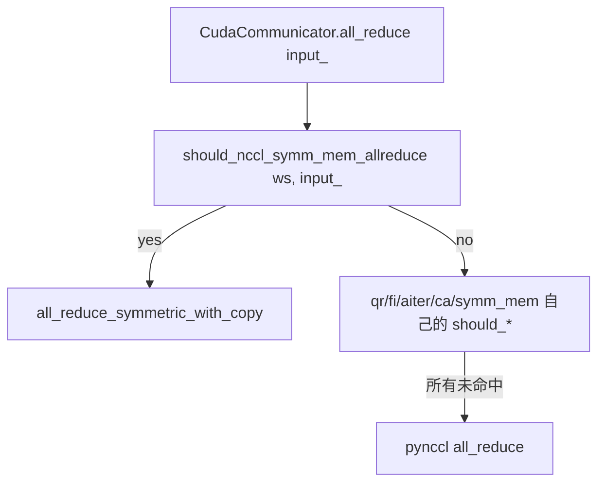

# all_reduce_utils.py — P2P 探测与 all-reduce 表

[← Wiki 首页](../../README.md) > [分布式](../../README.md) > [device-communicators](README.md) > all-reduce-utils

源码：`vllm/distributed/device_communicators/all_reduce_utils.py`（约 421 行）。本文件不是某个通信器，而是 [custom-all-reduce](custom-all-reduce.md) / [symm-mem](symm-mem.md) / NCCL symm mem 调度链共享的"工具与配置表"：各 SM 架构 + world_size 下的 max_size 上限、GPU P2P 实测探测、NCCL symm mem 的 tuned range 与 `should_*` 闸门函数。

## 是什么

### max_size 表

- `CUSTOM_ALL_REDUCE_MAX_SIZES`（`:31`）：`{cap: {ws: bytes}}`，cap ∈ {`"9.0"`, `"10.0"`, `"10.3"`}，ws ∈ {2,4,6,8}。自定义 AR 在该尺寸内尝试。
- `SYMM_MEM_ALL_REDUCE_MAX_SIZES`（`:52`）：同结构，给 `SymmMemCommunicator`。
- 注释 `:73` 起给出 H100/GB200 的 NCCL symm mem vs custom_AR benchmark：
  - 8 GPU：2K–16K NCCL symm mem 胜（1.35–1.48×）；32K–64K custom AR 胜；128K–1G NCCL symm mem 胜（1.12–6.14×）。

### NCCL symm mem 配置

- `NCCL_SYMM_MEM_ALL_REDUCE_CONFIG`（概念，从 `cuda_communicator.py` `_log_all_reduce_backend_selection` 使用，待核实确切表名）：含 `min_world_size`、`custom_ar_preferred_ranges`（world_size → (min,max) size 区间，custom AR 优先）、`always_use_above_world_size`（超过此 ws 总用 NCCL symm mem）。
- `should_nccl_symm_mem_allreduce(world_size, input_)`：组合上述静态条件 + tensor size/dtype，给 `CudaCommunicator.all_reduce` 用（`cuda_communicator.py:276`）。
- `should_nccl_symm_mem_ag_rs()`：all-gather/reduce-scatter 的同族判定（`cuda_communicator.py:348`）。

### P2P 探测

- `gpu_p2p_access_check(rank, peer_rank)`（函数，`:20` 起的辅助）：用 [cuda-wrapper](cuda-wrapper.md) 的 `CudaRTLibrary` 实际 `cudaIpcOpenMemHandle` 一段小 buffer，做一次 P2P 写读验证；失败则记缓存避免重测。
- `VLLM_SKIP_P2P_CHECK`：跳过实测，退化 `cudaDeviceCanAccessPeer` driver 报告。
- `KiB`/`MiB` 常量（`:27`/`:28`）。

### 多进程探测脚本

文件中（`:5` 起的 import）含 `torch.multiprocessing` + `subprocess`，用于在隔离进程里跑 P2P 探测，避免主进程 CUDA context 状态受影响（探测会 `cudaIpcOpenMemHandle` 多次）。`update_environment_variables` 用于子进程 env 同步。

## 为什么

- **尺寸闸门必要性**：custom AR / symm mem 各有优势区间，超尺寸走它们会失败或更慢；表化闸门让调度链"，命中即用"，未命中 fall through。
- **SM 架构细化**：H100 (8.9/9.0)、Blackwell (10.0)、GB200 (10.3) 在 multicast/multimem 支持与带宽特性不同，max_size 表按 cap 区分。
- **ws 集 [2,4,6,8]**：被内核 hard-coded 的 ws 限制；其它 ws 直接 disable。
- **P2P 实测不可省**：driver 的 `cudaDeviceCanAccessPeer` 只是声明，真实可用性受拓扑/驱动/BIOS 影响；实测一次小张量往返最可靠。
- **tuned range 跨大区间**：8 GPU 上 custom AR 在 32K–64K 胜出是反直觉的，NCCL symm mem 在两端胜；用 `custom_ar_preferred_ranges` 精确区间，避免"任一总胜"的简化误判。
- **多进程探测**：`cudaIpcOpenMemHandle` 多次调用在主进程会积累不可见状态；子进程隔离保证探测干净、可缓存。
- **`should_nccl_symm_mem_ag_rs`**：NVLS symm mem 对 dim=0 all-gather/reduce-scatter 也有加速，单独闸门避免误用到 dim≠0。

## 怎么做

### 调度链闸门位置

`should_nccl_symm_mem_allreduce` 内部：`VLLM_BATCH_INVARIANT` off + `is_symmetric_memory_enabled()` + `ws >= min_world_size` + (ws 过 tuned range or ws > always_use_above) + tensor size 在 benchmark 支持区间。

### P2P 探测流程

`gpu_p2p_access_check(rank, peer)`：
1. `CudaRTLibrary` 加载 cudart；
2. `cudaSetDevice(rank)`；`cudaMalloc(small_buffer)`；
3. `cudaIpcGetMemHandle(handle)`；经 gloo 广播给 peer；
4. peer `cudaIpcOpenMemHandle(handle)` → write known pattern → sync → 关闭；
5. rank 读回验证；
6. 结果缓存（dict key `(rank, peer)`）。

### 表查询

`CustomAllreduce.__init__`：`max_size = CUSTOM_ALL_REDUCE_MAX_SIZES[cap][ws]`；`SymmMemCommunicator.__init__`：`max_size = SYMM_MEM_ALL_REDUCE_MAX_SIZES[cap][ws]`。

## 与其它模块/系统配合

- **[cuda](cuda.md)**：调度链主要消费方（`should_nccl_symm_mem_*`）。
- **[custom-all-reduce](custom-all-reduce.md) / [symm-mem](symm-mem.md)**：max_size 表 + P2P 探测。
- **[cuda-wrapper](cuda-wrapper.md)**：IPC API 实际实现。
- **[pynccl](pynccl.md) / [pynccl_allocator](#)**：`is_symmetric_memory_enabled`/`is_symmetric_memory_tensor` 在 pynccl_allocator。
- **[08-platforms](../../08-platforms/README.md)**：`get_device_capability().as_version_str()` 提供 cap key。
- **[16-observability](../../16-observability/README.md)**：P2P 探测结果与 max_size 选择可入日志/指标（待核实）。

## 历史版本演进

- **早期**：`CUSTOM_ALL_REDUCE_MAX_SIZES` 单 cap（9.0），ws `[2,4,8]`。
- **v0.7**：`gpu_p2p_access_check` 实测路径 + 子进程隔离；`VLLM_SKIP_P2P_CHECK` 加入。
- **v0.8**：`SYMM_MEM_ALL_REDUCE_MAX_SIZES` 表引入；ws 加 6。
- **v0.9**：`NCCL_SYMM_MEM_ALL_REDUCE_CONFIG` 与 `should_nccl_symm_mem_allreduce`；H100/GB200 benchmark 注释；`should_nccl_symm_mem_ag_rs` 增加。
- **v0.10/main**：cap `10.0`/`10.3` 项；tuned range 持续调优（待核实）。

[← 返回 device-communicators 首页](README.md)

## 参见

- [cuda.md](cuda.md) — 闸门使用源。
- [custom-all-reduce.md](custom-all-reduce.md) / [symm-mem.md](symm-mem.md) — 表消费方。
- [cuda-wrapper.md](cuda-wrapper.md) — P2P 探测底层。
