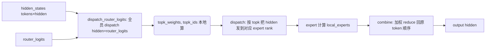

# all2all.py — EP all2all managers

[← Wiki 首页](../../README.md) > [分布式](../../README.md) > [device-communicators](README.md) > all2all

源码：`vllm/distributed/device_communicators/all2all.py`（约 987 行）。本文件实现所有 `All2AllManagerBase` 子类，是 MoE expert parallelism 的 dispatch/combine 通信后端全集。一个 manager 把"按 token→expert 的 routing 决定分发 hidden/router_logits 到各 EP rank，再聚合 expert 输出"翻译成具体通信原语。

## 是什么

### 后端族谱

| Manager | 后端 | 模式 | 依赖 | 适用 |
|---|---|---|---|---|
| `AgRsAll2AllManager`（`:42`）| all-gather + reduce-scatter | naive | torch.distributed | 任意平台/兜底 |
| `DeepEPAll2AllManagerBase`（`:144`）| DeepEP | 抽象基类 | `has_deep_ep()` | — |
| `DeepEPHTAll2AllManager`（`:198`）| DeepEP | high throughput | DeepEP kernels | 大 token 批 |
| `DeepEPLLAll2AllManager`（`:259`）| DeepEP | low latency | DeepEP kernels | 小 token 批（decode） |
| `DeepEPV2All2AllManager`（`:927`）| DeepEP v2 | — | `has_deep_ep_v2()` | 新 API |
| `NixlEPAll2AllManager`（`:360`）| NIXL | EP buffer | `nixl_utils.NixlWrapper` | 跨节点 RDMA |
| `FlashInferNVLinkTwoSidedManager`（`:558`）| FlashInfer | two-sided NVLink/MNNVL | `has_flashinfer_nvlink_two_sided()` | MNNVL NVL72 |
| `FlashInferNVLinkOneSidedManager`（`:665`）| FlashInfer | one-sided MNNVL | `has_flashinfer_nvlink_one_sided()` | MNNVL GB200 |
| `MoriAll2AllManager`（`:825`）| MoRI | high_throughput/low_latency | `has_mori()` | MoRI RDMA |

### 通用 API（来自 [base](base.md)）

各 manager 实现：`get_handle(kwargs)` 创建/缓存 plan；`dispatch_router_logits(hidden, router_logits, is_sequence_parallel, extra_tensors)`、`dispatch(hidden, topk_weights, topk_ids, is_sequence_parallel, extra_tensors)`、`combine(hidden, is_sequence_parallel)`、`query_active_mask`/`query_fault`/`set_num_sms`/`max_sms_used`（DeepEP 状态）、`destroy()`。

### DeepEP 路径要点

- `DeepEPAll2AllManagerBase.__init__`（`:149`）：assert `has_deep_ep()`；`handle_cache = Cache()`；`num_sms = 20`（DeepEP 默认，注释 `:157`）。
- `DeepEPHTAll2AllManager._make_all2all_kwargs`（`:206`）：`num_nvl_bytes = VLLM_DEEPEP_BUFFER_SIZE_MB*1MiB`；internode 时 `num_rdma_bytes` 与 `num_qps_per_rank=num_sms//2`；intranode 走 RDMA=0、qps=1。`low_latency_mode=False`。
- `DeepEPLLAll2AllManager`：low latency mode=True，buffer 更小，适合 decode 小批。
- DeepEP 的 `dispatch` 返回 `(recv_hidden, recv_topk_weights, recv_topk_ids [, extra])`；`combine` 把 expert 输出按 `topk_weights` 加权 reduce 回原 token 顺序。
- `destroy`（`:191`）：持 `handle_cache._lock` 逐 handle destroy。
- 注释（`:221`）：`# TODO: remove platform-specific logic once ROCm DeepEP is updated`。

### FlashInfer 路径要点

- `FlashInferNVLinkTwoSidedManager.initialize`（`:581`）：建 `Mapping(world_size, rank, gpus_per_node, tp_size=world_size)`；`MnnvlConfig(comm_backend=CustomCommunicator(self.cpu_group), fabric_page_size=512MB, allocation_granularity=0)`；`MnnvlMoe.get_moe_workspaces(...)` 取 workspace。
  - 注释 `:604`：MNNVL workspace 需跨 EP 组而非 DP 组，故 `comm_backend` 用 `cpu_group`（EP 组的 cpu 部分）。
- 旧名 `flashinfer_all2allv` 已 deprecated，重定向到 `flashinfer_nvlink_two_sided`（见 [cuda](cuda.md) `:184` warning）。
- `FlashInferNVLinkOneSidedManager` 用 `MoeAlltoAll`（`flashinfer.comm.trtllm_moe_alltoall`），one-sided MNNVL，单边发起。

### NIXL EP 路径要点

- `NixlEPAll2AllManager`（`:360`）：用 `NixlWrapper` 创建 agent，注册 EP buffer DescList；dispatch 阶段把 token-tensor 写到对端 buffer，combine 阶段拉回。适合跨节点大 token 流。`_NixlEPBufferState` 管理缓冲生命周期。

### AgRs 路径要点

- `AgRsAll2AllManager`（`:42`）：纯 `all_gather` + `reduce_scatter` 实现 dispatch/combine，无外部依赖。dispatch 时全员 all_gather 全部 hidden + router_logits，本地计算 routing + 各 expert 负担；combine 时 reduce_scatter 把 expert 输出按 token 段汇总。通信量 O(world_size × token)，性能较低但全平台可跑。

## 为什么

- **场景分化**：MoE 在 prefill（大 token 批）与 decode（小批）通信特性截然不同。DeepEP HT 优化吞吐、LL 优化延迟；FlashInfer NVLink one/two-sided 在 MNNVL 上各有优势；NIXL 适合跨节点低延迟；AgRs 兜底。
- **plan/buffer 复用**：DeepEP/FlashInfer/NIXL 建 plan 极重（workspace 分配 + rendezvous + handle 交换）；`Cache` 按 kwargs 元组复用，避免每 forward 重建。
- **dispatch_router_logits 单列**：MoE 前向需要同时分发 hidden 与 router_logits（router 在 dispatch 前算），二者 shape/语义不同；单列 API 避免与已带 topk 的 `dispatch` 混用。
- **sequence_parallel**：SP-MoE 下 token 维已 dispatch 过一次，all2all 内部需调整 dim 与 reduce 计数；`is_sequence_parallel` 参数贯穿。
- **DeepEP num_sms**：DeepEP 内核可指定 SM 数（`set_num_sms`/`max_sms_used`），与 GPU 上其它 kernel 抢资源；默认 20 SM 留余地给 attention。
- **MNNVL comm_backend 必须跨 EP 组**：MNNVL workspace `size(0)==moe_ep_size`，故 backend 必须 span EP 组；FlashInfer manager 用 `cpu_group`（由 `CudaCommunicator.__init__` 传 EP 组的 cpu_group）。
- **one-sided vs two-sided**：two-sided 经 Mapping 双方都建 workspace，通信稳；one-sided 仅发起方建，更省显存但需硬件支持 MNNVL one-sided load。
- **旧名 deprecated**：`flashinfer_all2allv` → `flashinfer_nvlink_two_sided`，命名与 one-sided 对齐。

## 怎么做

### 选择（构造期，CudaCommunicator）

按 `parallel_config.all2all_backend` 字符串分派（见 [cuda](cuda.md)）。`unique_name` 含 `ep` + `DP>1 or SP-MoE` 时才建 manager。

### dispatch/combine 流（DeepEP HT 示例）

### handle cache 复用

`get_handle(shape_dtype_kwargs)` → `cache.get_or_create(kwargs, lambda: DeepEPBuffer(...))`；同一 forward 内多次同 shape 复用。

### CUDA graph 与 num_sms

DeepEP 在 graph 捕获前需 `set_num_sms` 固定；`max_sms_used()` 反馈实际上限。

## 与其它模块/系统配合

- **[base](base.md)** / **[cuda](cuda.md)**：构造入口与生命周期管理。
- **[nixl-utils](../nixl-utils.md)**：`NixlEPAll2AllManager` 依赖。
- **[mnnvl-compat](mnnvl-compat.md)**：FlashInfer manager 依赖 `CustomCommunicator`。
- **[03-model-execution](../../03-model-execution/README.md)**：FusedMoE `forward` 内 `dispatch`/`dispatch_router_logits`/`combine` 调用。
- **[05-attention-MLA](../../05-attention/backends/mla/README.md)**：DeepSeek MoE + MLA 的 EP 通信紧密耦合。
- **[10-config](../../10-config/README.md)**：`ParallelConfig.all2all_backend` 字段；`VLLM_DEEPEP_*` env。
- **[18-build-ci-testing](../../18-build-ci-testing/README.md)**：DeepEP/FlashInfer kernel 安装指引（`tools/ep_kernels/README.md`）。

## 历史版本演进

- **早期**：仅 `AgRsAll2AllManager`。
- **v0.8**：DeepEP HT/LL 接入；`dispatch_router_logits` 单列；Cache 引入。
- **v0.9**：NIXL EP manager；FlashInfer two-sided (`flashinfer_all2allv`)；`num_sms` 默认 20。
- **v0.10**：DeepEP v2 manager；FlashInfer NVLink one-sided；MoRI manager；`flashinfer_all2allv` deprecated。
- **v0.11/main**：MNNVL MnnvlConfig 调整；`VLLM_DEEPEP_BUFFER_SIZE_MB`/`VLLM_DEEPEP_HIGH_THROUGHPUT_FORCE_INTRA_NODE` 配置完善；ROCm DeepEP 兼容在途（注释 `:221` TODO，待核实）。

[← 返回 device-communicators 首页](README.md)

## 参见

- [base.md](base.md) — `All2AllManagerBase` 抽象。
- [cuda.md](cuda.md) — 后端选择分派。
- [nixl-utils.md](../nixl-utils.md) / [mnnvl-compat.md](mnnvl-compat.md) — 后端依赖。
