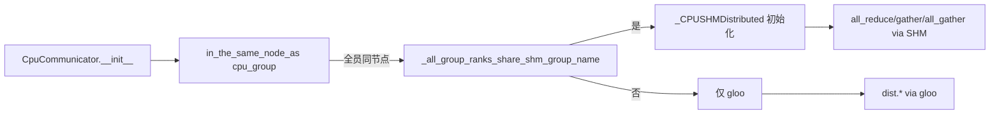

# cpu_communicator.py — CpuCommunicator

[← Wiki 首页](../../README.md) > [分布式](../../README.md) > [device-communicators](README.md) > cpu

源码：`vllm/distributed/device_communicators/cpu_communicator.py`（约 338 行）。CPU 平台的设备通信器，由 `cpu_platform.get_device_communicator_cls()` 返回。在 CPU 推理（如 `--device cpu`）与多 worker CPU 部署下，承担 TP/PP/EP/DP 的 collectives；当同节点时优先用共享内存（`_CPUSHMDistributed`）加速。

## 是什么

### CpuCommunicator（`:20`）

继承 `DeviceCommunicatorBase`。构造（`:21`）：`super().__init__`；按 `in_the_same_node_as` 探测同节点后，若 `_all_group_ranks_share_shm_group_name`（`:67`）成立，则建 `_CPUSHMDistributed` 实例做 all_reduce/all_gather/gather/send_tensor_dict/recv_tensor_dict 的高吞吐路径；否则回落 gloo。

字段：`self.shm_distributed: _CPUSHMDistributed | None`。

重写方法：
- `all_reduce(input_)`（`:81`）：SHM 启用则 `shm_distributed.all_reduce`，否则 `dist.all_reduce`（gloo）。
- `gather(input_, dst=0, dim=-1)`（`:85`）：同上。
- `all_gather(input_, dim=-1)`（`:118`）：SHM 走 `all_gather_into_tensor`，否则基类 concat-style。
- `send_tensor_dict`/`recv_tensor_dict`（`:146`/`:158`）：SHM 路径直接 pickle+memcpy 跨进程；与基类 `broadcast_tensor_dict` 协议一致（元数据+张量分离），但走 SHM 而非 device group。
- `dispatch_router_logits`/`dispatch`/`combine`（`:169`/`:192`/`:216`）：EP all2all 在 CPU 上仍 raise（CPU 不跑 MoE all2all）或简单 allgather/reducescatter 兜底（待核实具体行为）。

### _CPUSHMDistributed（`:230`）

CPU 共享内存算子集，封装 `torch.distributed._sharded_memory`/`gloo` SHM group。`make_group_name(communicator)`（`:239`）用 communic ftor 唯一命名；`_init_cpu_shm`（`:247`）调 `dist._make_sharded_memory_group` 建 SHM group，返回 size。

提供：`all_reduce`/`gather`/`all_gather_into_tensor`/`send_tensor_dict`/`recv_tensor_dict`，全部基于 SHM 的零拷贝/单拷贝语义。

## 为什么

- **CPU 推理仍需分布式**：vLLM CPU 后端支持多核/多进程 TP（`--device cpu` + `tensor_parallel_size>1`），必须有 CPU 通信路径。
- **gloo 太慢**：gloo all_reduce 在 CPU 上多走 TCP/共享内存拷贝；`_CPUSHMDistributed` 用 torch 内部 SHM group 直接零拷贝读写，吞吐量数倍提升。
- **同节点判定**：SHM 要求同物理内存系统；`in_the_same_node_as`（`parallel_state`）用 SharedMemory 探测，全组同节点才启用 SHM。
- **group_name 唯一性**：torch SHM group 用名字做 rendezvous，必须全组使用同一名字且跨组不冲突；`make_group_name` 借 `unique_name`。
- **EP 在 CPU 上不优先**：MoE 模型通常只在 GPU 跑，CPU EP all2all 路径仅作占位/测试，故 dispatch/combine 简化。

## 怎么做

### 同节点 SHM 启用判定

### tensor_dict 在 SHM 上的传输

发送方 `send_tensor_dict` 把张量直接 SHM mmap 共享，接收方 `recv_tensor_dict` 通过 SHM group 拿到指针并以 `TensorMetadata` 还原形状/dtype；避免 gloo 路径的张量序列化往返。

## 与其它模块/系统配合

- **[base](base.md)**：基类。
- **[parallel-state](../parallel-state.md)**：`in_the_same_node_as` 与 `get_device_communicator_cls()`。
- **[08-platforms](../../08-platforms/README.md)**：`cpu_platform.get_device_communicator_cls() → "vllm.distributed.device_communicators.cpu_communicator.CpuCommunicator"`（待核实确切的 qualname 字符串）。
- **[02-execution](../../02-execution/README.md)**：CPU executor 实例化 worker 时提供 cpu_group。
- **[shm-object-storage](shm-object-storage.md)**：`_CPUSHMDistributed` 的概念与之同源（跨进程 SHM），但本类直接用 torch 内部 API，不依赖 `SingleWriterShmRingBuffer`。

## 历史版本演进

- **早期**：仅 gloo fallback。
- **v0.7**：`_CPUSHMDistributed` 引入，使用 torch 实验 SHM group API。
- **v0.8**：`_all_group_ranks_share_shm_group_name` 增强 group_name 一致性校验。
- **v0.9/v0.10**：`send_tensor_dict`/`recv_tensor_dict` SHM 路径完善，与 PP/广播协议对齐。
- **v0.11/main**：dispatch/combine 占位；CPU MoE 仍有改进空间（待核实）。

[← 返回 device-communicators 首页](README.md)

## 参见

- [base.md](base.md) — 基类。
- [cuda.md](cuda.md) — 对照的 GPU 实现。
- [shm-object-storage.md](shm-object-storage.md) — 另一套 SHM 原语。
