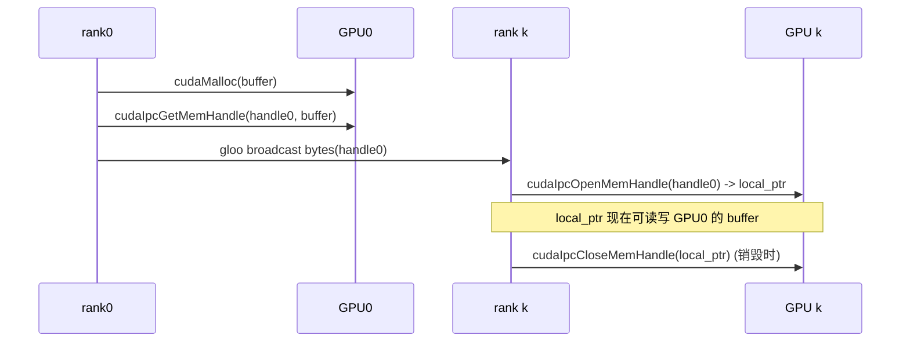

# cuda_wrapper.py — CudaRTLibrary

[← Wiki 首页](../../README.md) > [分布式](../../README.md) > [device-communicators](README.md) > cuda-wrapper

源码：`vllm/distributed/device_communicators/cuda_wrapper.py`（约 187 行）。纯 Python ctypes 包装 `libcudart`（CUDA Runtime API），避免为少量 cudart 调用编译独立 C++ 扩展。主要供 [custom-all-reduce](custom-all-reduce.md) / [all-reduce-utils](all-reduce-utils.md) 的 IPC 句柄操作与 P2P 访问探测使用。

## 是什么

### 类型与结构

- `cudaError_t = ctypes.c_int`、`cudaMemcpyKind = ctypes.c_int`（`:26`/`:27`）。
- `cudaIpcMemHandle_t(ctypes.Structure)`（`:30`）：`_fields_ = [("internal", ctypes.c_byte * 128)]`，对应 CUDA IPC 句柄 128 字节 opaque。
- `Function(name, restype, argtypes)`（`:34`，dataclass）：用于在 `CudaRTLibrary` 里声明导出函数表。
- `CudaRTLibrary`（`:41`）：`exported_functions` 列表声明 `cudaSetDevice`/`cudaDeviceSynchronize`/`cudaMalloc`/`cudaFree`/`cudaIpcGetMemHandle`/`cudaIpcOpenMemHandle`/`cudaIpcCloseMemHandle`/`cudaDeviceCanAccessPeer`/`cudaDeviceEnablePeerAccess` 等。

### 构造与加载（`:105`）

`__init__(so_file=None)`：
- `import torch` 让 `libcudart.so` 已被加载（注释 `:13`）。
- `find_loaded_library("libcudart")` 解析当前进程已加载的 cudart so 路径；`so_file` 可覆盖。
- `ctypes.CDLL(so_file)` 加载；逐 `Function` 设 `getattr(lib, name)` + `restype`/`argtypes`。
- 失败 raise。

调用方式：`lib.cudaIpcGetMemHandle(handle_ptr, dev_ptr)` 等 ctypes 直传。

### 典型被调点

- [`custom_all_reduce.py`](custom-all-reduce.md) `_can_p2p` / `__init__`：用 `cudaDeviceCanAccessPeer` / `cudaDeviceEnablePeerAccess` 探测并开启 P2P；`cudaIpcGetMemHandle` 取本地 buffer 句柄、`cudaIpcOpenMemHandle` 映射对端 buffer。
- [`all_reduce_utils.py`](all-reduce-utils.md) `gpu_p2p_access_check`：实际跑一次小张量 P2P 传输验证可用性，依赖 `CudaRTLibrary` 的 IPC API。
- [`shm_object_storage.py`](shm-object-storage.md)（可能复用句柄概念，待核实）。

## 为什么

- **避免编译扩展**：IPC 句柄、P2P 使能这类调用极少但必需；用 ctypes 直连 `libcudart` 比 PyBind 扩展更易跨 CUDA 版本维护。
- **借助 torch 预加载**：`import torch` 已让 `libcudart.so` 在进程地址空间，`find_loaded_library` 直接拿到路径，不需逐路径搜索。
- **IPC 句柄 128B**：CUDA 规范固定 128B opaque，用 `c_byte * 128` 描述便于跨进程广播（gloo `broadcast_object_list` 可直接传 bytes）。
- **P2P 探测准确**：`cudaDeviceCanAccessPeer` 仅是 driver 报告，真实可用性需实测；`gpu_p2p_access_check` 用 `cudaIpcOpenMemHandle` + 小张量 write/read 验证，避免误信 driver。
- **Function dataclass 化**：声明表化 + 一次性批量设置 `restype`/`argtypes`，避免每次调用前都设。

## 怎么做

### IPC 句柄交换（custom AR / shm 路径）

### P2P 使能

`cudaDeviceEnablePeerAccess(peer_device)` 在第一次跨设备访问前调一次；后续 NCCL/IPC 都受益。

## 与其它模块/系统配合

- **[custom-all-reduce](custom-all-reduce.md)** / **[quick-all-reduce](quick-all-reduce.md)**：IPC buffer 交换。
- **[all-reduce-utils](all-reduce-utils.md)**：`gpu_p2p_access_check` 实现。
- **[shm-object-storage](shm-object-storage.md)**：相邻概念（CPU SHM），不直接依赖。
- **[08-platforms](../../08-platforms/README.md)**：`find_loaded_library` 与平台 CUDA 路径。
- **[18-build-ci-testing](../../18-build-ci-testing/README.md)**：无需编译，减 CI 复杂度。

## 历史版本演进

- **早期（v0.4）**：`CudaRTLibrary` 引入，初版仅 IPC + Peer Access 函数。
- **v0.7**：`Function` dataclass 化；`find_loaded_library` 优化 so 定位。
- **v0.8**：`cudaIpcOpenMemHandle` 在 P2P 探测脚本使用完善。
- **v0.9/main**：函数表稳步扩展；适配 cu12/cu13（待核实）。

[← 返回 device-communicators 首页](README.md)

## 参见

- [custom-all-reduce.md](custom-all-reduce.md) — 主要消费方。
- [all-reduce-utils.md](all-reduce-utils.md) — P2P 探测实现。
- [pynccl.md](pynccl.md) — 同为 ctypes 包装思路。
