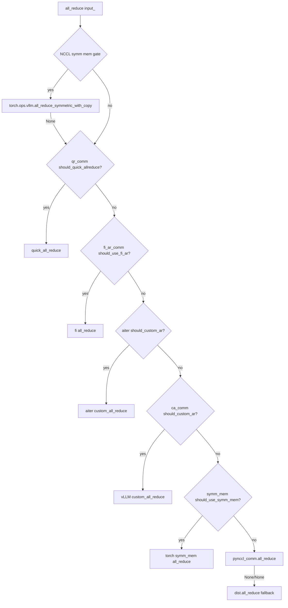

# cuda_communicator.py — CudaCommunicator

[← Wiki 首页](../../README.md) > [分布式](../../README.md) > [device-communicators](README.md) > cuda

源码：`vllm/distributed/device_communicators/cuda_communicator.py`（约 720 行）。CUDA 平台的主通信器，是 vLLM 默认/最重平台的实现：把一组 TP/EP 的 NCCL 通信与多种"低延迟/高吞吐" all-reduce 加速后端、EP all2all 后端、P2P（PP send/recv）揉到一个对象，由 `GroupCoordinator` 持有。它是 [README.md](README.md) 调度链与 all2all 后端选择的实际执行者。

## 是什么

### 构造（`cuda_communicator.py:30`）

`__init__(cpu_group, device=None, device_group=None, unique_name="", global_ranks=None, global_world_size=None, tcp_store_group=None)`。

1. `super().__init__(...)` 装定 rank/ranks/world_size/device 等。
2. **all-reduce 后端开关**（仅在 `"tp" in unique_name` 时启用，`:48`）：
   - `use_custom_allreduce = _ENABLE_CUSTOM_ALL_REDUCE`（全局 `set_custom_all_reduce`）。
   - `use_torch_symm_mem = envs.VLLM_ALLREDUCE_USE_SYMM_MEM`。
   - `use_flashinfer_allreduce = envs.VLLM_ALLREDUCE_USE_FLASHINFER`。
   - `use_aiter_allreduce = use_custom_allreduce and rocm_aiter_ops.is_custom_all_reduce_enabled()`。
3. 建 `pynccl_comm: PyNcclCommunicator | None`（`world_size>1`）：`tcp_store_group` 优先做 NCCL unique id 广播；`is_symmetric_memory_enabled()` 时调 `register_nccl_symmetric_ops`（`:88`）。
4. 按开关与平台建 `symm_mem_comm`/`fi_ar_comm`/`aiter_ar_comm`/`ca_comm`/`qr_comm`（详见各对应 wiki）。
5. **all2all manager**（`self.use_all2all`，由基类置位 = name 含 `ep` 且 DP>1 或 SP-MoE）：按 `self.all2all_backend` 字符串分派到 `AgRsAll2AllManager`/`DeepEPHTAll2AllManager`/`DeepEPLLAll2AllManager`/`MoriAll2AllManager`/`DeepEPV2All2AllManager`/`NixlEPAll2AllManager`/`FlashInferNVLinkTwoSidedManager`/`FlashInferNVLinkOneSidedManager`（`:137-199`）。`flashinfer_all2allv` 旧名 deprecated，重定向到 `flashinfer_nvlink_two_sided`。
6. `_log_all_reduce_backend_selection()` 打印启用后端供调试。

字段：`pynccl_comm`/`ca_comm`/`qr_comm`/`symm_mem_comm`/`fi_ar_comm`/`aiter_ar_comm`/`all2all_manager`。

### all_reduce（`cuda_communicator.py:273`）

调度链严格按下面顺序：

1. **NCCL_SYMM_MEM**：`should_nccl_symm_mem_allreduce(world_size, input_)` 命中 → `torch.ops.vllm.all_reduce_symmetric_with_copy(input_)`（注释 `:274` 说明现在 copy→symm_input→out-of-place AR，无须检查 input 是否 symm）。
2. **QUICK_REDUCE**（ROCm）：`qr_comm.should_quick_allreduce` → `quick_all_reduce`。
3. **FLASHINFER**：`fi_ar_comm.should_use_fi_ar` → `all_reduce`。
4. **AITER_CUSTOM**（ROCm）：`aiter_ar_comm.should_custom_ar` → `custom_all_reduce`。
5. **CUSTOM**（vLLM 自研）：`ca_comm.should_custom_ar` → `custom_all_reduce`。
6. **SYMM_MEM**（torch）：`symm_mem_comm.should_use_symm_mem` → `all_reduce`。
7. **PYNCCL**：`pynccl_comm.all_reduce(input_)`；若 disabled/None → `torch.distributed.all_reduce(input_.clone(), group=device_group)`。

任一后端返回 `None` 即 fall through。

### all_gather / reduce_scatter（`:341`/`:352`）

- `all_gather`：`dim==0` 且 `should_nccl_symm_mem_ag_rs()` 走 `_all_gather_symm_mem`（NVLS symmetric memory）；否则 `super().all_gather`（concat-style）。注释 `:343`：sequence parallelism 的 gather-before-GEMM 用 dim=0。
- `reduce_scatter`：`_reduce_scatter_symm_mem` 路径（NCCL symm mem）或 `dist.reduce_scatter_tensor`。
- `all_gatherv`（`:549`）/`reduce_scatterv`（`:379`）：变长切，必要时 batched symm mem。

### P2P（PP）与 broadcast

- `send(tensor, dst=None)`（`:493`）：`dst=None` 时 +1 取模；走 `pynccl_comm.send` 或 `dist.send`。
- `recv(size, dtype, src=None)`（`:505`）：同上。
- `broadcast(tensor, src=0)`（`:521`）。
- `batch_isend_irecv(p2p_ops)`（`:715`）：包装 NCCL 批量 P2P。
- `destroy`（`:533`）：daemon thread 跑 `ncclCommAbort` 避免 CUDA graph 释放同线程死锁（详见 [pynccl.md](pynccl.md)）。

### Dispatch / Combine（EP）（`:655`/`:678`/`:702`）

委派 `self.all2all_manager.dispatch_router_logits`/`dispatch`/`combine`（参见 [all2all.md](all2all.md)）。

## 为什么

- **多后端选择**：NCCL 在大 tensor 强；小 tensor lazy/two-sided NVLink 自研 AR 更快；symm mem multicast 在 H100/GB200 有权衡；ROCm 走 quickreduce/AITER；FlashInfer 融合 RMSNorm。一条链 + `should_*` 闸门让模型层无感切换。
- **TP-only all-reduce 加速**：注释 `:48` 明确 custom AR/symm mem/flashinfer/AITER 只服务 TP 组，其它组（PP/DP/EP）只走 PyNccl。避免加速器只支持同节点/特定 world_size 时误用。
- **NCCL symm mem 复杂门控**（`should_nccl_symm_mem_allreduce` 在 [all-reduce-utils](all-reduce-utils.md)）：需要 `VLLM_BATCH_INVARIANT` off + world_size 过 tuned range 或 > always_use_above_world_size，再按 tensor size 判；`_log_all_reduce_backend_selection`（`:207`）镜像这些静态条件日志化。
- **CUDA graph 友好**：`pynccl_comm` 是 `PyNcclCommunicator`（直连 NCCL，无 torch distr overhead，可被 graph 捕获）；custom AR/symm mem 也支持 `capture()`。
- **EP all2all 后端可插拔**：DeepEP/FlashInfer/MoRI/NIXL 各有 high_throughput/low_latency 权衡，配置 `all2all_backend` 字符串即可切换；`Cache`（[base.md](base.md)）保证 plan/buffer 复用。
- **destroy 防 join 死锁**：`ncclCommAbort` 会等所有 CUDA graph 释放，主线程 teardown 同线程会死锁；用 daemon thread + 5s timeout 绕过（`pynccl.py:148` 注释）。

## 怎么做

### all_reduce 选择决策（运行时）

### EP all2all 选择决策（构造期）

`unique_name` 含 `ep` 且 `DP>1 or SP-MoE` 时按 `all2all_backend` 选 manager；其它情况 `all2all_manager=None`。

### CUDA graph 链路

`group.graph_capture` 进入 `GraphCaptureContext`；custom AR/symm mem/pynccl 都需在 capture 前调自身 `capture()` 或在 stream 内 warmup；`pynccl.all_reduce` 走 `self.stream` 即 `current_stream()`，确保被同一个 graph 捕获。

## 与其它模块/系统配合

- **[base](base.md)**：基类。
- **[pynccl](pynccl.md) / [custom-all-reduce](custom-all-reduce.md) / [quick-all-reduce](quick-all-reduce.md) / [flashinfer-all-reduce](flashinfer-all-reduce.md) / [symm-mem](symm-mem.md) / [aiter-custom-all-reduce](aiter-custom-all-reduce.md)**：被持有的各 AR 后端。
- **[all2all](all2all.md)**：被持有的 EP 通信。
- **[cuda-wrapper](cuda-wrapper.md) / [all-reduce-utils](all-reduce-utils.md) / [pynccl_allocator](#)**：底层辅助（IPC、max_size 表、NCCL symm mem allocator）。
- **[parallel-state](../parallel-state.md)**：`get_device_communicator_cls()` 返回本类 qualname；`GroupCoordinator` 实例化并接 `tcp_store_group`（stateless 路径）。
- **[09-compilation-ir](../../09-compilation-ir/README.md)**：piecewise CUDA graph 与 all-reduce custom op 注册。
- **[08-platforms](../../08-platforms/README.md)**：`is_cuda_alike`/`is_rocm` 决定 AITER/quickreduce/RIXL 分支。

## 历史版本演进

- **早期**：`CudaCommunicator` 仅 NCCL（`dist.all_reduce`）+ `CustomAllreduce`。
- **v0.5/v0.6**：`PyNcclCommunicator` 引入（CUDA graph 友好），成为 TP all-reduce 默认兜底。
- **v0.7（v1）**：`unique_name` 分流，TP-only 加速；`pynccl_comm` 走 `tcp_store_group` 优先支持 stateless。
- **v0.8**：`SymmMemCommunicator`、`QuickAllReduce`、EP all2all（DeepEP/NIXL/FlashInfer）接入。
- **v0.9**：`register_nccl_symmetric_ops` + `all_reduce_symmetric_with_copy` custom op；`should_nccl_symm_mem_allreduce` tuned range；`aiter_ar_comm` 接入 ROCm。
- **v0.10**：`flashinfer_nvlink_two_sided`（旧 `flashinfer_all2allv` deprecated）+ `flashinfer_nvlink_one_sided`；`deepep_v2`/`mori_*`/`nixl_ep` 加入。
- **v0.11/v0.12/main**：`_log_all_reduce_backend_selection` 镜像 symm mem 静态条件；all_gather/reduce_scatter 走 NVLS symm mem（`should_nccl_symm_mem_ag_rs`）；all2all 后端持续扩充（待核实）。

[← 返回 device-communicators 首页](README.md)

## 参见

- [README.md](README.md) — 子模块总览与调度链表。
- [all-reduce-utils.md](all-reduce-utils.md) — `should_nccl_symm_mem_allreduce` 与 max_size 表。
- [all2all.md](all2all.md) — EP all2all 实现。
