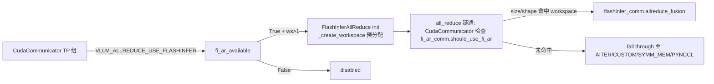

# flashinfer_all_reduce.py — FlashInferAllReduce

[← Wiki 首页](../../README.md) > [分布式](../../README.md) > [device-communicators](README.md) > flashinfer-all-reduce

源码：`vllm/distributed/device_communicators/flashinfer_all_reduce.py`（约 353 行）。基于 [FlashInfer](https://github.com/flashinfer-ai/flashinfer) 的 `allreduce_fusion` API，在 NVLink/MNNVL 系统上提供低延迟 all-reduce，并支持与 RMSNorm 的融合（数据归来即归一化，省一次往返）。由 [CudaCommunicator](cuda.md) 持有 `fi_ar_comm`（`VLLM_ALLREDUCE_USE_FLASHINFER` 时）。

## 是什么

### 模块级状态

- `PDL_ADVANCE_LAUNCH_TOKENS = 16`（`:23`）：小批提前 launch 的经验阈值。
- `fi_ar_available`（`:25`）：尝试 import `flashinfer.comm` + `flashinfer.comm.mnnvl.TorchDistBackend`，并探测 `flashinfer_comm.allreduce_fusion` 属性；失败置 False。
- `_fi_ar_workspace`/`_fi_ar_quant_workspace`（`:37`/`:39`）：standalone allreduce 与 quant 融合模式分别的 workspace，懒分配。
- `_create_workspace(backend, world_size, rank, max_token_num, hidden_dim, dtype, group)`（`:42`）：用 `TorchDistBackend(group)` + 随机种子调 `flashinfer_comm.create_allreduce_fusion_workspace`，失败返 None。

### FlashInferAllReduce（`:248`）

构造（`:249`）：`__init__(group, device)`。装定 rank/ws/dtype（默认 bfloat16）；探测平台 capability；调 `_create_workspace` 为常见 hidden_dim 预分配 workspace；`disabled = workspace is None`。

主要方法：
- `should_use_fi_ar(input_)`：`disabled` + dtype + size + 预分配 workspace 覆盖的 `(max_token_num, hidden_dim)` 组合判定。
- `all_reduce(input_tensor) -> torch.Tensor`：调 `flashinfer_comm.allreduce_fusion` 执行；可选 quant workspace 走 `trtllm` backend 做 quant 融合。
- 融合路径：vLLM 在 `RMSNorm` 前置 all-reduce 时，FlashInfer 支持"allreduce + RMSNorm" 单内核，避免中间往返（具体调用点在 [03-model-execution](../../03-model-execution/README.md) 的 norm 层，待核实确切切入点）。
- `capture()`：CUDA graph warmup；workspace 指针需在 graph 内固定。

## 为什么

- **MNNVL/NVLink 优势**：GB200 NVL72 等 MNNVL 系统上，FlashInfer 的 trtllm allreduce 内核直接调 NVLink multicast，比 NCCL 在小-中张量延迟更低。
- **AR+RMSNorm 融合**：Transformer MLP/Attention 后 Typical `AR -> RMSNorm`，融合后减少一次 global memory 读写，对小批 decode 提升明显。
- **与 vLLM 调度链解耦**：FlashInfer 作为可选后端，由 `VLLM_ALLREDUCE_USE_FLASHINFER` 显式开启；不取代 NCCL 兜底。
- **workspace 预分配**：FlashInfer workspace 与 hidden_dim/token_num 强相关，预分配常用尺寸避免运行时重分配；非常用尺寸回退（`should_use_fi_ar` 拒绝）。
- **quant workspace 分离**：quant 融合（INT8 输入）需要额外 workspace，只在 `trtllm` backend 支持，故单列 `_fi_ar_quant_workspace`。
- **MNNVL TorchDistBackend**：FlashInfer 通过 `TorchDistBackend(group)` 复用 torch ProcessGroup 但内部走 NVLink，需 `mnnvl_compat.CustomCommunicator` 适配（见 [mnnvl-compat](mnnvl-compat.md)）。

## 怎么做

### 启用 + 调度



### workspace 命中

`should_use_fi_ar` 检查 `input_.shape` 的 token_num ≤ `max_token_num` 且 hidden_dim 等于预分配值；不匹配则拒绝，让调度链下落。

### 融合 RMSNorm（伪）

```python
# 大致路径（确切 API 待核实）
out = fi_ar_comm.all_reduce(input_)           # 自带 normalize 选项
# 或 fused:
out = flashinfer_comm.allreduce_fusion(input_, residual, rmsnorm_eps, ...)
```

## 与其它模块/系统配合

- **[cuda](cuda.md)**：`CudaCommunicator.fi_ar_comm`（`:94`），TP-only。
- **[mnnvl-compat](mnnvl-compat.md)**：FlashInfer 需 `CustomCommunicator` 适配 `CommBackend` 协议。
- **[all2all](all2all.md)**：`FlashInferNVLinkTwoSidedManager`/`FlashInferNVLinkOneSidedManager` 是 EP 侧的 FlashInfer 同族 manager。
- **[08-platforms](../../08-platforms/README.md)**：`current_platform.is_cuda()`；capability 探测。
- **[03-model-execution](../../03-model-execution/README.md)**：RMSNorm 融合受益方。
- **[09-compilation-ir](../../09-compilation-ir/README.md)**：`capture()` + graph 重放。

## 历史版本演进

- **v0.8**：`FlashInferAllReduce` 引入，初版仅 standalone allreduce。
- **v0.9**：`allreduce_fusion` + RMSNorm 融合接入；`_fi_ar_quant_workspace` 加入 trtllm quant 路径。
- **v0.10**：MNNVL（GB200）支持；`TorchDistBackend` + `mnnvl_compat` 适配；`PDL_ADVANCE_LAUNCH_TOKENS` 提前 launch。
- **v0.11/main**：workspace 预分配策略调优；与 NCCL symm mem 调度链协同（待核实）。

[← 返回 device-communicators 首页](README.md)

## 参见

- [mnnvl-compat.md](mnnvl-compat.md) — FlashInfer 的 group 适配。
- [all2all.md](all2all.md) — FlashInfer NVLink all2all 实现。
- [cuda.md](cuda.md) — 调度链总览。
