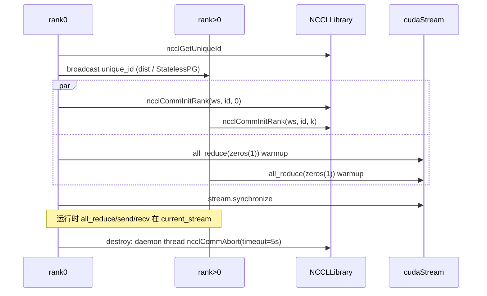

# pynccl.py — PyNcclCommunicator

[← Wiki 首页](../../README.md) > [分布式](../../README.md) > [device-communicators](README.md) > pynccl

源码：`vllm/distributed/device_communicators/pynccl.py`（约 434 行）。vLLM 直接通过 `ctypes` 调 NCCL 的 Python 包装，绕过 `torch.distributed` 在 CUDA graph 捕获时的限制（torch distr 内部含非图友好调用）。是 [CudaCommunicator](cuda.md) 的 all-reduce 兜底、PP send/recv 与 KV connector 握手 NCCL unique id 广播的实际执行者。

## 是什么

### 模块级

- `_NCCL_SYMM_OPS_REGISTERED`（`:28`）：保证 `register_nccl_symmetric_ops` 只注册一次。
- `register_nccl_symmetric_ops(pynccl_comm)`（`:31`）：注册 custom op `all_reduce_symmetric_with_copy`，实现把 input 拷到 symmetric buffer → NCCL all-reduce → 拷出，配合 [pynccl_allocator](cuda-wrapper.md)（实际是 [pynccl_allocator.py](#) 的 NCCL symm mem allocator）走 NCCL symm mem 路径。

### PyNcclCommunicator（`:60`）

构造（`:61`）：`__init__(group: ProcessGroup|StatelessProcessGroup, device, library_path=None)`。
- assert `dist.get_backend(group) != NCCL`（PyNcclCommunicator 应挂在 gloo/cpu 组上，自管 NCCL communicator）。
- `rank`/`world_size` 从 `group` 取（支持 `StatelessProcessGroup` 分支）。
- `world_size==1 or VLLM_DISABLE_PYNCCL` → `available=False, disabled=True` 直接返。
- `NCCLLibrary(library_path)` 加载 NCCL so（失败 disable）。
- rank0 调 `ncclGetUniqueId`；其余 rank 空 `ncclUniqueId`。
- 非 stateless：`dist.broadcast(byte_tensor, src=ranks[0])` 广播 unique id；stateless：`group.broadcast_obj(unique_id, src=0)`。
- `ncclCommInitRank(world_size, unique_id, rank)` 建 communicator（在指定 device 上）。
- warmup 一次 `all_reduce(torch.zeros(1))` + `stream.synchronize()`。

字段：`group`/`rank`/`world_size`/`nccl: NCCLLibrary`/`comm: ncclComm_t`/`device`/`unique_id`/`available`/`disabled`/`nccl_version`。

方法：
- `destroy()`（`:148`）：daemon thread 跑 `ncclCommAbort`（5s timeout）避免主线程 CUDA graph 释放同线程死锁（注释 `:150`）。
- `all_reduce(in_tensor, out_tensor=None, op=ReduceOp.SUM, stream=None)`（`:166`）：调 `nccl.ncclAllReduce`；`out_tensor=None` 时原地。
- `send`/`recv`/`broadcast`/`all_gather`/`reduce_scatter` 等：直调对应 NCCL API（`nccl.ncclSend`/`ncclRecv`/`ncclBcast`/...）。
- `stream` 属性：返回 `current_stream()`，CUDA graph 捕获时与模型同流。

## 为什么

- **CUDA graph 兼容**：`torch.distributed.all_reduce` 内部含 `_check_default_pg`/调度器同步等非图友好调用，捕获时会出错或卡住；直接 `ncclAllReduce` + 显式 stream 可被 graph 安全捕获。注释 `:7-13` 详述试 cupy/torch distr 均失败的过程。
- **版本灵活**：纯 ctypes 无需编译绑定，切换 NCCL 版本只改 `VLLM_NCCL_SO_PATH` 或 so 文件名（`find_nccl_library`）；CI/不同驱动下尤其关键。
- **挂在非 NCCL group**：torch.distributed 一个进程的 default NCCL communicator 不可拆；PyNcclCommunicator 挂在 gloo/cpu group 上自建独立 NCCL communicator，让多组（TP/PP/EP/DP/KV 握手）各持一份互不干扰。
- **stateless 兼容**：`StatelessProcessGroup` 非 torch PG，无法走 `dist.broadcast`，故 `broadcast_obj` 走 TCPStore；让 Elastic EP / KV connector 握手也能用 PyNccl。
- **unique_id 广播**：NCCL 要求所有 rank 用同一 `ncclUniqueId` 调 `ncclCommInitRank`；rank0 生成后广播给全员。
- **destroy 防 join 死锁**：`ncclCommAbort` 阻塞至所有 CUDA graph 释放，主线程 teardown 时 graph 释放晚于此处 join，自死锁；daemon thread + timeout 让主线程先走，graph 释放后再真正 abort（注释 `:150`）。
- **NCCL symm mem 注册**：`register_nccl_symmetric_ops` 让 NCCL 2.x 的 symmetric memory 路径在 vLLM 内可用作 all-reduce 后端（与 PyTorch `_symmetric_memory` 并列）。

## 怎么做

### 全周期时序



### CUDA graph 与自定义算子

`register_nccl_symmetric_ops` 注册 `all_reduce_symmetric_with_copy`：
```python
def impl(input_tensor):
    with nccl_symm_mem_context(pynccl_comm):
        symm_in = torch.empty_like(input_tensor)
        symm_out = torch.empty_like(input_tensor)
    symm_in.copy_(input_tensor)
    symm_out = pynccl_comm.all_reduce(symm_in, symm_out)
    return symm_out
direct_register_custom_op("all_reduce_symmetric_with_copy", impl, fake_impl)
```
`CudaCommunicator.all_reduce`（`cuda_communicator.py:276`）经 `torch.ops.vllm.all_reduce_symmetric_with_copy(input_)` 触发。

### 跨组多 communicator

每个 `GroupCoordinator`（TP/PP/EP/DP）的 `device_communicator.pynccl_comm` 是独立 NCCL communicator，互不干扰；同时 PyNcclCommunicator 也被 KV connector（NIXL/Mooncake）直接创建用于跨实例张量收发。

## 与其它模块/系统配合

- **[cuda](cuda.md)**：`CudaCommunicator.pynccl_comm`（`:84`），TP 兜底 + PP send/recv。
- **[pynccl_wrapper](#)**（原文 pynccl_wrapper.md）：`NCCLLibrary` ctypes 绑定；`pynccl.py` 是它的"会话层"。
- **[pynccl_allocator](#)**：`register_nccl_symmetric_ops` 用的 `nccl_symm_mem_context`。
- **[parallel-state](../parallel-state.md)**：`GroupCoordinator.send_tensor_dict`/`recv_tensor_dict`/PP P2P 走 `pynccl_comm`。
- **[stateless-coordinator](../stateless-coordinator.md)**：stateless 路径用 `broadcast_obj` 广播 unique id；`CudaCommunicator` 多接 `tcp_store_group`。
- **[kv-transfer](../kv-transfer/README.md)**：NIXL/Mooncake 等 connector 内部建独立 `PyNcclCommunicator` 做跨实例数据面。
- **[09-compilation-ir](../../09-compilation-ir/README.md)**：`all_reduce_symmetric_with_copy` 是 custom op + fake。
- **[eplb](../eplb.md)**：EplbCommunicator 用 `PyNcclCommunicator` 做专家权重传输（与 NIXL 并列）。

## 历史版本演进

- **早期（v0.4）**：`PyNcclCommunicator` 引入，初版仅 all_reduce。
- **v0.5/v0.6**：send/recv/broadcast/all_gather 补齐；`VLLM_DISABLE_PYNCCL` 测试用开关。
- **v0.7（v1）**：`StatelessProcessGroup` 分支接入；warmup 改 `current_stream`。
- **v0.8**：`register_nccl_symmetric_ops` + `all_reduce_symmetric_with_copy` custom op；`destroy` daemon thread 防 join 死锁。
- **v0.9/v0.10**：`nccl_version` 日志；`VLLM_NCCL_SO_PATH` 与 `find_nccl_library` 兼容多版本。
- **v0.11/main**：与 NCCL symm mem scheduler 协同；KV connector 复用持续完善（待核实）。

[← 返回 device-communicators 首页](README.md)

## 参见

- [cuda.md](cuda.md) — 持有方与调度链。
- [cuda-wrapper.md](cuda-wrapper.md) — 同类 ctypes 思路的 cudart wrapper。
- [all-reduce-utils.md](all-reduce-utils.md) — NCCL symm mem 调度闸门。
