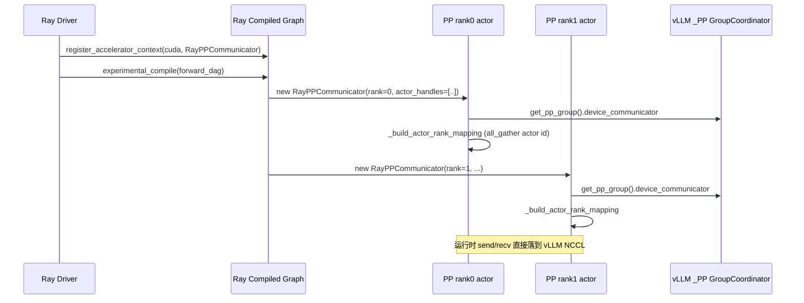

# ray_communicator.py — RayPPCommunicator

[← Wiki 首页](../../README.md) > [分布式](../../README.md) > [device-communicators](README.md) > ray

源码：`vllm/distributed/device_communicators/ray_communicator.py`（约 259 行）。本文件实现 `RayPPCommunicator`，让 Ray Compiled Graph 在做 pipeline 并行张量传递时，**复用 vLLM 已建好的 `_PP GroupCoordinator.device_communicator`**（即 `CudaCommunicator` 的 send/recv），而不是另起 Ray 自带的 NCCL communicator。实用性细节见顶层 [ray-integration.md](../ray-integration.md)。

## 是什么

`RayPPCommunicator(Communicator)`（`:22`，继承 `ray.experimental.channel.communicator.Communicator`），包装 `DeviceCommunicatorBase`。

字段：
- `_world_size`、`_rank`、`_actor_handles`、`_comm: DeviceCommunicatorBase | None`、`_closed: bool`。
- `_actor_id_to_rank: dict[str, int]`（`_build_actor_rank_mapping` 产物）。

构造（`:32`）：`__init__(world_size, comm_id, rank, actor_handles, cuda_stream, use_communication_streams=False)`。
- 拒绝 `use_communication_streams=True` 与非默认 cuda_stream（`NotImplementedError`/`ValueError`）。
- `rank is not None`（worker actor）：`assert ray.get_gpu_ids()`；`self._comm = get_pp_group().device_communicator`；assert 非 None；`_rank = self._comm.rank_in_group`（忽略 Ray 传入的 rank，`ray_communicator.py:80`）；`_build_actor_rank_mapping()`。
- `rank is None`（driver）：`_comm = None`。

`_build_actor_rank_mapping`（`:89`）：当前 actor `_actor_id.hex()`（32-char hex）转 uint8 tensor，过 `_comm.all_gather(dim=0)` 收齐全员，建 `actor_id_str → rank` 表。

API（实现 `Communicator` 协议）：
- `initialize(rank)`：no-op。
- `get_actor_handles()`/`get_rank(actor)`/`get_self_rank()`/`get_world_size()`。
- `send(buf, peer_rank)`（`:158`）→ `_comm.send(buf, peer_rank)`。
- `recv(shape, dtype, peer_rank, allocator)`（`:180`）→ `_comm.recv(size, dtype, src=peer_rank)` + `current_stream().synchronize()` + 重检 `_closed`。
- `allgather`/`allreduce`/`reducescatter`：`NotImplementedError`（PP 不用）。
- `recv_stream`/`send_stream`（`:241`）：`torch.cuda.StreamContext(current_stream())`。
- `destroy()`（`:249`）：`_closed=True`，不销毁 GroupCoordinator。
- `get_transport_name()`→"nccl"；`generate_communicator_id()`→`uuid.uuid4()`（classmethod）。

## 为什么

- **避免双 communicator**：Ray Compiled Graph 默认会自己起一套 NCCL communicator 做张量传递；vLLM 的 PP 路径已通过 `CudaCommunicator.pynccl_comm` 建好 NCCL P2P。两套 communicator 共存会重复占显存且 CUDA graph 捕获困难。
- **复用 vLLM graph capture**：`CudaCommunicator.send/recv` 在 `current_stream()` 上发射，与 vLLM 的 CUDA graph / piecewise 兼容；Ray 自带 communicator 不一定。
- **actor 句柄 ↔ rank**：Ray Compiled Graph 用 actor 句柄寻址，但 vLLM NCCL 用 rank；`_build_actor_rank_mapping` 用一次 `all_gather` 把 32B actor id 全员分发并建表。
- **不实现 collective**：PP 只需点对点；allreduce/allgather NotImplemented 防止误用与下降到性能差的回退。
- **recv 同步**：NCCL abort 后 buffer 值未定义，`synchronize()` + 双检 `_closed`（`ray_communicator.py:208` 注释）保证消费方读到的是有效数据或抛 `RayChannelError`。
- **destroy 软销毁**：生命周期由 vLLM `GroupCoordinator.destroy` 管理，此处只置标志，避免 Ray 与 vLLM 双重销毁竞态。

## 怎么做

### 接线时序

### actor_id → rank 映射

每个 actor 把自己 32 字符 hex id 编码为 `uint8[32]` tensor，过 `_comm.all_gather(dim=0)` 拿到 `[world_size*32]`，按 `rank*32:(rank+1)*32` 切片解出每个 rank 的 actor id，建 `actor_id_str → rank` 表。后续 `get_rank(actor_handle)` 查表即可。

## 与其它模块/系统配合

- **[parallel-state](../parallel-state.md)**：直接消费 `get_pp_group().device_communicator`。
- **[cuda](cuda.md)**：被包装的 device_communicator 在 CUDA 平台即 `CudaCommunicator`。
- **[02-execution](../../02-execution/README.md)**：`v1/executor/ray_executor.py:595` 在 `VLLM_USE_RAY_WRAPPED_PP_COMM` 时 `register_accelerator_context(cuda, RayPPCommunicator)`。
- **[ray-integration](../ray-integration.md)**：顶层总览与 `vllm/ray/` 模块。
- **[13-entrypoints](../../13-entrypoints/README.md)**：CLI `--distributed-executor-backend ray` + PP 触发使用。

## 历史版本演进

- **v0.8**：`RayPPCommunicator` 引入；`VLLM_USE_RAY_WRAPPED_PP_COMM` 开关；`_build_actor_rank_mapping` 落地。
- **v0.9**：`recv` 加 `synchronize()` + `_closed` 双检，修 NCCL abort 后 buffer 未定义。
- **v0.10**：`destroy` 改为软标志；`get_transport_name` 返回 "nccl"。
- **v0.11/main**：与 Compiled Graph overlap comm (`VLLM_USE_RAY_COMPILED_DAG_OVERLAP_COMM`) 协同实验（待核实稳定）。

[← 返回 device-communicators 首页](README.md)

## 参见

- [cuda.md](cuda.md) — 被包装的 NCCL send/recv 实现。
- [../ray-integration.md](../ray-integration.md) — Ray 集成全局视角。
- [base.md](base.md) — `DeviceCommunicatorBase` 协议。
