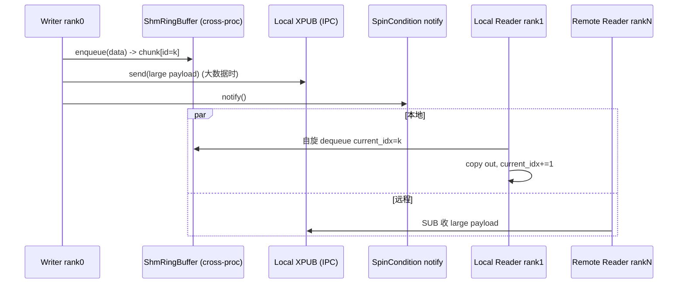

# shm_broadcast.py — MessageQueue 共享内存广播

[← Wiki 首页](../../README.md) > [分布式](../../README.md) > [device-communicators](README.md) > shm-broadcast

源码：`vllm/distributed/device_communicators/shm_broadcast.py`（约 947 行）。本文件实现 vLLM 在 TP 组内"1 写多读"的高速广播：写方 rank0 把张量 dict/张量推给本节点 TP 邻居（同节点走共享内存 ring buffer，跨节点走 ZMQ XPUB），读方在 SHM 上自旋或经 zmq SUB 通知后取数据。它是 `GroupCoordinator` 的 `mq_broadcaster` 与 scheduler→worker 的 `broadcast_tensor_dict` 高频路径核心。

## 是什么

### 顶层常量与函数

- `SPINLOOP_TIMEOUT_SECONDS = 0.1`、`VLLM_RINGBUFFER_WARNING_INTERVAL`（`:54`/`:59`）：自旋等待长告警间隔。
- `SPINLOOP_EXT_ENABLED`（`:44`）：`VLLM_USE_SPINLOOP_EXT` 时尝试 import `vllm.spinloop.spinloop` C 扩展；失败 warning 并禁用。
- `memory_fence()`（`:70`）：`threading.Lock` acquire/release 做全内存屏障，保证 SHM 写后立即对其它进程可见。
- `to_bytes_big`/`from_bytes_big`（`:91`/`:61`）：大端整数编解码。

### SpinCondition（`:104`）

类似 `threading.Condition` 的通知机制，但通知经 ZMQ socket 跨进程。writer 端 `notify` 发消息；reader 端 `wait_for_data` 自旋 + ZMQ poll 混合，避免纯自旋耗 CPU。

### ShmRingBuffer（`:216`）

固定大小多 chunk 环形缓冲（`max_chunk_bytes × max_chunks`）。每个 chunk：`[4B id][4B size][data]`。writer 端 `enqueue` 找 free chunk 写数据 + 更新 `monotonic_id`；reader 端 `dequeue` 按 `current_idx` 读 + 自更新。`handle()` 返回 `(name, max_chunk_bytes, max_chunks)` 供其它进程 `SharedMemory(name=)` 打开。

### Handle（`:355`，dataclass）

跨进程传递的句柄：`local_reader_ranks`、`buffer_handle=(name,max_chunk_bytes,max_chunks)`、`local_subscribe_addr`、`local_notify_addr`、`remote_subscribe_addr`、`remote_addr_ipv6`。由 writer `export_handle()` 返回，reader `create_from_handle` 重建。

### MessageQueue（`:365`）

主类。构造（writer 端）：
- `n_reader`（总读数）、`n_local_reader`（同节点数）、`local_reader_ranks`、`max_chunk_bytes=24MiB`（注释 `:372` 给 grammar bitmask 大批留空间）、`max_chunks=10`、`connect_ip`。
- 本地有 reader：建 `ShmRingBuffer` + 一个 XPUB（IPC path，`get_open_zmq_ipc_path`）+ 一个 `SpinCondition` notify socket。
- 远程有 reader：再建一个 XPUB TCP socket（IPv6 检测），bind `tcp://ip:port`。
- writer 持 `handle` 并经 `export_handle()` 给 reader。

`MessageQueue.create_from_handle(handle, rank)`（`:460`，reader 工厂）：按 `rank in handle.local_reader_ranks` 分本地/远程。本地 reader 打开同一 SHM name、连 IPC XPUB+notify；远程 reader 连 TCP XPUB。

`@staticmethod create_from_process_group(pg, n_reader+1, n_local_reader+1, ...)` / `create_from_process_group_single_reader`（待补行号，由 `GroupCoordinator` 调用）：从 `torch.distributed` ProcessGroup 派生 local/remote reader 集合，writer rank 默认 0，构造 `MessageQueue` 并 broadcast handle 给 reader。

API：`enqueue`（writer 写 SHM + XPUB 大块通知 + SpinCondition notify）、`dequeue`/`recv`（reader 按 current_idx 读，自旋等待）、`wait_for_data`、`shutting_down`/close、`current_idx`。

### 用途点位

- `GroupCoordinator.__init__` 在 `use_message_queue_broadcaster=True`（TP/DCP 组）时 `MessageQueue.create_from_process_group(cpu_group, 1<<22, 6)`（`parallel_state.py:498`）。
- `GroupCoordinator.create_mq_broadcaster`/`create_single_reader_mq_broadcasters`（`parallel_state.py:536`/`:550`）提供 writer/单 reader 变体。

## 为什么

- **TP 内 broadcast 高频**：每 step scheduler 把 `SchedulerOutput` 的 tensor dict 广播给 worker；NCCL broadcast 太重且不灵活（要 tensor 已在 device），SHM+ZMQ 让 CPU 侧 1→多零拷贝。
- **大小分流**：小数据（< chunk size）直接进 SHM ring buffer 自旋读；大数据走 XPUB（zmq PUB/SUB 拷贝一次，但跨进程可靠）。两者用同一 handle。
- **跨节点透明**：同节点 SHM，跨节点 XPUB TCP；`is_valid_ipv6_address` 处理 IPv6；`get_ip`/`get_open_port` 选地址。
- **自旋 + 通知**：纯自旋耗 CPU 但延迟极低；纯通知（zmq SUB blocking）延迟高。`SpinCondition` 折中——先自旋一段，无数据则短阻塞等 zmq poll。
- **memory_fence 必要**：Python GIL 与多进程 SHM 不保证写顺序可见，必须显式屏障；`threading.Lock` 在 POSIX/Windows 提供顺序一致语义（注释 `:80`，约 20ns）。
- **grammar bitmask**：默认 24MiB 给 structured output 大批（1024 req）bitmask 留空间（注释 `:372`）。
- **C 扩展可插拔**：`VLLM_USE_SPINLOOP_EXT` 启用 Rust/C 自旋实现降延迟；缺省降级到 Python。

## 怎么做

### writer→reader 时序



### handle 传递

writer 端 `export_handle()` 得 `Handle`（含 SHM name + ZMQ addr），通过 `cpu_group` broadcast_object_list 派发；reader 端用 `create_from_handle(handle, rank)` 还原。

### 集成点

```python
# parallel_state.GroupCoordinator
self.mq_broadcaster = MessageQueue.create_from_process_group(
    self.cpu_group, 1 << 22, 6)
# 之后广播：
self.broadcast_tensor_dict(tensor_dict, src=0)  # 内部用 mq_broadcaster 路径
```

## 与其它模块/系统配合

- **[parallel-state](../parallel-state.md)**：`GroupCoordinator.mq_broadcaster` 字段；TP/DCP/inner_dp_world 组启用。
- **[01-engine-core](../../01-engine-core/README.md)**：`SchedulerOutput` 的 tensor dict 经此广播给 worker。
- **[shm-object-storage](shm-object-storage.md)**：另一套 SHM 原语（`SingleWriterShmRingBuffer`），概念同源但更面向对象存储。
- **[02-execution](../../02-execution/README.md)**：worker 侧 `Executor`/`Worker` 用 handle 重建 MQ 接收 scheduler 决策。
- **[09-compilation-ir](../../09-compilation-ir/README.md)**：broadcast 不进 CUDA graph，是 CPU 侧前置。

## 历史版本演进

- **早期（v0.5）**：`MessageQueue` + `ShmRingBuffer` 引入，仅本地 SHM。
- **v0.6**：远程 XPUB TCP 支持；`Handle` dataclass 稳定。
- **v0.7（v1）**：`SpinCondition` 引入替代纯自旋；IPv6 支持；`memory_fence` 锁屏障。
- **v0.8**：`VLLM_USE_SPINLOOP_EXT` C 扩展可选；`XPUB_VERBOSE` 保证多订阅统计准确。
- **v0.9/v0.10**：`max_chunk_bytes=24MiB` 默认（grammar bitmask）；`create_from_process_group_single_reader` 用法扩展（dp wave 协调）。
- **v0.11/main**：长等待告警 `VLLM_RINGBUFFER_WARNING_INTERVAL`；与 async scheduling 协同（待核实）。

[← 返回 device-communicators 首页](README.md)

## 参见

- [shm-object-storage.md](shm-object-storage.md) — 对象存储版 SHM。
- [base.md](base.md) — 基类不直接用，但 GroupCoordinator 是消费方。
- [all-reduce-utils.md](all-reduce-utils.md) — 自旋等待的兄弟工具。
