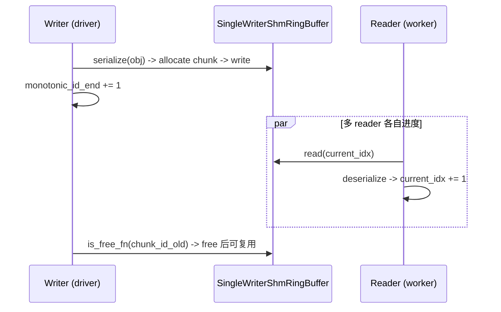

# shm_object_storage.py — SHM 对象存储

[← Wiki 首页](../../README.md) > [分布式](../../README.md) > [device-communicators](README.md) > shm-object-storage

源码：`vllm/distributed/device_communicators/shm_object_storage.py`（约 709 行）。提供一套基于共享内存的"单写多读对象存储"原语：`SingleWriterShmRingBuffer`（环形缓冲）+ `MsgpackSerde`/`ObjectSerde`（序列化）+ `SingleWriterShmObjectStorage`（门面）。与 [shm-broadcast](shm-broadcast.md) 的 `MessageQueue` 同族，但更面向"按 key 写、按 key 取"的对象存储语义，用于 CPU executor 跨进程广播 Python 对象（如 SchedulerOutput）。

## 是什么

### SingleWriterShmRingBuffer（`:22`）

单写多读共享内存环形缓冲。每个 chunk 格式 `[4B id][4B size][data]`（注释 `:33`）。属性：`monotonic_id_start`/`monotonic_id_end`、`data_buffer_start`/`data_buffer_end`、自动 wraparound、按 `is_free_fn` 懒回收。

API（概念）：
- `allocate(size) -> (chunk_id, ptr)`：找 free chunk；若无则按 `is_free_fn` 回收旧的。
- `write(chunk_id, data)`、`read(chunk_id)`、`is_free(chunk_id)`。
- `handle()`：返回跨进程重建所需信息（SHM name + 元数据）。
- 注释 `:33`/`:44` 起给出线性分配与回收两个 scenario 示例。

### ObjectSerde（`:334`，ABC）/ MsgpackSerde（`:346`）

序列化协议抽象：`serialize(obj) -> bytes`、`deserialize(bytes) -> obj`。`MsgpackSerde` 用 msgpack + 可选 pickle fallback。张量与普通对象混合打包。

### ShmObjectStorageHandle（`:406`）/ SingleWriterShmObjectStorage（`:414`）

门面类，把 ring buffer + serde 整合为"按对象写入、按 id/seq 读出"的存储。writer 端 `insert(obj)`：序列化 → 找 free chunk → 写；reader 端按 id 拉取反序列化。`ShmObjectStorageHandle` 跨进程传递 SHM name + 序列化协议参数。

## 为什么

- **CPU executor 跨进程广播**：[02-execution](../../02-execution/README.md) 的 multiproc executor 父进程要把 SchedulerOutput、input 等大对象传给 worker。`MessageQueue` 偏张量；本存储偏"Python 对象 + 偶尔夹张量"。
- **单写多读 ring**：1 个 driver 写、N 个 worker 读同一 SHM 段；ring 限制内存上限、避免无限增长；`is_free_fn` 让"全员已读"的 chunk 可被回收。
- **id 单调**：每个 chunk 有 monotonic id；reader 记 `current_idx` 顺序读，跟不上时由 `is_free` 判定丢弃/回退。
- **msgpack + pickle 混搭**：msgpack 快但不支持全部对象；pickle 兜底复杂对象；张量用 msgpack 的 bin 块 + 元数据头。
- **与 zmq 互补**：本原语纯 SHM（同节点），跨节点仍走 zmq/PUB（shm-broadcast 的 remote 路径）。
- **`is_free_fn` 解耦**：writer 不主动 track reader 进度，回收取决于"该 chunk 是否被标记 free"（由业务回调判定，例如"下一 chunk 已被全员 enqueue"）。

## 怎么做

### writer/reader

### handle 跨进程

writer 返回 `ShmObjectStorageHandle`（含 SHM name + serde 参数）；reader `create_from_handle` 打开同名 SHM + 同 serde，建对等 reader。

## 与其它模块/系统配合

- **[shm-broadcast](shm-broadcast.md)**：概念同源，分工：MessageQueue 偏张量/低延迟；本存储偏 Python 对象/通用。
- **[cpu](cpu.md)**：CPU executor 用 SHM 算子是 torch `_sharded_memory`；本原语是另一条独立路径（更多用在 multiproc executor 父↔子 IPC）。
- **[02-execution](../../02-execution/README.md)**：multiproc/external launcher 父进程 driver 与 worker 的对象广播。
- **[01-engine-core](../../01-engine-core/README.md)**：EngineCore 进程与 output_processor 之间若同机也可用类似原语（实际 [01-engine-core](../../01-engine-core/README.md) 走 ZMQ，待核实本原语确切使用点）。

## 历史版本演进

- **v0.7**：`SingleWriterShmRingBuffer` 引入，初版仅线性分配。
- **v0.8**：`ObjectSerde` 抽象 + `MsgpackSerde`；`is_free_fn` 回调机制。
- **v0.9/v0.10**：`ShmObjectStorageHandle` 跨进程契约稳定；张量与对象混合序列化优化。
- **v0.11/main**：回收策略与多 reader 落后处理持续打磨（待核实）。

[← 返回 device-communicators 首页](README.md)

## 参见

- [shm-broadcast.md](shm-broadcast.md) — 同族张量广播。
- [cpu.md](cpu.md) — CPU SHM 算子。
- [base.md](base.md) — 通信器抽象。
