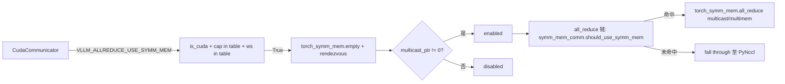

# symm_mem.py — SymmMemCommunicator

[← Wiki 首页](../../README.md) > [分布式](../../README.md) > [device-communicators](README.md) > symm-mem

源码：`vllm/distributed/device_communicators/symm_mem.py`（约 155 行）。基于 PyTorch `torch.distributed._symmetric_memory` 的 all-reduce 实现，利用 NVLS / multicast symmetric memory（NVLink SHM 在 GPU 间），针对中等张量比 NCCL/custom AR 更优的区间。由 [CudaCommunicator](cuda.md) 持有 `symm_mem_comm`（`VLLM_ALLREDUCE_USE_SYMM_MEM` 时）。

## 是什么

### 构造（`:32`）

`__init__(group, device, force_multimem=None, max_size_override=None)`：
- `symm_mem_available`（成功 import `torch.distributed._symmetric_memory as torch_symm_mem`）+ `current_platform.is_cuda()` 才继续；否则 `disabled=True` 返回。
- 平台 capability（`get_device_capability().as_version_str()`）必须在 `SYMM_MEM_ALL_REDUCE_MAX_SIZES` 表（[all-reduce-utils](all-reduce-utils.md)）keys 内（`9.0`/`10.0`/`10.3`）。
- `world_size` 必须在该 cap 的表项 keys 内（`2/4/6/8`）。
- `max_size = SYMM_MEM_ALL_REDUCE_MAX_SIZES[cap][ws]` 或 `max_size_override`。
- `torch_symm_mem.empty(max_size//dtype.itemsize, device, dtype)` 分配 buffer；`torch_symm_mem.rendezvous(buffer, group.group_name)` 建立对称内存 rendezvous。
- `handle.multicast_ptr == 0` → multicast 不支持 → disable。
- `VLLM_BATCH_INVARIANT` 启用时 disable。
- 字段：`disabled`、`buffer`、`group`、`device`、`dtype`（bfloat16）、`max_size`、`device_capability`、`force_multimem`。

### `_WORLD_SIZES_MULTIMEM`（`:26`）

```
{"9.0": [4, 6, 8], "10.0": [6, 8], "10.3": [6, 8]}
```
对这些 ws + cap 走 multimem 路径（NVIDIA multimem 直接 multicast 写）。

### 方法

- `should_use_symm_mem(inp)`（`:116`）：`disabled`/dtype==bfloat16/`inp_size % 4 == 0`/`inp_size <= max_size`。
- `all_reduce(inp, *, out=None) -> torch.Tensor | None`（`:126`）：`should_use_symm_mem` 不满足返 None 让 fall through；否则调 `torch_symm_mem.all_reduce`（multicast 或 reduce 视 ws/cap）。

## 为什么

- **NVLS/multicast 优势区间**：NVLink 上 NCCL all-reduce 在 32K–64K 输给 custom AR，但 <2K 与 >128K 时 custom AR 不一定快。symm mem multicast 在大张量上带宽利用率高，对 64K–128K mid-range 也有竞争力（注释 [all-reduce-utils](all-reduce-utils.md) `:73` 起给出 H100/GB200 benchmark）。
- **复用 torch 实现**：`torch.distributed._symmetric_memory` 由 PyTorch 维护，跨 cap/驱动版本更稳；vLLM 只做封装与调度。
- **multimem 路径**：Hopper/Blackwell 提供 `multimem` 指令（单 kernel multicast write），对 ws `[4,6,8]`/`[6,8]` 显著提速；`force_multimem` 便于测试。
- **VLLM_BATCH_INVARIANT 互斥**：batch-invariant 路径走其它后端，避免冲突。
- **rendezvous 一次性**：`torch_symm_mem.rendezvous(buffer, group_name)` 一次性建对所有端 buffer 映射，运行时无握手开销。
- **bfloat16 only**：当前内核仅 bf16 实现；其它 dtype 走别的后端。

## 怎么做

### 启用 + 调度



### 调度链位置

`CudaCommunicator.all_reduce`（`cuda_communicator.py:320`）：symm_mem 在 custom AR 之后、PyNccl 之前。

### multimem 选择

`_WORLD_SIZES_MULTIMEM[cap]` 含当前 ws 时走 multimem 内核；否则普通 multicast reduce。`force_multimem` 测试用。

## 与其它模块/系统配合

- **[cuda](cuda.md)**：`CudaCommunicator.symm_mem_comm`（`:93`），TP-only。
- **[all-reduce-utils](all-reduce-utils.md)**：`SYMM_MEM_ALL_REDUCE_MAX_SIZES` 表 + NCCL symm mem benchmark。
- **[pynccl](pynccl.md)**：fall-through 兜底。
- **[custom-all-reduce](custom-all-reduce.md)**：custom AR 也会传 `symm_mem_enabled` 给构造但两者调度独立。
- **[08-platforms](../../08-platforms/README.md)**：`is_cuda()`/`get_device_capability()`。
- **[09-compilation-ir](../../09-compilation-ir/README.md)**：symm mem reduce 需 piecewise CUDA graph 兼容（待核实 custom op 注册）。

## 历史版本演进

- **v0.8**：`SymmMemCommunicator` 引入，basd on torch `_symmetric_memory`，ws `[2,4,6,8]`。
- **v0.9**：multimem 路径接入（Hopper cap 9.0 ws 4/6/8）；`_WORLD_SIZES_MULTIMEM` 表落地。
- **v0.10**：cap `10.0`/`10.3`（Blackwell/GB200）支持；`SYMM_MEM_ALL_REDUCE_MAX_SIZES` 调优。
- **v0.11/main**：`VLLM_BATCH_INVARIANT` 互斥；与 NCCL symm mem 调度链重叠区持续 benchmark（待核实）。

[← 返回 device-communicators 首页](README.md)

## 参见

- [all-reduce-utils.md](all-reduce-utils.md) — max_size 表与 benchmark 注释。
- [cuda.md](cuda.md) — 调度链总览。
- [pynccl.md](pynccl.md) — fall-through 兜底。
