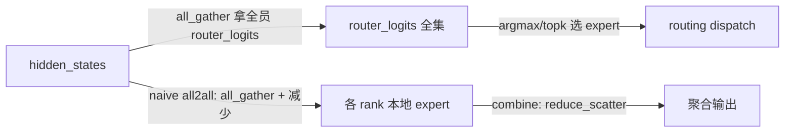

# xpu_communicator.py — XpuCommunicator

[← Wiki 首页](../../README.md) > [分布式](../../README.md) > [device-communicators](README.md) > xpu

源码：`vllm/distributed/device_communicators/xpu_communicator.py`（约 252 行）。Intel XPU（ARC/Flex/PVC/MAX）平台的设备通信器，由 `xpu_platform.get_device_communicator_cls()` 返回。封装 oneCCL（经 `torch.distributed` ccl backend）的 all-reduce/all-gather/reduce-scatter/gather/broadcast，并实现 EP dispatch/combine 的 naive allgather+reducescatter 兜底。

## 是什么

### XpuCommunicator（`:16`）

继承 `DeviceCommunicatorBase`。构造（`:17`）：`super().__init__`；可选建 all2all manager（若有 `all2all_backend`，XPU 通常用 `naive`/`allgather_reducescatter`）。XPU 无 custom AR/symm mem/quickreduce/flashinfer 等加速后端，all-reduce 直接走 `pynccl_comm` 或 `dist.all_reduce`（ccl backend）。

重写方法：
- `all_reduce(input_)`（`:45`）：`world_size==1` 短路；优先 `pynccl_comm.all_reduce`，disabled/None 时 `dist.all_reduce(out=clone, group=device_group)`。
- `reduce_scatter(input_, dim=-1)`（`:50`）：movedim + `reduce_scatter_tensor`；注释同 base 提到 contiguity bug。
- `reduce_scatterv`（`:74`）：手动 chunk + 逐段 `reduce_scatter`（XPU ccl 不直接支持 v 版本）。
- `all_gatherv`（`:108`）：手动 chunk + 逐段 `all_gather`。
- `gather(input_, dst=0, dim=-1)`（`:162`）：`dist.gather` + cat。
- `broadcast(input_, src=0)`（`:192`）。
- `dispatch_router_logits`/`dispatch`/`combine`（`:195`/`:218`/`:242`）：基于 `all_gather`/`reduce_scatter` 的 naive all2all 实现，供 EP MoE 在 XPU 上的最小可用路径；高性能后端（DeepEP/FlashInfer）不适用 XPU。

## 为什么

- **平台覆盖**：vLLM XPU 后端支持 Intel GPU 推理；oneCCL 是其原生集合通信库，经 `torch.distributed` ccl backend 暴露。
- **无 NVLink 加速后端**：custom AR/symm mem/DeepEP 都依赖 CUDA/NVLink，XPU 上不可用，故 all-reduce 调度链极简——NCCL（ccl）+ naive all2all。
- **v 版本手实现**：oneCCL 的 reduce_scatter_v/all_gatherv 接口在 torch 绑定层面不完整，需手动 chunk 循环。
- **EP naive 兜底**：让 MoE 模型在 XPU 上至少能跑通（性能并非首要）。

## 怎么做

### dispatch/combine naive 路径

具体实现：dispatch 阶段 `all_gather` 把各 rank 的 hidden/router 拼成全集，本地按 routing 决定哪些 token 发给哪号 expert（都在本地即完成）；combine 阶段 `reduce_scatter` 把各 expert 输出按 token 维汇总回原 rank。是 EP all2all 的数学等价但通信量较大。

### P2P

`send`/`recv`/`batch_isend_irecv` 用基类（`dist.send`/`dist.recv`），用于 PP。

## 与其它模块/系统配合

- **[base](base.md)**：基类。
- **[parallel-state](../parallel-state.md)**：`get_device_communicator_cls` 返回本类。
- **[08-platforms](../../08-platforms/README.md)**：XPU 平台定义；`is_xpu()` 路由。
- **[02-execution](../../02-execution/README.md)**：XPU executor 提供 cpu_group/device_group。
- **[all2all](all2all.md)**：`AgRsAll2AllManager` 是 XPU 上唯一可用的 all2all manager（同 naive 语义）。

## 历史版本演进

- **v0.5/v0.6**：XPU 后端接入分布式，初版仅 all_reduce/all_gather。
- **v0.7**：`XpuCommunicator` 抽象落地，dispatch/combine naive 实现。
- **v0.8/v0.9**：`reduce_scatterv`/`all_gatherv` 手动实现补齐；`pynccl_comm` 复用于 ccl unique id 广播（待核实 ccl 路径是否完全走 `dist`）。
- **v0.10/main**：随 oneCCL/torch xpu 后端持续打磨；高性能 all2all 暂未引入 XPU（待核实）。

[← 返回 device-communicators 首页](README.md)

## 参见

- [base.md](base.md) — 基类。
- [cuda.md](cuda.md) — 对照的 CUDA 完整实现。
- [all2all.md](all2all.md) — `AgRsAll2AllManager` 的详细语义。
