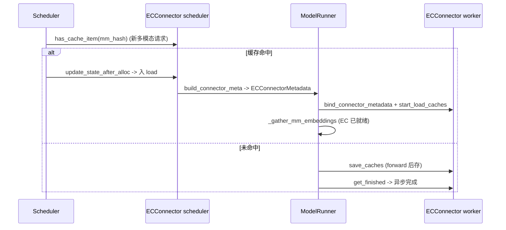

# ec_transfer/ — Encoder Cache 迁移子包

[← Wiki 首页](../README.md) > [分布式](../README.md) > ec-transfer

源码根：`vllm/distributed/ec_transfer/`。本子包与 [kv-transfer](kv-transfer/README.md) 平行，但迁移的是**多模态 encoder cache**（视觉/音频 encoder 输出）而非 KV cache。在多模态 PD 分离 / 跨实例 encoder cache 共享场景下，让 consumer 不必重算多模态特征。结构对偶 KV：`ECConnectorBase` + `ECConnectorFactory` + `ECConnectorRole` + `ECConnectorMetadata` + 全局单例 `ec_transfer_state.py`。

## 是什么

### 目录结构

| 文件 | 主要符号 |
|---|---|
| `__init__.py` | 从 `ec_transfer_state` 导出 |
| `ec_transfer_state.py`（49 行） | `_EC_CONNECTOR_AGENT` 单例 + `get_ec_transfer`/`has_ec_transfer`/`ensure_ec_transfer_initialized`/`ensure_ec_transfer_shutdown` |
| `ec_connector/__init__.py` | 导出 |
| `ec_connector/base.py`（277 行） | `ECConnectorRole`、`ECConnectorMetadata`、`ECConnectorBase(ABC)` |
| `ec_connector/factory.py`（85 行） | `ECConnectorFactory` + 注册 `ECExampleConnector` |
| `ec_connector/example_connector.py`（200 行） | `MMMeta`、`ECExampleConnectorMetadata`、`ECExampleConnector` |

### ECConnectorBase（`ec_connector/base.py:59`）

构造 `__init__(vllm_config, role)`：装 `_connector_metadata`/`_vllm_config`/`_role`；从 `ec_transfer_config` 取 `_is_producer`/`_is_consumer`（注释 `is_ec_producer`/`is_ec_consumer`）。`role`/`is_producer`/`is_consumer` property；`shutdown()` 默认 no-op。

#### Worker 侧方法

- `bind_connector_metadata(md)`/`clear_connector_metadata()`/`_get_connector_metadata()`：与 KV 协议同形。
- `register_caches(ec_caches: dict[str, Tensor])`：注册 encoder cache 张量（`TODO: Implement this later for P2P feature`，`:127`）。
- `@abstractmethod start_load_caches(encoder_cache, **kwargs)`：forward 前加载，对 `_gather_mm_embeddings` 之前。
- `@abstractmethod save_caches(encoder_cache, mm_hash, **kwargs)`：保存到 connector。
- `get_finished(finished_req_ids) -> (saving_ids|None, loading_ids|None)`：异步完成反馈。

#### Scheduler 侧方法

- `@abstractmethod has_cache_item(identifier: str) -> bool`：mm_hash 是否已缓存。
- `ensure_cache_available(request, num_computed_tokens) -> bool`：默认 True，可发起异步传输并返 False 让请求延后。
- `@abstractmethod update_state_after_alloc(request, index)`：分配后决定是否加载。
- `@abstractmethod build_connector_meta(scheduler_output) -> ECConnectorMetadata`。
- `update_connector_output(connector_output)`：默认 no-op。
- `request_finished(request) -> (bool, dict|None)`：默认 (False, None)。

### ECConnectorFactory（`ec_connector/factory.py:20`）

`_registry: dict[str, Callable[[], type[ECConnectorBase]]]`。`register_connector(name, module_path, class_name)`（lazy loader）；`create_connector(config, role)`：校验 `ec_transfer_config` 非 None + 日志 + 构造；`get_connector_class(ec_transfer_config)`：优先 registry，否则 `ec_connector_module_path` + 名。注册 `ECExampleConnector`（`:81`）。

### ECExampleConnector（`example_connector.py:45`）

注释 `:46`：simple debug implementation，save/load EC cache to/from disk，用 safetensors。`MMMeta(mm_hash, num_token)`。`ECExampleConnectorMetadata(mm_datas: list[MMMeta])`。worker 端 `save_caches` 写 `safetensors` 到磁盘；`start_load_caches` 读回。scheduler 端 `has_cache_item` 检查文件存在；`update_state_after_alloc` 决定加载；`build_connector_meta` 收集本步 mm 数据。

### 全局单例（`ec_transfer_state.py`）

`_EC_CONNECTOR_AGENT`；`ensure_ec_transfer_initialized(vllm_config)`：`ec_transfer_config.is_ec_transfer_instance` 且未初始化时调 `ECConnectorFactory.create_connector(config, role=ECConnectorRole.WORKER)`。`ensure_ec_transfer_shutdown`。

## 为什么

- **多模态 EC 也是重计算成本**：vision/audio encoder forward 耗时远大于 LLM 一层；PD 分离时若 decode 端重算 EC 等于浪费 prefill 端 encoder 算力。EC transfer 让 encode-once-share-many。
- **与 KV transfer 平行协议**：复用同一模式（scheduler/worker 双角色、metadata、async finish）；`ECConnectorMetadata` 与 `KVConnectorMetadata` 概念一致，便于 EngineCore 统一处理。
- **producer/consumer 标志**：`is_ec_producer`/`is_ec_consumer` 可独立配置（如某个 engine 只产不消，或只消不产）；与 `ECConnectorRole` 职责正交。
- **`has_cache_item` 单点查询**：多模态请求进入时按 `mm_hash` 查本地/远端是否已缓存；与 scheduler `ensure_cache_available` 配合让请求"等 EC 就绪再 admit"。
- **P2P register_caches TODO**：注释 `:127` 指出未来要做 P2P 直传（类似 NIXL），目前先 disk/shared store 路径。
- **example 用 safetensors**：debug 实现选 safetensors 是因为其零拷贝加载语义适合大张量且 vLLM 已依赖。

## 怎么做

### 启用

`ec_transfer_config.is_ec_transfer_instance=True` + `ec_connector='ECExampleConnector'`。EngineCore 在 scheduler 创建时持 scheduler 侧 EC connector；Worker 启动时 `ensure_ec_transfer_initialized` 建 worker 侧。

### 每 step

## 与其它模块/系统配合

- **[kv-transfer](kv-transfer/README.md)**：协议对偶，可同时启用（多模态 PD）。
- **[01-engine-core](../01-engine-core/README.md)**：scheduler 持 EC connector；`update_connector_output`/`get_finished` 回流。
- **[02-execution](../02-execution/README.md)**：worker `ensure_ec_transfer_initialized`；ModelRunner `_gather_mm_embeddings` 前后调 worker 钩子。
- **[11-multimodal](../11-multimodal/README.md)**：mm_hash 来源；EncoderCacheManager（[01-engine-core](../01-engine-core/README.md) 的 `kv-cache-management/encoder-cache.md`）与 EC connector 协作。
- **[10-config](../10-config/README.md)**：`ECTransferConfig`（`ec_connector`/`is_ec_producer`/`is_ec_consumer`/`engine_id`/`ec_connector_module_path`）。

## 历史版本演进

- **v0.10**：`ec_transfer/` 子包引入（与 HMA/encoder cache manager 协同需求驱动）。`ECConnectorBase` 双角色协议 + Example (safetensors) 落地。
- **v0.11/v0.12/main**：`register_caches` P2P 路径在途；与 multi-process LMCache 风格的独立 EC 进程原型探索（待核实）；`ensure_cache_available` 接入 scheduler admit loop。

[← 返回分布式首页](../README.md)

## 参见

- [kv-transfer/README.md](kv-transfer/README.md) — KV 协议对偶。
- [kv-transfer/base.md](kv-transfer/base.md) — `KVConnectorBase_V1` 对照阅读。
- [11-multimodal](../11-multimodal/README.md) — 多模态 encoder 上游。
