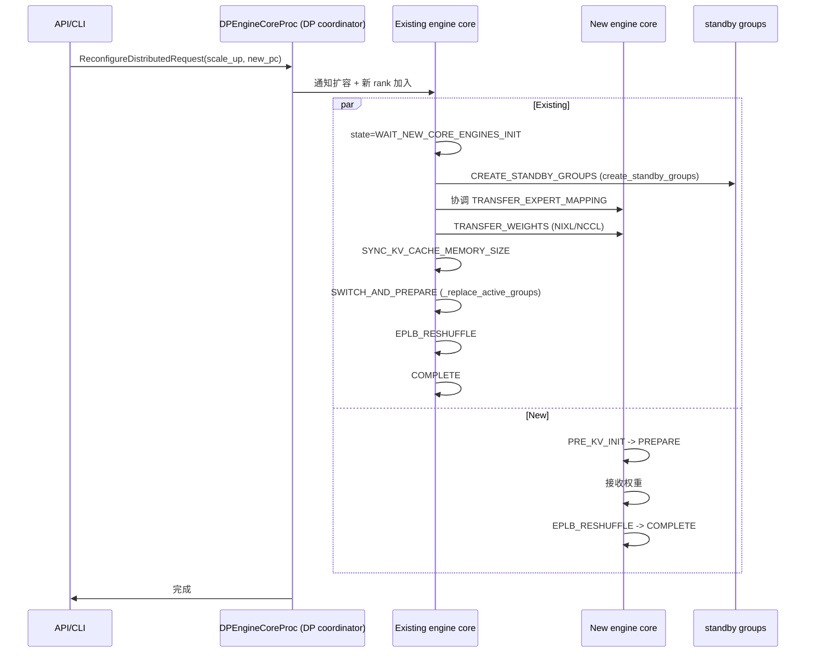

# elastic_ep/ — Elastic Expert Parallelism

[← Wiki 首页](../README.md) > [分布式](../README.md) > elastic-ep

源码根：`vllm/distributed/elastic_ep/`（`elastic_state.py`、`elastic_execute.py`、`standby_state.py`、`__init__.py` 空）。本子包实现 MoE expert parallelism 的**运行时弹性扩缩容**：在不重启 vLLM 服务的前提下增减 EP rank（对应 GPU），重排专家权重到新拓扑，并把 standby 进程组切换为 active。是 [`enable_elastic_ep=True`](parallel-state.md) 路径的执行核心，依赖 [stateless-coordinator](stateless-coordinator.md) 与 [eplb](eplb.md)。

## 是什么

### 状态机（`elastic_state.py:33` 起）

四类 `IntEnum`，覆盖扩容/缩容两端各自的"现存"/"新增/移除"角色：

- `ScaleUpExistingEngineState`（`:33`）：`WAIT_NEW_CORE_ENGINES_INIT` → `CREATE_STANDBY_GROUPS` → `TRANSFER_EXPERT_MAPPING` → `WAIT_NEW_CORE_ENGINES_WEIGHTS_INIT` → `TRANSFER_WEIGHTS` → `SYNC_KV_CACHE_MEMORY_SIZE` → `SWITCH_AND_PREPARE` → `EPLB_RESHUFFLE` → `COMPLETE`。
- `ScaleUpNewEngineState`（`:45`）：`PRE_KV_INIT` → `PREPARE` → `EPLB_RESHUFFLE` → `COMPLETE`。
- `ScaleDownRemainingEngineState`（`:52`）：`PREPARE` → `EPLB_RESHUFFLE` → `SWITCH_AND_PREPARE` → `COMPLETE`。
- `ScaleDownRemovingEngineState`（`:59`）：`PREPARE` → `EPLB_RESHUFFLE` → `COMPLETE`。

`EngineState: TypeAlias` 联合四者。`WorkerType = Literal["existing", "new", "removing"]`。

### ElasticEPScalingState（`elastic_state.py:82`）

每 engine 一次扩缩容会话的状态对象。构造 `__init__(model_executor, engine_core, vllm_config, new_parallel_config, worker_type, scale_type, reconfig_request)`：
- 持 `model_executor_ref`/`engine_core_ref`（weakref）；
- `old_dp_group`/`old_dp_store`（现存 engine 持有）/`new_dp_group`/`new_dp_store`（new engine 持有）；
- `new_parallel_config: ParallelConfig`（目标拓扑）；
- 按 `scale_type ∈ {"scale_up","scale_down"}` + `worker_type` 选初始 `state`。

`progress() -> bool`：推进当前状态一步，内部按 (scale_type, worker_type) 分派到 `_progress_new_engine`/`_progress_existing_engine`/`_progress_removing_engine`/`_progress_remaining_engine`。

`run_pre_kv_init_states()`：scale_up + new worker 专用，把状态从 `PRE_KV_INIT` 推进到 `PREPARE`，让 KV cache init 在正确阶段发生。

`_execute_tcp_store_barrier(dp_store, group_rank, group_size, barrier_id, timeout)`（`:152`）：多 engine 间的两段式 barrier（arrival/departure），与 `StatelessProcessGroup.barrier`（[utils](utils.md)）同形——但因 elastic 场景下 store 是动态的 `dp_store`，本类自管。

### standby_state.py（123 行）

模块级单例 `_STANDBY_WORLD/_STANDBY_WORLD_NODE_COUNT/_STANDBY_DP/_STANDBY_EP/_STANDBY_EPLB`（:14-18）。API：
- `get_standby_dp_group`/`get_standby_ep_group`/`get_standby_eplb_group`/`get_standby_world_group`。
- `create_standby_groups(new_dp_size, new_world_size_across_dp, master_ip, coord_store_port, enable_eplb=True, backend=None)`：用 `parallel_state._init_stateless_group`（见 [parallel-state](parallel-state.md)）建 standby DP/EP/EPLB/world，存入单例。
- `pop_standby_groups()`：取出 standby 切换为 active 后清理单例（让 GC 收旧对象）。

### elastic_execute.py（686 行）

`execute_reconfigure_distributed(...)`（概念入口，待核实确切函数名）：扩缩容的执行主体，编排：
1. 创建 standby 组（`create_standby_groups`）；
2. 转移专家映射（`FusedMoEParallelConfig` 调整）、权重（`make_eep_staged_quant_method`、`rearrange_expert_weights_inplace` 见 [eplb](eplb.md)）；
3. 同步 KV cache memory size；
4. `lock_workspace`/`unlock_workspace`（`v1/worker/workspace.py`）与 `UBatchWrapper` 协同暂停/恢复 worker；
5. `reset_compile_wrapper`/`CUDAGraphWrapper` 重建编译_GRAPH（新拓扑下 capture 失效）；
6. `prepare_communication_buffer_for_model` 重建 all2all buffer；
7. `_replace_active_groups`（[parallel-state](parallel-state.md)）切换 standby→active；
8. EPLB 重排（`create_eplb_communicator` 见 [eplb](eplb.md)）；
9. 状态机推进到 `COMPLETE`。

依赖：`get_dp_group`/`get_ep_group`/`get_pcp_group`/`get_tp_group`/`_replace_active_groups`/`prepare_communication_buffer_for_model`/`get_eplb_group`/`StatelessGroupCoordinator`/`ReconfigureDistributedRequest`/`ReconfigureRankType`/`EEPNotificationType`、`DPEngineCoreProc`、`compilation.counter`、`UBatchWrapper`、`is_moe_layer`。

### ReconfigureDistributedRequest / 协调入口

来自 `vllm/v1/engine`：`ReconfigureDistributedRequest`（含 new parallel config、worker ranks、`ReconfigureRankType`）由 API 层发起；`DPEngineCoreProc` 收到后建 `ElasticEPScalingState` 并按 step 推进；`EEPNotificationType` 描述各阶段通知。

## 为什么

- **MoE 弹性需求**：MoE 推理流量峰谷明显；高峰扩 EP rank 加 expert 副本、低谷缩容省 GPU。重启服务代价大（KV 丢、连接断）；elastic_ep 让扩缩容在线。
- **四状态机**：扩容/缩容 × 现存/新增(移除) 角色对应不同准备动作（现存要建 standby 组等新 engine、新 engine 要 init KV/权重；缩容要重排后切组）。状态机明确每步顺序，避免遗漏。
- **standby 组**：扩容时新 EP 组不能立刻替换 active（旧 forward 还在进行）；先建 standby 等 forward 完成 + 新权重就位再原子切换。
- **stateless 必要**：扩缩容涉及新 rank 加入/退出，PyTorch `new_group` 不支持；`StatelessGroupCoordinator`（独立 TCPStore/gloo/NCCL）是唯一可行路径。
- **权重迁移分阶段**：`make_eep_staged_quant_method` 让量化模型分阶段搬权重（避免显存尖峰）；`rearrange_expert_weights_inplace` 按新 EPLB 映射重排。
- **KV memory size 同步**：扩容后每 rank KV 配额可能变（GPU 多了）；需同步让 scheduler 重算 `gpu_memory_utilization`。
- **CUDA graph 重捕**：通信 buffer/plan 改变后旧 graph 失效；`reset_compile_wrapper` + `CUDAGraphWrapper` 重建。
- **workspace lock**：扩缩容切换组瞬间 worker 不能 forward；`lock_workspace` 阻断新 forward、`unlock_workspace` 恢复。
- **两段式 barrier**：多 engine 间协调（保 standby 全 ready 再切）；`_execute_tcp_store_barrier` 自管而非用 `StatelessProcessGroup.barrier` 因 store 是会话临时。
- **EPLB 集成**：扩缩容后 expert load 分布变；`EPLB_RESHUFFLE` 阶段触发 [eplb](eplb.md) 重排。
- **DPEngineCoreProc 编排**：DP coordinator 进程是扩缩容的"指挥"（它持 `dp_group`/`dp_store`），各 engine_core 收请求后推进本机状态机。

## 怎么做

### 扩容时序（多 engine 协同）

### 缩容

类似但 `ScaleDownRemoving*` 让被移除 engine 优雅退出；`ScaleDownRemaining*` 重排后切组；旧 rank 在 `COMPLETE` 后被 `pop_standby_groups`/销毁。

### 与 EPLB 协同

`EPLB_RESHUFFLE` 阶段调 [eplb](eplb.md) 的 `rearrange_expert_weights_inplace` + `EplbCommunicator` 跨 rank 搬 expert 权重；`make_eep_staged_quant_method` 适配量化。

## 与其它模块/系统配合

- **[parallel-state](parallel-state.md)**：`_replace_active_groups`/`_init_stateless_group`/`prepare_communication_buffer_for_model`/`_node_count`/`get_*_group`。
- **[stateless-coordinator](stateless-coordinator.md)**：standby 组实现。
- **[eplb](eplb.md)**：`EPLB_RESHUFFLE` 阶段 + `make_eep_staged_quant_method`。
- **[01-engine-core](../01-engine-core/README.md)**：`DPEngineCoreProc` 编排；`ReconfigureDistributedRequest`/`ReconfigureRankType`/`EEPNotificationType` 来自 `v1/engine`；`scale_elastic_ep` API 入口。
- **[02-execution](../02-execution/README.md)**：`Executor` weakref；`UBatchWrapper`/`workspace` lock/unlock。
- **[03-model-execution](../03-model-execution/README.md)**：`FusedMoEParallelConfig`/`is_moe_layer`/`rearrange_expert_weights_inplace`/`make_eep_staged_quant_method`。
- **[09-compilation-ir](../09-compilation-ir/README.md)**：`reset_compile_wrapper`/`CUDAGraphWrapper`/`compilation.counter`。
- **[13-entrypoints](../13-entrypoints/README.md)**：`scale_elastic_ep` API 暴露。
- **[10-config](../10-config/README.md)**：`ParallelConfig.enable_elastic_ep`；`new_parallel_config` 字段。

## 历史版本演进

- **v0.8**：`elastic_ep/` 引入；初版 ScaleUp/ScaleDown 状态机；standby_state。
- **v0.9**：`_replace_active_groups` 含 EPLB；`execute_reconfigure_distributed` 编排成型；与 `make_eep_staged_quant_method` 量化集成。
- **v0.10/v0.11**：`ReconfigureDistributedRequest`/`ReconfigureRankType` API 稳定；`UBatchWrapper`/workspace lock 集成；KV memory size 同步；CUDA graph 重捕流程。
- **v0.12/main**：scale_elastic_ep API 公开；多节点 elastic EP（仍受单节点 stateless 约束，见 [parallel-state](parallel-state.md) `:1663` raise）持续突破（待核实）。

[← 返回分布式首页](../README.md)

## 参见

- [eplb.md](eplb.md) — expert 重排算法与通信。
- [parallel-state.md](parallel-state.md) — standby/active 切换机制。
- [stateless-coordinator.md](stateless-coordinator.md) — 动态建组底层。
