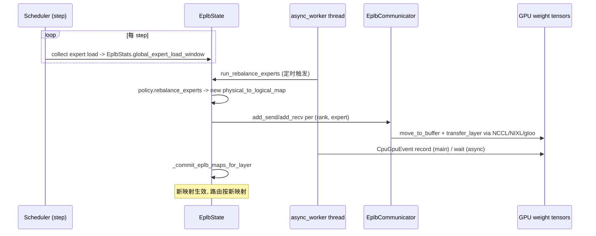

# eplb/ — Expert Parallelism Load Balancer

[← Wiki 首页](../README.md) > [分布式](../README.md) > eplb

源码根：`vllm/distributed/eplb/`（`__init__.py` 仅 docstring "Expert parallelism load balancer (EPLB)."；`eplb_state.py`、`eplb_communicator.py`、`eplb_utils.py`、`rebalance_execute.py`、`async_worker.py`、`policy/`）。本子包实现 MoE expert parallelism 的负载均衡：根据各 expert 负载统计重排物理 expert 副本到 EP rank，让高负载 logical expert 多副本分散、低负载合并，并把权重跨 rank 搬迁。算法改编自 [DeepSeek EPLB](https://github.com/deepseek-ai/eplb)。在 [elastic-ep](elastic-ep.md) 扩缩容后与定期重排场景下使用。

## 是什么

### 术语（`eplb_state.py:7` 起）

- **Logical Expert**：模型结构的 expert，持一份权重。
- **Redundant Expert**：为均衡对高负载 logical expert 增加的副本（同权重，多 rank 各持一份，路由可分担）。
- **Physical Expert**：实例化在某 device 的 expert，某个 logical 的副本。`num_replicas = num_logical + num_redundant`。
- **Local Physical Expert**：本 rank 持有的 physical expert。
- 例：DeepSeek-R1 256 logical + 32 redundant = 288 physical；EP=32 时每 rank 9 local。

### 数据类

- `EplbStats`（`eplb_state.py:64`）：`global_expert_load_window` 形状 `(window_size, num_moe_layers, num_physical_experts)`、`num_replicas`/`num_groups`/`num_nodes`/`num_gpus`。
- `EplbModelState`（`:93`）：`physical_to_logical_map: (num_moe_layers, num_physical_experts)`、`logical_to_physical_map: (num_moe_layers, num_logical_experts, num_redundant+1)`（`-1` 无映射）。

### EplbState（`:219`）/ EplbLayerState（`:1029`）

`EplbState`：模型级 EPLB 状态与调度。维护统计窗口、`EplbCommunicator` 实例（`create_eplb_communicator`）、`AsyncEplbLayerResult` 协调、与 eplb policy 交互。`EplbLayerState`：单层状态，参与 `_commit_eplb_maps_for_layer`（`:1187`）。

### policy/

- `AbstractEplbPolicy(ABC)`（`policy/abstract.py:9`）：`@classmethod @abstractmethod rebalance_experts(weight, num_replicas, num_groups, num_nodes, num_ranks, old_global_expert_indices=None) -> physical_to_logical_map: [layers, num_replicas]`。
- `DefaultEplbPolicy(AbstractEplbPolicy)`（`policy/default.py:21`）：实现 DeepSeek 算法。`balanced_packing(weight, num_packs)` 把 n 个 weighted object 装入 m packs（每组 n/m 个、各 pack 权重尽量均衡）；按 weight 降序、贪心放当前最轻 pack。注释 `default.py:11` 指向 deepseek-ai/EPLB issue #12 示例。
- `EPLB_POLICIES`（`policy/__init__.py`）：注册表，按 `EPLBPolicyOption` 选择。

### eplb_communicator.py（776 行）

`EplbCommunicator(ABC)`（`:45`）+ 多实现：
- `TorchDistNcclEplbCommunicator`（`:98`）：基于 `torch.distributed` NCCL P2P。
- `TorchDistGlooStagedEplbCommunicator`（`:155`）：staged gloo 路径，避免与 MoE 前向 collectives 死锁。
- `NixlEplbCommunicator`（`:241`）：基于 [NIXL](nixl-utils.md)，RDMA 高吞吐；`has_nixl()` 探测。
- `PyNcclEplbCommunicator`（`:614`）：基于 [PyNcclCommunicator](device-communicators/pynccl.md)。
- `create_eplb_communicator(...)`（`:658`）：工厂，按 `parallel_config.eplb_config.communicator ∈ {"torch_nccl","torch_gloo_staged","nixl","pynccl"}` 实例化。

API：`add_send(tensors, dst_rank, expert_id)`/`add_recv(...)`/`commit()`/`destroy()` 等。

### rebalance_execute.py

- `TransferMetadata`（`:24`）/ `AsyncEplbLayerResult`（`:42`）：异步重排层结果。
- `get_ep_ranks_with_experts_batch(...)`（`:65`）：批量取出某层哪些 expert 在哪些 rank。
- `move_to_buffer(...)`/`move_from_buffer(...)`（`:172`/`:350`）：把权重经 staging buffer 跨 rank 搬。
- `transfer_layer(...)`（`:427`）：单层迁移协调。
- `rearrange_expert_weights_inplace(...)`（`:511`）：原地重排（新映射等于旧映射可省）。
- `_map_old/new_expert_indices_with_rank_mapping`（`:618`/`:671`）：新旧映射对照。

### async_worker.py / eplb_utils.py

- `start_async_worker(...)`（`async_worker.py:24`）：启动后台线程做周期性重排。
- `run_rebalance_experts(...)`（`:50`）/ `transfer_run_periodically(...)`（`:76`）。
- `CpuGpuEvent`（`eplb_utils.py:16`）：跨线程 record→wait 事件（CPU `threading.Event` + CUDA Event 复合，解决 CUDA event 未 record 时 wait 是 no-op 的问题）。
- `override_envs_for_eplb(parallel_config, moe_backend)`（`:64`）：DeepGEMM mega moe cooperative launch 与 NCCL 抢 SM 会死锁，DP+eplb+nccl 通信器+mega_moe 时设 `NCCL_MAX_CTAS=8` 留 SM 余地（注释 `:84`）。

## 为什么

- **MoE 负载不均**：热门 expert（如代码生成）被打多、冷门 expert 闲；不重排会让热 rank 成瓶颈。DeepSeek EPLB 算法用 redundant 副本 + balanced_packing 把负载均匀到 rank。
- **冗余副本定价**：`num_redundant_experts` 是显存/吞吐 tradeoff——多副本省路由排队、占显存。
- **DeepSeek 算法适配**：vLLM 直接复刻其 `balanced_packing`（注释 `default.py:8`），保证跨实现结果一致；用户也可经 `EPLBPolicyOption` 注册自定义 policy。
- **多通信后端**：NCCL/PyNccl 适合中等规模；NIXL 适合跨节点大模型（DeepSeek-R1 256 expert）；gloo_staged 适合与 MoE 前向 collectives 解耦（防死锁）。
- **EPLB 独立 PG**：[parallel-state](parallel-state.md) 给 EPLB 单建 PG 与 EP 同 ranks 但独立，正是为防"重排通信与 MoE 前向 all2all 同 PG 阻塞"死锁（见 `parallel_state.py:1918` 注释）。
- **staged gloo**：当 NCCL 资源被 MoE all2all 占满，gloo staged 让 EPLB 通信走 CPU 侧分阶段，规避 contention。
- **NCCL_MAX_CTAS override**：DeepGEMM mega moe cooperative launch 要占满 SM；NCCL 也用 SM；二者争用死锁。`override_envs_for_eplb` 在该组合下自动设 `NCCL_MAX_CTAS=8` 限制 NCCL 占用（注释 `:84-90`）。
- **async 周期重排**：负载是慢变量，每 N 秒重排即可，不必每 step；`async_worker` 后台线程 + `CpuGpuEvent` 保证 GPU 重排与 CPU 决策同步。
- **CpuGpuEvent**：CUDA event 未 record 时 `wait()` 是 no-op（不阻塞），跨线程会出错；`CpuGpuEvent` 复合 CPU `threading.Event` 保证"先 record 后 wait"语义（注释 `:25`）。
- **inplace 重排**：新映射与旧映射相同时 expert 不必迁；`_map_old/new_expert_indices_with_rank_mapping` 让"同 rank 内移动"省去跨 rank 传输。
- **elastic_ep 集成**：扩缩容后必须重排（rank 数变）；`EPLB_RESHUFFLE` 状态调本子包。

## 怎么做

### 周期性重排（async worker）

### 扩缩容后重排（elastic-ep）

`elastic_ep.EPLB_RESHUFFLE` 阶段调 `rearrange_expert_weights_inplace` + `EplbCommunicator`，与扩缩容权重迁移阶段（`TRANSFER_WEIGHTS`）共用底层通信。

### Communicator 选择

`create_eplb_communicator(parallel_config, ...)`：`communicator ∈ {"torch_nccl","torch_gloo_staged","nixl","pynccl"}`；NIXL 需 `has_nixl()`；多节点优先 NIXL；同节点 NCCL/Pynccl 即可；mega_moe 死锁场景可切 gloo_staged。

## 与其它模块/系统配合

- **[parallel-state](parallel-state.md)**：`get_eplb_group`（独立 PG）；`_init_stateless_group`（elastic 路径）；`in_the_same_node_as`/`get_node_count` 决定通信后端选择。
- **[elastic-ep](elastic-ep.md)**：`EPLB_RESHUFFLE` 阶段消费者；`make_eep_staged_quant_method` 适配量化。
- **[nixl-utils](nixl-utils.md)**：`NixlEplbCommunicator` 依赖。
- **[device-communicators/pynccl](device-communicators/pynccl.md)**：`PyNcclEplbCommunicator` 依赖。
- **[03-model-execution](../03-model-execution/README.md)**：`FusedMoE` 层路由按 `physical_to_logical_map`；`rearrange_expert_weights_inplace` 经 model_executor 触达权重张量。
- **[01-engine-core](../01-engine-core/README.md)**：scheduler 每步采 expert load（`RoutedExpertsManager`/`enable_return_routed_experts`）入 `EplbStats`；async worker 后台触达 worker。
- **[10-config](../10-config/README.md)**：`ParallelConfig.enable_eplb`/`EPLBConfig.communicator`/`EPLBPolicyOption`。
- **[08-platforms](../08-platforms/README.md)**：`is_rocm()` 影响 NIXL vs RIXL。
- **[16-observability](../16-observability/README.md)**：EplbStats 与重排事件可入指标。

## 历史版本演进

- **v0.9**：`eplb/` 引入；`DefaultEplbPolicy` (DeepSeek 算法)；`NixlEplbCommunicator`/`TorchDistNcclEplbCommunicator`；EPLB 独立 PG。
- **v0.10**：`async_worker` 周期重排；`CpuGpuEvent` 跨线程同步；`PyNcclEplbCommunicator`；`override_envs_for_eplb` NCCL_MAX_CTAS。
- **v0.11/v0.12/main**：`TorchDistGlooStagedEplbCommunicator`（mega_moe 死锁解）；`EPLBPolicyOption` 注册；与 elastic_ep + EPLB_RESHUFFLE 完整闭环；多节点 TP/PP+EPLB 持续突破（待核实）。

[← 返回分布式首页](../README.md)

## 参见

- [elastic-ep.md](elastic-ep.md) — `EPLB_RESHUFFLE` 阶段编排。
- [parallel-state.md](parallel-state.md) — EPLB 独立 PG 来源。
- [nixl-utils.md](nixl-utils.md) / [device-communicators/pynccl.md](device-communicators/pynccl.md) — 通信后端依赖。
