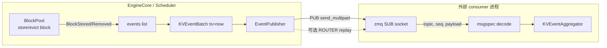

# kv_events.py — KV 缓存事件与外部发布

[← Wiki 首页](../README.md) > [分布式](../README.md) > kv-events

源码：`vllm/distributed/kv_events.py`（约 537 行）。本文件把 vLLM 内部的 KV block 生命周期（存储/驱逐/清空）抽象成可对外发布的事件流，供外部 KV cache consumer（如 [LMCache](kv-transfer/lmcache.md)、Prefix Cache 服务）按 at-least-once 语义订阅。它和 `kv_transfer/` 是平行互补关系：`kv_transfer` 做块级数据面搬运，`kv_events` 做控制面事件通知。

## 是什么

### 事件类型（msgspec.Struct）

- `EventBatch`（`:25`）：`ts: float`、`events: list[Any]`、`data_parallel_rank: int | None`。所有发布批次的基础容器。
- `KVCacheEvent`（`:36`）：tagged base，`omit_defaults=True`、`gc=False`。
- `BlockStored`（`:48`）：block 被写入 KV cache。字段含 `block_hashes`、`parent_block_hash`、`token_ids`、`block_size`、`medium`（"GPU"/其它）、`lora_name`、`extra_keys`（MM hash、cache_salt、prompt embedding hash 等，逐 block 一项）、`group_idx`、`kv_cache_spec_kind`、`kv_cache_spec_sliding_window`。
  - `lora_id` 字段已 deprecated（注释 `:55`），保留向后兼容。
  - `__hash__` 把全部字段 tuple 化以便 dedup。
- `BlockRemoved`（`:92`）：block 被驱逐，含 `block_hashes`、`medium`、`group_idx`。
- `AllBlocksCleared`（`:107`）：全体清空（reset）。
- `KVEventBatch(EventBatch)`（`:111`）：`events: list[BlockStored|BlockRemoved|AllBlocksCleared]`。

### 聚合器 KVEventAggregator（`:115`）

跨 worker 聚合事件，**只保留所有 worker 都报告过的事件**（common events）。API：`add_events`/`get_common_events`/`get_all_events`/`clear_events`/`increment_workers`/`reset_workers`/`get_number_of_workers`。基于 `Counter` + 期望 worker 数判定。DP 下各 DP rank 独立维护 block，故需"全员一致"才视为权威事件。

### KVConnectorKVEvents（`:202`）

KV connector 实现的事件协议抽象：`add_events`/`aggregate`/`increment_workers`/`get_all_events`/`get_number_of_workers`/`clear_events`/`merge`。`LMCacheConnectorV1` 内的 `LMCacheKVEvents`（`lmcache_connector.py:34`）即其默认实现，包装 `KVEventAggregator`。

### EventPublisher 体系

- `EventPublisher`（`:237`，ABC）：`publish(events: EventBatch)`（at-least-once、单调序）+ `shutdown`。构造接 `data_parallel_rank`，注释 `:240` 说明"DP 下每 rank 独立 publisher + 标注 dp_rank，scheduler 不感知 DP"。
- `NullEventPublisher`（`:268`）：默认 no-op。
- `ZmqEventPublisher`（`:278`）：可靠 PUB/ROUTER + 内存 replay buffer。参数 `endpoint`（PUB，绑/连启发式：含 `*`/`::`/`ipc://`/`inproc://` 则 bind）、`replay_endpoint`（可选 ROUTER，供订阅者按 8B 大端起始序号请求回放）、`buffer_steps=10000`、`hwm=100000`、`max_queue_size=100000`。独立 daemon 线程 `zmq-publisher`：循环 poll replay socket → 从 `Queue` 取事件 → `msgspec.msgpack` 编码 → `pub.send_multipart((topic, seq_bytes, payload))` → 入 `_buffer`。`offset_endpoint_port`（`:472`）按 `dp_rank` 偏移端口避免多 DP 冲突。
- `EventPublisherFactory`（`:505`）：`register_publisher(name, ctor)` + `create(name, config, data_parallel_rank)`。

## 为什么

- **解耦控制面/数据面**：LMCache/外部 cache 不要做 NCCL 搬运，只需知道"哪些 block 存在/被驱逐"即可建立索引，再去自己的存储里取；事件流是最小契约。
- **DP 一致性**：同 DP 组各 rank 维护不同 block 副本，但对外应只广播"全员都存的"——`KVEventAggregator` 的 common-events 语义解决。
- **at-least-once + replay**：订阅者可能晚到/断线，`ZmqEventPublisher` 的 ROUTER replay socket + `_buffer` deque 让其按序号补播；`END_SEQ=(-1).to_bytes(8, big, signed=True)` 标记回放结束。
- **DP rank 标注**：scheduler 不知道 DP 拓扑（参见 [01-engine-core](../01-engine-core/README.md)），publisher 在 `publish` 时自动注入 `data_parallel_rank`，让下游能区分来源、避免把不同 DP 的 block 当成同一份。
- **msgspec + gc=False**：高频事件（每 step 多 block）需低开销编码，`msgspec.msgpack` + `array_like=True`/`omit_defaults=True` 优于 JSON。
- **端口隔离**：多 DP rank 共用主机时 `offset_endpoint_port` 按 dp_rank 偏移，避免 PUB/ROUTER 端口冲突。

## 怎么做

### 发布链路



### Worker 侧聚合（LMCacheKVEvents 示例）

```python
# 各 worker connector 收到本地 events
self._aggregator.add_events(local_events)
# full_aggregate 时
common = self._aggregator.get_common_events()
self._aggregator.clear_events(); self._aggregator.add_events(common)
self._aggregator.reset_workers()
```

### Replay 流程

订阅者丢失某段时，向 `replay_endpoint`（ROUTER）发送 `start_seq`（8B big-endian）；publisher `_service_replay`（`:448`）从 `_buffer` 找 `seq >= start_seq` 的所有 `(seq, buf)`，按 `[client_id, b"", seq_bytes, buf]` 流式回送，最后发 `END_SEQ`。

## 与其它模块/系统配合

- **[kv-transfer/lmcache](kv-transfer/lmcache.md)**：`LMCacheConnectorV1` 内 `LMCacheKVEvents` 包装 `KVEventAggregator`，并经 `get_kv_connector_kv_cache_events()` 暴露给 scheduler。
- **[01-engine-core](../01-engine-core/README.md)**：`BlockPool` 在 store/evict 时构造事件，scheduler `take_events` 把事件交给 connector。
- **[15-kv-cache-offload](../15-kv-cache-offload/README.md)**：外部 KV 服务以本事件流为权威索引。
- **[16-observability](../16-observability/README.md)**：publisher stats、`buffer_steps` 命中率可作为可观测输出（待补充具体 metric 名）。
- **DP coordinator**：多个 DP rank 的 publisher 用 `data_parallel_rank` 区分；engine 侧 scheduler 不感知 DP（见 `:240` 注释）。

## 历史版本演进

- **v0.7（v1）**：事件体系引入，初版仅 `BlockStored`/`BlockRemoved`，PUB 用裸 zmq。
- **v0.8**：`AllBlocksCleared` 加入；`ZmqEventPublisher` 引入 ROUTER replay + `buffer_steps`；`offset_endpoint_port` 按 DP rank 偏移。
- **v0.9**：`extra_keys` 字段加入（MM hash、cache_salt、prompt embedding），让外部 consumer 能重建 `ExternalBlockHash`；`medium: GPU` 区分 KV 存储介质。
- **v0.10**：`group_idx`/`kv_cache_spec_kind`/`kv_cache_spec_sliding_window` 加入以支持 HMA 多 spec 组（注释 `:69`）；`lora_id` 标 deprecated。
- **v0.11/v0.12/main**：`KVConnectorKVEvents` 抽象稳定，被多 connector 复用；replay buffer 容量与 `hwm` 调优仍在迭代（待核实）。

[← 返回分布式首页](../README.md)

## 参见

- [kv-transfer/lmcache.md](kv-transfer/lmcache.md) — 主要消费者。
- [kv-transfer/base.md](kv-transfer/base.md) — `get_kv_connector_kv_cache_events` 协议。
- [15-kv-cache-offload](../15-kv-cache-offload/README.md) — 外部 KV 服务的总览。
