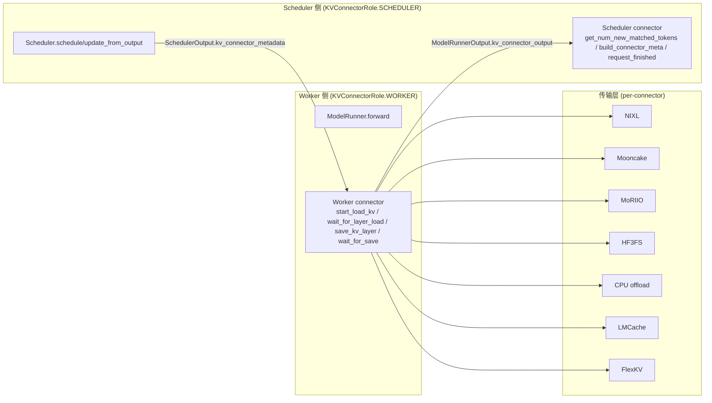

# kv-transfer/ — KV 缓存迁移子模块

[← Wiki 首页](../../README.md) > [分布式](../README.md) > kv-transfer

源码根：`vllm/distributed/kv_transfer/`。本子模块实现 vLLM 跨实例的 KV cache（及部分 hidden states）迁移，主要用途是** disaggregated prefilling**：prefill worker 算完 prompt 的 KV 后推给 decode worker，decode worker 跳过 prefill 直接 decode，从而把长 prefill 与高 QPS decode 解耦在两套 GPU 上。它也支持 prefix cache 共享、KV 卸载到 CPU/SSD、外部 KV store（LMCache/FlexKV/Mooncake/3FS 等）。

## 三层抽象

按 `kv_transfer/README.md`：

- **KV pipe**：张量传输 FIFO（`send_tensor`/`recv_tensor`）。可被跳过——若分布式通信服务本身支持 KV 查找（如 redis/RDMA DB）。
- **KV lookup buffer**：token→KV 的查找缓冲（`insert`/`drop_select`）。解决"prefill 与 decode 请求处理顺序不同步"——FIFO 不足以按 token 回查。
- **KV connector**：把 KV pipe + lookup buffer 接到 vLLM 调度/前向生命周期。这是 v1 当前主抽象（`KVConnectorBase_V1`）。

## v1 connector 协议要点

- **双角色分离**：`KVConnectorRole.SCHEDULER`（伴随 scheduler 进程，决策"哪些请求要迁移、迁移多少"）与 `KVConnectorRole.WORKER`（伴随 worker 进程，实际收发 KV 张量）。`KVConnectorFactory.create_connector` 按 `role` 构造同一类的不同实例，类内通过 `self._role` 分支。
- **生命周期钩子**（见 [base.md](base.md)）：`get_num_new_matched_tokens`/`update_state_after_alloc`/`build_connector_meta`（scheduler 侧）；`register_kv_caches`/`start_load_kv`/`wait_for_layer_load`/`save_kv_layer`/`wait_for_save`/`get_finished`/`get_block_ids_with_load_errors`/`shutdown`（worker 侧）。
- **HMA 支持**：`SupportsHMA` mixin 标识支持 Hybrid Memory Allocator（混合多 spec KV cache）。`request_finished_all_groups` 替代 `request_finished`，按组异步释放。
- **Handshake metadata**：P/D worker 间带外握手（`get_handshake_metadata`/`set_xfer_handshake_metadata*`），传 NIXL agent 元数据/端口/TP 映射等。
- **stats/events**：`get_kv_connector_stats`/`get_kv_connector_kv_cache_events`（对接 [kv-events](../kv-events.md)）。

## 全局单例

`kv_transfer_state.py`（`vllm/distributed/kv_transfer/`）维护 `_KV_CONNECTOR_AGENT` 单例，提供：
- `get_kv_transfer_group()` / `has_kv_transfer_group()` / `is_v1_kv_transfer_group()`。
- `ensure_kv_transfer_initialized(vllm_config, kv_cache_config)`：当 `kv_transfer_config.is_kv_transfer_instance` 时调 `KVConnectorFactory.create_connector(role=WORKER)`。注意：worker 角色先建；scheduler 侧由 [01-engine-core](../../01-engine-core/README.md) 的 Scheduler 直接持有 connector（除非走 multi-process 模式，[lmcache](lmcache.md)）。
- `_sync_engine_id_across_tp(vllm_config)`：TP/PP 组广播 `engine_id`，让同 engine 全 rank 一致。
- `ensure_kv_transfer_shutdown()`。

## 已注册 connector（`kv_connector/factory.py:152` 起）

| name | module | 类 | 说明 |
|---|---|---|---|
| `ExampleConnector` | `v1.example_connector` | `ExampleConnector` | 教学示例 |
| `ExampleHiddenStatesConnector` | `v1.example_hidden_states_connector` | `ExampleHiddenStatesConnector` | hidden states 转移示例 |
| `LMCacheConnectorV1` | `v1.lmcache_connector` | `LMCacheConnectorV1` | LMCache 单进程 |
| `LMCacheMPConnector` | `v1.lmcache_mp_connector` | `LMCacheMPConnector` | LMCache 多进程 |
| `NixlConnector` | `v1.nixl` | `NixlConnector`（=`NixlPullConnector` 别名） | NIXL pull 路径 |
| `NixlPullConnector` | `v1.nixl` | `NixlPullConnector` | NIXL pull（READ） |
| `NixlPushConnector` | `v1.nixl` | `NixlPushConnector` | NIXL push（WRITE） |
| `MultiConnector` | `v1.multi_connector` | `MultiConnector` | 组合多个子 connector |
| `MoRIIOConnector` | `v1.moriio.moriio_connector` | `MoRIIOConnector` | MoRIIO RDMA |
| `OffloadingConnector` | `v1.offloading_connector` | `OffloadingConnector` | CPU 卸载/分层 |
| `DecodeBenchConnector` | `v1.decode_bench_connector` | `DecodeBenchConnector` | decode bench 工具 |
| `MooncakeConnector` | `v1.mooncake.mooncake_connector` | `MooncakeConnector` | Mooncake RDMA |
| `MooncakeStoreConnector` | `v1.mooncake.store.connector` | `MooncakeStoreConnector` | Mooncake store API |
| `FlexKVConnectorV1` | `v1.flexkv_connector` | `FlexKVConnectorV1` | 外部 FlexKV |
| `SimpleCPUOffloadConnector` | `v1.simple_cpu_offload_connector` | `SimpleCPUOffloadConnector` | 简单 CPU offload |
| `HF3FSKVConnector` | `v1.hf3fs.hf3fs_connector` | `HF3FSKVConnector` | 3FS 文件存储 |

外部模块路径（`kv_connector_module_path`）可覆盖：vLLM 通过 `importlib.import_module` 加载用户模块并取类，要求构造函数支持 `kv_cache_config` 第三参数（factory.py:115 校验）。

## 子目录导航表

| 文档 | 简介 | 主要源码 |
|---|---|---|
| [base.md](base.md) | `KVConnectorBase_V1`/`SupportsHMA`/`KVConnectorRole` + `KVConnectorFactory` | `kv_connector/base.py`、`kv_connector/factory.py`、`kv_connector/v1/base.py` |
| [utils.md](utils.md) | `KVOutputAggregator`/`TransferTopology`/`EngineTransferInfo` + cache layout 决策 | `kv_connector/utils.py` |
| [offloading.md](offloading.md) | `OffloadingConnector` + `SimpleCPUOffloadConnector` | `v1/offloading_connector.py`、`v1/simple_cpu_offload_connector.py`、`v1/offloading/` |
| [lmcache.md](lmcache.md) | `LMCacheConnectorV1`/`LMCacheMPConnector` + LMCache 集成 | `v1/lmcache_connector.py`、`v1/lmcache_mp_connector.py`、`v1/lmcache_integration/` |
| [flexkv.md](flexkv.md) | `FlexKVConnectorV1` | `v1/flexkv_connector.py` |
| [multi.md](multi.md) | `MultiConnector` | `v1/multi_connector.py` |
| [transports/nixl.md](transports/nixl.md) | NIXL Pull/Push connector 内部 | `v1/nixl/` |
| [transports/mooncake.md](transports/mooncake.md) | Mooncake connector + store | `v1/mooncake/` |
| [transports/moriio.md](transports/moriio.md) | MoRIIO connector | `v1/moriio/` |
| [transports/hf3fs.md](transports/hf3fs.md) | HF3FS connector | `v1/hf3fs/` |

## 阅读建议

1. 第一次进入：先 [base.md](base.md) 理解协议，再到 [utils.md](utils.md) 看 cache layout 与聚合。
2. 关注 P/D：[transports/nixl.md](transports/nixl.md)（vLLM 自研主推）。
3. 关注外部 KV：[lmcache.md](lmcache.md) / [flexkv.md](flexkv.md) / [transports/mooncake.md](transports/mooncake.md) / [transports/hf3fs.md](transports/hf3fs.md)。
4. 关注分层/卸载：[offloading.md](offloading.md) 与 [15-kv-cache-offload](../../15-kv-cache-offload/README.md)。

## 与其它子系统

- [01-engine-core](../../01-engine-core/README.md)：Scheduler 持 scheduler 侧 connector；`update_from_output` 调 `update_connector_output`/`take_events`。
- [02-execution](../../02-execution/README.md)：Worker `ensure_kv_transfer_initialized`；ModelRunner 在 `forward` 前后调 worker 侧钩子。
- [15-kv-cache-offload](../../15-kv-cache-offload/README.md)：`SimpleCPUOffloadConnector` 复用 `v1/simple_kv_offload`；`OffloadingConnector` 复用 `v1/kv_offload/factory`。
- [kv-events](../kv-events.md)：`get_kv_connector_kv_cache_events` 桥接 BlockStored/Removed 事件。
- [05-attention-MLA](../../05-attention/backends/mla/README.md)：MLA spec 影响 layout；`get_kv_connector_cache_layout` 决定 HND vs NHD。
- [09-compilation-ir](../../09-compilation-ir/README.md)：`requires_piecewise_for_cudagraph` 声明 piecewise graph 需求。
- [nixl-utils](../nixl-utils.md)：NIXL/MoRIIO/EPLB 共用 NIXL 加载。

[← 返回分布式首页](../README.md)
