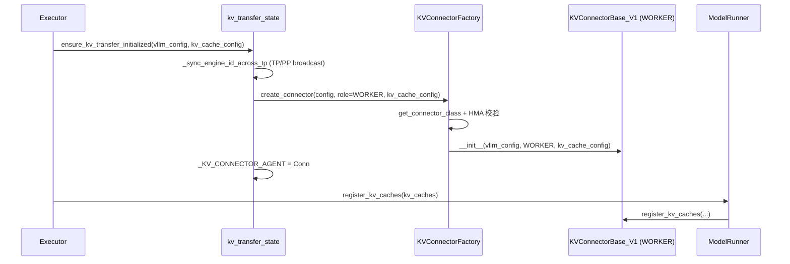
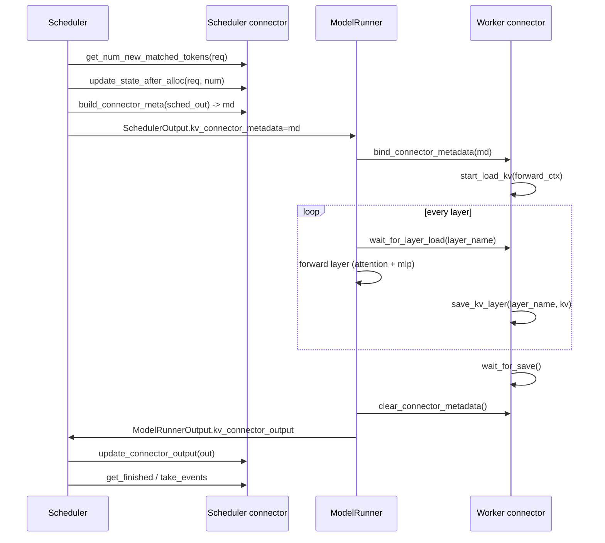

# base.py + factory.py — KV connector 协议与工厂

[← Wiki 首页](../../README.md) > [分布式](../../README.md) > [kv-transfer](README.md) > base

源码：`vllm/distributed/kv_transfer/kv_connector/base.py`（10 行别名）、`vllm/distributed/kv_transfer/kv_connector/factory.py`（242 行注册表）、`vllm/distributed/kv_transfer/kv_connector/v1/base.py`（703 行协议）。本页是 KV 迁移体系的"宪法"：定义 connector 的双角色、生命周期钩子、HMA 协议、握手/统计/事件接口，以及工厂的 lazy 注册与创建流程。所有具体 connector（[transports/*](transports/)、[offloading](offloading.md)、[lmcache](lmcache.md) 等）都实现 `KVConnectorBase_V1`。

## 是什么

### base.py：别名层

`kv_connector/base.py` 仅：
```python
from vllm.distributed.kv_transfer.kv_connector.v1 import KVConnectorBase_V1
KVConnectorBase = KVConnectorBase_V1
KVConnectorBaseType = KVConnectorBase_V1
```
为兼容旧 import 路径保留。

### v1/base.py：协议层

#### 枚举与抽象数据类

- `SupportsHMA(ABC)`（`:85`）：标识 connector 支持 Hybrid Memory Allocator（混合多 spec KV）。需实现 `request_finished_all_groups(request, block_ids) -> (bool, dict|None)`——所有 KV cache group 完成后调用一次；返回 `(async_saving, kv_transfer_params)`，`True` 表示异步保存、blocks 暂不释放直到 `get_finished` 返回。
- `supports_hma(connector)`（`:117`）：`isinstance`/`issubclass` 判定。
- `KVConnectorRole(enum)`（`:124`）：`SCHEDULER=0`、`WORKER=1`。
- `KVConnectorHandshakeMetadata`（`:132`）：P/D 带外握手元数据基类（可序列化）。
- `KVConnectorMetadata`（`:141`）：scheduler→worker 单步元数据基类。
- `KVConnectorWorkerMetadata`（`:150`）：worker→scheduler 回流元数据基类，含 `aggregate(other)` 方法（多 worker 聚合到一个）。

#### KVConnectorBase_V1（`:171`）

抽象基类。属性 `prefer_cross_layer_blocks`（默认 False，示意是否偏好"一 tensor 跨所有层"的 KV 数据布局，可加速传输）。`__init__(vllm_config, role, kv_cache_config)`（`:184`）：装 `_vllm_config`/`_kv_transfer_config`/`_kv_cache_config`/`_role`；警告"This API is experimental"。

**Worker 侧方法**：
- `bind_connector_metadata(md)`/`clear_connector_metadata()`/`has_connector_metadata()`/`_get_connector_metadata()`：每 forward 前 model runner 绑定、forward 后清。
- `register_kv_caches(kv_caches: dict[layer_name, Tensor])`：注册本 rank 的 KV 张量表（NIXL 等需预注册）。
- `register_cross_layers_kv_cache(kv_cache, attn_backend)`：`prefer_cross_layer_blocks=True` 时被调用，单 tensor 含 `num_layers`。
- `set_host_xfer_buffer_ops(CopyBlocksOp)`：设置 host↔device 拷贝算子（NIXL 用）。
- `handle_preemptions(md)`：抢占地 connector 异步保存中受影响请求的处理。
- `@abstractmethod start_load_kv(forward_context, **kwargs)`：开始异步加载（在 forward 前）。
- `@abstractmethod wait_for_layer_load(layer_name)`：阻塞等某层 KV 加载完成（layerwise 同步）。
- `@abstractmethod save_kv_layer(layer_name, kv_layer)`：异步保存某层 KV。
- `@abstractmethod wait_for_save()`：阻塞等所有保存完成（forward 结束时）。
- `get_finished(finished_req_ids) -> set[str]`：返回异步传输完成的 req id。
- `get_block_ids_with_load_errors() -> set[int]`：加载失败的 block 集合（scheduler `_handle_invalid_blocks` 消费）。
- `shutdown()`。

**Scheduler 侧方法**：
- `@abstractmethod get_num_new_matched_tokens(request, num_computed_tokens)`：返回"可从远端免费拿到的 token 数"（决定 scheduler 跳过 prefill）。
- `@abstractmethod update_state_after_alloc(request, num_computed_tokens)`：分配 block 后调用，决定是否触发异步加载。
- `@abstractmethod build_connector_meta(scheduler_output) -> KVConnectorMetadata`：构造本步 metadata（不修改 scheduler_output）。
- `on_new_request(request)`、`update_connector_output(connector_output)`、`request_finished(request) -> (bool, dict|None)`、`take_events() -> Iterable[KVCacheEvent]`、`has_pending_push_work()`。

**类方法与钩子**：
- `get_required_kvcache_layout(vllm_config) -> str | None`：返回 `"HND"`/`"NHD"` 等，影响 [03-model-execution](../../03-model-execution/README.md) 的 KV 布局。
- `requires_piecewise_for_cudagraph(extra_config) -> bool`：声明是否需 piecewise CUDA graph。
- `get_finished_count() -> int|None`：供 `KVOutputAggregator` 用。
- `build_kv_connector_stats`/`build_prom_metrics`/`reset_cache`/`set_xfer_handshake_metadata*`/`get_handshake_metadata`/`build_connector_worker_meta`/`bind_gpu_block_pool`。

### factory.py：注册与创建

`KVConnectorFactory`（`:27`）：
- `_registry: dict[str, Callable[[], type[KVConnectorBase]]]`：name→lazy loader（`importlib.import_module(module_path)` + `getattr(class_name)`）。
- `register_connector(name, module_path, class_name)`：保证唯一；放入 loader。
- `create_connector(config, role, kv_cache_config) -> KVConnectorBase`：
  1. 校验 `kv_transfer_config` 非 None；
  2. `get_connector_class` 解析类（含外部 module_path 覆盖 + `supports_kw` 校验 3 参构造）；
  3. HMA 校验：`hma_enabled = not disable_hybrid_kv_cache_manager`；若开但 connector 不支持 HMA → raise（提示 `--disable-hybrid-kv-cache-manager`）；
  4. 日志：connector 名 + engine_id；构造类返回。
- `get_connector_class_by_name(name)`、`get_connector_class(kv_transfer_config)`、`supports_hma_config(kv_transfer_config)`（`MultiConnector` 特判：`all_children_support_hma`）。

注册表见 [README.md](README.md) 表。

### kv_transfer_state.py 单例

`_KV_CONNECTOR_AGENT` 模块级单例（`get_kv_transfer_group`/`has_kv_transfer_group`/`is_v1_kv_transfer_group`/`ensure_kv_transfer_initialized`/`ensure_kv_transfer_shutdown`），由 [02-execution](../../02-execution/README.md) 在 worker 启动时调；`_sync_engine_id_across_tp` 经 TP/PP 组广播 `engine_id`。

## 为什么

- **双角色强制分离**：scheduler 不应有任何张量操作；worker 不应做调度决策。同一类按 `role` 分支让协议集中、避免两个类 drifted。
- **layerwise 协议**：`wait_for_layer_load(layer_name)` + `save_kv_layer(layer_name)` 让 PD 转移与模型 layer-by-layer 前向重叠——前一 layer 在加载/保存时，模型可算下一 layer 的 attention（`prefer_cross_layer_blocks` 加速此过程）。
- **HMA mixin**：HMA 启用时 `BlockPool` 按多 spec 组管理；connector 必须按组释放，故 `request_finished_all_groups` 替代 `request_finished`。`SupportsHMA` 让 factory 在创建时静态校验配置兼容。
- **`get_required_kvcache_layout`**：NIXL/HND 在大 KV 段传输更快；connector 声明所需 layout，scheduler/model loader 据此选 block 结构，避免运行时 reshape。
- **piecewise 声明**：`requires_piecewise_for_cudagraph` 让 [09-compilation-ir](../../09-compilation-ir/README.md) 切到 piecewise 模式以容纳 layerwise 同步；不让全局 graph 捕获失败。
- **lazy 注册**：每个 connector 模块加载可能拉入 NIXL/Mooncake/3FS 重依赖；factory 仅在创建时 import 对应模块，避免单机/未装依赖时启动失败。
- **外部 module_path 覆盖**：用户可写自有 connector 不入 vLLM 仓，靠 `kv_connector_module_path` + `kv_connector` 指向；factory 校验 3 参构造签名（`supports_kw(kv_cache_config)`）防止旧 API 滥用。
- **HMA 校验特判 Multi**：`MultiConnector` 自身实现 `SupportsHMA` 但子 connector 可能不支持；`all_children_support_hma` 递归校验。

## 怎么做

### Worker 初始化时序



### 每 step 协议（layerwise）



### 创建选择（factory）

`get_connector_class` 优先级：`kv_connector_module_path`（外部）> registry（内部）> 报错。`supports_hma_config`：非 Multi 直接 `supports_hma(cls)`；Multi 调 `MultiConnector.all_children_support_hma`。

## 与其它模块/系统配合

- **[README](README.md)** / 各 transport 页：协议的具体实现。
- **[utils](utils.md)**：`KVOutputAggregator`/`TransferTopology`/`get_kv_connector_cache_layout` 配合。
- **[01-engine-core](../../01-engine-core/README.md)**：Scheduler 是 scheduler 侧 connector 的拥有者；`_handle_invalid_blocks` 消费 `get_block_ids_with_load_errors`。
- **[02-execution](../../02-execution/README.md)**：`ensure_kv_transfer_initialized` 在 worker 启动序列；ModelRunner 在 forward 前后调 worker 钩子。
- **[03-model-execution](../../03-model-execution/README.md)**：ModelLoader 按 `get_required_kvcache_layout` 选布局。
- **[09-compilation-ir](../../09-compilation-ir/README.md)**：`requires_piecewise_for_cudagraph` 触发 piecewise 模式。
- **[kv-events](../kv-events.md)**：`get_kv_connector_kv_cache_events` 桥接 BlockStored/Removed。
- **[05-attention-MLA](../../05-attention/backends/mla/README.md)**：MLA/SlidingWindow spec 在 connector 注册时声明 attention backend。
- **[10-config](../../10-config/README.md)**：`KVTransferConfig`（`kv_connector`/`kv_role`/`engine_id`/`kv_connector_extra_config` 等）。

## 历史版本演进

- **早期（v0.5/v0.6）**：v0 KV connector（`KVConnectorBase`）单角色、单传输（PyNcclBasedConnector）。`kv_transfer/README.md` 三层抽象（KV pipe/lookup/connector）此时定型。
- **v0.7（v1）**：`KVConnectorBase_V1` 双角色协议落地；`SupportsHMA` mixin；layerwise `wait_for_layer_load`/`save_kv_layer`。`KVConnectorFactory` lazy 注册。
- **v0.8**：NIXL pull connector 进 registry；`get_required_kvcache_layout`（HND）；`set_xfer_handshake_metadata*` 握手协议。
- **v0.9**：Mooncake/MoRIIO/HF3FS/FlexKV 接入；`get_block_ids_with_load_errors` + scheduler `_handle_invalid_blocks`；`MultiConnector` 支持 HMA 校验。Push connector（NixlPushConnector）加入。
- **v0.10/v0.11**：`OffloadingConnector`/`SimpleCPUOffloadConnector` 重构为 v1 协议 + 复用 `v1/kv_offload/factory`；`LMCacheMPConnector` 多进程；`requires_piecewise_for_cudagraph` 接入编译子系统。
- **v0.12/main**：external module_path 覆盖 + 3 参构造校验；HMA 校验在各 connector 完成度提升；`get_finished_count`/`has_pending_push_work` 闭环（待核实具体版本）。

[← 返回 kv-transfer 首页](README.md)

## 参见

- [utils.md](utils.md) — 聚合与 layout。
- [transports/nixl.md](transports/nixl.md) — 主推 connector 的协议实现。
- [multi.md](multi.md) — 组合协议。
- [kv-events.md](../kv-events.md) — 事件协议桥接。
