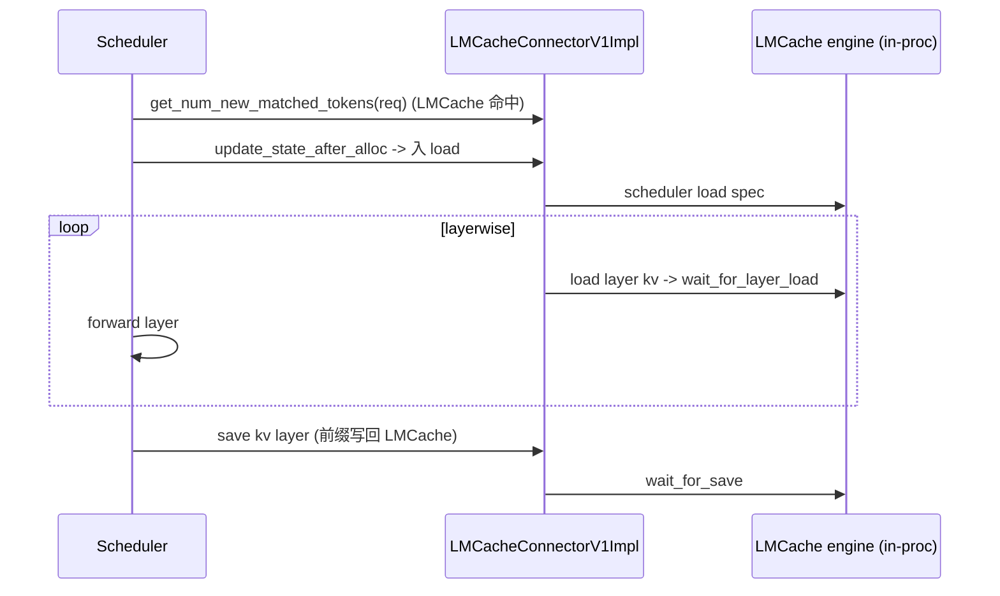

# lmcache_connector + lmcache_mp_connector — LMCache 集成

[← Wiki 首页](../../README.md) > [分布式](../../README.md) > [kv-transfer](README.md) > lmcache

源码：
- `vllm/distributed/kv_transfer/kv_connector/v1/lmcache_connector.py`（354 行）
- `vllm/distributed/kv_transfer/kv_connector/v1/lmcache_mp_connector.py`（多进程变体）
- `vllm/distributed/kv_transfer/kv_connector/v1/lmcache_integration/`：`vllm_v1_adapter.py`、`multi_process_adapter.py`、`utils.py`

LMCache 是第三方分布式 KV cache 管理库（CPU/SSD/远端联合）。vLLM 通过两条 connector 路径接入：单进程 `LMCacheConnectorV1`（LMCache 与 vLLM worker 同进程）与多进程 `LMCacheMPConnector`（LMCache 在独立进程，避免与 vLLM CUDA graph/NCCL 资源冲突）。两者都实现 `KVConnectorBase_V1`。

## 是什么

### LMCacheConnectorV1（`lmcache_connector.py:72`）

- `LMCacheKVEvents(KVConnectorKVEvents)`（`:34`）：包装 `KVEventAggregator`，实现 `add_events`/`aggregate`/`increment_workers`/`get_all_events`/`clear_events`/`merge`。
- `@classmethod requires_piecewise_for_cudagraph(extra_config) -> bool`（`:73`）：当 `extra_config["use_layerwise"]=True` 时返回 True——layerwise 模式下 `wait_for_layer_load`/`save_kv_layer` 含真实异步同步，不能进全局 graph。
- `__init__(vllm_config, role, kv_cache_config)`：`super().__init__`；按 `role` 把工作分给 LMCache v1 adapter（`lmcache_integration/vllm_v1_adapter.py`）的 scheduler/worker 实现。
- 内部实例 `LMCacheConnectorV1Impl`（`vllm_v1_adapter.py:570`）持有 `RequestTracker`/`ReqMeta`/`LoadSpec`/`SaveSpec`/`DisaggSpec`，调度 LMCache 的 save/load。

### LMCacheMPConnector（`lmcache_mp_connector.py`）

多进程路径。`LMCacheMPRequestState(enum)`、`LMCacheMPRequestTracker`、`LMCacheMPRequestMetadata`、`LMCacheMPConnectorMetadata`、`LMCacheMPConnectorUpstream(KVConnectorBase_V1)`。

- LMCache 跑在独立进程（`LMCacheMPSchedulerAdapter`/`LMCacheMPWorkerAdapter`，`lmcache_integration/multi_process_adapter.py`），通过 ZMQ/SHM 与 vLLM worker 通信。
- vLLM 侧 `LMCacheMPConnectorUpstream` 把 v1 协议的 scheduler/worker 钩子转译成与 LMCache 进程的 IPC 消息（`LoadStoreOp` 等）。
- `ParallelStrategy(enum)`（`:83`）描述多进程并行策略。

### lmcache_integration/ 子包

- `vllm_v1_adapter.py`：单进程 adapter。`LoadSpec`/`SaveSpec`/`DisaggSpec`、`RequestTracker`、`ReqMeta`、`LMCacheConnectorMetadata`、`LMCacheConnectorV1Impl`。
- `multi_process_adapter.py`：多进程 adapter。`ParallelStrategy`、`LoadStoreOp`、`LMCacheMPSchedulerAdapter`、`LMCacheMPWorkerAdapter`。
- `utils.py`：`lmcache_get_or_create_config()`（生成 LMCache `V1Config`）、`hex_hash_to_int16`、`apply_mm_hashes_to_token_ids`、`mla_enabled(model_config)`、`create_lmcache_metadata`、`extract_mm_features` 等。

注册名：`LMCacheConnectorV1`、`LMCacheMPConnector`。

## 为什么

- **LMCache 生态完整**：LMCache 自带 CPU/SSD/远端三级 + 分布式索引，vLLM 不必重造；connector 只做协议适配。
- **两路径并存**：
  - 单进程：性能高（无 IPC），但 LMCache 与 vLLM 共 CUDA/NCCL 资源，CUDA graph/内存池可能冲突，仅适合 LMCache 自身不重度用 GPU 的场景。
  - 多进程：隔离彻底（LMCache 进程独立 CUDA context），避免与 vLLM graph 捕获冲突；代价是 IPC 延迟。`LMCacheMPConnector` 即此路。
- **`requires_piecewise_for_cudagraph`**：layerwise 模式 `wait_for_layer_load` 含真实 stream 同步，必须 piecewise；非 layerwise 模式不声明，让全局 graph 仍可用。
- **KV 事件桥接**：LMCache 把 [kv-events](../kv-events.md) 的 `BlockStored`/`BlockRemoved` 作为索引更新信号；`LMCacheKVEvents` 聚合多 worker 后交 LMCache。
- **MLA/多模态 hash**：`mla_enabled` 影响 LMCache 的 spec；`apply_mm_hashes_to_token_ids` 让多模态图片/视频的 hash 进入 block key，避免不同 mm 内容命中同 KV。
- **LMCache config 派生**：`lmcache_get_or_create_config` 从 vllm_config 推导 LMCache 需要的 `V1Config`，避免用户双份配置。
- **`hex_hash_to_int16`**：LMCache 内部用 int16 token hash 做索引压缩；从 vLLM 的 `ExternalBlockHash`（hex）转换。

## 怎么做

### 配置示例

`--kv-transfer-config '{"kv_connector":"LMCacheConnectorV1","kv_role":"kv_both"}'` + LMCache 自身 env（`LMCACHE_*`，见 [ray-integration](../ray-integration.md) env 传播含 `LMCACHE_` 前缀）。多进程用 `LMCacheMPConnector`。

### Layerwise 同步（单进程）

### 多进程 IPC

`LMCacheMPConnectorUpstream` → ZMQ/SHM → `LMCacheMPWorkerAdapter`（独立进程）→ LMCache engine。`LoadStoreOp`/`LMCacheMPRequestMetadata` 描述每步操作。

## 与其它模块/系统配合

- **[base](base.md)**：协议实现。
- **[kv-events](../kv-events.md)**：`LMCacheKVEvents` + `KVEventAggregator`。
- **[utils](utils.md)**：layout/cache layout 决策。
- **[01-engine-core](../../01-engine-core/README.md)**：scheduler 钩子；`take_events` 把 LMCache 事件回流。
- **[09-compilation-ir](../../09-compilation-ir/README.md)**：`requires_piecewise_for_cudagraph` 触发 piecewise。
- **[11-multimodal](../../11-multimodal/README.md)**：MM hash 进 block key。
- **[ray-integration](../ray-integration.md)**：`LMCACHE_` env 前缀默认复制到 Ray actor。

## 历史版本演进

- **v0.7（v1）**：`LMCacheConnectorV1` 落地，单进程、layerwise。
- **v0.8**：`lmcache_integration/` 子包成形；`LMCacheKVEvents`/`KVEventAggregator` 桥接。
- **v0.9/v0.10**：`LMCacheMPConnector` + `multi_process_adapter.py` 多进程路径；`apply_mm_hashes_to_token_ids`/`extract_mm_features` 多模态支持。
- **v0.11/v0.12/main**：`mla_enabled` + MLA spec；`requires_piecewise_for_cudagraph` 接入编译；与 LMCache 上游持续对齐（待核实）。

[← 返回 kv-transfer 首页](README.md)

## 参见

- [base.md](base.md) — 协议。
- [kv-events.md](../kv-events.md) — 事件聚合。
- [offloading.md](offloading.md) — 对比 vLLM 自研的 CPU 卸载路径。
