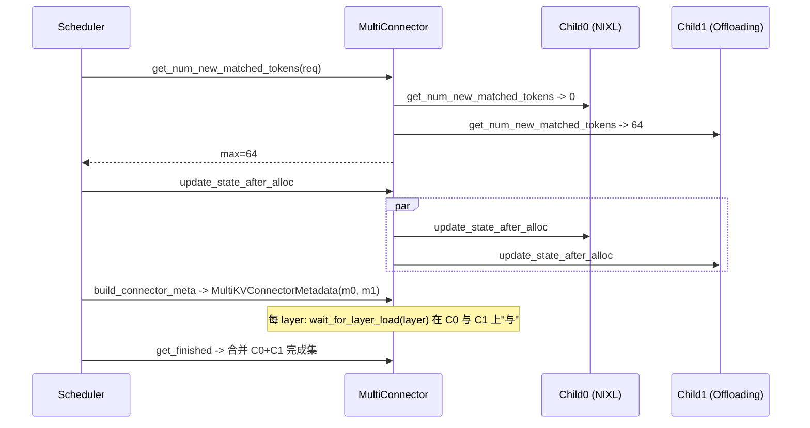

# multi_connector.py — MultiConnector

[← Wiki 首页](../../README.md) > [分布式](../../README.md) > [kv-transfer](README.md) > multi

源码：`vllm/distributed/kv_transfer/kv_connector/v1/multi_connector.py`（约 668 行）。`MultiConnector` 是一个"组合 connector"：把多个子 connector（如 `NixlConnector` + `LMCacheConnectorV1`、或 `OffloadingConnector` + `MooncakeConnector`）拧成一个 `KVConnectorBase_V1`，让 vLLM 同时享受"跨实例 P/D 转移"+"本地/外部 KV 缓存"两条路径。

## 是什么

### 数据类

- `MultiKVConnectorMetadata(KVConnectorMetadata)`（`:46`）：`metadata: tuple[KVConnectorMetadata, ...]` + `extra_async_saves: dict[str, int] | None`。scheduler→worker 通信时把所有子 connector 的 metadata 打包。
- `MultiKVConnectorWorkerMetadata(KVConnectorWorkerMetadata)`（`:52`）：`metadata: tuple[KVConnectorWorkerMetadata | None, ...]`；`aggregate(other)` 逐子项聚合（None 透传）。
- `MultiKVConnectorStats(KVConnectorStats)`（`:72`）/ `MultiKVConnectorPromMetrics(KVConnectorPromMetrics)`（`:107`）：dict 形式保存子 stats，分别展示。
- 子 connector 静态身份：`MultiChildConnector` namedtuple（概念，由 `__init__` 内部从 `kv_connector_extra_config["connectors"]` 解析），含 name + KVTransferConfig 子配置。

### MultiConnector（`:128`）

`MultiConnector(KVConnectorBase_V1, SupportsHMA)`。

`__init__(vllm_config, role, kv_cache_config)`：
- `super().__init__`；
- 从 `kv_transfer_config.kv_connector_extra_config` 读 `connectors` 列表（每项含 `kv_connector` 名 + 覆盖字段）；
- 为每子项构造子 `KVTransferConfig`（copy base，覆盖 connector 名与 extra_config）；
- 用 `KVConnectorFactory.create_connector(child_config, role, kv_cache_config)` 创建子 connector 实例；
- 装 `self._children: tuple[KVConnectorBase_V1, ...]`。

`@classmethod all_children_support_hma(cls, kv_transfer_config) -> bool`（factory 调用）：递归校验每个子 connector 是否 `supports_hma`；任一不支持即 False。

实现 `KVConnectorBase_V1` 全部钩子，语义：
- `get_num_new_matched_tokens(request, num_computed_tokens) -> int`：取所有子 connector 返回的最大值（贪心：能用最远端/最深缓存者）。
- `update_state_after_alloc`/`build_connector_meta`：对所有子 connector 调用，聚合 metadata 为 `MultiKVConnectorMetadata`。
- `on_new_request`/`update_connector_output`/`request_finished`/`take_events`/`has_pending_push_work`：广播到所有子 connector；`request_finished_all_groups`（HMA）同步广播。
- `start_load_kv`/`wait_for_layer_load`/`save_kv_layer`/`wait_for_save`：按顺序逐子 connector 调用——`wait_for_layer_load` 必须所有子都完成该层才算完成。
- `register_kv_caches`/`register_cross_layers_kv_cache`/`set_host_xfer_buffer_ops`/`handle_preemptions`：广播给所有子。
- `get_finished`：合并各子 returned 集合。
- `get_block_ids_with_load_errors`：合并各子错误集。
- `get_kv_connector_stats`/`get_kv_connector_kv_cache_events`：合并为 `Multi*Stats`/事件聚合。
- `shutdown`：逐子 shutdown。

类方法：`get_required_kvcache_layout(vllm_config)` 取子并集/兼容（取非 None 且一致者，否则 None）；`requires_piecewise_for_cudagraph(extra_config)` 任意子 True 则 True；`get_finished_count` 取子最大值。

### 注册

`KVConnectorFactory.register_connector("MultiConnector", ..., "MultiConnector")`。

## 为什么

- **多源协同**：典型 PD 部署既要做跨实例 PD（NIXL/Mooncake），又想叠加本地 CPU 卸载（OffloadingConnector）或 LMCache 索引——单 connector 不够。MultiConnector 让两者并行工作。
- **HMA 递归校验**：HMA 要求所有子都支持 `SupportsHMA`；`all_children_support_hma` 在 factory 创建时调，早失败提示用户 `--disable-hybrid-kv-cache-manager`。
- **`get_num_new_matched_tokens` 取最大**：哪个子能多省一些 token 就用谁——远端 P/D 给 0、本地缓存给 N 时，取 N。
- **`wait_for_layer_load` 全等**：某层只要任一子还在加载（如 NIXL 跨实例 + OffloadingConnector 本地恢复），模型不能进该层 attention；故"与"语义。
- **events/stats 合并**：scheduler 不应感知多子；`MultiKVConnectorStats` 字典化保留各子名字段，可观测性更好。
- **`extra_async_saves`**：各子异步保存进度不同；`MultiKVConnectorMetadata` 携带该信息让 worker 侧知道哪些 req 的某些子保存未完成。
- **layout 兼容**：子 connector 要求 layout 必须一致（都 NHD 或都 HND）；不一致 → None 让默认 NHD，子 connector 内部按需 reshape。
- **piecewise 兼容**：任一子（如 LMCache layerwise）需 piecewise 则整体 piecewise——保守。

## 怎么做

### 配置示例

`--kv-transfer-config '{"kv_connector":"MultiConnector","kv_role":"kv_both","kv_connector_extra_config":{"connectors":[{"kv_connector":"NixlPullConnector"},{"kv_connector":"OffloadingConnector","kv_connector_extra_config":{"cpu_bytes_to_use":17179869184}}]}}'`（结构待核实确切字段名，但语义如此）。

### 每 step 协议

### HMA 校验

factory `supports_hma_config`（`factory.py:131`）：非 Multi 直接 `supports_hma(cls)`；Multi 调 `MultiConnector.all_children_support_hma`，递归各子（子也可能是 Multi）。

## 与其它模块/系统配合

- **[base](base.md)**：协议实现 + `SupportsHMA` 递归校验。
- **[transports/nixl](transports/nixl.md) / [offloading](offloading.md) / [lmcache](lmcache.md) / [transports/mooncake](transports/mooncake.md)**：典型子 connector。
- **[01-engine-core](../../01-engine-core/README.md)**：scheduler 看到的是单个 connector，不感知 Multi。
- **[02-execution](../../02-execution/README.md)**：worker 侧同理。
- **[09-compilation-ir](../../09-compilation-ir/README.md)**：piecewise 由任一子决定。
- **[kv-events](../kv-events.md)**：事件合并。

## 历史版本演进

- **v0.8**：`MultiConnector` 引入，初版广播钩子。
- **v0.9**：`all_children_support_hma` + factory HMA 校验；`MultiKVConnectorWorkerMetadata.aggregate`。
- **v0.10/v0.11**：`get_required_kvcache_layout`/`requires_piecewise_for_cudagraph` 类方法对齐；`extra_async_saves` 字段；stats/prom 合并。
- **v0.12/main**：子 connector 嵌套（Multi 含 Multi）支持；HMA 协议在各子完善度提升后逐步强制（待核实）。

[← 返回 kv-transfer 首页](README.md)

## 参见

- [base.md](base.md) — 协议来源与 HMA。
- [offloading.md](offloading.md) / [transports/nixl.md](transports/nixl.md) — 典型子。
- [lmcache.md](lmcache.md) — 常与 Multi 组合使用。
