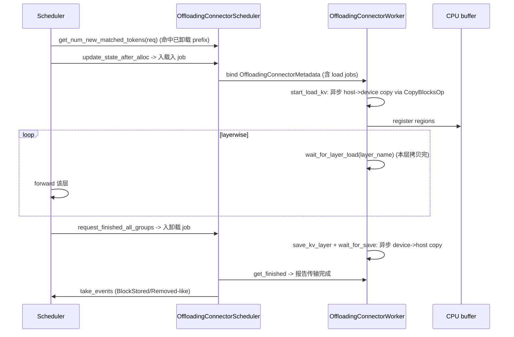

# offloading_connector + simple_cpu_offload_connector — CPU 卸载/分层 KV 连接器

[← Wiki 首页](../../README.md) > [分布式](../../README.md) > [kv-transfer](README.md) > offloading

源码：
- `vllm/distributed/kv_transfer/kv_connector/v1/offloading_connector.py`（215 行）
- `vllm/distributed/kv_transfer/kv_connector/v1/simple_cpu_offload_connector.py`（254 行）
- `vllm/distributed/kv_transfer/kv_connector/v1/offloading/`：`common.py`、`events.py`、`metrics.py`、`scheduler.py`、`worker.py`（子包）

本页两个 connector 都把本地 GPU KV cache 异步卸载到 CPU（或反向加载回 GPU），用于在显存紧张时腾出 KV 配额、又不必全量重算 prefix。二者都实现 `KVConnectorBase_V1`+`SupportsHMA`。

## 是什么

### OffloadingConnector（`offloading_connector.py:46`）

`OffloadingConnector(KVConnectorBase_V1, SupportsHMA)`。

- `prefer_cross_layer_blocks = True`（`:48`）——偏好跨层单 tensor，加速 host↔device 拷贝。
- `__init__(vllm_config, role, kv_cache_config)`：`super().__init__`；调 `OffloadingSpecFactory.create_spec(vllm_config, kv_cache_config)`（来自 `vllm/v1/kv_offload/factory`）得到卸载 spec；按 `role` 把 scheduler/worker 工作分发给 `OffloadingConnectorScheduler`（`offloading/scheduler.py`）与 `OffloadingConnectorWorker`（`offloading/worker.py`）。这两类在 `offloading/` 子包内：
  - `OffloadingConnectorMetadata`（`common.py:68`）、`OffloadingWorkerMetadata`（`common.py:76`）。
  - `TransferJob`/`TransferStats`/`DirectionalTransferStats`（`common.py`）。
  - `OffloadingConnectorScheduler`（`scheduler.py:319`）：维护 `RequestGroupState`/`RequestOffloadState`、`SchedulerOffloadConfig`/`GroupOffloadConfig`、`TransferJobStatus`；调度加载/卸载 job。
  - `OffloadingConnectorWorker`（`worker.py:33`）：执行 host↔device 拷贝、走 `CopyBlocksOp`、追踪 job 完成与错误。
  - `OffloadingEventsTracker`/`OffloadEventMetadata`（`events.py`）：发 BlockStored/Removed 风格事件，对接 [kv-events](../kv-events.md)。
  - `OffloadingConnectorStats`/`OffloadPromMetrics`（`metrics.py`）。
- 实现 `KVConnectorBase_V1` 全部抽象钩子，转发给 scheduler/worker 实例。

### SimpleCPUOffloadConnector（`simple_cpu_offload_connector.py:45`）

`SimpleCPUOffloadConnector(KVConnectorBase_V1, SupportsHMA)`。注释 `:46`：CPU KV offloading with custom kernel transfers and BlockPool LRU。

- `DEFAULT_CPU_CAPACITY_BYTES = 8 * (1024**3)`（`:42`）：默认 8 GiB CPU 配额。
- `__init__(vllm_config, role, kv_cache_config)`：
  - `super().__init__`；
  - 读 `enable_prefix_caching`；
  - 从 `kv_connector_extra_config` 取 `cpu_bytes_to_use`（默认 8 GiB）；
  - 按 `role` 创建 `SimpleCPUOffloadScheduler`（`vllm/v1/simple_kv_offload/manager.py`）或 `SimpleCPUOffloadWorker`（`.../worker.py`）+ `SimpleCPUOffloadMetadata`（`.../metadata.py`）。
- 这一套（`vllm/v1/simple_kv_offload/`）是 [15-kv-cache-offload](../../15-kv-cache-offload/README.md) 的核心，本 connector 仅作 v1 协议适配层。

二者注册名：`OffloadingConnector`、`SimpleCPUOffloadConnector`（见 [README](README.md) / [base](base.md) 表）。

## 为什么

- **显存压力释放**：长 context/高并发时 GPU KV 容易满；把低频访问的 prefix block 异步卸到 CPU，腾出 GPU 块给新请求；命中时再异步拉回。比 swap 到 SSD 快得多。
- **两条路径并存**：
  - `OffloadingConnector`：通用、分层（可扩展到 SSD/远端）、跨层 KV 友好、事件化、与 `OffloadingSpecFactory` 配合，支持多 spec 组（HMA）。
  - `SimpleCPUOffloadConnector`：复用 `v1/simple_kv_offload` 的简化实现 + BlockPool LRU；适合单组、纯 CPU、自定义 kernel 拷贝路径。
- **`prefer_cross_layer_blocks`**：跨层单 tensor 让一次 host↔device memcpy 覆盖全部层，比逐层拷贝快数倍；OffloadingConnector 显式声明，让 [utils](utils.md) 的 `TransferTopology` 走 cross-layer 路径。
- **HMA 支持**：多 spec 组（FullAttention + SlidingWindow + Mamba）需按组独立管理；`SupportsHMA` 的 `request_finished_all_groups` 让 connector 在所有组完成后才异步释放。
- **异步 job 模型**：scheduler 决定"哪些 block 卸/载"，worker 异步执行；`TransferJob`/`TransferJobStatus` 状态机让 scheduler 经 `get_finished` 知晓何时归还 block。
- **CPU 容量配额**：避免无限制卸载耗尽 CPU 内存；`cpu_bytes_to_use` extra_config + LRU 驱逐。
- **事件化**：`OffloadingEventsTracker` 把卸载/重载的 block 生命周期转成 KV 事件，让外部 consumer（LMCache 等）能同步索引。
- **复用 `kv_offload/factory`**：vLLM 已有 `v1/kv_offload/` 子系统（见 [15-kv-cache-offload](../../15-kv-cache-offload/README.md)）；`OffloadingConnector` 通过 `OffloadingSpecFactory` 复用其 spec 与拷贝路径，避免重复实现。

## 怎么做

### 异步加载/卸载时序（OffloadingConnector）

### 配置

`--kv-transfer-config '{"kv_connector":"OffloadingConnector","kv_role":"kv_both","kv_connector_extra_config":{"cpu_bytes_to_use": 17179869184}}'`（伪配置，确切字段名待核实）。`SimpleCPUOffloadConnector` 同理。

## 与其它模块/系统配合

- **[base](base.md)**：协议实现。
- **[15-kv-cache-offload](../../15-kv-cache-offload/README.md)**：`OffloadingConnector` 复用 `v1/kv_offload/factory`；`SimpleCPUOffloadConnector` 复用 `v1/simple_kv_offload`。后者本身在 15 子系统有更详尽文档。
- **[utils](utils.md)**：`TransferTopology`/`KVOutputAggregator`；`prefer_cross_layer_blocks` 影响 layout。
- **[kv-events](../kv-events.md)**：`OffloadingEventsTracker` 输出事件。
- **[01-engine-core](../../01-engine-core/README.md)**：scheduler 侧钩子消费；`_handle_invalid_blocks` 处理 load 错误。
- **[03-model-execution](../../03-model-execution/README.md)**：`CopyBlocksOp` 自定义算子做 host↔device 拷贝。
- **[09-compilation-ir](../../09-compilation-ir/README.md)**：layerwise 拷贝与 `wait_for_layer_load` 需 piecewise CUDA graph。

## 历史版本演进

- **v0.7**：`SimpleCPUOffloadConnector` 引入（v1 早期，复用 `simple_kv_offload`）。
- **v0.8/v0.9**：`OffloadingConnector` + `offloading/` 子包成形，支持多 spec/HMA、跨层、事件化。
- **v0.10**：`OffloadingSpecFactory` 接入；`TransferJob` 状态机稳定；`OffloadingEventsTracker` 对接 [kv-events](../kv-events.md)。
- **v0.11/v0.12/main**：`OffloadPromMetrics`/`OffloadingConnectorStats` 完善；与 async scheduling + `defer_block_free` 协同（待核实）。

[← 返回 kv-transfer 首页](README.md)

## 参见

- [base.md](base.md) — 协议来源。
- [15-kv-cache-offload](../../15-kv-cache-offload/README.md) — 底层卸载子系统。
- [utils.md](utils.md) — `TransferTopology` 与 cross-layer layout。
