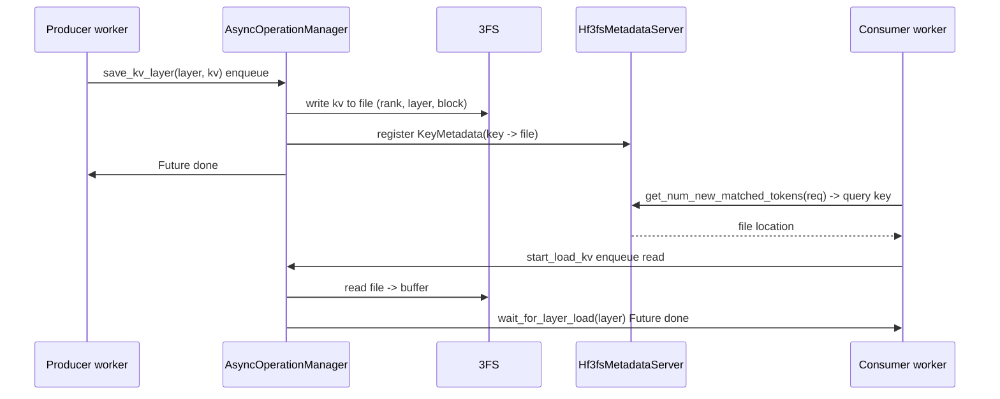

# transports/hf3fs — HF3FS KV Connector

[← Wiki 首页](../../../README.md) > [分布式](../../README.md) > [kv-transfer](../README.md) > transports/hf3fs

源码：`vllm/distributed/kv_transfer/kv_connector/v1/hf3fs/`。本子包实现 `HF3FSKVConnector`，基于 [3FS](https://github.com/deepseek-ai/3FS)（Hugging Face / DeepSeek 的全闪存文件系统）做 KV cache 存取：把 KV 当作"文件块"写入 3FS，其它实例按需读取。与 [NIXL](nixl.md) 直 RDMA / [Mooncake store](mooncake.md) KV store 不同，HF3FS 走"分布式文件系统"语义，适合多实例共享、可持久化、跨大集群场景。

## 是什么

### 目录结构

| 文件 | 主要类 |
|---|---|
| `hf3fs_connector.py`（~1195 行） | `AsyncOperationManager`、`HF3FSKVConnector(KVConnectorBase_V1)`、`HF3FSKVConnectorStats`、`HF3FSPromMetrics` |
| `hf3fs_client.py` | `Hf3fsClient`（3FS client 封装） |
| `hf3fs_metadata_server.py` | `RankFileMetadata`、`KeyMetadata`、`GlobalMetadataState`、`Hf3fsMetadataServer`、`Hf3fsMetadataInterface(ABC)`、`Hf3fsGlobalMetadataClient` |
| `utils/common.py` | `AtomicCounter`、`HF3FSConnectorMetadata`、`HF3FSRequestMetadata`、`LoadBlockInfo`、`RequestSchedulingState` |
| `utils/gather_scatter_helper.py` | `CopyBufferAllocator`、gather/scatter 辅助 |
| `utils/hf3fs_mock_client.py` | 测试用 mock client |
| `utils/hf3fs_utils.cpp` | C++ 辅助（待核实确切作用） |
| `utils/__init__.py` | 导出 |

### HF3FSKVConnector（`hf3fs_connector.py:469`）

- 注释（文件头 `:1-15`）：HF3FS 把 KV 存到 3FS；`AsyncOperationManager` 管理异步 save/load 背景线程；`Hf3fsMetadataServer` 是 mini metadata server；`Hf3fsClient` 是 3FS 客户端实现。
- `AsyncOperationManager`（`:101`）：背景线程池 + Future 接口，承载异步 save/load。
- `HF3FSKVConnectorStats`（`:1020`）/ `HF3FSPromMetrics`（`:1110`）：可观测性。

### 元数据 server（`hf3fs_metadata_server.py`）

3FS 是文件系统，不含 KV→文件位置索引。`Hf3fsMetadataServer` 提供：
- `RankFileMetadata`（`:35`）：哪个 rank 的哪号文件。
- `KeyMetadata`（`:63`）：哪个 KV key（`engine_id+layer+block`）存在哪个文件。
- `GlobalMetadataState`（`:87`）：全局索引状态。
- `Hf3fsMetadataServer`（`:242`）：mini 次 server，托管 `GlobalMetadataState`。
- `Hf3fsMetadataInterface(ABC)`（`:395`）/ `Hf3fsGlobalMetadataClient`（`:431`）：客户端接口与实现，供 worker 查/写元数据。

### 工作流

- producer 在 `save_kv_layer` 时把 KV 段写 3FS 文件，并在 metadata server 登记 `KeyMetadata`。
- consumer 在 `start_load_kv`/`get_num_new_matched_tokens` 时查 metadata server 得到文件位置，再经 `Hf3fsClient` 读。
- `AsyncOperationManager` 让两端读写异步，与 vLLM forward 解耦。
- `gather_scatter_helper` + `CopyBufferAllocator` 处理多 rank 间的 gather/scatter（异构 TP/PP）。
- `HF3FSRequestMetadata`/`RequestSchedulingState`/`LoadBlockInfo` 描述每步操作。

### 注册

`KVConnectorFactory.register_connector("HF3FSKVConnector", "vllm.distributed.kv_transfer.kv_connector.v1.hf3fs.hf3fs_connector", "HF3FSKVConnector")`（factory.py:239）。

## 为什么

- **3FS 全闪存吞吐**：3FS 设计目标是大集群全闪存高吞吐文件系统；KV 段（每块几 MB）非常适合其 I/O 模式，比通用 SSD/对象存储快得多。
- **持久化 + 共享**：3FS 上 KV 跨实例重启仍可复用；多实例可同时读同一 KV（典型 prefix 共享）。
- **mini metadata server**：3FS 不带 KV→location 索引；本子包自己提供轻量元数据服务，避免依赖额外组件。
- **AsyncOperationManager**：3FS I/O 异步；vLLM forward 不能阻塞，故用后台线程 + Future。
- **gather/scatter helper**：异构 TP/PP 部署下 KV 段需在多 rank 间重排；本子包自带 allocator。
- **不继承 SupportsHMA**：HF3FS 当前未声明 HMA 支持（待核实），混合组模型需 `--disable-hybrid-kv-cache-manager`。
- **mock client**：`hf3fs_mock_client.py` 让单机测试不需真 3FS 部署。
- **C++ utils**：`hf3fs_utils.cpp` 提供 Python 难做的高性能路径（如批量拷贝/校验，待核实）。

## 怎么做

### 部署

启动一个 `Hf3fsMetadataServer` 实例（独立进程或 sidecar）；所有 vLLM instance 的 `HF3FSKVConnector` 经 `Hf3fsGlobalMetadataClient` 连之；`Hf3fsClient` 配置 3FS 挂载点。配置 `kv_role='kv_producer'`/`'kv_consumer'` + `kv_connector='HF3FSKVConnector'` + `kv_connector_extra_config`（元数据 server 地址、3FS 路径等，待核实字段名）。

### save/load 时序

## 与其它模块/系统配合

- **[base](../base.md)**：协议实现。
- **[01-engine-core](../../../01-engine-core/README.md)**：scheduler 钩子 + 异步完成回流。
- **[03-model-execution](../../../03-model-execution/README.md)**：KV 张量结构与 layer 索引。
- **[16-observability](../../../16-observability/README.md)**：`HF3FSPromMetrics`。
- **[18-build-ci-testing](../../../18-build-ci-testing/README.md)**：`hf3fs_utils.cpp` 编译。

## 历史版本演进

- **v0.10**：`HF3FSKVConnector` 引入；初版 metadata server + 3FS client。
- **v0.11/v0.12/main**：`AsyncOperationManager` 完善；gather_scatter 异构支持；`HF3FSKVConnectorStats`/`HF3FSPromMetrics`；mock client 测试覆盖（待核实）。

[← 返回 kv-transfer 首页](../README.md)

## 参见

- [nixl.md](nixl.md) — RDMA 路径，对比 3FS 文件系统路径。
- [mooncake.md](mooncake.md) — Mooncake store 是 KV store 路径，3FS 是文件系统路径。
- [../base.md](../base.md) — 协议来源。
