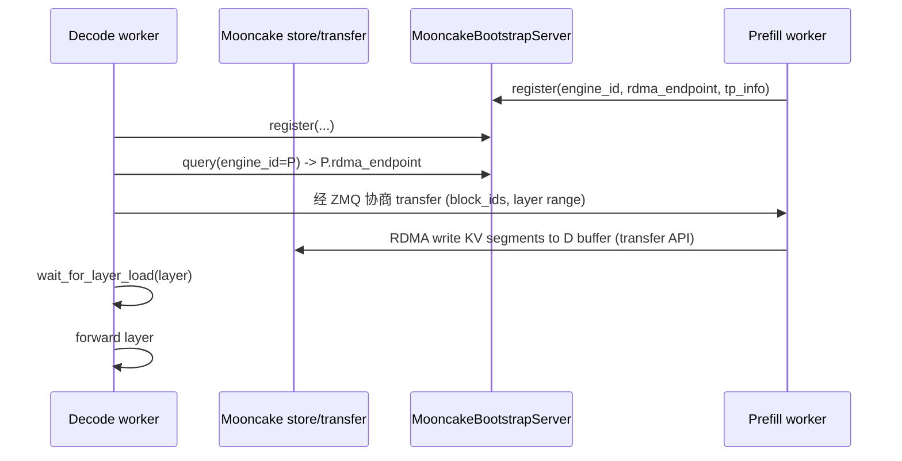

# transports/mooncake — Mooncake Connector

[← Wiki 首页](../../../README.md) > [分布式](../../README.md) > [kv-transfer](../README.md) > transports/mooncake

源码：`vllm/distributed/kv_transfer/kv_connector/v1/mooncake/`。本子包实现两条 Mooncake 路径：`MooncakeConnector`（基于 Mooncake RDMA transfer API）与 `MooncakeStoreConnector`（基于 Mooncake KV store API，子包 `mooncake/store/`）。Mooncake 是月之暗面开源的 KV cache 传输与存储系统（多级缓存 + RDMA + 分布式索引），定位与 [NIXL](nixl.md) / [LMCache](../lmcache.md) / [FlexKV](../flexkv.md) 互补。

## 是什么

### 目录结构

| 路径 | 主要类 |
|---|---|
| `mooncake_connector.py` | `MooncakeConnector(KVConnectorBase_V1, SupportsHMA)`（2179 行） |
| `mooncake_utils.py` | `MooncakeBootstrapServer`、`RegisterWorkerPayload` |
| `rdma_utils.py` | RDMA 辅助 |
| `stats.py` | `MooncakeKVConnectorStats` |
| `store/connector.py` | `MooncakeStoreConnector` |
| `store/worker.py`/`coordinator.py`/`scheduler.py` | store 路径的多角色实现 |
| `store/protocol.py`/`data.py`/`metrics.py` | 协议/数据/metrics |

### MooncakeConnector（`mooncake_connector.py`）

- import 量大：`httpx`、`msgspec`、`zmq`/`zmq.asyncio`、`numpy`、`ThreadPoolExecutor`、`asyncio`、`threading`。
- 复用 [utils](../utils.md) 的 `TransferTopology`/`EngineId`/`get_current_attn_backends` + [base](../base.md) `SupportsHMA`。
- 复用 `parallel_state.get_pp_group`/`get_tensor_model_parallel_*` 做 TP/PP 内部协调。
- 构造按 `role` 分 scheduler/worker 内部对象；scheduler 经 ZMQ + httpx 与对端 worker 协调；worker 用 Mooncake RDMA transfer API 发送/接收 KV 张量段。
- `MooncakeBootstrapServer`（`mooncake_utils.py`）：bootstrap 注册服务——各 worker 启动时把自己的 RDMA endpoint/engine_id/tp 信息注册到此，再查别的 engine 信息；避免直接点对点发现复杂。
- 内部含 layer 级传输、`extract_layer_index` 拼装、`compute_block_transfer_offsets`、MLA/SlidingWindowMLA/Mamba spec 分流（导入自 `kv_cache_interface`）。
- `MooncakeKVConnectorStats`（`stats.py`）：传输字节、命中率、错误。

### store/ 子路径

`MooncakeStoreConnector` 走 Mooncake 的 KV store API（按 key 存取 KV 段，而非纯 transfer）：
- `store/coordinator.py`：与 Mooncake store 协调器交互，决定哪个 segment 在哪个 store node。
- `store/scheduler.py`/`worker.py`：v1 协议的 scheduler/worker 实现，转译为 store API 调用。
- `store/protocol.py`/`data.py`：自定义 RPC 协议与数据封装。
- `store/metrics.py`：路径特有指标。

### 注册

`MooncakeConnector` 与 `MooncakeStoreConnector` 均在 factory 注册（见 [README](../README.md) 表 / [base](../base.md)）。

## 为什么

- **Mooncake 生态成熟**：Mooncake 在 KV transfer 与多级缓存已被多家部署验证；vLLM 接入让用户按需选。
- **两条 API 路径**：transfer API（直 RDMA 写）延迟低但需预注册 buffer；store API（按 key）灵活可与外部索引/存储同构。`MooncakeConnector` 偏 transfer，`MooncakeStoreConnector` 偏 store。
- **Bootstrap server**：RDMA endpoint 发现是难题；`MooncakeBootstrapServer` 提供中心化注册表，worker 启动时上报、查询对端。
- **TP/PP 内部协调**：mooncake_connector 直接调 `parallel_state` 同 engine 内 TP/PP 一致性；跨 engine 才走 Mooncake。
- **HMA 支持**：MLA/SlidingWindowMLA/Mamba 各 spec 分流处理，`SupportsHMA` 让其与 HMA 调度器配合。
- **async + threading**：Mooncake transfer 异步；connector 用 `ThreadPoolExecutor` + ZMQ 异步事件循环与 vLLM 的同步 forward 解耦。
- **Layer 感知**：`extract_layer_index` + `compute_block_transfer_offsets` 让传输按层精确切，与 vLLM layerwise 协议对齐。

## 怎么做

### 部署示例

prefill：`kv_role='kv_producer'` `kv_connector='MooncakeConnector'`；decode：`kv_role='kv_consumer'` 同 connector。`MooncakeBootstrapServer` 通常作为 sidecar 在某节点启动，所有 worker 连之注册/查询。

### Transfer 路径时序

### Store 路径差异

`MooncakeStoreConnector` 把 KV segment 按 key（`engine_id+layer+block`）存入 store；decode 端按 key 取。store coordinator 决定 segment 在哪个 store node。

## 与其它模块/系统配合

- **[base](../base.md)**：协议 + HMA。
- **[utils](../utils.md)**：`TransferTopology`、`get_current_attn_backends`、`extract_layer_index`。
- **[parallel-state](../../parallel-state.md)**：`get_pp_group`/`get_tensor_model_parallel_*`。
- **[01-engine-core](../../../01-engine-core/README.md)**：scheduler 钩子。
- **[03-model-execution](../../../03-model-execution/README.md)**：layer 索引与 KV 张量结构。
- **[05-attention-MLA](../../../05-attention/backends/mla/README.md)**：MLA/SlidingWindowMLA spec。
- **[ray-integration](../../ray-integration.md)**：`UCX_`/`LMCACHE_` 等 env 传播含相关前缀。

## 历史版本演进

- **v0.9**：`MooncakeConnector` 引入（transfer 路径），初版 bootstrap server。
- **v0.10**：`MooncakeStoreConnector` + `store/` 子包加入；HMA 支持；MLA/Mamba spec 分流。
- **v0.11/v0.12/main**：async/threading 模型完善；`MooncakeKVConnectorStats`；与 PD deploy scripts 协同（待核实）。

[← 返回 kv-transfer 首页](../README.md)

## 参见

- [nixl.md](nixl.md) — 同为 RDMA 传输路径，对比 NVIDIA NIXL。
- [moriio.md](moriio.md) — 另一 RDMA 实现。
- [../base.md](../base.md) — 协议来源。
