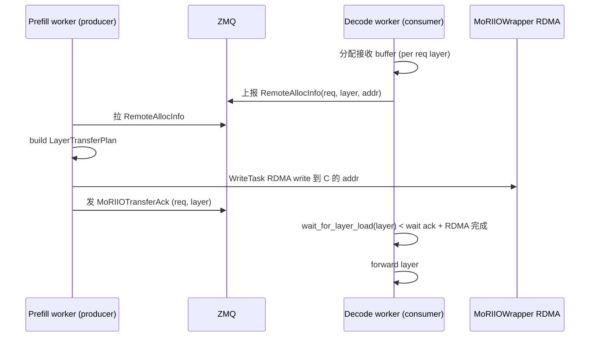

# transports/moriio — MoRIIO Connector

[← Wiki 首页](../../../README.md) > [分布式](../../README.md) > [kv-transfer](../README.md) > transports/moriio

源码：`vllm/distributed/kv_transfer/kv_connector/v1/moriio/`。本子包实现 `MoRIIOConnector`，基于 [MoRIIO](https://github.com/moriio-system/moriio)（一个 RDMA/cudaIpc 混合的高吞吐 KV/hidden 传输库）。与 [NIXL](nixl.md)/[Mooncake](mooncake.md) 同属"跨实例 GPU↔GPU 传输"路径，但实现侧重不同：MoRIIO 强调 layer-level transfer plan 与多 writer/reader 的角色编排。

## 是什么

### 目录结构

| 文件 | 主要类 |
|---|---|
| `moriio_connector.py`（~1968 行） | `MoRIIOConnector(KVConnectorBase_V1)`、`MoRIIOConnectorScheduler`、`MoRIIOConnectorWorker` |
| `moriio_engine.py` | `MoRIIOWriter`、`MoRIIOWrapper` |
| `moriio_layout.py` | `LayerTransferGeometry`、`build_layer_to_spec`、`compute_block_transfer_offsets`、`get_layer_transfer_geometry`、`is_mla_cache_layer`、`iter_layer_registration_regions` |
| `moriio_common.py` | `MoRIIOTransferAck`、`WriteTask`、`LayerTransferPlan`、`RemoteAllocInfo`、`ROLE(Enum)`、`MoRIIOAgentMetadata`、`RoleManager`、`MoRIIOMode(Enum)`、`MoRIIOError`/`HandshakeError`/`TransferError`、`MoRIIOConfig`、`MoRIIOConstants`、`ReqMeta`、`get_moriio_mode`、`get_role`、`set_role`、`zmq_ctx`、`resolve_host_ip`、`get_port_offset`、`parse_moriio_zmq_address`、`get_peer_zmq_from_request_id` |

### MoRIIOConnector 角色

- `ROLE(Enum)`（`moriio_common.py:99`）：producer/consumer/both 等，配合 `kv_role`。
- `MoRIIOMode(Enum)`（`:156`）：high_throughput/low_latency 等（与 all2all `mori_*` backend 呼应，见 [all2all](../../device-communicators/all2all.md) 表）。
- `RoleManager`（`:119`）：管理与对端 engine 的 ROLE 配对，避免双方都 producer 或都 consumer。
- `MoRIIOConfig`（`:227`）：从 `kv_connector_extra_config` 解析的 MoRIIO 专属配置（buffer 大小、QP 数、mode 等）。
- `MoRIIOAgentMetadata`、`ReqMeta`、`MoRIIOTransferAck`、`WriteTask`、`LayerTransferPlan`：握手与每步传输元数据。

### 工作流

- `MoRIIOConnectorScheduler`：scheduler 侧决策"哪些 req/layer 发送、发到哪端"；经 ZMQ 与对端 worker 协商 `RemoteAllocInfo`（对端预分配接收 buffer）。
- `MoRIIOConnectorWorker`：worker 侧，用 `MoRIIOWrapper`/`MoRIIOWriter`（`moriio_engine.py`）发起 RDMA/cudaIpc 写。`MoRIIOWriter`（`:75`）封装 MoRIIO 库的写路径；`MoRIIOWrapper`（`:486`）是更高层 facade。
- `moriio_layout.py`：按 spec 构建 `LayerTransferGeometry`，计算每层每 block 的传输 offset；`is_mla_cache_layer` 单独处理 MLA。
- `get_moriio_mode`/`get_role`/`set_role`：从 vllm_config + kv_role 派生 ROLE/Mode。
- 注：`MoRIIOConnector` **未继承 `SupportsHMA`**（与 NIXL/Mooncake 不同）——HMA 模型暂不支持，需 `--disable-hybrid-kv-cache-manager`。

### 注册

`KVConnectorFactory.register_connector("MoRIIOConnector", "vllm.distributed.kv_transfer.kv_connector.v1.moriio.moriio_connector", "MoRIIOConnector")`（factory.py:201）。

## 为什么

- **MoRIIO 性能定位**：在大 batch/高吞吐 PD 场景 MoRIIO 的 layer transfer plan + 多 reader 编排有优势；与 NIXL 的 pull/push 二选一不同，MoRIIO 强调 producer 主动规划每层 writer 任务。
- **Layer-level plan**：`LayerTransferPlan`/`WriteTask` 把每层每块传输显式建模，便于对接 all2all 后端（`MoriAll2AllManager` 见 [all2all](../../device-communicators/all2all.md)）。
- **RemoteAllocInfo**：consumer 端先分配接收 buffer，把地址回告 producer；producer 直 RDMA 写入，避免 consumer 主动拉的轮询开销。
- **RoleManager**：避免两端都被配为 producer（导致无人接收）或都 consumer（无人发送）的配置错误；握手阶段强制校验。
- **不继承 SupportsHMA**：MoRIIO 当前 layout 处理只覆盖单 spec 组（FullAttention/MLA/SlidingWindow/Mamba 之一），HMA 混合组未稳定；factory 的 HMA 校验会因此要求 `--disable-hybrid-kv-cache-manager`。
- **`mori_*` all2all 复用**：MoRIIO 既做 KV transfer 也做 EP all2all，二者共享 `MoRIIOWrapper`；connector 路径与 [all2all](../../device-communicators/all2all.md) 的 `MoriAll2AllManager` 是兄弟。
- **ZMQ 协调 + RDMA 数据面**：与 NIXL/Mooncake 同思路——元数据/握手走 ZMQ，数据面走 RDMA。

## 怎么做

### 部署

prefill：`kv_role='kv_producer'` `kv_connector='MoRIIOConnector'` `kv_connector_extra_config={"moriio_mode":"high_throughput", ...}`。
decode：`kv_role='kv_consumer'` 同 connector。
两端经 ZMQ 交换 `MoRIIOAgentMetadata`+`ReqMeta`+`RemoteAllocInfo`。

### Transfer 时序

## 与其它模块/系统配合

- **[base](../base.md)**：协议实现（非 HMA）。
- **[all2all](../../device-communicators/all2all.md)**：`MoriAll2AllManager` 共享 `MoRIIOWrapper`。
- **[01-engine-core](../../../01-engine-core/README.md)**：scheduler 钩子。
- **[03-model-execution](../../../03-model-execution/README.md)**：layer 几何与 KV 张量结构。
- **[05-attention-MLA](../../../05-attention/backends/mla/README.md)**：`is_mla_cache_layer` 处理。
- **[10-config](../../../10-config/README.md)**：`kv_connector_extra_config` 解析为 `MoRIIOConfig`。

## 历史版本演进

- **v0.9**：`MoRIIOConnector` 引入；producer/consumer 角色；high_throughput/low_latency mode。
- **v0.10**：`LayerTransferGeometry` + `compute_block_transfer_offsets`；MLA 处理；与 `MoriAll2AllManager` 共享底层。
- **v0.11/v0.12/main**：`MoRIIOConfig` 完整化；`RoleManager` 校验；HMA 支持在途（待核实）。

[← 返回 kv-transfer 首页](../README.md)

## 参见

- [nixl.md](nixl.md) — 同类 RDMA 传输，vLLM 自研主推。
- [mooncake.md](mooncake.md) — 同类 RDMA 传输。
- [../../device-communicators/all2all.md](../../device-communicators/all2all.md) — `MoriAll2AllManager`。
