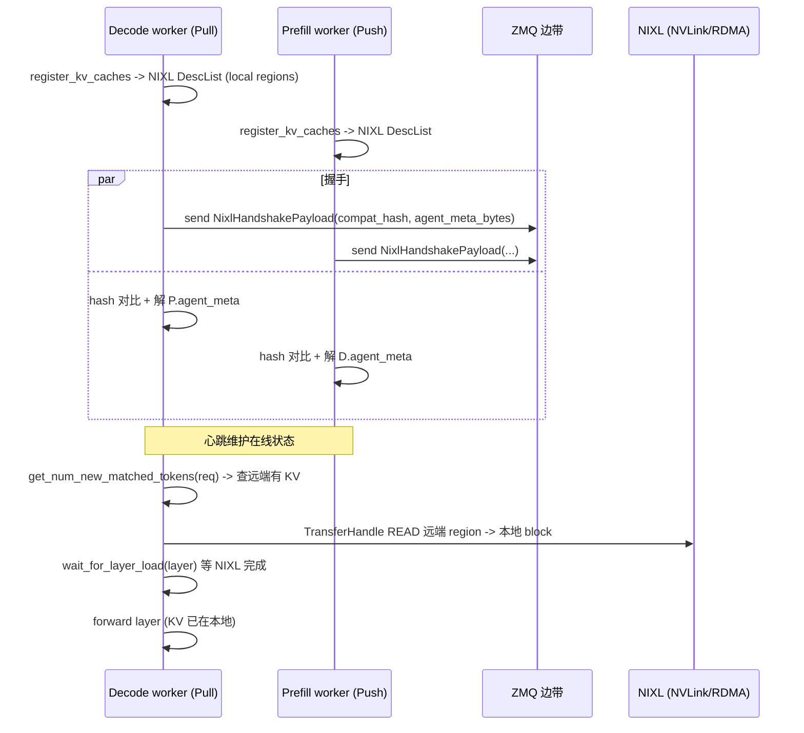

# transports/nixl — NIXL Pull/Push Connector

[← Wiki 首页](../../../README.md) > [分布式](../../README.md) > [kv-transfer](../README.md) > transports/nixl

源码：`vllm/distributed/kv_transfer/kv_connector/v1/nixl/`（约 8 文件）。本子包是 vLLM 针对 disaggregated prefilling **自研主推**的 KV 迁移 connector，基于 NVIDIA [NIXL](https://github.com/nixl-ai/nixl)（ROCm 上为 RIXL）做 GPU↔GPU RDMA/NVLink 高吞吐传输。提供两种模式：

- **Pull（READ）**：decode worker 主动从 prefill worker 拉 KV（`NixlPullConnector`，旧别名 `NixlConnector`）。
- **Push（WRITE）**：prefill worker 算完主动推 KV 到 decode worker（`NixlPushConnector`）。

二者共享 `NixlBaseConnector`/`NixlBaseConnectorScheduler`/`NixlBaseConnectorWorker`。注册名见 [base](../base.md) 表。

## 是什么

### 文件分工

| 文件 | 主要类 |
|---|---|
| `connector.py` | `NixlBaseConnector`、`NixlPullConnector`、`NixlPushConnector`、`NixlConnector`（别名） |
| `base_scheduler.py` | `NixlBaseConnectorScheduler`（共 scheduler 逻辑） |
| `base_worker.py` | `NixlBaseConnectorWorker`（共 worker 逻辑，最大文件 ~2420 行） |
| `pull_scheduler.py`/`pull_worker.py` | `NixlPullConnectorScheduler`/`NixlPullConnectorWorker` |
| `push_scheduler.py`/`push_worker.py` | `NixlPushConnectorScheduler`/`NixlPushConnectorWorker` |
| `scheduler.py` | 组合与公共调度辅助 |
| `worker.py` | worker 公共辅助 |
| `metadata.py` | `NixlAgentMetadata`、`NixlHandshakePayload`、`NixlConnectorMetadata`、`HeartbeatInfo`、`RemoteMeta`、`ReqMeta`、`TransferHandle`、`compute_nixl_compatibility_hash` |
| `tp_mapping.py` | `TPMapping`、`compute_tp_mapping`、`_is_attention_spec`/`_is_ssm_spec` |
| `stats.py` | `NixlKVConnectorStats`、`NixlPromMetrics` |
| `utils.py` | `zmq_ctx`、`get_representative_spec_type`、`get_base_request_id` |

### NixlBaseConnector（`connector.py:79`）

`NixlBaseConnector(KVConnectorBase_V1, SupportsHMA)`，pull/push 共享。

- `prefer_cross_layer_blocks`（`:82`）：Hybrid SSM 模型 False；backend 需在 {`FLASH_ATTN`, `FLASHINFER`, `TRITON_ATTN`} 且 `get_kv_cache_layout()=="HND"`；`extra_config["enable_cross_layers_blocks"]=="true"` 才 True。
- `__init__`（`:112`）：警告 `kv_role='kv_both'` 已 deprecated（应分别 `kv_producer`/`kv_consumer`）。子类设置 `self.connector_scheduler`/`self.connector_worker`。
- `get_required_kvcache_layout`（classmethod，`:141`）：MLA 模型返 None（layout 不影响）；否则返 `"HND"`（注释 `:155`："for better xfer performance"）。
- 所有 `KVConnectorBase_V1` 钩子转发给 `connector_scheduler`（scheduler 侧）或 `connector_worker`（worker 侧）。

### 握手与 compatibility hash（`metadata.py`）

`NixlHandshakePayload(KVConnectorHandshakeMetadata)`（`:62`）：`compatibility_hash: str` + `agent_metadata_bytes: bytes`，**两阶段解码**：
1. 解 `NixlHandshakePayload` 拿 `compatibility_hash`；
2. 本地算 hash 对比；
3. 一致才解 `agent_metadata_bytes` 为 `NixlAgentMetadata`——避免 schema 不兼容时解码崩溃。

`compute_nixl_compatibility_hash(vllm_config, attn_backend_name, cross_layers_blocks)`（`:79`）：SHA-256，factors 含 vLLM 版本/NIXL connector 版本/模型架构（name/dtype/kv heads/head size/layers）/attention backend/KV dtype/sliding window。注释 `:94`：`tensor_parallel_size`、`block_size`、`kv_cache_layout` 不入 hash——这些在 `_validate_remote_agent_handshake` 运行时校验，**以支持异构部署**。

`NixlAgentMetadata`（`:47`）：本 rank 的 NIXL agent 描述（engine_id、tp_rank、tp_size、block_size、tensor_shape、regions 等），随握手广播。

### Scheduler/Worker 分工

- `NixlBaseConnectorScheduler`（`base_scheduler.py:51`）：
  - 持 `engine_id`、`vllm_config`、`kv_cache_config`；
  - 经 ZMQ 与对端 worker 交换 `NixlHandshakePayload`/`NixlAgentMetadata`；
  - `get_num_new_matched_tokens`：查对端是否有该 req 的 KV，返回可省的 token 数。
  - `build_connector_meta`：构造 `NixlConnectorMetadata` 含本步要 load/save 的 req+block_ids+target ranks。
  - 心跳 `HeartbeatInfo` 维护远端 agent 是否在线。
- `NixlBaseConnectorWorker`（`base_worker.py`，最大文件）：
  - 持 `TransferTopology`（见 [utils](../utils.md)）与 NIXL `NixlWrapper` agent；
  - `register_kv_caches`：按 `get_transfer_cache_regions` 把本 rank KV 张量作为 NIXL DescList 注册；
  - `start_load_kv`：发起 NIXL `TransferHandle` 拉远端 KV 到本地 GPU block；
  - `wait_for_layer_load`：等待 NIXL 该层 transfer 完成；
  - `save_kv_layer`/`wait_for_save`：push 模式下把本地 KV 注册到对端；
  - `get_finished`/`get_block_ids_with_load_errors`：transfer 完成/错误反馈；
  - `tp_mapping.py` 把本地 TP rank 映射到对端 TP rank（处理 TP 异构）。

### Pull vs Push

- **Pull**（READ）：decode 侧主动。`NixlPullConnectorWorker` 发 `TransferHandle` 读远端 NVIDIA buffer 到本地；scheduler 侧 `get_num_new_matched_tokens` 决定哪些 req 要拉。
- **Push**（WRITE）：prefill 侧主动。`NixlPushConnectorWorker` 在 `save_kv_layer` 把本地 KV 经 NIXL push 到 decode 端预注册的 buffer；decode 侧拉时已是本地。

### 统计

`NixlKVConnectorStats`/`NixlPromMetrics`（`stats.py`）暴露 transfer 字节、延迟、命中率、错误率。

## 为什么

- **NIXL 高吞吐**：NIXL 是 NVIDIA 专为 inference transfer 设计（NVLink + RDMA 统一抽象），比 NCCL P2P + 自管 buffer 更高效；vLLM 借此实现 P/D 间接近裸金属带宽的 KV 搬运。
- **Pull/Push 二选一**：Pull 让 decode 自主决定何时拉、灵活应对 QPS 波动；Push 让 prefill 算完立刻推、decode 端零等待。不同 PD 拓扑/调度偏好下各有优势。
- **握手兼容性 hash**：vLLM/NIXL 协议在演进；hash 让两端 schema 不兼容时**优雅失败**而非崩溃（注释 `:71`）；hash 故意不含 TP/block_size 以支持异构部署（prefill TP8、decode TP2 等）。
- **TP mapping**：异构 TP 下 1 个 decode rank 要从 N 个 prefill rank 收，或反之；`compute_tp_mapping` 集中处理（与 [utils](../utils.md) `TransferTopology` 互补）。
- **HND layout**：`get_required_kvcache_layout` 返回 HND 让传输按 head 拼合，NIXL 单 transfer 覆盖更多 KV 数据；MLA 不影响 layout 故 None。
- **cross_layers_blocks**：跨层单 tensor NIXL 一次 transfer 覆盖全层 KV，吞吐进一步翻倍；SSM 暂不支持、需 backend 配合 HND。
- **HMA 支持**：多 spec（FullAttention+SlidingWindow+Mamba）各组独立注册 NIXL DescList；`request_finished_all_groups` 在全组完成才异步释放。
- **ZMQ 边带**：NIXL 只管数据面；元数据/握手/心跳走 ZMQ（控制面），二者解耦。
- **`kv_role='kv_both'` deprecated**：明确区分 producer/consumer 让两端 connector 行为更清晰（pull 仅 consumer、push 仅 producer）。

## 怎么做

### Pull 模式部署

prefill 实例：`kv_role='kv_producer'`，`kv_connector='NixlPushConnector'`（或旧 `NixlConnector`）。
decode 实例：`kv_role='kv_consumer'`，`kv_connector='NixlPullConnector'`。
两端 `engine_id` 不同；握手经 ZMQ（带外，通常 `data_parallel_master_ip` + port 偏移）。

### 握手 + 首次 transfer

### Push 模式差异

prefill `save_kv_layer` 时直接 NIXL WRITE 到 decode 端预注册 buffer；decode `start_load_kv` 仅 check 本地 buffer 状态。

## 与其它模块/系统配合

- **[base](../base.md)**：协议实现 + `SupportsHMA`。
- **[utils](../utils.md)**：`TransferTopology`/`get_transfer_cache_regions`/`kv_postprocess_*`。
- **[nixl-utils](../../nixl-utils.md)**：NIXL/RIXL 懒加载。
- **[01-engine-core](../../../01-engine-core/README.md)**：scheduler 钩子 + `_handle_invalid_blocks`。
- **[03-model-execution](../../../03-model-execution/README.md)**：HND layout 由 model loader落实。
- **[05-attention-MLA](../../../05-attention/backends/mla/README.md)**：MLA 不影响 layout；FlashAttn/FlashInfer/Triton 支持 cross-layer。
- **[09-compilation-ir](../../../09-compilation-ir/README.md)**：layerwise `wait_for_layer_load` 需 piecewise。
- **[08-platforms](../../../08-platforms/README.md)**：`is_rocm()` 决定 RIXL。
- **[eplb](../../eplb.md) / [elastic-ep](../../elastic-ep.md)**：NIXL 也是 EPLB/EEP 权重迁移的底层，但与本 connector 路径不同。

## 历史版本演进

- **v0.8**：`NixlConnector`（Pull）引入，初版 TP 同构、HND layout。
- **v0.9**：`NixlPushConnector` 加入（双向）；`compute_nixl_compatibility_hash` 两阶段握手；TP mapping 异构支持。
- **v0.10**：`prefer_cross_layer_blocks` + `enable_cross_layers_blocks` extra config；HMA 支持；`kv_role='kv_both'` deprecated。
- **v0.11/v0.12/main**：`get_block_ids_with_load_errors` + scheduler `_handle_invalid_blocks` 闭环；stat/prom 完善；与 ROCm RIXL 协同（待核实）。

[← 返回 kv-transfer 首页](../README.md)

## 参见

- [../base.md](../base.md) — 协议。
- [../utils.md](../utils.md) — `TransferTopology` 与 layout 工具。
- [mooncake.md](mooncake.md) / [moriio.md](moriio.md) — 其它 RDMA 传输。
- [../../nixl-utils.md](../../nixl-utils.md) — NIXL 加载。
