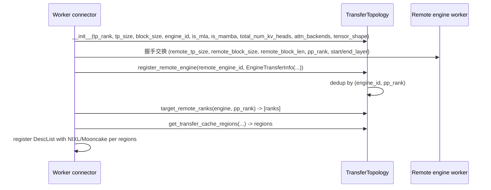

# utils.py — KV connector 共享工具

[← Wiki 首页](../../README.md) > [分布式](../../README.md) > [kv-transfer](README.md) > utils

源码：`vllm/distributed/kv_transfer/kv_connector/utils.py`（约 634 行）。本文件是各 KV connector 共用的"上层工具"：决定 KV cache layout、聚合多 worker 输出、记录跨 engine 传输拓扑、按 TP 比例/MLA/SSM 等约束算握手对端与传输区域、按 attention backend 处理 layout 转换。与 [base](base.md) 的协议层互补——后者定义生命周期钩子，本文件提供可复用实现。

## 是什么

### 顶层类型与决策

- `EngineId = str`（`:28`）：engine 标识，跨实例唯一。
- `BlockIds = tuple[list[int], ...] | list[list[int]]`（`:30`）：HMA 多组 block id 表示（一组一 list）。
- `get_kv_connector_cache_layout() -> str`（`:34`）：以 `get_current_vllm_config().kv_transfer_config` 解析 connector 类，调 `cls.get_required_kvcache_layout(vllm_config)`；非 None 则用之（如 NIXL 用 `"HND"`），否则默认 `"NHD"` 并日志 once。

### KVOutputAggregator（`:50`）

把多 worker 的 `ModelRunnerOutput.kv_connector_output` 聚合成 rank0 的统一输出供 scheduler 消费。构造 `__init__(expected_finished_count)`：`_recv_remaining_count`/`_send_remaining_count` 按 `req_id → n_remaining_workers` 倒数；`from_connector(connector, world_size)`（classmethod，`expected_finished_count = connector.get_finished_count() or world_size`）。`aggregate(outputs, output_rank=0) -> ModelRunnerOutput | None`：把各 worker 的"已完成 send/recv req_id"集合按倒计数收敛，等全员完成才记入最终完集；`_make_src_and_dst_indices`（`:173`）辅助跨 worker 索引映射。

### KV 块复制与后处理

- `copy_kv_blocks(...)`（`:184`）：按 indices 把一组 KV 块从 src 拷到 dst（用于 host↔device 缓冲搬运）。
- `kv_postprocess_blksize_on_receive(cache, indices, block_size_ratio)`（`:221`）：接收端按 `local_block_size / remote_block_size` 比例 reshape（local block 更大时合并、更小时拆分）。
- `kv_postprocess_layout_on_receive(cache, indices)`（`:252`）：处理 blocks-first vs layers-first layout 差异。
- `kv_postprocess_blksize_and_layout_on_receive(cache, indices, block_size_ratio)`（`:277`）：上述两者合并。
- `yield_req_data(...)`（`:299`）：迭代 yield 每请求的 KV 区域描述，供 NIXL/Mooncake 注册 DescList 时用。

### Attention backend 探测

- `get_current_attn_backends(vllm_config, kv_cache_config) -> list[type[AttentionBackend]]`（`:319`）：按 spec → backend 映射返回每"组"的 backend 类。
- `get_current_attn_backend(vllm_config, kv_cache_config) -> type[AttentionBackend]`（`:357`）：单 backend 情形。

### EngineTransferInfo（`:368`，dataclass）

每个 `(remote_engine_id, pp_rank)` 的远端身份信息：`remote_tp_size`、`remote_block_len`（字节）、`remote_block_size`（tokens/block）、`remote_physical_blocks_per_logical`、`remote_pp_rank`、`start_layer`/`end_layer`（本 PP rank 拥有的全局层区间）。在握手阶段由 worker 计算并 `TransferTopology.register_remote_engine` 存入。

### TransferTopology（`:398`，dataclass）

**单源真相**：本 engine 的 TP 身份 + 所有远端 engine 信息。字段：`tp_rank`/`tp_size`/`block_size`/`engine_id`/`is_mla`/`is_mamba`/`total_num_kv_heads`/`attn_backends`/`tensor_shape`。

`__post_init__`（`:412`）：
- `local_physical_heads = max(1, total_num_kv_heads // tp_size)`。
- 用 attn backend `get_kv_cache_shape(num_blocks=1, block_size=16, num_kv_heads=1, head_size=1)` 探测 layout：5 维且 `[0]==1` → blocks-first（与非 MLA 一致）；SSM 单 blocks-first。
- `_cross_layers_blocks`：`tensor_shape` 比 `kv_cache_shape` 多 1 维 → 跨层 KV（`prefer_cross_layer_blocks=True` 路径）；用 `get_kv_cache_stride_order(include_num_layers_dimension=True)` 重排 stride。
- 派生属性：`is_kv_layout_blocks_first`、`cross_layers_blocks`、`virtually_split_kv_in_blocks`（blocks-first 且非 cross-layer）、`split_k_and_v`（非 cross-layer、非 MLA、非 blocks-first 时 K/V 分注册）。

方法：
- `register_remote_engine(engine_id, info)`/`get_engine_info`/`unregister_remote_engine`。
- `tp_ratio(remote_tp_size) -> int`：正数=local≥remote（多个 local rank 读同一 remote），负数反之。
- `block_size_ratio(remote_block_size)`、`is_kv_replicated(engine, pp_rank)`（`remote_tp_size > total_num_kv_heads`）、`replicates_kv_cache`（MLA 永远 replicated）、`local_replicates_kv_cache`。
- `handshake_target_ranks(remote_tp_size) -> list[int]`：预注册时按 TP 比例算应与哪些远端 rank 握手。
- `target_remote_ranks(engine, pp_rank)`：实际读取的远端 rank 列表。
- `get_transfer_cache_regions(...)`（`:597`）：返回本 rank 要 register 的 KV 区域描述（layer × block × head 段），供 NIXL/Mooncake DescList 构造。
- `describe(remote_engine_id, remote_pp_rank=0) -> str`：人读描述。

## 为什么

- **layout 决策统一**：connector 异构（NIXL 偏 HND、LMCache 偏 NHD、Mooncake 看 spec），但 model loader 只问 `get_kv_connector_cache_layout()`；本文件封装"该问谁、默认什么"。
- **多 worker 输出聚合**：scheduler 只关心 rank0 的视角，但传输完成判定需多 worker 倒计数；`KVOutputAggregator` 给出与 `get_finished_count()` 协议一致的统一聚合。
- **TP 异构握手**：prefill 用 TP=8、decode 用 TP=2 时，4 个 decode rank 共享 1 个 prefill rank 的 KV；反之 1 个 decode rank 要从 4 个 prefill rank 收。`tp_ratio` + `target_remote_ranks` 把这套数学集中。
- **block_size 异构**：local block 128、remote block 16 时，1 个 local block 装下 8 个 remote block；`block_size_ratio` + `kv_postprocess_blksize_on_receive` 让接收端正确 reshape。
- **MLA 永远 replicated**：MLA 的 hidden 不可拆，TP 多于 KV head 时 KV 是复制；`replicates_kv_cache` 显式标注，避免错误地"分发"。
- **blocks-first vs layers-first**：非 MLA 普通 attention 的 cache 是 `[num_blocks, 2, H, N, D]`（blocks-first）或 `[2, num_blocks, H, N, D]`（layers-first/K-V-first）；cross-layer 模式多一个 `num_layers` 维度。connector 注册 DescList 时必须按正确 stride 切区域，否则数据面传输错位。
- **K/V 分注册**：部分后端（如 Mooncake）按 K 和 V 分开注册更高效；`split_k_and_v` 用 layout + MLA 标志判定。
- **attention backend 探测**：connector 不应硬编码 backend；按 spec 映射取得 backend 类，再调 `get_kv_cache_shape`/`get_kv_cache_stride_order` 拿权威 layout。

## 怎么做

### TransferTopology 创建与注册（NIXL/Mooncake worker 初始化）

### KVOutputAggregator 集成（ModelRunner 输出聚合）

Worker 多 rank 各产 `ModelRunnerOutput.kv_connector_output`；executor 收齐后 `KVOutputAggregator.aggregate(outputs)` 倒计数聚合，得到 rank0 视角的"scheduler 可见完成集"，注入 `EngineCoreOutputs`。

### layout 决策链

`get_kv_connector_cache_layout` → `connector_cls.get_required_kvcache_layout` → `ModelLoader` 使用之选 block 结构 → worker `register_kv_caches` 时 KV 张量按该 layout 排布 → `TransferTopology.__post_init__` 探测实际 stride → `get_transfer_cache_regions` 给传输层注册。

## 与其它模块/系统配合

- **[base](base.md)**：协议层；本文件实现协议里 `get_required_kvcache_layout`/`get_finished_count` 等的具体支撑。
- **[transports/nixl](transports/nixl.md) / [transports/mooncake](transports/mooncake.md) / [transports/moriio](transports/moriio.md) / [transports/hf3fs](transports/hf3fs.md)**：直接消费 `TransferTopology` + `kv_postprocess_*` + `yield_req_data`。
- **[offloading](offloading.md) / [lmcache](lmcache.md) / [multi](multi.md)**：可能复用 `KVOutputAggregator`。
- **[01-engine-core](../../01-engine-core/README.md)**：`KVOutputAggregator` 输出回流 scheduler；`EngineCoreOutputs`。
- **[02-execution](../../02-execution/README.md)**：executor 调聚合。
- **[05-attention-MLA](../../05-attention/backends/mla/README.md)**：`is_mla` 影响 layout；`get_kv_cache_stride_order` 是 backend 接口。
- **[03-model-execution](../../03-model-execution/README.md)**：`get_kv_connector_cache_layout` 决定 KV 张量结构。

## 历史版本演进

- **v0.7（v1）**：`KVOutputAggregator` 引入；`get_kv_connector_cache_layout` 决策。
- **v0.8**：`TransferTopology` + `EngineTransferInfo` 落地，供 NIXL 处理 TP/block_size 异构；`kv_postprocess_*` 系列加。
- **v0.9**：`cross_layers_blocks` / `get_kv_cache_stride_order` 支持跨层 KV；Mooncake/MoRIIO 接入复用本工具。
- **v0.10/v0.11**：`split_k_and_v`/`virtually_split_kv_in_blocks` 区分细化；`register_remote_engine` 去重逻辑稳定。
- **v0.12/main**：HF3FS 接入复用；`describe` 调试输出；布局判定随 MLA 演进持续调整（待核实）。

[← 返回 kv-transfer 首页](README.md)

## 参见

- [base.md](base.md) — `get_required_kvcache_layout`/`get_finished_count` 协议来源。
- [transports/nixl.md](transports/nixl.md) — `TransferTopology` 的主要消费方。
- [05-attention-MLA](../../05-attention/backends/mla/README.md) — layout 判定的 attention backend 接口。
