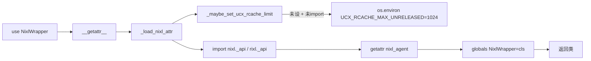

# nixl_utils.py — NIXL/RIXL 懒加载与 UCX 调校

[← Wiki 首页](../README.md) > [分布式](../README.md) > nixl-utils

源码：`vllm/distributed/nixl_utils.py`（约 95 行）。NIXL（NVIDIA Inference Transfer Library）与 ROCm 上的 RIXL 是 vLLM 跨实例 KV/权重高吞吐搬运的底层。本文件以"模块级 `__getattr__` 懒加载"方式暴露三个符号，并修一个 UCX 内存泄露的环境变量。它是 [kv-transfer/transports/nixl](kv-transfer/transports/nixl.md) 与 [eplb](eplb.md)/[elastic-ep](elastic-ep.md) 通信路径的统一入口。

## 是什么

模块级声明（仅静态分析用）：`NixlWrapper: Any`、`nixl_agent_config: Any`、`nixlXferTelemetry: Any`（`:14-17`）。真正取值由 `__getattr__` 触发。

懒加载符号：
- `NixlWrapper`：NIXL 的 `nixl_agent.NixlAgent` 包装类，提供 agent 创建/DescList/TransferHandle 等。
- `nixl_agent_config`：NIXL 的 `nixl_agent_config`，用于 GPU 内存类型、保护等。
- `nixlXferTelemetry`：`nixl._bindings` 内的传输遥测类型，用于性能统计。

API：
- `_maybe_set_ucx_rcache_limit()`（`:20`）：若 `UCX_RCACHE_MAX_UNRELEASED` 未设且 NIXL/RIXL 尚未 import，则置为 `"1024"`。若已被 import 则记录 warning（无法再改）。注释 `:32` 说明这避免 UCX 在 NIXL 下的一种罕见内存泄露。
- `_get_nixl_module_name(name)`（`:39`）：ROCm (`current_platform.is_rocm()`) 返回 `"rixl.*"`，否则 `"nixl.*"`；`nixlXferTelemetry` 走 `.*._bindings`，其余走 `.*._api`。
- `_load_nixl_attr(name)`（`:46`）：根据 `name` 选真实属性名（如 `NixlWrapper→nixl_agent`），调 `_maybe_set_ucx_rcache_limit` 后 `importlib.import_module` + `getattr`；失败置 `None` 并 `warning_once`。成功后 `globals()[name] = value`，后续访问直接命中，不再走 `__getattr__`。
- `__getattr__(name)`（`:76`）：仅响应 `__all__` 内的符号，否则 `AttributeError`。
- `is_nixl_available()`（`:82`）：用 `importlib.util.find_spec` 不实际 import 地探测 `nixl`/`rixl`，供 connector 初始化前快速门控。
- `__all__ = ["NixlWrapper", "nixl_agent_config", "nixlXferTelemetry", "is_nixl_available"]`。

## 为什么

- **懒加载必要**：NIXL/RIXL 是 optional 依赖，且 import 后会初始化 UCX/IB 资源。vLLM 很多场景（单机、CPU）不需要它；放在模块顶层 import 会拖慢启动并触发不必要的 UCX 初始化。
- **globals 注入**：`globals()[name] = value` 后下次访问绕过 `__getattr__`，等价于"首次访问时真正 import，之后变普通模块属性"。
- **UCX rcache 泄露**：UCX 的 registration cache 在 NIXL 高频注册/注销 GPU 内存时存在一种罕见泄露（见 NIXL issue），设 `UCX_RCACHE_MAX_UNRELEASED=1024` 是官方 workaround；但若 NIXL 已 import，UCX 配置已固化，无法再改——故 `warning_once` 提示用户手动设。
- **ROCm 双站**：NIXL 在 ROCm 上以 RIXL 名义发布，模块名不同；`current_platform.is_rocm()` 决定取 `rixl.*` 还是 `nixl.*`，让上层共用一套 API。
- **find_spec 探测**：`is_nixl_available` 不真正 import，避免在"想判断要不要装 NIXL"场景下意外触发 UCX 初始化。
- **统一入口**：所有 vLLM 内部用 NIXL 的地方都应通过 `from vllm.distributed.nixl_utils import NixlWrapper`，而非直接 `import nixl`，便于平台分支与推迟加载。

## 怎么做

### 典型使用（NIXL worker）

```python
from vllm.distributed.nixl_utils import NixlWrapper, nixl_agent_config, is_nixl_available

if not is_nixl_available():
    raise RuntimeError("NIXL not installed")
# 首次访问触发 import rixl._api 或 nixl._api
agent = NixlWrapper(agent_config=nixl_agent_config(...), ...)
```

### EPLB/Elastic EP 内部

`eplb/eplb_communicator.py:40` 的 `has_nixl()` 检查 `nixl_utils.NixlWrapper is not None`——这里 `is not None` 实际上会触发 `__getattr__`（若未加载），加载后才比较。此后 NIXL 真正可用与否即可判定。

### UCX 环境预设

调用任何 NIXL API 前，`_maybe_set_ucx_rcache_limit` 会先把 `UCX_RCACHE_MAX_UNRELEASED` 写入 `os.environ`。NIXL 初始化 UCX 时读到该变量即生效。



## 与其它模块/系统配合

- **[kv-transfer/transports/nixl](kv-transfer/transports/nixl.md)**：NixlConnector 通过 `NixlWrapper` 创建 local agent、注册 KV cache DescList、发起 `XferDesc` 传输。
- **[eplb](eplb.md)**：`has_nixl()` + `NixlEventGroup`/NIXL 通信后端用于专家权重重排（与 PyNcclCommunicator 并列选项）。
- **[elastic-ep](elastic-ep.md)**：扩缩容期间的权重迁移可走 NIXL（`elastic_execute.py` 内）。
- **[08-platforms](../08-platforms/README.md)**：`current_platform.is_rocm()` 决定 nixl vs rixl。
- **UCX/IB 环境**：`UCX_RCACHE_MAX_UNRELEASED`、`UCX_*`（参见 [ray-integration](ray-integration.md) 的 env 传播前缀含 `UCX_`）。

## 历史版本演进

- **v0.8**：随 NixlConnector 引入；初版仅有 `NixlWrapper` 与 `is_nixl_available`。
- **v0.9**：`_maybe_set_ucx_rcache_limit` 加入，修 UCX rcache 泄露；`nixl_agent_config` 公开。
- **v0.10**：ROCm RIXL 双站支持（`_get_nixl_module_name`）。
- **v0.11/v0.12/main**：`nixlXferTelemetry` 加入以支持 NIXL 传输遥测；warning 文案与 `warning_once` 节流调优（待核实）。

[← 返回分布式首页](../README.md)

## 参见

- [kv-transfer/transports/nixl.md](kv-transfer/transports/nixl.md) — 主要消费方。
- [eplb.md](eplb.md) — NIXL 用于 EPLB 专家权重迁移。
- [ray-integration.md](ray-integration.md) — `UCX_` 环境变量传播。
