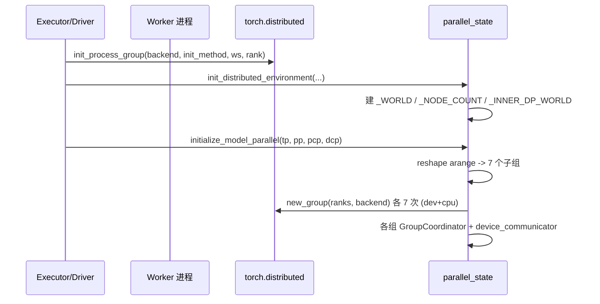

# parallel_state.py — 进程组与并行拓扑

[← Wiki 首页](../README.md) > [分布式](../README.md) > parallel_state

源码：`vllm/distributed/parallel_state.py`（约 2322 行）。改编自 Megatron-LM 的 `parallel_state`，是 vLLM 接管 PyTorch distributed 全部并行状态的"单一事实源"：进程组创建/查询/销毁、graph capture 上下文、tensor dict 序列化与 P2P 收发都在此集中。`__init__.py` 通过 `from .parallel_state import *` 把全部公开符号再导出到 `vllm.distributed`。

## 是什么

### 顶层模块级单例

- `_WORLD`：世界组 `GroupCoordinator`，`_NODE_COUNT` 缓存节点数，`_INNER_DP_WORLD` 是 `nnodes_within_dp>1` 时的内部 DP 世界组。
- `_TP`/`_DCP`/`_PCP`/`_PP`/`_DP`/`_EP`/`_EPLB`：七类并行组单例（均 `GroupCoordinator | None`）。`_EP`/`_EPLB` 只在 MoE 模型（`model_config.is_moe`）下创建（`parallel_state.py:1892`）。
- `_ENABLE_CUSTOM_ALL_REDUCE`：全局开关，由 `set_custom_all_reduce(enable)` 设置（`parallel_state.py:1454`）。
- `_group_name_counter`：保证每个组的 `unique_name` 唯一（如 `tp:0`、`tp:1`）。

### GroupCoordinator（`parallel_state.py:358`）

PyTorch `ProcessGroup` 的包装类，囊括一组进程的 CPU/设备通信。构造时同时建立：

- `device_group`（NCCL/gloo 等）+ `cpu_group`（恒为 gloo，便于 CPU 侧协调）；
- 可选 `device_communicator: DeviceCommunicatorBase`：由 `current_platform.get_device_communicator_cls()` 解析（`parallel_state.py:484`）；
- 可选 `mq_broadcaster: MessageQueue`：仅 TP/DCP 组需要（`use_message_queue_broadcaster=True`，`parallel_state.py:497`）；
- `device`：根据平台算 `cuda:x`/`xpu:x`/`cpu`。

属性：`rank`（全局）、`rank_in_group`、`local_rank`、`ranks`、`world_size`、`first/last/next/prev_rank`、`is_first/last_rank`。

核心方法（`parallel_state.py:641` 起）：`all_reduce`/`all_gather`/`all_gatherv`/`reduce_scatter`/`reduce_scatterv`/`gather`/`broadcast`/`broadcast_object`/`broadcast_object_list`/`send_object`/`recv_object`/`broadcast_tensor_dict`/`send_tensor_dict`/`recv_tensor_dict`/`isend_tensor_dict`/`irecv_tensor_dict`/`barrier`/`send`/`recv`/`dispatch`/`combine`/`dispatch_router_logits`/`prepare_communication_buffer_for_model`/`graph_capture`/`destroy`。

### 进程组网格派生（initialize_model_parallel, `parallel_state.py:1713`）

布局顺序 `ExternalDP × DP × PP × PCP × TP`（注释见 `:1779`）。对 `torch.arange(world_size).reshape(-1, DP, PP, PCP, TP)` 做 transpose + reshape + unbind 得到每维子组：

- **TP 组**（`:1796`）：`view(-1, TP).unbind(0)`，开启 `mq_broadcaster`。
- **DCP 组**（`:1813`）：`dcp_size ≤ tp_size`，复用 TP GPU（注释 `:1816`）；同样开 MQ。
- **PCP 组**（prefill context parallel，`:1835`）：transpose(3,4) 派生。
- **PP 组**（`:1854`）：transpose(2,4) 派生，行主序。
- **DP 组**（`:1872`）：transpose(1,4) 派生；elastic EP 下走 `_init_stateless_group`。
- **EP 组**（`:1889`）：transpose(1,2).reshape(-1, DP*PCP*TP) 派生，仅 MoE。
- **EPLB 组**（`:1917`）：与 EP 同 ranks 但独立 PG，"隔离 EPLB 通信与 MoE 前向 collectives 以防死锁"。

### Elastic EP 路径（`parallel_state.py:1520` `_init_elastic_ep_world`）

`enable_elastic_ep=True` 时 world 组本身由 `StatelessGroupCoordinator` 构建（单节点 TP/PP），DP/EP/EPLB 全部走 `_init_stateless_group`（`parallel_state.py:1316`），用 `data_parallel_master_ip` + `coord_store_port`（一个 TCPStore）协调端口分配。多节点 TP/PP 在该路径下显式 raise（`:1663`）。

### 全局生命周期 API

- `init_distributed_environment`（`:1555`）：DP>1/多节点时自动按 `data_parallel_rank` 偏移 rank、扩 world_size（`:1587`），调 `torch.distributed.init_process_group` 或 `_init_process_group_for_split_group`（`VLLM_DISTRIBUTED_USE_SPLIT_GROUP`）。
- `ensure_model_parallel_initialized`（`:1957`）：幂等初始化 + size 断言。
- `prepare_communication_buffer_for_model`（`:2002`）：把模型喂给 TP/PCP/PP/DP/EP/EPLB 的 `prepare_communication_buffer_for_model`（MoE all2all 缓冲）。
- `destroy_model_parallel`/`destroy_distributed_environment`/`cleanup_dist_env_and_memory`（`:2047`/`:2086`/`:2096`）：销毁顺序 PG → torch dist → 可选 ray.shutdown → gc + cache empty。
- `in_the_same_node_as`（`:2138`）：通过 `SharedMemory` 探测同节点，供 all-reduce/eplb 选择 SHM/NIXL 路径。
- `get_node_count`/`is_global_first_rank`/`is_local_first_rank`：拓扑位置查询。

### 模块级算子辅助

`all_reduce`/`reduce_scatter`/`all_gather`（`:130`/`:142`/`:160`）+ 对应 `_fake` 实现，用于 `torch.compile` 自定义算子注册；`patched_fused_scaled_matmul_reduce_scatter*`（`:178`/`:298`）拦截 MM+RS 融合算子注入 TP 通信。

## 为什么

- **接管 PyTorch distributed**：vLLM 需要更细粒度的生命周期（cleanup、graph capture、动态建组），不能直接用裸 `torch.distributed`。`GroupCoordinator` 把 CPU/设备双 PG、MQ 广播、设备 communicator 揉到一处。
- **统一多维并行**：TP/PP/DP/EP/EPLB/PCP/DCP 七组用同一 reshape 派生逻辑，避免每维各写一套；EPLB 单独 PG 是性能与死锁预防的关键取舍（`parallel_state.py:1918` 注释）。
- **layout 顺序约定**：`ExternalDP × DP × PP × PCP × TP` 让"相邻 rank 同机箱"成立，是 NVLink all-reduce/all2all 高吞吐前提。
- **Elastic EP 必须无状态**：扩缩容时活组不能重建，故 `[DP/EP/EPLB]` 走 `StatelessGroupCoordinator`（独立 TCPStore/gloo/NCCL communicator），`_replace_active_groups`（`:1341`）原子切换全局单例。
- **DP 跨网格 rank 偏移**：`data_parallel_rank * world_size + rank` 让多个 DP 实例共用同一 `distributed_init_method` 时仍能区分。
- **split_group 实验**：`VLLM_DISTRIBUTED_USE_SPLIT_GROUP` 走 `_create_subgroups_split_group`（`:260`）缓解 torch `new_group` 在大 world_size 下的开销；需要 `local_rank` 提前置（`:1629` 注释）。
- **graph capture 友好**：`graph_capture`（`:598`）+ `_inject_graph_capture_ctx` 让 NCCL/custom AR 在 CUDA graph 内可控。

## 怎么做

### 典型初始化时序

### 多节点 DP 协调

`nnodes>1 or DP>1` 且非 external_launcher 且非 elastic EP 时（`:1578`）：
1. `rank = data_parallel_rank * world_size + rank`；
2. `world_size = world_size_across_dp`；
3. 多节点用 `master_addr:master_port`；单节点多 DP 用 `data_parallel_master_ip:get_next_dp_init_port()`。
4. `nnodes_within_dp>1` 时额外建 `_INNER_DP_WORLD`（带 MQ 广播，`use_device_communicator=False`）。

### Elastic EP 切换组

`_replace_active_groups(world=, dp=, ep=, eplb=, node_count=)`（`:1341`）严格顺序销毁旧 `(DP, EP, WORLD, EPLB)` 后替换全局单例；调用方（`elastic_ep/elastic_execute.py`）在 standby 组准备就绪后一次切换。

### tensor_dict 收发

`broadcast_tensor_dict`（`:864`）用 `_split_tensor_dict`（`:81`）把张量与元数据分离：元数据走 `broadcast_object_list`（gloo），张量走 device_group broadcast；发送端按 `TensorMetadata(device.type, dtype, size)` 描述，接收端用 `device.index` 重建。`send_tensor_dict`/`recv_tensor_dict`/`isend`/`irecv` 同构。

## 与其它模块/系统配合

- **[02-execution](../02-execution/README.md)**：`MultiprocExecutor`/`RayExecutor` 在 worker 启动序列里调 `init_distributed_environment` → `initialize_model_parallel`；`UniprocExecutor` 仍保证 `model_parallel_is_initialized()` 返回 True 的等价语义。
- **[device-communicators](device-communicators/README.md)**：每组 `GroupCoordinator.device_communicator` 是设备通信实际执行者，本文件只负责建组与算子 API 壳。
- **[communication-op](communication-op.md)**：5 个 `tensor_model_parallel_*` 函数全部委派给 `get_tp_group()`。
- **[stateless-coordinator](stateless-coordinator.md)**：Elastic EP/EPLB 路径把 DP/EP/EPLB 三组替换为 `StatelessGroupCoordinator`。
- **[kv-transfer](kv-transfer/README.md)**：`kv_transfer_state._sync_engine_id_across_tp` 用 `get_tp_group().broadcast_object` + `get_pp_group().broadcast_object` 同步 `engine_id`。
- **[eplb](eplb.md)** / **[elastic-ep](elastic-ep.md)**：消费 `get_ep_group`/`get_eplb_group`/`get_dp_group`/`get_pp_group`/`get_tp_group`，`_replace_active_groups` 是重配置入口。
- **[08-platforms](../08-platforms/README.md)**：`current_platform.get_device_communicator_cls()`/`is_cuda_alike()`/`logical_device_id_to_visible_device_id()` 直接影响建组副作用。
- **[09-compilation-ir](../09-compilation-ir/README.md)**：`graph_capture`/`dispatch`/`combine` 必须在 piecewise CUDA graph 下可重放；`requires_piecewise_for_cudagraph` 由下游 connector 声明。

## 历史版本演进

- **早期（v0.3–v0.4）**：从 Megatron 移植 `initialize_model_parallel`，仅 TP/PP；world_group 用裸 `torch.distributed.new_group`。
- **v0.5**：引入 `data_parallel_size` 维度与 `world_size_across_dp` rank 偏移；`StatelessProcessGroup`（`utils.py`）落地用于 PD 迁移的 NCCL 握手。
- **v0.6**：`enable_async_scheduling`/`defer_block_free` 出现前，`pp_group` P2P `send_tensor_dict`/`recv_tensor_dict` 在 v0 scheduler 中串行使用。
- **v0.7（v1 落地）**：`GroupCoordinator` 取代散落的 `*_group` 类；`device_communicator` 抽象加入；PCP/DCP 维度引入支持 context parallel。
- **v0.8**：`enable_elastic_ep` 路径成形，DP/EP/EPLB 走 `_init_stateless_group`；`_replace_active_groups` 接口稳定。
- **v0.9**：EPLB 独立 PG（`:1917` 注释，原与 EP 共用导致死锁）；`in_the_same_node_as` 被 all-reduce/eplb 广泛复用。
- **v0.10**：`VLLM_DISTRIBUTED_USE_SPLIT_GROUP` 实验 codepath（`_create_subgroups_split_group`、`_init_process_group_for_split_group`）应对大 world_size `new_group` 开销；DCP 文档化"复用 TP GPU"约束。
- **v0.11/v0.12/main**：`NM` 全局删除以适配新平台抽象；`nnodes_within_dp` 内部 DP 世界组持续完善；split_group 路径仍在迭代（待核实具体稳定版本）。

[← 返回分布式首页](../README.md)

## 参见

- [communication-op.md](communication-op.md) — TP 算子的薄封装。
- [utils.md](utils.md) — `StatelessProcessGroup` 与 `get_pp_indices`。
- [stateless-coordinator.md](stateless-coordinator.md) — 动态建组实现。
- [device-communicators/README.md](device-communicators/README.md) — `device_communicator` 子系统。
- [eplb.md](eplb.md) / [elastic-ep.md](elastic-ep.md) — EPLB 与弹性扩缩容的用户。
