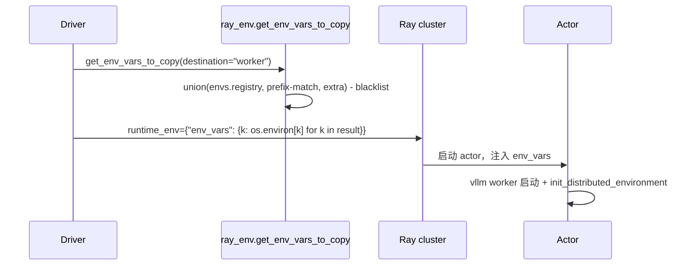
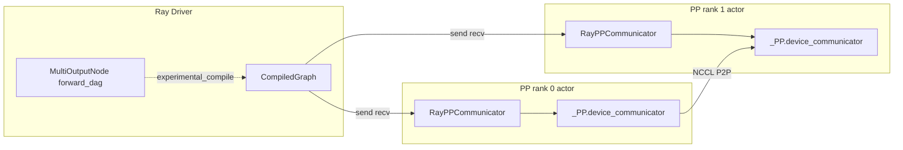

# vllm/ray/ + RayPPCommunicator — Ray 集成

[← Wiki 首页](../README.md) > [分布式](../README.md) > ray-integration

源码：`vllm/ray/`（`ray_env.py`、`lazy_utils.py`、`__init__.py` 空），`vllm/v1/executor/ray_executor*.py`、`vllm/v1/executor/ray_env_utils.py`，以及包装器 `vllm/distributed/device_communicators/ray_communicator.py`。Ray 是 vLLM 多节点/弹性部署的首选编排层；本子系统不实现 Executor 主体，只负责：Ray 环境变量传播、Ray 状态探测、以及在 Ray Compiled Graph 下让 PP 通信复用 vLLM 自有 `_PP GroupCoordinator`。

## 是什么

### vllm/ray/

- `__init__.py`：空，仅为 package 标记。
- `lazy_utils.py`：两个侦探函数：
  - `is_ray_initialized()`（`lazy_utils.py:5`）：try import ray，`ray.is_initialized()`；失败返 False。
  - `is_in_ray_actor()`（`:17`）：ray 已初始化且 `get_runtime_context().get_actor_id() is not None`。
- `ray_env.py`：环境变量传播策略。
  - 常量 `RAY_NON_CARRY_OVER_ENV_VARS_FILE`：`$VLLM_CONFIG_ROOT/ray_non_carry_over_env_vars.json`，黑名单（`:14`）。
  - `DEFAULT_ENV_VAR_PREFIXES = {"VLLM_","LMCACHE_","NCCL_","UCX_","HF_","HUGGING_FACE_"}`（`:36`）。
  - `DEFAULT_EXTRA_ENV_VARS = {"PYTHONHASHSEED"}`（`:45`）。
  - `get_env_vars_to_copy(exclude_vars=None, additional_vars=None, destination=None) -> set[str]`（`:55`）：并集 `vllm.envs.environment_variables` 注册表 + 前缀匹配集合（含用户 `VLLM_RAY_EXTRA_ENV_VAR_PREFIXES_TO_COPY`）+ 额外名（含 `VLLM_RAY_EXTRA_ENV_VARS_TO_COPY`）+ caller additional —— 减去 exclude 与黑名单。日志输出实际被复制且当前存在的变量名。

### RayPPCommunicator（`device_communicators/ray_communicator.py:22`）

继承 `ray.experimental.channel.communicator.Communicator`。**包装 vLLM 的 `_PP GroupCoordinator.device_communicator`**，让 Ray Compiled Graph 的 PP send/recv 复用 vLLM 已建好的 NCCL/PyNccl communicator，而不另起一套。

构造：`__init__(world_size, comm_id, rank, actor_handles, cuda_stream, use_communication_streams=False)`（`:32`）：
- 拒绝 `use_communication_streams` 与非默认 cuda_stream。
- rank 非 None（worker）时：`assert ray.get_gpu_ids()`；`self._comm = get_pp_group().device_communicator`；忽略 Ray 传入的 rank，改用 `_comm.rank_in_group`（`ray_communicator.py:80`）；`_build_actor_rank_mapping()`。
- rank None（driver）：`self._comm = None`。

`_build_actor_rank_mapping`（`:89`）：把当前 actor 的 32 字符 hex id 编码成 uint8 tensor，过 `_comm.all_gather` 收集全员 actor id，建 `actor_id → rank` 表——让 Ray 的 actor 句柄能映射到设备通信 rank。

实现的方法：
- `send(buf, peer_rank)`（`:158`）→ `_comm.send(buf, peer_rank)`。
- `recv(shape, dtype, peer_rank, allocator)`（`:180`）→ `_comm.recv(size, dtype, src=peer_rank)` + `current_stream().synchronize()`（注释 `:208` 解析：NCCL 中止时 buffer 值未定义，需同步+检查 `self._closed`）。
- `allgather`/`allreduce`/`reducescatter`：`NotImplementedError`（PP 路径不需要）。
- `recv_stream`/`send_stream`（`:241`）：返回 `current_stream()` 的 `StreamContext`。
- `destroy()`（`:249`）：仅置 `_closed=True`，**不销毁** GroupCoordinator（由 vLLM 管理生命周期）。
- `get_transport_name()`→`"nccl"`；`generate_communicator_id()`→`uuid.uuid4()`（classmethod）。

### 在 Ray Executor 中的接线（`v1/executor/ray_executor.py:595`）

当 `VLLM_USE_RAY_WRAPPED_PP_COMM` 为真：
1. 从 `ray.experimental.channel.accelerator_context` 导入 `register_accelerator_context`；
2. 调 `register_accelerator_context(torch_module_name="cuda", communicator_cls=RayPPCommunicator)`；
3. `MultiOutputNode([outputs]).experimental_compile(...)` 编译 DAG 时，Ray 自动用 `RayPPCommunicator` 做 PP 张量传递。

否则日志说明走 Ray 自带 NCCL communicator。

### RayExecutorV2（`v1/executor/ray_executor_v2.py:219`）

继承 `MultiprocExecutor`，用 Ray actor 承载 worker 进程；`RayWorkerHandle`/`RayWorkerProc` 包装。`abstract.py:64` 在 `executor_backend=="ray"` 时选 `RayExecutorV2`。仅 Multiproc 风格，不实现 PP Compiled Graph（ Compiled Graph 仅旧 `RayExecutor`）。

## 为什么

- **环境变量传播难题**：Ray actor 默认只继承部分 driver env；vLLM/NCCL/UCX/LMCache/HF 大量运行时配置必须显式复制。`get_env_vars_to_copy` 给出一个"白名单前缀 + 注册表 + 黑名单"的可扩展策略，避免逐个手列。
- **黑名单文件**：某些变量是 worker 特有（如 `CUDA_VISIBLE_DEVICES`、`LOCAL_RANK`），复制会冲突；用户通过 `ray_non_carry_over_env_vars.json` 覆盖。
- **复用 vLLM PP communicator**：vLLM 的 PP 路径已建好 NCCL P2P（含 PyNccl/CudaCommunicator 的 send/recv），若 Ray Compiled Graph 另起一套 NCCL communicator 会重复占显存、且与 vLLM graph capture 不对齐。`RayPPCommunicator` 让两者共用，等于"Ray 调度 + vLLM 通信"。
- **actor_id → rank 映射**：Ray Compiled Graph 传的是 actor 句柄而非 rank，必须做映射才能调 vLLM `_comm.send(buf, rank)`。
- **不实现 allreduce/allgather**：PP 只需点对点；CSL collectives 显式 NotImplemented 避免误用。
- **安全 recv 同步**：NCCL 异常中止时 buffer 未定义，`synchronize()` + 重检 `_closed` 保证消费方安全（注释 `:208`）。
- **懒 import ray**：`lazy_utils.py` 与 `ray_env.py` 内部所有 `import ray` 都在函数体内，让非 Ray 部署（`ray` 未装）仍能 import `vllm.ray`。

## 怎么做

### Driver 向 actor 复制环境（伪时序）

### Ray Compiled Graph PP 通信

### Actor rank 映射一次性建立

`_build_actor_rank_mapping` 在 `__init__` 末尾调一次：每个 actor 把自己的 32-char hex actor id 转 uint8 tensor，过 `_comm.all_gather(dim=0)`，本地拼出 `actor_id → rank` 字典。`get_rank(actor)` 用句柄的 `_actor_id.hex()` 查表。

## 与其它模块/系统配合

- **[parallel-state](parallel-state.md)**：`RayPPCommunicator` 直接消费 `get_pp_group().device_communicator`；Ray Executor 在 worker 启动时调 `init_distributed_environment`+`ensure_model_parallel_initialized`。
- **[02-execution](../02-execution/README.md)**：`RayExecutorV2`（`v1/executor/ray_executor_v2.py`）继承 `MultiprocExecutor`，是 Ray 部署的默认 executor；`v1/executor/ray_utils.py`/`ray_env_utils.py` 提供 actor 创建辅助。
- **[device-communicators/base](device-communicators/base.md) / [cuda](device-communicators/cuda.md)**：被包装的 `device_communicator` 实例即 `CudaCommunicator`/`XpuCommunicator`/`CpuCommunicator`。
- **[13-entrypoints](../13-entrypoints/README.md)**：CLI/API serve 在 `--distributed-executor-backend ray` 时触发 Ray executor。
- **[08-platforms](../08-platforms/README.md)**：`register_accelerator_context(torch_module_name="cuda")` 依赖平台 cuda 判定。
- **[nixl-utils](nixl-utils.md)**：`UCX_` 前缀被 `get_env_vars_to_copy` 默认复制，保证 NIXL 在 Ray actor 上 UCX 配置一致。

## 历史版本演进

- **早期（v0.3）**：`ray_executor.py`（旧）作为 Ray executor 主体，PP 通信走 Ray 自带 NCCL communicator。
- **v0.6/v0.7**：`RayExecutorV2`（基于 MultiprocExecutor）落地，简化为"Ray actor + ZMQ/SHM IPC"，去掉旧 executor 的复杂握手。
- **v0.8**：`VLLM_USE_RAY_WRAPPED_PP_COMM` 引入 `RayPPCommunicator`，让 Compiled Graph 复用 vLLM communicator；`_build_actor_rank_mapping` 落地。
- **v0.9**：`recv` 加 `current_stream().synchronize()` + `self._closed` 双检，修 NCCL abort 后 buffer 未定义问题；`destroy` 改为只置标志。
- **v0.10**：`ray_env.py` 的 `get_env_vars_to_copy` 引入可扩展前缀/额外变量 (`VLLM_RAY_EXTRA_ENV_VAR_PREFIXES_TO_COPY`/`VLLM_RAY_EXTRA_ENV_VARS_TO_COPY`)。
- **v0.11/v0.12/main**：RayExecutorV2 持续完善与 MultiprocExecutor 的对齐；Compiled Graph overlap (`VLLM_USE_RAY_COMPILED_DAG_OVERLAP_COMM`) 实验（待核实稳定版本）。

[← 返回分布式首页](../README.md)

## 参见

- [device-communicators/ray.md](device-communicators/ray.md) — `RayPPCommunicator` 在设备通信目录下的同页。
- [parallel-state.md](parallel-state.md) — `_PP` 组的来源。
- [02-execution](../02-execution/README.md) — Executor 主体在 Ray 上的承载。
