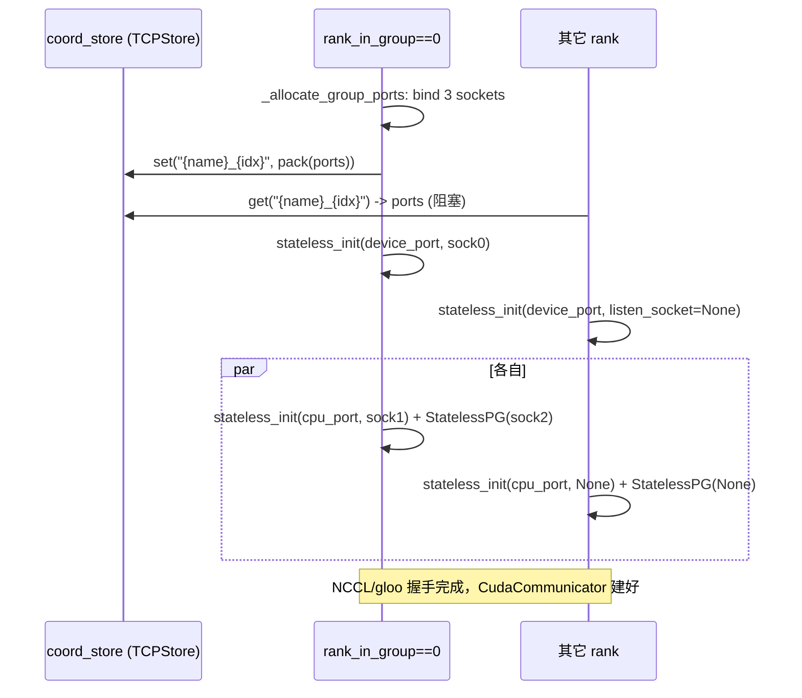

# stateless_coordinator.py — StatelessGroupCoordinator

[← Wiki 首页](../README.md) > [分布式](../README.md) > stateless-coordinator

源码：`vllm/distributed/stateless_coordinator.py`（约 381 行）。`StatelessGroupCoordinator` 继承 `GroupCoordinator`，但**不依赖 PyTorch 全局 WORLD group**——它在每次构造时为每个子组单独建立设备 PG + gloo PG + `StatelessProcessGroup`（TCPStore），从而可以在不销毁现有 PG 的前提下动态创建"参与者集合不同"的副组。Elastic EP 和 EPLB 重配置依赖它。

## 是什么

### 构造（`stateless_coordinator.py:70`）

`__init__(group_ranks, local_rank, torch_distributed_backend, use_device_communicator, coord_store: Store, use_message_queue_broadcaster=False, group_name=None, host="127.0.0.1", global_rank=0, global_world_size=1)`。

对每个本 rank 所属的 `ranks` 列表：
1. **端口分配**：rank_in_group==0 调 `_allocate_group_ports`（`:31`）监听 3 个 socket（device_port/cpu_port/tcp_store_port），`struct.pack("!3I")` 把三端口写入 `coord_store`（key=`{group_name}_{idx}`）；其余 rank `_fetch_group_ports`（`:53`）从 store 读。
2. **device PG**：`stateless_init_torch_distributed_process_group(host, device_port, rank_in_group, world_size, backend, group_name=f"{unique}_device", listen_socket=socks[0] or None)`。
3. **cpu PG**：同上但 backend=gloo、cpu_port、socks[1]。
4. **tcp_store_group**：`StatelessProcessGroup.create(host, tcp_store_port, ..., listen_socket=socks[2])`，用作元数据通道。
5. **device_communicator**：仅 CUDA 平台 + `use_device_communicator` 时建 `CudaCommunicator`，并 assert `== CudaCommunicator`（`:185`），传入 `global_ranks`/`global_world_size`/`tcp_store_group`。
6. `mq_broadcaster=None`（不支持），`use_custom_op_call` 走 cuda_alike/tpu 分支。

属性与父类一致：`rank=global_rank`、`rank_in_group`、`ranks`、`world_size`、`cpu_group`、`device_group`、`tcp_store_group`、`device_communicator`、`device`。

### 重写的方法

- `destroy`（`:203`）：销毁 device_communicator + `stateless_destroy_torch_distributed_process_group(device_group)` + 同 cpu_group。
- `size`（`:211`）：返回 `world_size`。
- `broadcast`（`:215`）：`world_size==1` 直返；device_communicator+cuda 走它，否则 `tcp_store_group.broadcast`。
- `broadcast_object`/`broadcast_object_list`（`:224`/`:229`）：全部走 tcp_store_group。
- `broadcast_tensor_dict`（`:246`）：元数据走 tcp_store，张量按 is_cuda 走 device_communicator 或 tcp_store。
- `send_object`/`recv_object`（`:291`/`:296`）：tcp_store_group。
- `send_tensor_dict`/`recv_tensor_dict`（`:301`/`:328`）：元数据走 tcp_store，张量按 cuda 走 device_communicator.send/recv 或 tcp_store。
- `barrier`（`:358`）：`tcp_store_group.barrier()`（三段式实现见 [utils.md](utils.md)）。
- `gather`（`:361`）：device_communicator.send/recv 拼接，不支持非 cuda。

### 模块级辅助

- `_allocate_group_ports(key, host, coord_store)`（`:31`）：bind 3 个 socket + listen，pack 端口写 store，返回 `(ports, sockets)`（sockets 保留给 rank0 传给 `listen_socket`）。
- `_fetch_group_ports(key, coord_store)`（`:53`）：阻塞读 store 拿 3 端口。
- `_PORTS_FMT = "!3I"`：3×uint32 网络序。
- 在 `parallel_state._init_stateless_group`（`parallel_state.py:1316`）被实例化。

## 为什么

- **脱离 torch WORLD**：PyTorch `new_group` 必须在所有世界 rank 上集体调用，且不能与现有 PG 解耦；弹性扩缩容时新加入的 rank 根本不在原 WORLD 里。`StatelessGroupCoordinator` 用独立 TCPStore + 独立 PG 完全旁路 WORLD。
- **端口协调难题**：每个副组要 3 个端口（device/cpu/tcp_store），多组同时建会抢端口；`coord_store`（一个共享 TCPStore）让 rank0 统一分配并广播，避免冲突。
- **设备通信仍走 NCCL**：元数据走 TCPStore（小、稀疏），数据面仍用 `stateless_init_torch_distributed_process_group` 建的 NCCL PG + `CudaCommunicator`，与主路径性能一致。
- **CudaCommunicator assertion**：目前 stateless 路径仅验证过 CUDA（`assert device_comm_cls == CudaCommunicator`，`:185`），其它平台需先放开断言并测试。
- **单节点约束**：注释 `parallel_state.py:1660` 指出 stateless 路径用 `127.0.0.1`/`data_parallel_master_ip`，TP/PP 必须同节点；多节点 TP/PP 显式 raise。
- **standby → active 切换**：`parallel_state._replace_active_groups` 把 standby `StatelessGroupCoordinator` 替换为全局 `_DP/_EP/_EPLB/_WORLD`，原 PG 由新对象接管，避免在干活的过程中销毁。

## 怎么做

### Standby 组创建时序



### 切换到 active

`elastic_ep/elastic_execute.py` 在 standby 组权重/KV 都 ready 后：

```python
_replace_active_groups(
    world=standby_world,
    dp=standby_dp,
    ep=standby_ep,
    eplb=standby_eplb,
    node_count=...,
)
# 之后 get_dp_group()/get_ep_group() 返回新对象
```

### 与多 connector 握手

NIXL/Mooncake/MoRIIO 等 connector 在 worker 间握手时也用 `StatelessGroupCoordinator.tcp_store_group` 广播 agent 元数据、NCCL unique id、远端端口表。

## 与其它模块/系统配合

- **[parallel-state](parallel-state.md)**：`_init_stateless_group` 是工厂；`_replace_active_groups` 是切换入口；`init_distributed_environment` 的 `enable_elastic_ep` 分支用 `StatelessGroupCoordinator` 建世界组。
- **[utils](utils.md)**：`StatelessProcessGroup.create`/`stateless_init_*`/`create_tcp_store` 是底层。
- **[elastic-ep](elastic-ep.md)**：`standby_state.py` 管理 `_STANDBY_WORLD/_DP/_EP/_EPLB`；`elastic_execute.py` 切换。
- **[eplb](eplb.md)**：EPLB 重排通信在 elastic EP 路径下走 `StatelessGroupCoordinator`。
- **[kv-transfer](kv-transfer/README.md)**：NIXL/Mooncake connector 用 `coord_store` 模式但通常各自建独立 store，不直接复用本类——但受其设计启发（待核实）。
- **[device-communicators/cuda](device-communicators/cuda.md)**：`CudaCommunicator` 在 stateless 路径下额外接 `global_ranks`/`global_world_size`/`tcp_store_group`，用于 NCCL unique id 广播。

## 历史版本演进

- **v0.8**：随 Elastic EP 首次落地，Name 由"experimental stateless PG"成形；`_allocate_group_ports` 端口协调逻辑引入。
- **v0.9**：EPLB 独立 PG 路径接入，`_STANDBY_EPLB` 加入 standby_state；`_replace_active_groups` 扩到含 eplb。
- **v0.10**：完善 `broadcast_tensor_dict`/`send_tensor_dict`/`recv_tensor_dict` 在 stateless 下的张量路由（cuda↔tcp_store 分流）。
- **v0.11/v0.12/main**：`CudaCommunicator` 注入 `global_ranks`/`tcp_store_group` 以支持 NCCL unique id 跨 stateless 组广播；单节点约束仍在（待核实多节点 stateless 路径进展）。

[← 返回分布式首页](../README.md)

## 参见

- [parallel-state.md](parallel-state.md) — 调用方与切换机制。
- [utils.md](utils.md) — `StatelessProcessGroup` 与 `stateless_init_*`。
- [elastic-ep.md](elastic-ep.md) — standby 组的创建与切换编排。
- [eplb.md](eplb.md) — EPLB 重排通信消费者。
