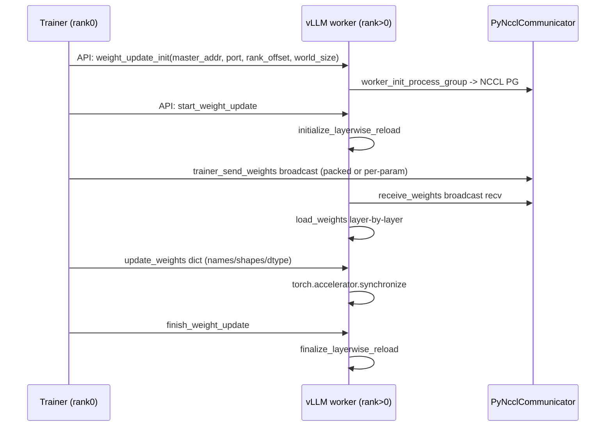

# weight_transfer/ — 训练→推理权重迁移引擎

[← Wiki 首页](../README.md) > [分布式](../README.md) > weight-transfer

源码根：`vllm/distributed/weight_transfer/`（`__init__.py`、`base.py`、`factory.py`、`nccl_common.py`、`nccl_engine.py`、`ipc_engine.py`、`sparse_nccl_engine.py`、`packed_tensor.py`）。本子包服务**在线学习/持续训练**场景：把 trainer 进程更新后的模型权重实时搬到 vLLM 推理 worker，避免"训完→存盘→重启加载"的分钟级延迟。与 [kv-transfer](kv-transfer/README.md) 迁移 KV cache 不同，这里迁移的是**模型权重**，且方向固定（trainer→worker）。

## 是什么

### 基类与协议（`base.py`）

- `WeightTransferInitInfo(ABC)` / `WeightTransferUpdateInfo(ABC)`：后端专属初始化/更新信息基类。
- `WeightTransferInitRequest` / `WeightTransferUpdateRequest`：API 层接受的 dict 形态请求，`init_info: dict`/`update_info: dict`，经 `parse_init_info`/`parse_update_info` 由后端 dataclass 校验+构造。
- `WeightTransferEngine(ABC, Generic[TInitInfo, TUpdateInfo])`（`:52`）：核心抽象。
  - `__init__(config: WeightTransferConfig, vllm_config, device, model)`：装 `parallel_config`/`model_config`/`device`/`model`。
  - `parse_init_info(init_dict) -> TInitInfo` / `parse_update_info(update_dict) -> TUpdateInfo`：try/except 构造后端 dataclass，失败 raise ValueError。
  - `@abstractmethod init_transfer_engine(init_info)`：一次性初始化（建 NCCL PG 等）。
  - `@abstractmethod start_weight_update()`：准备一次更新（checkpoint-format 引擎在此启 layerwise reload；in-place 引擎 no-op）。
  - `@abstractmethod finish_weight_update()`：终结一次更新（layerwise reload finalize；in-place no-op）。
  - `update_weights(update_info: dict)`：`parse_update_info` → `receive_weights(typed)` → `torch.accelerator.synchronize()`。约定收一份 chunk 立即可用于下一步。
  - `@abstractmethod receive_weights(update_info)`：后端实际收权重实现。
  - `@abstractmethod shutdown()`、`@staticmethod @abstractmethod trainer_send_weights(iterator, trainer_args)`：trainer 侧发送静态方法。

类属性 `init_info_cls`/`update_info_cls` 子类覆盖。

### 工厂（`factory.py`）

`WeightTransferEngineFactory`（`:21`）：
- `_registry: dict[str, Callable[[], type[WeightTransferEngine]]]`。
- `register_engine(name, module_path_or_cls, class_name=None)`：支持 lazy（str+class_name）或直接类两种注册。
- `create_engine(config, vllm_config, device, model) -> WeightTransferEngine`：按 `config.backend` 解析类，注入 4 参构造。

注册表：
- `"nccl"` → `NCCLWeightTransferEngine`（`nccl_engine.py:99`）。
- `"ipc"` → `IPCWeightTransferEngine`（`ipc_engine.py:135`）。
- `"sparse_nccl"` → `SparseNCCLWeightTransferEngine`（`sparse_nccl_engine.py:88`）。

### NCCLWeightTransferEngine（`nccl_engine.py`）

**Checkpoint-format / dense 广播**。
- `NCCLWeightTransferInitInfo`（`nccl_common.py:24`）：`master_address`/`master_port`/`rank_offset`/`world_size`。
- `NCCLTrainerSendWeightsArgs`（`:41`）：`group`（`PyNcclCommunicator`）、`src=0`、`post_iter_func`、`packed=False`、`stream`、`packed_buffer_size_bytes`、`packed_num_buffers`。
- `NCCLWeightTransferUpdateInfo`（`:67`）：`names`/`dtype_names`/`shapes`/`packed`/`packed_buffer_size_bytes`/`packed_num_buffers`；`__post_init__` 校验三 list 等长。
- 引擎实现：
  - `init_transfer_engine` → `worker_init_process_group(init_info, parallel_config)` 建 `PyNcclCommunicator`。
  - `start_weight_update` → `vllm.model_executor.model_loader.reload.initialize_layerwise_reload`（layerwise reload 启动）。
  - `receive_weights` → NCCL broadcast 收 packed 或逐 param；layerwise reload 把每 tensor 经 `load_weights` 装回 model。
  - `finish_weight_update` → layerwise reload finalize。
  - `trainer_send_weights(iterator, trainer_args)` 静态：trainer 端用 `PyNcclCommunicator` broadcast。

### IPCWeightTransferEngine（`ipc_engine.py`）

**CUDA IPC 句柄路径**（trainer 与 worker 同机或经 Ray 共享 GPU）。
- `IPCTrainerSendWeightsArgs`（`:34`）：`send_mode ∈ {"ray","http", callable}`、`llm_handle`（ray）、`url`（http）、`packed`。`__post_init__` 校验 mode 与必填字段。
- `IPCWeightTransferInitInfo`：`pass`（IPC 无需 init）。
- `IPCWeightTransferUpdateInfo`（`:73`）：`names`/`dtype_names`/`shapes`、`ipc_handles`（`{gpu_uuid: rebuild_cuda_tensor args}`，逐 param 或 packed 单 buffer）、`ipc_handles_pickled`（base64 pickle，HTTP 用）、`tensor_sizes`（packed 时 per-param 字节）、`packed`。
- 引擎：`receive_weights` 用 IPC 句柄重建 tensor 直接拷入 model（无 NCCL）；`trainer_send_weights` 按 send_mode 分发：`"ray"` 经 Ray actor call，`"http"` POST HTTP endpoint，callable 自定义。

### SparseNCCLWeightTransferEngine（`sparse_nccl_engine.py`）

**稀疏 in-place 补丁**：trainer 只发被改的少量 (indices, values)。
- `SparseWeightPatch`（`:47`）：`name`/`indices`/`values`。
- `SparseNCCLWeightTransferUpdateInfo`（`:56`）：`names`/`dtype_names`/`shapes`/`num_updates_list`（每 param 的 sparse entry 数）。
- 引擎：`receive_weights` broadcast indices+values → 按 `name` 索引到 `model` 参数 → in-place `index_copy_`；**不走 layerwise reload，`start_weight_update`/`finish_weight_update` no-op**（注释 `:97`）。复用 `NCCLWeightTransferInitInfo` 建 communicator。

### packed_tensor.py

`PackedChunk`（`:50`）/ `PackedIpcChunk`（`:288`）：多 tensor 打包成单个大 buffer 一次性 broadcast/IPC，减 NCCL launch/IPC handle 开销。双/三缓冲（`packed_num_buffers`）让生产消费重叠。`packed_buffer_size_bytes`/`packed_num_buffers` producer/consumer 必须一致。

### nccl_common.py

`NCCLWeightTransferInitInfo` + `worker_init_process_group`（建 PG 的辅助）。

## 为什么

- **在线学习实时性**：RLHF/PPO 在线训练时，trainer 每 N step 更新一次权重，vLLM 须秒级跟上而不重启服务。NCCL broadcast 与 IPC 句柄把这做到亚秒。
- **三后端定位**：
  - **Dense NCCL**：跨节点、整权重广播、checkpoint-format（layerwise reload）。latency 高但稳。
  - **IPC**：同机/trainer 同 Ray 集群，CUDA IPC 句柄直接共享 GPU ptr，跳过 NCCL 序列化，零拷贝。
  - **Sparse NCCL**：trainer 只改小部分参数（LoRA 增量、噪声扰动、稀疏梯度），广播 indices+values 比 dense 省带宽数个量级。
- **packed buffer**：NCCL/IPC 启动开销对单 tensor 显著；打包多 tensor 一次传输 + 多缓冲重叠，吞吐数倍。
- **layerwise reload 复用**：NCCL dense 路径直接复用 `model_loader.reload` 的 layerwise reload 生命周期，避免重复实现"边收边装"逻辑。
- **in-place vs layerwise**：sparse 是增量改，原地 `index_copy_` 即可，layerwise reload 反而绕远；故 no-op `start/finish`。
- **训练/推理契约统一**：`trainer_send_weights(iterator, trainer_args)` 静态方法让 trainer 侧用同一类与 worker 对齐——避免协议漂移。
- **dict API + typed 验证**：API 层拿 dict（HTTP/RPC 友好），引擎内 `parse_*` 转 dataclass 校验，保证类型与字段长度一致，错误早暴露。
- **HTTP/Ray 双 transport（IPC）**：trainer 不一定在 Ray；HTTP endpoint 让外部 trainer 也能用 IPC（base64 pickle handle 跨网络传）。

## 怎么做

### NCCL dense 时序

### Sparse 时序（无 layerwise）

trainer 端把 `SparseWeightPatch` 列表打包 broadcast；worker 端按 `names` 索引参数、`index_copy_` 原地改。

### IPC 时序

trainer 同机/同 Ray 集群：`cudaIpcGetMemHandle` 取训练参数句柄 → 经 Ray/HTTP 发 `IPCWeightTransferUpdateInfo` → worker `cudaIpcOpenMemHandle` 重建 tensor → 拷入 model（或 packed 单 buffer 一次拷全部）。

## 与其它模块/系统配合

- **[03-model-execution](../03-model-execution/README.md)**：`model_loader.reload.initialize_layerwise_reload`/`finalize_layerwise_reload`；`load_weights` 钩子；`model` 实例。
- **[device-communicators/pynccl](device-communicators/pynccl.md)**：`PyNcclCommunicator` 是 NCCL/sparse 后端基础。
- **[cuda-wrapper](device-communicators/cuda-wrapper.md)**：IPC 引擎用 `cudaIpcMemHandle_t`/`cudaIpcOpenMemHandle`（经 `rebuild_cuda_tensor`，待核实具体辅助函数位置）。
- **[parallel-state](parallel-state.md)**：`worker_init_process_group` 用 `parallel_config` 建独立 NCCL PG（不污染主 vLLM PG）。
- **[02-execution](../02-execution/README.md)**：worker 启动时按 `WeightTransferConfig` 决定是否建 engine。
- **[13-entrypoints](../13-entrypoints/README.md)**：`weight_update_init`/`update_weights`/`start_weight_update`/`finish_weight_update` API（OpenAI/Ray serve）暴露给 trainer。
- **[10-config](../10-config/README.md)**：`WeightTransferConfig`（`backend ∈ {"nccl","ipc","sparse_nccl"}`）。
- **[09-compilation-ir](../09-compilation-ir/README.md)**：layerwise reload 期间 piecewise CUDA graph 重建。
- **[18-build-ci-testing](../18-build-ci-testing/README.md)**：相关在线学习示例脚本。

## 历史版本演进

- **v0.10**：`weight_transfer/` 引入；`NCCLWeightTransferEngine`（dense） + layerwise reload 集成；`WeightTransferEngineFactory` lazy 注册。
- **v0.11**：`IPCWeightTransferEngine`（Ray + HTTP transport） + `PackedIpcChunk`；`SparseNCCLWeightTransferEngine` 增量更新；`packed_tensor` 双/三缓冲。
- **v0.12/main**：`NCCLTrainerSendWeightsArgs.post_iter_func` 让 trainer 在 broadcast 前做 transform（如量化/反量化）；API 入口稳定化；与 async scheduling + CUDA graph 重捕协同（待核实）。

[← 返回分布式首页](../README.md)

## 参见

- [kv-transfer/README.md](kv-transfer/README.md) — 对偶：KV 迁移 vs 权重迁移。
- [device-communicators/pynccl.md](device-communicators/pynccl.md) — NCCL 后端基础。
- [device-communicators/cuda-wrapper.md](device-communicators/cuda-wrapper.md) — IPC 句柄底层。
- [03-model-execution](../03-model-execution/README.md) — layerwise reload。
