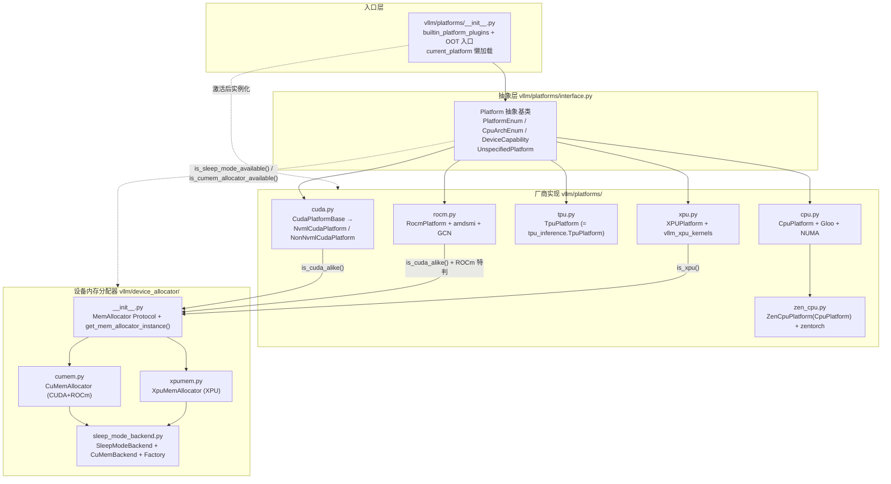
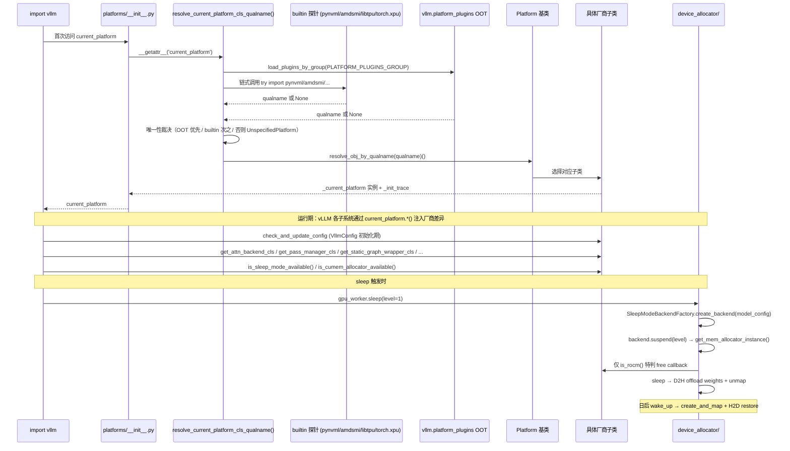

# 08 · 硬件平台子系统

[← Wiki 首页](../README.md)

本子系统是 vLLM 与具体硬件（NVIDIA CUDA、AMD ROCm、Google TPU、Intel XPU、纯 CPU、AMD Zen CPU）之间的**抽象层与适配层**，由两棵子树构成：

- `vllm/platforms/`（约 4195 行）：定义 `Platform` 抽象基类与 `current_platform` 全局单例，按厂商实现子类，提供"我是谁、能做什么"的统一 `@classmethod` hook 集合，给编译、attention、分布式、KV 卸载、配置等子系统注入厂商差异。
- `vllm/device_allocator/`（约 918 行）：实现 sleep/wake-up（暂时让出 GPU 显存）的 `MemAllocator` Protocol 与 `SleepModeBackend` 抽象，通过 PyTorch `CUDAPluggableAllocator` / `XPUPluggableAllocator` 注入自定义 malloc/free 回调，按 tag 把权重 D2H offload 或 KV cache discard。

两棵子树之间通过**单向 import**（`device_allocator/` → `platforms.current_platform`）与**bool 谓词**（`is_sleep_mode_available` / `is_cumem_allocator_available` / `is_cuda_alike` / `is_xpu`）解耦，详见 [platform-vs-allocator.md](platform-vs-allocator.md)。

## 子系统全景图

## Platform 抽象 + current_platform 单例 + 各厂商 + device_allocator 协作

## 模块导航

### 抽象与解析（`vllm/platforms/`）

| 页 | 源码 | 职责 |
|---|---|---|
| [interface.md](interface.md) | `interface.py` | `Platform` 抽象基类、`PlatformEnum` / `CpuArchEnum` / `DeviceCapability` / `UnspecifiedPlatform`，约 80 个 `@classmethod` hook |
| [plugin-resolver.md](plugin-resolver.md) | `__init__.py` | `builtin_platform_plugins` + `PLATFORM_PLUGINS_GROUP` OOT 入口 + `current_platform` 懒加载（PEP 562 `__getattr__`）+ `_init_trace` |

### 厂商实现（`vllm/platforms/`）

| 页 | 源码 | 职责 |
|---|---|---|
| [cuda.md](cuda.md) | `cuda.py` | `CudaPlatformBase` / `NvmlCudaPlatform` / `NonNvmlCudaPlatform`：NVML 无 context 探测、cuDNN SDP 关闭、SM10/12 sparse MLA 优先级、NUMA/GB200/WSL 兜底、`oink` IR 优先级 |
| [rocm.md](rocm.md) | `rocm.py` | `RocmPlatform` + amdsmi + GCN 字符串解析（`gfx942`→`(9,4)`）+ AITER 集成 + FNUZ FP8 + HIP/CUDA env 镜像 |
| [tpu.md](tpu.md) | `tpu.py` | `TpuPlatform = tpu_inference.TpuPlatform` 重导出，Pathways vs libtpu 分流 |
| [xpu.md](xpu.md) | `xpu.py` | `XPUPlatform` + `vllm_xpu_kernels` + xccl + XPU Graph opt-in + GDN 64 对齐 + TurboQuant 直通 |
| [cpu.md](cpu.md) | `cpu.py` | `CpuPlatform` + Gloo + NUMA 拓扑 + LD_PRELOAD libgomp/libtcmalloc + AVX512/AVX2 ISA 分流 |
| [zen-cpu.md](zen-cpu.md) | `zen_cpu.py` | `ZenCpuPlatform(CpuPlatform)`：仅覆写 `is_zen_cpu()` + `supported_dtypes`（剔除 FP16）+ zentorch 路由 contract |

### 设备内存分配器（`vllm/device_allocator/`）

| 页 | 源码 | 职责 |
|---|---|---|
| [device-allocator.md](device-allocator.md) | `__init__.py` / `cumem.py` / `xpumem.py` / `sleep_mode_backend.py` | `MemAllocator` Protocol + `CuMemAllocator`（CUDA/ROCm）+ `XpuMemAllocator`（XPU）+ `SleepModeBackend` 抽象（RFC #34303）+ `SleepModeBackendFactory` + `model_config.sleep_mode_backend` 字段 |
| [platform-vs-allocator.md](platform-vs-allocator.md) | — | 两棵子树边界与互引方向、三层抽象（Platform → MemAllocator → SleepModeBackend）责任分配表 |

## 核心配置与开关

### 选择平台（自动解析）

- `vllm.platform_plugins` entry point：OOT 平台通过 `pyproject.toml` 注册，工厂函数返回 qualname 字符串。
- 内置探针顺序：`tpu → cuda → rocm → xpu → cpu`，每个 try import 对应厂商库（`libtpu`/`pynvml`/`amdsmi`/`torch.xpu`/vllm 包名匹配）。
- `VLLM_TPU_USING_PATHWAYS=1`：Pathways 模式下 TPU 走 `tpu_inference.platforms.tpu_platform.TpuPlatform` 而非 `vllm.platforms.tpu.TpuPlatform`。
- cpu build：vLLM 包名含 `"cpu"` 子串即激活 `CpuPlatform`；macOS 默认也走 CPU。
- AMD Zen + `zentorch`：`/proc/cpuinfo` 检测 `AuthenticAMD + avx512` 且 `import zentorch` 成功时，CPU 探针返回 `ZenCpuPlatform`。

### 设备可见性 env

| platform | `device_control_env_var` | 备注 |
|---|---|---|
| CUDA | `CUDA_VISIBLE_DEVICES` | NVML 不受影响 |
| ROCm | `CUDA_VISIBLE_DEVICES`（弃用窗口）/ `HIP_VISIBLE_DEVICES`（推荐）/ `ROCR_VISIBLE_DEVICES` | 三者 import 期同步 |
| TPU | — | 由 Pathways/libtpu 管理 |
| XPU | `ZE_AFFINITY_MASK` | Level Zero 范式 |
| CPU | `DEVICE_CONTROL_ENV_VAR`（`vllm.utils.cpu_resource_utils`） | — |

### Sleep mode 字段

- `model_config.sleep_mode_backend: str = "cumem"`（`vllm/config/model.py:305`）：工厂据此 lazy import 具体 backend。
- `Platform.is_sleep_mode_available()` 在 CUDA/ROCm/XPU 返回 `True`，CPU/TPU 返回 `False`。
- `Platform.is_cumem_allocator_available()` try import `vllm.cumem_allocator` C 扩展。
- `vllm.general_plugins` entry point：第三方 `SleepModeBackend` 通过 import-time 静态调用 `SleepModeBackendFactory.register_backend` 挂入。

### 各平台常用 env

详见对应模块页的"关键环境变量"小节。简表：

| env | 平台 | 说明 |
|---|---|---|
| `VLLM_WSL2_ENABLE_PIN_MEMORY` | CUDA | WSL2 上启用 pinned memory |
| `VLLM_USE_OINK_OPS` | CUDA | `oink` 加入 rms_norm IR provider |
| `VLLM_ROCM_USE_AITER` + 子开关 | ROCm | AITER 总开关与子功能 |
| `HIP_ONLINE_TUNING` | ROCm | platform 自动设（AITER+hipBLASLt+MI3XX） |
| `VLLM_USE_TRITON_AWQ` | ROCm | AWQ 强制走 Triton |
| `FLASH_ATTENTION_TRITON_AMD_ENABLE` | ROCm | RDNA Flash Attention Triton backend |
| `VLLM_XPU_ENABLE_XPU_GRAPH` | XPU | XPU Graph opt-in |
| `XPU_USE_TRITON_KERNEL` | XPU | LoRA 切 PunicaWrapperGPU |
| `UCX_MEMTYPE_CACHE` | XPU | platform 强制 `n` |
| `VLLM_CPU_KVCACHE_SPACE` | CPU | KV cache 配额（GiB，Legacy） |
| `VLLM_CPU_CI_ENV` | CPU | CI 走 eager 编译 |
| `VLLM_SSM_CONV_STATE_LAYOUT` | CPU | AMX 平台 SSM 布局 |
| `LD_PRELOAD` | CPU | platform 自动追加 libgomp/libtcmalloc |
| `VLLM_ZENTORCH_WEIGHT_PREPACK` | Zen CPU | zentorch eager prepack（默认 1） |

## 与其它子系统配合

- [`编译`](../09-compilation-ir/README.md)：`get_compile_backend` / `get_pass_manager_cls` / `get_static_graph_wrapper_cls` / `get_default_ir_op_priority` / `pass_key` 注入厂商 Pass 管理器、cudagraph wrapper 与 IR provider 优先级。
- [`分布式-通信`](../07-distributed/device-communicators/README.md)：`get_device_communicator_cls` 返回 `CudaCommunicator` / `CpuCommunicator` / `XpuCommunicator`；`stateless_init_device_torch_dist_pg()` 让 Ray stateless worker 无 CUDA init 构造 NCCL PG。
- [`执行层`](../02-execution/README.md)：`check_and_update_config` 把 `worker_cls: "auto"` 解析为 `Worker` / `CPUWorker` / `XPUWorker`；`update_block_size_for_backend` 调整 `block_size`。
- [`模型执行-内核`](../03-model-execution/kernels.md)：`import_kernels()` 加载 `vllm._C` / `vllm._C_stable_libtorch` / `vllm._rocm_C` / `vllm._C_AVX512` 等扩展；`import_ir_kernels()` 注册 vLLM IR op 实现。
- [`配置-device`](../10-config/device-config.md)：`device_control_env_var` / `uses_host_device_handling()`；`apply_config_platform_defaults` + `check_and_update_config` 是平台写回配置的唯二入口。
- [`KV 卸载-sleep`](../15-kv-cache-offload/README.md)：`is_sleep_mode_available()` 决定能否走 `device_allocator/` 的 sleep/wake；`SleepModeBackend.suspend/resume` 是底层实现。
- [`注意力`](../05-attention/README.md)：`get_attn_backend_cls` 与 `AttentionSelector` 协作选 backend；`opaque_attention_op()` 决定 attention 是否注册为单个不透明 op。
- [`Ray`](../02-execution/README.md)：`ray_device_key` / `device_control_env_var` / `ray_noset_device_env_vars` 决定 Ray 调度与可见设备；`set_assigned_physical_gpu_ids` 给 Ray DP/弹性 EP 显式映射逻辑设备。

## 历史版本演进

- **v0.5–v0.6（早期）**：`Platform` 抽象已在 `vllm/platforms/__init__.py`，与具体厂商实现混杂；`current_platform` 在模块导入期即解析（eager），OOT 插件无法"先 import Platform 再被检测"；`device_allocator/` 子树不存在；sleep mode 不存在。
- **v0.7（抽象独立化 + 懒加载）**：`interface.py` 从 `__init__.py` 拆出，定义 `PlatformEnum` / `CpuArchEnum` / `DeviceCapability`；PEP 562 `__getattr__` 把 `current_platform` 推迟到首次访问解析；`vllm.platform_plugins` entry point 组与 `vllm.general_plugins` 区分；NVML/amdsmi stateless 探测成型。
- **v0.8（sleep mode 落地 + IR 集成）**：`[Core] Support fully transparent sleep mode`（#11743）引入 `device_allocator/cumem.py` + `vllm.cumem_allocator` C 扩展；`Platform.is_cumem_allocator_available` try import 模式成型；`vllm/ir/` 命名空间成型让 `get_default_ir_op_priority` 注入平台差异；`import_ir_kernels()` 支持 OOT 平台私有 IR；`num_compute_units` 统一接口。
- **v0.9（多模型 / hybrid / OOT 抽象）**：`pre_register_and_update` / `apply_config_platform_defaults` 拆分；`update_block_size_for_backend` + `_align_hybrid_block_size` 处理 attention+mamba hybrid page 对齐；`use_custom_op_collectives`；`is_integrated_gpu`（#35356）识别 UMA；`get_all_gpu_pci_bus_ids`（#42083）为 RDMA NIC 选择铺路。
- **v0.10（nvfp4 / 异质 KV / sleep 抽象 / Zen in-tree）**`：`_align_heterogeneous_kv_block_size` 处理 nvfp4 primary + skip layers；`Plugable KVCacheSpec`（#37505）；`is_device_capability_family` CUDA 13 family semantics；`In-Tree AMD Zen CPU Backend`（#35970）落地 `ZenCpuPlatform`；`[XPU][Feature] transparent sleep mode support`（#37149）让 `XpuMemAllocator` 落地。
- **v0.11 / v0.12 / main**：`[Core] Pluggable sleep-mode backend abstraction (RFC #34303)`（#44074）引入 `SleepModeBackend` + `SleepModeBackendFactory`，把"机制"从"内存操作"再拆一层，第三方 backend 通过 `vllm.general_plugins` 接入；`stop setting CUDA_VISIBLE_DEVICES internally`（#45026）让 platform 不再改 env 转由显式映射；Blackwell sparse MLA backend 优先级、GB200 NUMA 非 CDMM 拓扑回退、SM10/12 attention 候选持续扩充。具体版本归属（部分待核实）。

[← 返回 Wiki 首页](../README.md)
