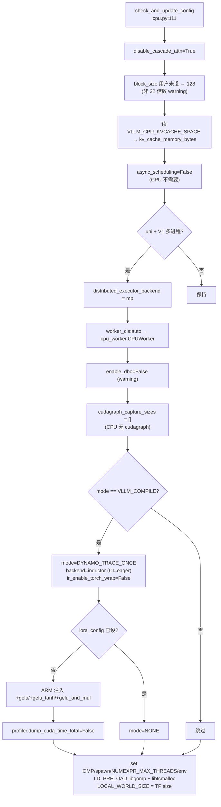

# CpuPlatform · Gloo · NUMA

[← Wiki 首页](../README.md) > [硬件平台](README.md) > CPU

源码：`vllm/platforms/cpu.py`（约 502 行）

## 是什么

`cpu.py` 是 vLLM 在纯 CPU（含 AMD Zen、Intel Xeon、ARM、PowerPC、RISC-V、Apple Silicon）上的平台实现。它把 NUMA 拓扑发现、`OMP/gomp/tcmalloc` LD_PRELOAD 注入、ATM/AVX-512/AMX kernel 选择、`CPU_ATTN` backend 唯一路由、`gloo` 通信后端、`spawn` 多进程与 OMP thread binding 等问题集中处理。`CpuPlatform` 是 [`ZenCpuPlatform`](zen-cpu.md) 的父类，且被 plugin-resolver 在两种情况下激活：vLLM 包名含 `"cpu"` 子串（cpu build）、或 `sys.platform.startswith("darwin")`（macOS）。

核心成员：

- `CpuPlatform`（`cpu.py:42`）：单实现类。`device_type="cpu"`、`dispatch_key="CPU"`、`dist_backend="gloo"`、`device_control_env_var=DEVICE_CONTROL_ENV_VAR`（来自 `vllm.utils.cpu_resource_utils`，封装 `VLLM_CPU_KVCACHE_SPACE` 等的统一 key）。
- `get_max_threads(pid=0)`（`cpu.py:33`）：模块级辅助，用 `os.sched_getaffinity` 取 Linux cgroup-aware 核数，macOS 回退 `os.cpu_count()`。
- `supported_dtypes` 属性（`cpu.py:50`）：按 `get_cpu_architecture()` 分支——PowerPC/ARM(macOS 且 `FEAT_BF16`)/RISCV/x86 返回 `[bf16, fp16, fp32]`；macOS ARM 无 BF16 走 `[fp16, fp32]`。
- `get_attn_backend_cls(...)`（`cpu.py:75`）：CPU 只用 `CPU_ATTN`；`use_mla` 与 `use_sparse` 都 `raise NotImplementedError`；用户指定其它 backend 仅 info 提示后忽略。
- `check_and_update_config(vllm_config)`（`cpu.py:111`）：关闭 cascade attention（CPU 不支持）；默认 `block_size=128`；读 `VLLM_CPU_KVCACHE_SPACE` 设置 `kv_cache_memory_bytes`；强制 `async_scheduling=False`；分布式 worker 默认改 `mp`；worker_cls `auto` → `cpu_worker.CPUWorker`；禁用 DBO；编译模式改为 `DYNAMO_TRACE_ONCE` + `inductor`（CI 走 `eager`）；ARM 注入 `+gelu/+gelu_tanh/+gelu_and_mul`；LD_PRELOAD PyTorch 的 `libgomp.so` 与 vLLM bundled `libtcmalloc`；set `LOCAL_WORLD_SIZE` / `OMP`/`TORCHINDUCTOR_*` 一组 env。
- `update_block_size_for_backend`（`cpu.py:316`）：仅对 hybrid model 走父类 `_align_hybrid_block_size`。
- `discover_numa_topology()`（`cpu.py:329`）：扫描 `/sys/devices/system/node/nodeN/cpulist` 与 `/sys/devices/system/cpu/cpuN/topology/thread_siblings_list`，给每个 NUMA 节点保留最后一个 physical core，返回 `list[list[int]]` 给 nixl `start_kv_load()` 用。
- `pack_kv_cache(...)`（`cpu.py:449`）：CPU 专用 KV cache reshape，调用 `cpu_attn_reshape_and_cache` + `_get_attn_isa(dtype, block_size, head_size)` 选择 ISA-specific kernel。
- `import_kernels()`（`cpu.py:414`）：x86 + AVX-512 BF16 → `vllm._C`；x86 + AVX-512 → `vllm._C_AVX512`；x86 其它 → `vllm._C_AVX2`；其它架构 → `vllm._C`。模块名 `_C` 但库名可能是 `_C_AVX512`/`_C_AVX2`，import 失败时忽略"dynamic module does not define module export function"。
- `get_current_memory_usage(device)`（`cpu.py:493`）：NUMA-aware，遍历 `get_visible_memory_node()` 列出的内存节点累加 `total - available`。

## 为什么

- **统一 CPU build 探测**：`vllm_version_matches_substr("cpu")` 是 vLLM cpu build 的判别特征——上游 PyPI 包名在 cpu build 时含 `cpu` 后缀。`CpuPlatform` 不需要 NVML/amdsmi 这类外置库，只用 `torch.cpu._is_avx512_supported()` 等 torch 内置 API 做能力检测。
- **NUMA 感知**：CPU 多 socket 系统访存性能严重受 NUMA 拓扑影响。`discover_numa_topology` 显式返回每个 NUMA 节点的"Reserved 给 KV Load 的 core group"，让 nixl KV 迁移在约定 core 上跑避免跨 NUMA 访存抖动。`get_current_memory_usage` 走 `get_memory_node_info` 而非全局内存，让 sleep/wake 在正确的 memory node 上算 free。
- **LD_PRELOAD 自动化**：CPU 后端 OMP 并行要求把 PyTorch 自带的 `libgomp.so` 提前加载（否则只有单核被用，参考 vLLM#27369）；同时把 vLLM bundled 的 `libtcmalloc` 加在前以减少分配开销。`check_and_update_config` 通过 glob `torch.libs/libgomp*.so*` 与 `vllm/libs/libtcmalloc*` 自动找到库路径，避免用户手动设置 LD_PRELOAD。
- **架构分支的 kernel 选择**：x86 上 vLLM 编译多个 ISA 变体（`_C` for AVX512_BF16、`_C_AVX512` for AVX512 但无 BF16、`_C_AVX2` for AVX2 only），`import_kernels` 在运行期按 `torch.cpu._is_avx512_supported()` 与 `_is_avx512_bf16_supported()` 选对应 .so。让一份 wheel 跨多代 x86 CPU 工作。
- **block_size=128 默认**：CPU KV cache 操作的局部性收益大于并行开销，128 比 16 更优；但 `block_size % 32 != 0` 时 warning。`VLLM_CPU_KVCACHE_SPACE` 是历史 env（注释标 Lagecy），新代码用 `kv_cache_memory_bytes` 字段。
- **async_scheduling 强制关闭**：CPU worker 没有"分布式 KV 通信流"独立于"compute 流"的概念，async scheduling 没收益。`check_and_update_config` 直接关闭。
- **编译模式 DYNAMO_TRACE_ONCE**：CPU 不做 piecewise + cudagraph，而是用 inductor 单次 trace；CI 环境通过 `VLLM_CPU_CI_ENV` 切到 `eager` 加速测试。

## 怎么做

### `check_and_update_config` 全流程



### `import_kernels` 的 ISA 决策

```python
# cpu.py:414 简化
def import_kernels(cls):
    if Platform.get_cpu_architecture() == CpuArchEnum.X86:
        ignored = "dynamic module does not define module export function"
        if torch.cpu._is_avx512_supported():
            if torch.cpu._is_avx512_bf16_supported():
                import vllm._C           # AVX512_BF16
            else:
                import vllm._C_AVX512    # AVX512 无 BF16
        else:
            import vllm._C_AVX2          # AVX2 only
    else:
        import vllm._C                   # ARM/PPC/RISCV 共用
```

### `discover_numa_topology` 算法

```python
# cpu.py:329 简化
def discover_numa_topology(cls):
    # 遍历 /sys/devices/system/node/nodeN
    # 对每个 node，遍历 nodeN/cpuX/
    #   读 /sys/devices/system/cpu/cpuX/topology/thread_siblings_list
    #   解析 "0-3,8-11" 格式
    #   siblings = cpus 至少 [cpu_id]
    #   phys = min(siblings)     # physical core = sibling 最小 ID
    #   if phys not in seen_phys: seen_phys.add(phys)
    # 每节点的 seen_phys 列表 append 到 result
    # 结果：每个 NUMA 节点保留一组 physical core，给 nixl start_kv_load()
```

### `pack_kv_cache` 调用链

```python
# cpu.py:449 简化
def pack_kv_cache(cls, key, value, key_cache, value_cache, block_ids, indices):
    from vllm._custom_ops import cpu_attn_reshape_and_cache
    from vllm.v1.attention.backends.cpu_attn import _get_attn_isa
    # CPU_ATTN: [N, num_kv_heads, block_size, head_size]
    _, _, block_size, head_size = key_cache.shape
    key = key.permute(0, 2, 1, 3).flatten(0, 1)
    value = value.permute(0, 2, 1, 3).flatten(0, 1)
    isa = _get_attn_isa(dtype, block_size, head_size)
    slot_mapping = (block_offsets.reshape(1, block_size)
                    + indices.reshape(num_blocks, 1) * block_size).flatten()
    if key_cache.dtype == torch.uint8:
        raise NotImplementedError("FP8 KV cache 不支持 CPU KV transfer")
    cpu_attn_reshape_and_cache(key, value, key_cache, value_cache, slot_mapping, isa)
```

`_get_attn_isa` 按 `dtype`/`block_size`/`head_size` 选 ATM/AVX-512/AMX 等 kernel 路径。

### 关键环境变量

| env | 作用 | 默认 |
|---|---|---|
| `VLLM_CPU_KVCACHE_SPACE` | KV cache 配额（GiB），历史 env（Legacy） | — |
| `VLLM_CPU_CI_ENV` | CI 环境，编译切 `eager` 加速 | `0` |
| `VLLM_ENABLE_V1_MULTIPROCING` | V1 多进程开关，影响 uni → mp 降级 | `1` |
| `VLLM_DISABLE_SHARED_EXPERTS_STREAM` | CPU 无 stream，强制 `1` | 由 platform 设 |
| `TORCHINDUCTOR_COMPILE_THREADS` | CPU inductor 单线程编译 | 由 platform 设 `1` |
| `TORCHINDUCTOR_CPP_DYNAMIC_THREADS` | 避免 inductor 生成 num_thread() 破坏 thread binding | 由 platform 设 `1` |
| `VLLM_SSM_CONV_STATE_LAYOUT` | AMX 平台 SSM conv state 用 `SD` 布局 | 由 platform 设（若支持 AMX） |
| `LD_PRELOAD` | platform 自动追加 PyTorch `libgomp.so` + vLLM bundled `libtcmalloc` | — |
| `NUMEXPR_MAX_THREADS` | 避免 numexpr 64 上限报错 | 由 platform 设 `get_max_threads()` |
| `LOCAL_WORLD_SIZE` | 给 OMP 用 | 由 platform 设为 TP size |

## 与其它模块/系统配合

- **[plugin-resolver](plugin-resolver.md)**：`cpu_platform_plugin()` 在 vLLM cpu build 或 macOS 下激活；若 `_is_amd_zen_cpu()` 且 `zentorch` 可导入则改走 `ZenCpuPlatform`。
- **[interface.md](interface.md)**：`CpuPlatform` 实现 `Platform`；`get_cpu_architecture()` 基类方法返回 `CpuArchEnum`，CPU 平台据此分流 dtype。
- **[zen-cpu.md](zen-cpu.md)**：`ZenCpuPlatform(CpuPlatform)` 继承父类全部行为，仅覆盖 `is_zen_cpu()` 和 `supported_dtypes`。
- **`vllm/utils/cpu_resource_utils.py`**：`get_memory_node_info` / `get_visible_memory_node` 与 `DEVICE_CONTROL_ENV_VAR` 是 NUMA 探测的底层实现。
- **`vllm/utils/mem_constants.py`**：`GiB_bytes = 1024**3` 用于 `VLLM_CPU_KVCACHE_SPACE` 换算。
- **[KV 卸载-sleep](../15-kv-cache-offload/README.md)**：`is_sleep_mode_available()` 对 CPU 返回 `False`（基类默认）；discover_numa_topology 给 nixl CPU KV 迁移提供 core group。
- **[执行层](../02-execution/README.md)**：`worker_cls` 解析为 `cpu_worker.CPUWorker`；`get_punica_wrapper()` 返回 `PunicaWrapperCPU`；`get_device_communicator_cls` 返回 `CpuCommunicator`；`DBO=False`、`async_scheduling=False`、`cudagraph_capture_sizes=[]`。
- **[编译](../09-compilation-ir/README.md)**：CPU 走 `DYNAMO_TRACE_ONCE` + `inductor`，不走 piecewise/cudagraph；`VLLM_CPU_CI_ENV` 切 `eager` 跳过编译加速 CI。
- **[模型执行-内核](../03-model-execution/kernels.md)**：`import_kernels` 按 ISA 选 `vllm._C`/`_C_AVX512`/`_C_AVX2`；`pack_kv_cache` 走 `cpu_attn_reshape_and_cache`。
- **[分布式-通信](../07-distributed/device-communicators/README.md)**：`dist_backend="gloo"`；`get_device_communicator_cls` 返回 `CpuCommunicator`（通常基于 Gloo）。
- **[配置-device](../10-config/device-config.md)**：`device_control_env_var=DEVICE_CONTROL_ENV_VAR`，由 `cpu_resource_utils` 提供具体 key 名。

## 历史版本演进

- **v0.5–v0.6**：CPU 后端用 ipex-like 自定义 contexts，NUMA 拓扑无显式 API；`async_scheduling` 与 worker 多进程交互未规范化；`import vllm._C` 单一扩展覆盖所有 x86（待核实）。
- **v0.7（V1 CPU 适配）**：`CpuPlatform.check_and_update_config` 接管 V1 worker_cls、`async_scheduling=False`、`cudagraph_capture_sizes=[]`；引入 `VLLM_CPU_CI_ENV` 切 `eager` 加速 CI；ARM 注入 `+gelu*` 自定义 op。
- **v0.8（block_size=128 + AMX）**：默认 `block_size=128`，`block_size % 32` warning；`VLLM_SSM_CONV_STATE_LAYOUT=SD` 在 AMX 平台自动设置；`pack_kv_cache` 走 `_get_attn_isa` 选 ISA-specific kernel。
- **v0.9（LD_PRELOAD + NUMA topology）**：自动 LD_PRELOAD PyTorch `libgomp.so` 与 vLLM `libtcmalloc`（vLLM#27369/#30470）；`discover_numa_topology` 落地支持 nixl KV load；`vllm._C_AVX512`/`_C_AVX2` ISA 分流成型；`supports_structured_output=True` 与 `opaque_attention_op=True`。
- **v0.10（hybrid model + MLA）**：`update_block_size_for_backend` 走父类 hybrid page 对齐；MLA 在非 GPU 平台强制 `disable_chunked_prefill` + `max_num_batched_tokens=max(model_len, DEFAULT)`；`pack_kv_cache` 拒绝 FP8 KV（`raise NotImplementedError`）。
- **v0.11 / v0.12 / main**：`[CPU] Fix Qwen-Next SSM type for AMX GDN`（#48073）；`[CPU] Create Proper Numa topology for s390x`（#40714）扩展架构支持；`[CPU] Enable chunked prefill and prefix caching for qwen3.5`（#46202）调整 MLA 限制；`[CPU] [Perf] Added tanh AOR for faster gelu activations`（#44639）优化 ARM gelu；`[CPU] CPU top-k and top-p sampling kernels using Triton`（#43633）引入 Triton 采样。具体版本归属（部分待核实）。

[← 返回硬件平台首页](README.md)

## 参见

- [interface.md](interface.md) — `Platform` 抽象基类与 `CpuArchEnum`。
- [zen-cpu.md](zen-cpu.md) — `ZenCpuPlatform` 继承 `CpuPlatform` 仅做 ZenDNN/zentorch 优化覆盖。
- [plugin-resolver.md](plugin-resolver.md) — `_is_amd_zen_cpu()` 探测与 `zentorch` 分流。
- [../02-execution/worker/cpu-worker.md](../02-execution/worker/cpu-worker.md) — CPU Worker 与 `libgomp`/`libtcmalloc` 协作。
- [../07-distributed/device-communicators/README.md](../07-distributed/device-communicators/README.md) — `CpuCommunicator` 基于 Gloo。
