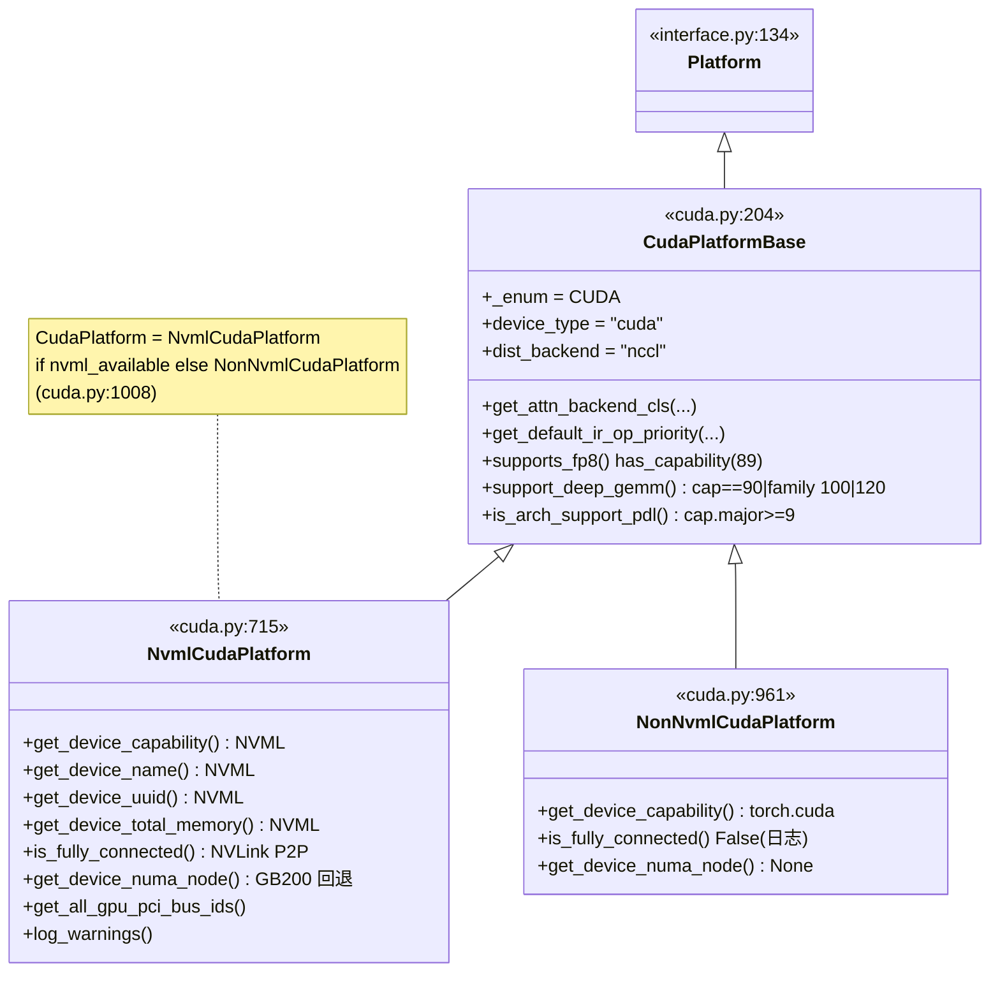
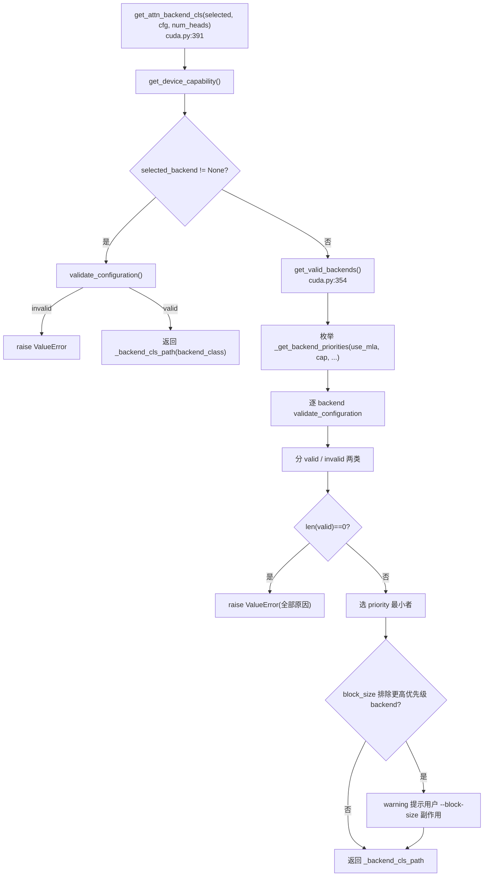

# CudaPlatform · NVML · cumem · cuDNN

[← Wiki 首页](../README.md) > [硬件平台](README.md) > CUDA

源码：`vllm/platforms/cuda.py`（约 1010 行）

## 是什么

`cuda.py` 是 vLLM 平台抽象在 NVIDIA GPU 上的主力实现。它通过 `pynvml`（NVIDIA Management Library 的 Python 绑定）做**无 CUDA context 初始化**的设备探测，并把 Ampere/Hopper/Blackwell 各代的能力差异、attention backend 优先级、cuDNN SDP 关闭、sleep mode 内存卸载、IR op 优先级（`vllm_c`/`native`/`oink`）等集中实现。模块被 `cuda_platform_plugin()` 通过 `pynvml.nvmlDeviceGetCount() > 0` 命中后实例化为全局 `current_platform`。

核心成员：

- `CudaPlatformBase`（`cuda.py:204`）：`Platform` 的 CUDA 共通子类。定义 `device_type="cuda"`、`dispatch_key="CUDA"`、`dist_backend="nccl"`、`device_control_env_var="CUDA_VISIBLE_DEVICES"`，并实现 attention 优先级选择、cuDNN 禁用、comm/LoRA/编译注入点等。NVML 相关的 `get_device_capability` / `get_device_name` 仍 `raise NotImplementedError`，留给子类。
- `NvmlCudaPlatform`（`cuda.py:715`）：基类的 NVML 实现。所有探测都包在 `@with_nvml_context`（`cuda.py:177`）里，进出函数 `nvmlInit/nvmlShutdown`，**不受 `CUDA_VISIBLE_DEVICES` 影响、不创建 CUDA context**。`get_device_numa_node`（`cuda.py:802`）处理 GB200 等"NUMA 节点无 CPU"的非 CDMM 拓扑——先 `nvmlDeviceGetNumaNodeId`，若该节点 `cpulist` 为空则用 `nvmlDeviceGetCpuAffinity` + `/sys/devices/system/node` 回退定位最近 CPU 节点。
- `NonNvmlCudaPlatform`（`cuda.py:961`）：Jetson 等无 NVML 平台的兜底实现，全部走 `torch.cuda.*`，无 NVLink 检测。
- `CudaPlatform = NvmlCudaPlatform if nvml_available else NonNvmlCudaPlatform`（`cuda.py:1008`）：模块导入期通过 `pynvml.nvmlInit()` 试探决定走哪个子类，末尾 `CudaPlatform.log_warnings()` 提示多卡不同型号要设 `CUDA_DEVICE_ORDER=PCI_BUS_ID`。
- `_get_backend_priorities(use_mla, cap, num_heads, kv_dtype)`（`cuda.py:83`）：`@cache` 装饰的 attention backend 优先级表。按 `device_capability.major`（10=Blackwell/12=未来/其它=Hopper及以前）与 `use_mla` 分支，返回 `AttentionBackendEnum` 列表。SM10 下还要按 `num_heads` 与 KV dtype 把 sparse backends 排序。
- `_cuda_device_count_stateless(cuda_visible_devices)`（`cuda.py:57`）：`@lru_cache` 缓存当前 `CUDA_VISIBLE_DEVICES` 值下的设备数；优先 `torch.cuda._device_count_nvml()`，回退 `torch._C._cuda_getDeviceCount()`。
- `with_nvml_context(fn)`（`cuda.py:177`）装饰器：保证 NVML init/shutdown 成对，避免泄漏。
- 模块级副作用：`import vllm._C_stable_libtorch` + 尝试 `vllm._qutlass_C`（quant 专用扩展，导入失败被吞）；`torch.backends.cuda.enable_cudnn_sdp(False)`（`cuda.py:53`）——pytorch 2.5 默认走 cuDNN SDPA，但部分模型会崩，参见 diffusers#9704。

## 为什么

- **Stateless 探测避免污染 fork**：Ray executor 默认 `fork` 子进程，而 CUDA context 一旦创建就不可继承。NVML 是独立于 CUDA runtime 的 library，`nvmlInit` 不创建 context，因此 `CudaPlatform.get_device_capability()` 可以在父进程随意调用，子进程 fork 后再自行初始化 CUDA。`NonNvmlCudaPlatform` 没有这层保护——它直接调 `torch.cuda.get_device_capability`，会触发 HIP/CUDA context init（参考 [`rocm.md`](rocm.md) 的 amdsmi 同样思路）。
- **代际能力矩阵**：vLLM 的 attention/quant/dynamic-graph/deep-gemm 能力差异完全按 `DeviceCapability.major` 决定。`supported_dtypes`（`cuda.py:229`）按 80/60/其它三档返回不同 dtype 列表；`supports_fp8` 要求 `has_device_capability(89)`（Ada/Hopper/Blackwell）；`support_deep_gemm`（`cuda.py:660`）要求 `is_device_capability(90)` (Hopper) 或 `is_device_capability_family(100)`/`is_device_capability_family(120)` (Blackwell)。这避免在运行期散落 `torch.cuda.get_device_capability()` 调用。
- **NVLink 全互联检测**：`is_fully_connected(device_ids)`（`cuda.py:771`）通过 `pynvml.nvmlDeviceGetP2PStatus(...NVLINK...)` 判断一组 GPU 是否 1-hop NVLink 全互联，给 TP/PP 拓扑规划与 custom allreduce 启用提供依据。
- **Blackwell sparse MLA 分支**：SM10（Blackwell）的 MLA 在不同 head 数与 KV dtype 下最优 backend 不同。`_get_backend_priorities` 对 SM10 的 sparse 分支专门按 `num_heads<=16` 与 `is_quantized_kv_cache` 调换 `FLASHINFER_MLA_SPARSE` 与 `FLASHMLA_SPARSE` 顺序（`cuda.py:96-115`），并新增 `TOKENSPEED_MLA`、`CUTLASS_MLA` 等 Blackwell-only backend 到候选表。
- **Jetson / UMA / WSL 兜底**：`is_integrated_gpu`（`cuda.py:668`）通过 `torch.cuda.get_device_properties(device_id).is_integrated` 识别 GH200/Jetson/DGX Spark 等 UMA 设备，让 `cudaMemGetInfo` 上报 free 时考虑 OS 可回收内存；`is_pin_memory_available`（`cuda.py:282`）对 WSL2 检查内核版本 `>= 4.19.121`，并接受 `VLLM_WSL2_ENABLE_PIN_MEMORY=1` 显式开启（默认关闭）。
- **IR op 优先级差异**：`get_default_ir_op_priority`（`cuda.py:680`）按是否用 inductor 编译决定默认 `["native"]`（编译期）还是 `["vllm_c","native"]`（运行期），并在 `VLLM_USE_OINK_OPS=1` 时把 `rms_norm`/`fused_add_rms_norm` 优先级前置 `["oink"]`，是 vLLM IR provider 系统的平台侧入口（见 [`ir-op.md`](../09-compilation-ir/ir-op.md)）。

## 怎么做

### 类继承拓扑



### attention backend 选择流程



`_get_backend_priorities` 是 `@cache` 的，key 包括 `use_mla` / `DeviceCapability` / `num_heads` / `kv_cache_dtype`——同一进程内同配置只算一次。

### `check_and_update_config` 的平台默认

`CudaPlatformBase.check_and_update_config`（`cuda.py:303`）：

1. `parallel_config.worker_cls == "auto"` → 解析为 `vllm.v1.worker.gpu_worker.Worker`。
2. 模型是 `is_mm_prefix_lm` + 多模态 + 未禁用 chunked_mm_input → 强制 `disable_chunked_mm_input=True`（带警告）。
3. WSL2 + `cpu_offload_gb>0` + cudagraph on → 警告 pinned memory 的 50% RAM 上限风险。

### NVML NUMA 节点探测（GB200 回退）

```python
# cuda.py:802 简化
@with_nvml_context
def get_device_numa_node(cls, device_id=0):
    handle = ...
    try:
        numa_node = pynvml.nvmlDeviceGetNumaNodeId(handle)
        if cls._numa_node_has_cpus(numa_node):     # /sys/devices/system/node/nodeN/cpulist
            return numa_node
        # 非 CDMM Grace-Blackwell：HBM 在独立 NUMA 节点但无 CPU
    except Exception:
        pass
    # 兜底：用 NVML CPU affinity 反查 /sys/devices/system/node
    cpu_ids = cls._get_device_cpu_affinity(handle)         # nvmlDeviceGetCpuAffinity
    return cls._get_numa_node_for_cpu(cpu_ids[0])          # 遍历 sysfs
```

### IR op 优先级决策

```python
# cuda.py:680 简化
@classmethod
def get_default_ir_op_priority(cls, vllm_config):
    cc = vllm_config.compilation_config
    using_inductor = cc.backend == "inductor" and cc.mode != CompilationMode.NONE
    default = ["native"] if using_inductor else ["vllm_c", "native"]
    rms_norm = default
    if envs.VLLM_USE_OINK_OPS:
        rms_norm = ["oink"] + default
    return IrOpPriorityConfig.with_default(
        default, rms_norm=rms_norm, fused_add_rms_norm=rms_norm)
```

### 关键环境变量

| env | 作用 | 默认 |
|---|---|---|
| `CUDA_VISIBLE_DEVICES` | 设备可见性（platform `device_control_env_var`） | — |
| `VLLM_WSL2_ENABLE_PIN_MEMORY` | WSL2 上启用 pinned memory | `False` |
| `VLLM_USE_OINK_OPS` | 把 `oink` 加到 rms_norm IR provider 优先级最前 | `False` |
| `CUDA_DEVICE_ORDER` | 多卡不同型号时建议 `PCI_BUS_ID`（`log_warnings` 提示） | — |

## 与其它模块/系统配合

- **[plugin-resolver](plugin-resolver.md)**：`cuda_platform_plugin()` 在 `pynvml.nvmlDeviceGetCount()>0` 且非 cpu build 时返回 `"vllm.platforms.cuda.CudaPlatform"`；Jetson 走 `/etc/nv_tegra_release` 兜底。
- **[interface.md](interface.md)**：`CudaPlatformBase` 实现了 `Platform` 几乎所有 `@classmethod`，未实现的只有 `get_device_capability/name/total_memory/is_fully_connected` 等留给 `NvmlCudaPlatform`/`NonNvmlCudaPlatform` 分化。
- **[device-allocator](device-allocator.md)**：`is_cumem_allocator_available()` try import `vllm.device_allocator.cumem.cumem_available`；sleep mode 通过 `current_platform.is_cuda_alike()` 走 `CuMemAllocator`，二者协作见 [`platform-vs-allocator.md`](platform-vs-allocator.md)。
- **[编译](../09-compilation-ir/README.md)**：`get_static_graph_wrapper_cls()` 返回 `vllm.compilation.cuda_graph.CUDAGraphWrapper`（`cuda.py:568`）；`get_pass_manager_cls` 沿用基类默认 `PostGradPassManager`；`get_default_ir_op_priority` 决定 IR provider 顺序。
- **[执行层](../02-execution/README.md)**：`check_and_update_config` 把 `worker_cls` 解析为 `gpu_worker.Worker`；`get_punica_wrapper()` 返回 `PunicaWrapperGPU`；`get_device_communicator_cls()` 返回 `CudaCommunicator`。
- **[模型执行-内核](../03-model-execution/kernels.md)**：`import_kernels()` 显式导入 `vllm._C_stable_libtorch`、`vllm._moe_C_stable_libtorch`、`vllm._qutlass_C`（quant 专用，可缺失）。
- **[注意力](../05-attention/README.md)**：`_get_backend_priorities` 是 CUDA attention selector 的"候选名单"；`opaque_attention_op()` 返回 `True`，使 attention 注册为单个不透明 op 供 torch.compile 切分。
- **[分布式-通信](../07-distributed/device-communicators/README.md)**：`use_custom_allreduce()` 返回 `True`，`use_custom_op_collectives()` 返回 `True`；`stateless_init_device_torch_dist_pg()` 手搓 `ProcessGroup` + `ProcessGroupNCCL` 避免在 Ray stateless worker 初始化 CUDA。
- **[配置-device](../10-config/device-config.md)**：`device_control_env_var="CUDA_VISIBLE_DEVICES"` 被 `DeviceConfig` 用来读可见设备。

## 历史版本演进

- **v0.5–v0.6**：CUDA 平台与 Platform 抽象耦合较紧，NVML 探测与平台方法混在一起；`CudaPlatform` 仅有单一实现，无 NVML/non-NVML 分化（待核实）。
- **v0.7（NVML 抽象抽出）**：`CudaPlatformBase` 与 `NvmlCudaPlatform`/`NonNvmlCudaPlatform` 分层落地，Jetson（无 NVML）走 `NonNvmlCudaPlatform`；`with_nvml_context` 装饰器统一 init/shutdown；cuDNN SDP 关闭在模块顶层执行（`enable_cudnn_sdp(False)`）。
- **v0.8（sleep mode + IR 集成）**：`is_cumem_allocator_available` try import 模式成型；`get_default_ir_op_priority` 在 IR 框架成型后引入，开始按 `using_inductor` 切换 `["native"]` vs `["vllm_c","native"]`；`get_static_graph_wrapper_cls` 返回 `CUDAGraphWrapper`；`is_integrated_gpu`（#35356）识别 UMA 设备。
- **v0.9（Blackwell sparse MLA + WSL2 pin）**：`_get_backend_priorities` 引入 SM10 / SM12 分支，新增 `FLASHINFER_MLA_SPARSE`/`FLASHMLA_SPARSE`/`TOKENSPEED_MLA`/`CUTLASS_MLA`；`is_pin_memory_available` 支持 WSL2 内核版本检测与 `VLLM_WSL2_ENABLE_PIN_MEMORY`（#41496）；`get_all_gpu_pci_bus_ids`（#42083）为 RDMA NIC 选择铺路。
- **v0.10（NVML capability 修复 + oink）**：`get_device_capability` 的 NVML 路径修复 visible devices lookup（#47892）；`VLLM_USE_OINK_OPS` 把 oink 加到 IR provider 优先级；`is_arch_support_pdl`（cap.major>=9）引入 PDL（Programmatic Dependent Launch）能力探测。
- **v0.11 / v0.12 / main**：`stop setting CUDA_VISIBLE_DEVICES internally`（#45026）让 platform 不再改 env，转由 `set_assigned_physical_gpu_ids` 显式映射；`stable ABI` 迁移让 `import_kernels` 改为 `_C_stable_libtorch` + `_moe_C_stable_libtorch`；GB200 `get_device_numa_node` 的非 CDMM 拓扑回退（`nvmlDeviceGetCpuAffinity` + sysfs 遍历）。具体版本归属（部分待核实）。

[← 返回硬件平台首页](README.md)

## 参见

- [interface.md](interface.md) — `Platform` 抽象基类与所有注入点。
- [device-allocator.md](device-allocator.md) — `CuMemAllocator` 实现 sleep/wake 内存卸载。
- [platform-vs-allocator.md](platform-vs-allocator.md) — `CudaPlatform` 与 `device_allocator/` 的边界。
- [rocm.md](rocm.md) — 同为 `is_cuda_alike()`，对照 amdsmi vs NVML。
- [../05-attention/README.md](../05-attention/README.md) — `_get_backend_priorities` 候选名单被 attention selector 消费。
- [../09-compilation-ir/cuda-graph.md](../09-compilation-ir/cuda-graph.md) — `CUDAGraphWrapper` 由 `get_static_graph_wrapper_cls` 注入。
