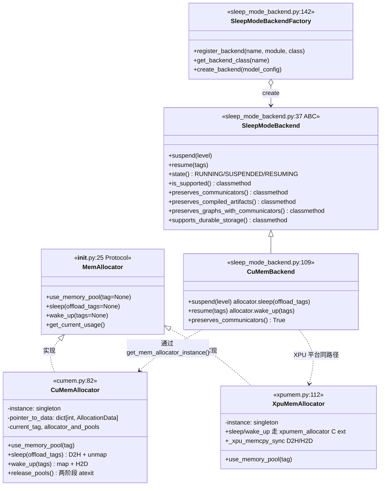
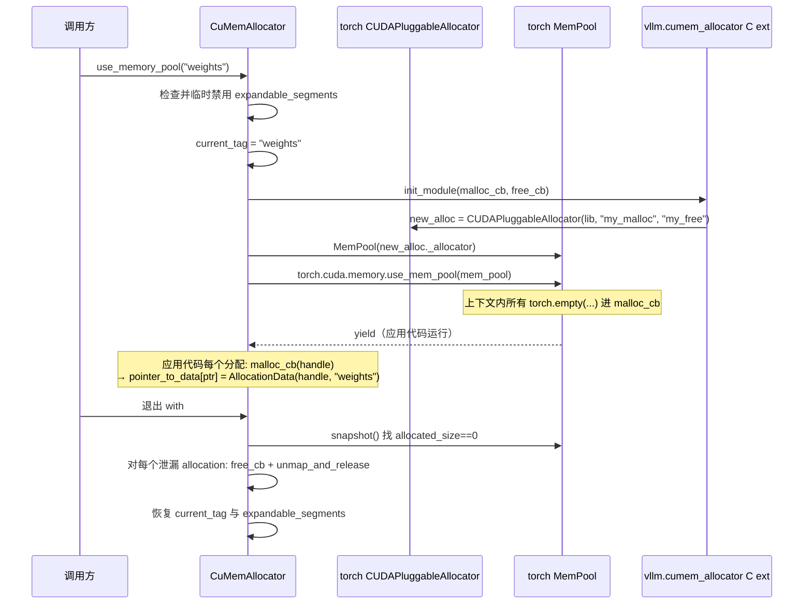
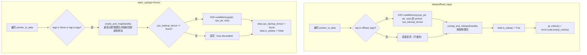

# 设备内存分配器 · MemAllocator · cumem · xpumem · sleep backend

[← Wiki 首页](../README.md) > [硬件平台](README.md) > 设备内存分配器

源码：`vllm/device_allocator/`（4 个文件，约 918 行）

- `__init__.py`（50 行）：`MemAllocator` Protocol + 数据类 + 工厂 `get_mem_allocator_instance()`
- `cumem.py`（377 行）：CUDA/ROCm 的 cumem-based pluggable allocator
- `xpumem.py`（295 行）：XPU 的 `XpuMemAllocator`
- `sleep_mode_backend.py`（196 行）：`SleepModeBackend` 抽象 + `CuMemBackend` 默认实现 + `SleepModeBackendFactory`

## 是什么

`device_allocator/` 子系统是 vLLM 实现 sleep/wake-up（暂时让出 GPU 显存）能力的核心：通过 PyTorch 的 **CUDAPluggableAllocator / XPUPluggableAllocator** 注入自定义 malloc/free 回调，把每次分配记录到 `(handle, tag, cpu_backup_tensor, is_asleep)` 的 `AllocationData` 表里；`sleep()` 时按 `tag` 决定哪些 allocation 把数据拷到 CPU pinned memory 备份、哪些直接丢弃，并 `unmap_and_release` 物理显存；`wake_up()` 时按 tag 重新 `create_and_map` 把虚拟地址映射回新物理显存并恢复数据。该机制让 vLLM EngineCore 在空闲时把显存让给同机其它进程，被请求再唤醒恢复，是 [KV 卸载-sleep](../15-kv-cache-offload/README.md) 的底层实现。

核心成员：

- `HandleType`（`__init__.py:14`）：`tuple[int, int, int, list[int] | int]`，即 `(py_device, py_size_or_aligned_size, py_ptr, py_handle)`。`py_handle` 在 ROCm 是 `list[int]`（多 chunk），其它平台是 `int`。
- `AllocationData` dataclass（`__init__.py:17`）：`handle / tag / cpu_backup_tensor=None / is_asleep=False`。每条 GPU 分配对应一个 `AllocationData`。
- `MemAllocator` Protocol（`__init__.py:25`）：定义 `use_memory_pool(tag=None) / sleep(offload_tags=None) / wake_up(tags=None) / get_current_usage()` 四个 API，是 platform-agnostic 契约。
- `get_mem_allocator_instance()`（`__init__.py:35`）：工厂函数。`is_cuda_alike()` → `CuMemAllocator.get_instance()`；`is_xpu()` → `XpuMemAllocator.get_instance()`；其它平台 raise `RuntimeError`。
- `cumem_available`（`cumem.py:29`）：模块导入期 try import `vllm.cumem_allocator`（vLLM C 扩展）+ `vllm.distributed.device_communicators.cuda_wrapper.CudaRTLibrary`，成功置 `True`，被 `Platform.is_cumem_allocator_available()` 探测调用。
- `CuMemAllocator`（`cumem.py:82`）：单例（`instance`/`get_instance()`，`atexit` 注册 `_shutdown_singleton`）。持 `pointer_to_data: dict[int, AllocationData]`、`current_tag`、`allocator_and_pools: dict[str, Any]`。`use_memory_pool(tag)` 通过 `torch.cuda.memory.CUDAPluggableAllocator` + `MemPool` 重定向 PyTorch 分配；`sleep/wake_up` 走 `python_create_and_map`/`python_unmap_and_release` C 扩展。
- `XpuMemAllocator`（`xpumem.py:112`）：与 `CuMemAllocator` 对称的单例。`xpumem_available` try import `vllm_xpu_kernels.xpumem_allocator`；`use_memory_pool` 走 `torch.xpu.memory.XPUPluggableAllocator` + `torch.xpu.memory.MemPool`；D2H/H2D 通过 `torch.ops._C.xpu_memcpy_sync` 同步拷贝。
- `SleepModeState = Literal["RUNNING", "SUSPENDED", "RESUMING"]`（`sleep_mode_backend.py:34`）：sleep lifecycle 三态。
- `SleepModeBackend` ABC（`sleep_mode_backend.py:37`）：把"sleep/wake 机制"抽象成 `suspend(level)` + `resume(tags)`，并暴露 4 个 capability `@classmethod`：`preserves_communicators` / `preserves_compiled_artifacts` / `preserves_graphs_with_communicators` / `supports_durable_storage`，以及 `is_supported` 与 `state()`。让未来的"非 cumem"机制（CUDA process checkpoint、CRIU、durable snapshot）可以同 API 接入。
- `CuMemBackend(SleepModeBackend)`（`sleep_mode_backend.py:109`）：默认后端。`suspend(level)` 调 `get_mem_allocator_instance().sleep(offload_tags=("weights",) if level==1 else tuple())`；`resume(tags)` 调 `wake_up(tags)`。`preserves_communicators=True`（NCCL 缓冲在 allocator pool 之外）。
- `SleepModeBackendFactory`（`sleep_mode_backend.py:142`）：注册表 + lazy 解析，镜像 `KVConnectorFactory`。`register_backend(name, module_path, class_name)` 懒注册；`create_backend(model_config)` 按 `model_config.sleep_mode_backend` 字符串解析并实例化。模块末尾自动注册 `"cumem"` → `CuMemBackend`。

## 为什么

- **sleep 的本质 = 让出物理显存**：vLLM 把权重与 KV cache 放在显存里是为了推理吞吐；但在多模型轮转或弹性调度场景，空闲模型若继续占用 80 GiB 显存就是浪费。`CuMemAllocator` 通过 cumem driver API 把虚拟地址 `unmap` 并释放底层物理内存，OS/驱动可以把这些物理页给其它进程用；唤醒时重新 `map` 新物理页并恢复数据。PyTorch 自带 caching allocator 没法做到这点（它只缓存空闲块不释放回 OS）。
- **PluggableAllocator 注入**：PyTorch 提供 `CUDAPluggableAllocator(lib_name, "my_malloc", "my_free")` 接口让用户给出 C 函数名注册成 allocator。`CuMemAllocator` 在 `use_memory_pool(tag)` 上下文里把它注入成当前 `MemPool` 的分配器——所有上下文内 `torch.empty(...)` 都进 `python_malloc_callback`（记录 AllocationData）+ C 扩展 `python_create_and_map`（实际 cuMemCreate + cuMemMap）。退出上下文后回到默认 caching allocator。这种"按需切换"避免修改全局 allocator 影响 vLLM 其它分配路径。
- **单例强约束**：C 扩展 `vllm.cumem_allocator.init_module` 用全局变量存 Python 回调指针，多实例会互相覆盖；因此 `CuMemAllocator` 强制单例（`get_instance()` + `__init__` 不建议直接调用）。`atexit` 注册 `_shutdown_singleton` 在解释器退出时按"先释放 MemPool 再释放 allocator"两阶段拆 pool，规避 PyTorch 内 `MemPool` 析构期间对已释放 allocator 虚调（pytorch/pytorch#145168 的 "pure virtual method called"）。
- **tag 区分 offload vs discard**：`sleep(offload_tags=("weights",))` 把权重 D2H pinned memory 备份、丢弃 KV cache；`level=2` 走 `tuple()` 即"全部丢弃"（resume 时权重从 model source 重 load）。这让 sleep level 1（保留权重）vs level 2（彻底清空）的差异仅是 `offload_tags` 不同，机制完全统一。
- **ROCm 特判 is_asleep**：ROCm `sleep()` 已在 `unmap_and_release` 时把 physical chunks 释放并把虚拟地址作为 placeholder 保留。后续 free callback 时若 `is_asleep` 且 `is_rocm()`，返回空 chunk list `[]` 让 C 扩展跳过 unmap/release，避免 double-free（`cumem.py:207-214`）。CUDA 无此分支——CUDA 在 free callback 里 `torch.cuda.synchronize(device)` 后正常返回 handle。
- **PyTorch allocator bugs work-around**：`use_memory_pool` 显式禁用 `expandable_segments`（与 MemPool 冲突，pytorch#147851）；退出上下文时手动 `snapshot()` MemPool 找 `allocated_size==0` 的 allocations 并 `_python_free_callback + unmap_and_release` 清理——这是 PyTorch#145168 让 `empty_cache()` 在 pluggable allocator 下 error 期间的临时方案（注释明确"TODO: ask for help from PyTorch team to expose this method"）。
- **SleepModeBackend 抽象（RFC #34303）**：直接调 `allocator.sleep()` 把"机制"与"调度"耦合。RFC #34303 提出 CUDA process checkpoint、CRIU、durable snapshot 等替代机制，它们共享调度路径（`/sleep` endpoint → engine → executor → worker）但保留不同资源（NCCL 通信器、编译产物、CUDA graph 跨进程存活）。`SleepModeBackend` 抽象 + capability flag 让这些机制能用同一 API 接入而不改 dispatch。

## 怎么做

### 整体类关系



### `use_memory_pool(tag)` 上下文（cumem 版）



### `sleep(offload_tags)` 与 `wake_up(tags)`



### `SleepModeBackend` 抽象层

```python
# sleep_mode_backend.py:109 简化
class CuMemBackend(SleepModeBackend):
    def suspend(self, level=1):
        self._state = "SUSPENDED"
        allocator = get_mem_allocator_instance()
        allocator.sleep(offload_tags=("weights",) if level == 1 else tuple())

    def resume(self, tags=None):
        self._state = "RESUMING"
        allocator = get_mem_allocator_instance()
        allocator.wake_up(tags)
        self._state = "RUNNING"

    @classmethod
    def preserves_communicators(cls):
        return True    # NCCL buffer 在 allocator pool 之外，suspend 不影响

# sleep_mode_backend.py:142 注册表
class SleepModeBackendFactory:
    _registry: dict[str, Callable] = {}

    @classmethod
    def register_backend(cls, name, module_path, class_name):
        def loader():
            module = importlib.import_module(module_path)
            return getattr(module, class_name)
        cls._registry[name] = loader

    @classmethod
    def create_backend(cls, model_config):
        name = model_config.sleep_mode_backend   # 默认 "cumem"
        backend_cls = cls.get_backend_class(name)
        if not backend_cls.is_supported():
            raise ValueError(...)
        return backend_cls()

# 模块末尾自动注册默认后端
SleepModeBackendFactory.register_backend(
    "cumem", "vllm.device_allocator.sleep_mode_backend", "CuMemBackend")
```

### Worker 调用路径

`vllm/v1/worker/gpu_worker.py` 懒加载 backend：

```python
# gpu_worker.py:174-185 简化
self._sleep_mode_backend: SleepModeBackend | None = None

def _get_sleep_mode_backend(self):
    if self._sleep_mode_backend is None:
        from vllm.device_allocator.sleep_mode_backend import SleepModeBackendFactory
        self._sleep_mode_backend = SleepModeBackendFactory.create_backend(
            self.vllm_config.model_config)
    return self._sleep_mode_backend

def sleep(self, level=1):
    torch.accelerator.synchronize()
    if level == 2:
        self._sleep_saved_buffers = {n: b.cpu().clone() for n, b in model.named_buffers()}
    self._get_sleep_mode_backend().suspend(level)
    # ROCm 多 5 秒宽限期等 memory 释放
    ...

def wake_up(self, tags=None):
    self._get_sleep_mode_backend().resume(tags)
```

### `HandleType` 各字段语义

| 字段 | 含义 |
|---|---|
| `py_device` (int) | CUDA/HIP/XPU device ID |
| `py_size_or_aligned_size` (int) | 分配字节数（可能对齐到页大小） |
| `py_ptr` (int) | 虚拟地址（D2D/H2D memcpy 用） |
| `py_handle` (int 或 list[int]) | cumem physical chunk handle；ROCm 多 chunk 用 list，其它单 int |

### 关键环境变量

| env | 作用 | 默认 |
|---|---|---|
| `PYTORCH_CUDA_ALLOC_CONF` | `expandable_segments:True` 与 sleep pool 冲突，context 内临时禁用 | — |
| `VLLM_ZENTORCH_WEIGHT_PREPACK` | 非 allocator 相关，但 sleep level 2 resume 后 weight 重 load 路径相关 | `1` |
| `model_config.sleep_mode_backend` | 字段默认 `"cumem"`，工厂据此解析 | `"cumem"` |

## 与其它模块/系统配合

- **[`platform-vs-allocator.md`](platform-vs-allocator.md)**：专门一页说明 `Platform` 与 `device_allocator/` 的边界。
- **[interface.md](interface.md)**：`is_sleep_mode_available()`（CUDA/ROCm/XPU 返回 `True`）与 `is_cumem_allocator_available()`（try import `cumem_available`）是 allocator 启用的前置条件。
- **[cuda.md](cuda.md)**：`is_cuda_alike()` 让 CUDA 与 ROCm 共用 `CuMemAllocator`；cumem 的 `python_create_and_map`/`python_unmap_and_release` C 扩展由独立 wheel `vllm.cumem_allocator` 提供。
- **[rocm.md](rocm.md)**：ROCm 在 `_python_free_callback` 特判 `is_asleep` 返回空 chunk list 避免 double-free（`cumem.py:207`）；`gpu_worker.sleep()` 在 ROCm 上多等 5 秒让 memory 释放。
- **[xpu.md](xpu.md)**：`is_xpu()` 走 `XpuMemAllocator`，走 `vllm_xpu_kernels.xpumem_allocator` C 扩展；`_xpu_memcpy_sync` 通过 `torch.ops._C.xpu_memcpy_sync` 同步 D2H/H2D。
- **`vllm/v1/worker/gpu_worker.py`**：`sleep()` / `wake_up()` 入口；`_get_sleep_mode_backend()` 懒加载；level 2 sleep 单独保存 `named_buffers()` 的 CPU clone。
- **`vllm/config/model.py:305`**：`sleep_mode_backend: str = "cumem"` 字段，被 factory 读取。
- **`vllm/plugins/__init__.py`**：`vllm.general_plugins` entry point 让第三方 `SleepModeBackend` 通过 `register_backend` 静态调用挂入（见 `sleep_mode_backend.py:188-191` 注释）。
- **[KV 卸载-sleep](../15-kv-cache-offload/README.md)**：本子系统是该子系统落地"sleep engine"的底座——`/sleep` endpoint → engine → executor → worker → `_sleep_mode_backend.suspend(level)`。
- **[执行层](../02-execution/README.md)**：`gpu_worker.sleep()` 测量 free bytes 前后差异并 assert `freed_bytes >= 0`，与 allocator 协作上报日志。
- **NCCL / [分布式-通信](../07-distributed/device-communicators/README.md)**：NCCL buffer 在 allocator pool 之外，`CuMemBackend.preserves_communicators()` 返回 `True`，通信器无需 reinit。
- **torch.compile / [编译](../09-compilation-ir/README.md)**：cumem allocator 不影响编译产物，`preserves_compiled_artifacts()` 默认 `False`（其它 backend 的 capability 决定是否需要 recompile）。

## 历史版本演进

- **v0.5**：sleep mode 不存在；vLLM 没有任何显存让出机制（待核实）。
- **v0.6（cumem 早期，#11743）**：`[Core] Support fully transparent sleep mode`（PR #11743）引入 `CuMemAllocator` + `vllm.cumem_allocator` C 扩展，通过 `CUDAPluggableAllocator` 注入；`sleep(offload_tags)` / `wake_up(tags)` API 成型；tag 机制区分 weights vs kv_cache。
- **v0.7（expandable_segments 兼容，#14189）**：sleep 与 `PYTORCH_CUDA_ALLOC_CONF=expandable_segments:True` 冲突，`use_memory_pool` 内自动禁用 + 退出恢复；后续 (#40812) 把"自动禁用"逻辑内化进上下文。
- **v0.8（PyTorch 2.6 兼容 + 强引用，#13456/#23477）**：PyTorch 2.6 引入 `MemPool` 与 pluggable allocator 的 GC 时序问题（pytorch#146431），用 `allocator_and_pools[tag] = data` 强保 MemPool 引用；同时为 `python_malloc_callback`/`python_free_callback` 创建强引用防止 bound method 被 GC。
- **v0.9（sleep 后清缓存 + tags 参数，#15248/#15500）**：`sleep` 末尾 `gc.collect() + torch.cuda.empty_cache()`；`wake_up(tags=None)` 接受 list 选择性恢复。
- **v0.10（优化在线量化 + ROCm 迁移，#12695/#24731）**：`[Core][AMD] Migrate fully transparent sleep mode to ROCm platform`（#12695）让 ROCm 走同一 `CuMemAllocator`；`#24731 [sleep mode] save memory for on-the-fly quantization` 在 `use_memory_pool` 退出时手动 `snapshot()` 清理 unused allocations，规避 pluggable allocator 下 `empty_cache` error。
- **v0.11（breakable cumem / async h2d pin，#45424/#46203）**：`[Core] Ensure memory is pinned prior to async h2d copy`（#45424）让 cpu_backup_tensor 用 `PIN_MEMORY`；`[Bugfix][ROCm] Fix cumem sleep and teardown`（#46203）修 ROCm `is_asleep` 分支与 `_shutdown_singleton` 时序；`[Bugfix] Make CuMemAllocator free callback stream-aware`（#43020）在 free 前 `torch.cuda.synchronize(device)` 规避 in-flight kernel 与 unmap 竞争。
- **v0.12 / main（XPU + SleepModeBackend 抽象，#37149/#44074/#47243）**：`[XPU][Feature] transparent sleep mode support for XPU platform`（#37149）落地 `XpuMemAllocator`；`[Core] Pluggable sleep-mode backend abstraction (RFC #34303)`（#44074）引入 `SleepModeBackend` + `SleepModeBackendFactory`，把 cumem 包装成 `CuMemBackend`；`#47243 [Core] Make sleep-mode backend capability flags communicator-agnostic` 把 capability flag 从"specific resource"改为"communicator-agnostic"。其它 sleep backend（CUDA checkpoint、CRIU、durable snapshot）仍在 RFC 推进（待补充）。具体版本归属（部分待核实）。

[← 返回硬件平台首页](README.md)

## 参见

- [platform-vs-allocator.md](platform-vs-allocator.md) — `Platform` 与 `device_allocator/` 的边界与互引。
- [cuda.md](cuda.md) / [rocm.md](rocm.md) / [xpu.md](xpu.md) — 各平台如何 enable / 调用 allocator。
- [interface.md](interface.md) — `is_sleep_mode_available` / `is_cumem_allocator_available` 前置检查。
- [../15-kv-cache-offload/README.md](../15-kv-cache-offload/README.md) — sleep engine 上层调度。
- [../02-execution/worker/gpu-worker.md](../02-execution/worker/gpu-worker.md) — `sleep()`/`wake_up()` worker 侧入口。
